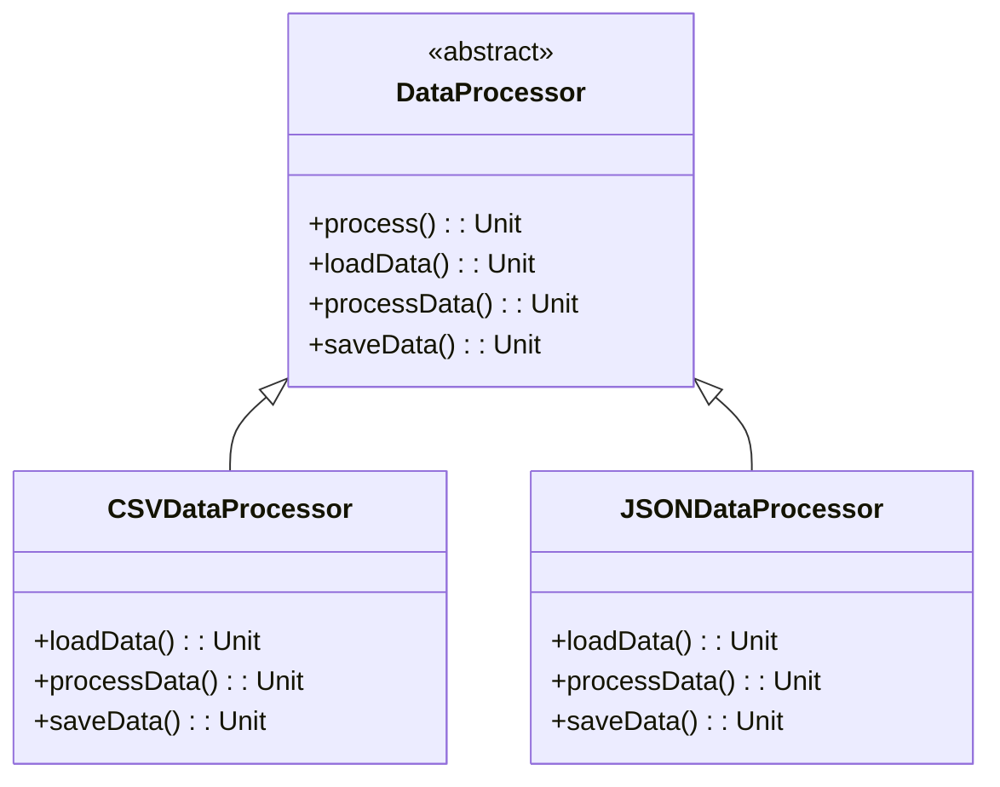

## 6.10 Template Method Pattern

The Template Method Pattern is a behavioral design pattern that defines the skeleton of an algorithm in a superclass, allowing subclasses to override specific steps of the algorithm without changing its structure. This pattern is particularly useful when you have a series of steps that are common across multiple implementations but require some customization. In Scala, the Template Method Pattern can be elegantly implemented using abstract classes and method overriding.

### Intent

The primary intent of the Template Method Pattern is to define the overall structure of an algorithm while allowing subclasses to refine certain steps. This separation of concerns promotes code reuse and flexibility, enabling developers to implement variations of an algorithm without duplicating code.

### Key Participants

1. **Abstract Class**: Defines the template method and declares abstract methods for the steps that can vary.
2. **Concrete Subclasses**: Implement the abstract methods to provide specific behavior for each step of the algorithm.

### Applicability

- Use the Template Method Pattern when you have multiple classes that share a common algorithm but differ in specific steps.
- Apply this pattern to promote code reuse and reduce redundancy by encapsulating common behavior in a superclass.
- Consider the Template Method Pattern when you want to enforce a specific sequence of steps in an algorithm.

### Sample Code Snippet

Let's explore a practical example of the Template Method Pattern in Scala. We'll implement a simple data processing pipeline where the steps of data loading, processing, and saving are defined in a template method.

```scala
// Abstract class defining the template method
abstract class DataProcessor {

  // Template method defining the skeleton of the algorithm
  final def process(): Unit = {
    loadData()
    processData()
    saveData()
  }

  // Abstract methods to be implemented by subclasses
  def loadData(): Unit
  def processData(): Unit
  def saveData(): Unit
}

// Concrete subclass implementing specific steps
class CSVDataProcessor extends DataProcessor {
  override def loadData(): Unit = {
    println("Loading data from CSV file...")
    // Implementation for loading CSV data
  }

  override def processData(): Unit = {
    println("Processing CSV data...")
    // Implementation for processing CSV data
  }

  override def saveData(): Unit = {
    println("Saving processed data to CSV file...")
    // Implementation for saving data
  }
}

// Concrete subclass implementing specific steps
class JSONDataProcessor extends DataProcessor {
  override def loadData(): Unit = {
    println("Loading data from JSON file...")
    // Implementation for loading JSON data
  }

  override def processData(): Unit = {
    println("Processing JSON data...")
    // Implementation for processing JSON data
  }

  override def saveData(): Unit = {
    println("Saving processed data to JSON file...")
    // Implementation for saving data
  }
}

// Usage
object TemplateMethodExample extends App {
  val csvProcessor = new CSVDataProcessor()
  csvProcessor.process()

  val jsonProcessor = new JSONDataProcessor()
  jsonProcessor.process()
}
```

In this example, the `DataProcessor` abstract class defines the `process` method, which serves as the template method. The `CSVDataProcessor` and `JSONDataProcessor` classes extend `DataProcessor` and provide specific implementations for the `loadData`, `processData`, and `saveData` methods.

### Design Considerations

- **Final Template Method**: Mark the template method as `final` to prevent subclasses from altering the algorithm's structure.
- **Hook Methods**: Consider adding hook methods in the abstract class to provide optional steps that subclasses can override if needed.
- **Code Reuse**: By encapsulating common behavior in the abstract class, the Template Method Pattern promotes code reuse and reduces duplication.

### Differences and Similarities

The Template Method Pattern is often confused with the Strategy Pattern. While both patterns involve defining a family of algorithms, the Template Method Pattern focuses on defining the skeleton of an algorithm in a superclass, whereas the Strategy Pattern involves encapsulating algorithms in separate classes.

### Visualizing the Template Method Pattern

To better understand the Template Method Pattern, let's visualize the relationship between the abstract class and its subclasses using a class diagram.



This diagram illustrates how the `DataProcessor` class serves as the template for its subclasses, which implement the specific steps of the algorithm.

### Try It Yourself

To gain a deeper understanding of the Template Method Pattern, try modifying the code example above. Here are a few suggestions:

- Add a new subclass, `XMLDataProcessor`, that processes XML data.
- Introduce a hook method in the `DataProcessor` class to allow subclasses to perform additional actions before saving data.
- Experiment with different data processing algorithms by overriding the `processData` method in the subclasses.

### Knowledge Check

- What is the primary intent of the Template Method Pattern?
- How does the Template Method Pattern promote code reuse?
- What is the difference between the Template Method Pattern and the Strategy Pattern?

### Embrace the Journey

Remember, mastering the Template Method Pattern is just one step in your journey as a Scala developer. As you continue to explore design patterns, you'll discover new ways to write clean, maintainable, and efficient code. Keep experimenting, stay curious, and enjoy the journey!

## Quiz Time!



### What is the primary intent of the Template Method Pattern?

- [x] To define the skeleton of an algorithm in a superclass, allowing subclasses to override specific steps.
- [ ] To encapsulate algorithms in separate classes.
- [ ] To provide a simplified interface to a complex system.
- [ ] To separate abstraction from implementation.

> **Explanation:** The Template Method Pattern defines the skeleton of an algorithm in a superclass, allowing subclasses to override specific steps without changing the algorithm's structure.

### Which of the following is a key participant in the Template Method Pattern?

- [x] Abstract Class
- [ ] Singleton
- [ ] Facade
- [ ] Adapter

> **Explanation:** The abstract class defines the template method and declares abstract methods for the steps that can vary, making it a key participant in the Template Method Pattern.

### What is the purpose of marking the template method as `final`?

- [x] To prevent subclasses from altering the algorithm's structure.
- [ ] To allow subclasses to override the template method.
- [ ] To enable dynamic method dispatch.
- [ ] To improve performance.

> **Explanation:** Marking the template method as `final` ensures that subclasses cannot alter the algorithm's structure, preserving the intended sequence of steps.

### How does the Template Method Pattern promote code reuse?

- [x] By encapsulating common behavior in an abstract class.
- [ ] By using multiple inheritance.
- [ ] By allowing dynamic method dispatch.
- [ ] By providing a simplified interface.

> **Explanation:** The Template Method Pattern promotes code reuse by encapsulating common behavior in an abstract class, reducing redundancy across subclasses.

### What is the difference between the Template Method Pattern and the Strategy Pattern?

- [x] The Template Method Pattern defines the skeleton of an algorithm in a superclass, while the Strategy Pattern encapsulates algorithms in separate classes.
- [ ] The Template Method Pattern uses interfaces, while the Strategy Pattern uses abstract classes.
- [ ] The Template Method Pattern is a creational pattern, while the Strategy Pattern is a structural pattern.
- [ ] The Template Method Pattern is used for concurrency, while the Strategy Pattern is used for data processing.

> **Explanation:** The Template Method Pattern defines the skeleton of an algorithm in a superclass, allowing subclasses to override specific steps, while the Strategy Pattern involves encapsulating algorithms in separate classes.

### What is a hook method in the context of the Template Method Pattern?

- [x] An optional step that subclasses can override if needed.
- [ ] A method that must be implemented by all subclasses.
- [ ] A method that is automatically called by the JVM.
- [ ] A method that handles exceptions.

> **Explanation:** A hook method is an optional step in the Template Method Pattern that subclasses can override to provide additional behavior.

### Which of the following is a benefit of using the Template Method Pattern?

- [x] It promotes code reuse and reduces redundancy.
- [ ] It simplifies the user interface.
- [ ] It improves performance by caching results.
- [ ] It allows for dynamic method dispatch.

> **Explanation:** The Template Method Pattern promotes code reuse and reduces redundancy by encapsulating common behavior in an abstract class.

### In the provided code example, which class defines the template method?

- [x] DataProcessor
- [ ] CSVDataProcessor
- [ ] JSONDataProcessor
- [ ] TemplateMethodExample

> **Explanation:** The `DataProcessor` class defines the template method `process`, which outlines the skeleton of the algorithm.

### True or False: The Template Method Pattern is a structural design pattern.

- [ ] True
- [x] False

> **Explanation:** False. The Template Method Pattern is a behavioral design pattern, not a structural one.

### Which of the following is a common use case for the Template Method Pattern?

- [x] When you have multiple classes that share a common algorithm but differ in specific steps.
- [ ] When you need to provide a simplified interface to a complex system.
- [ ] When you want to separate abstraction from implementation.
- [ ] When you need to manage object creation.

> **Explanation:** The Template Method Pattern is commonly used when you have multiple classes that share a common algorithm but differ in specific steps, allowing for customization without altering the overall structure.


