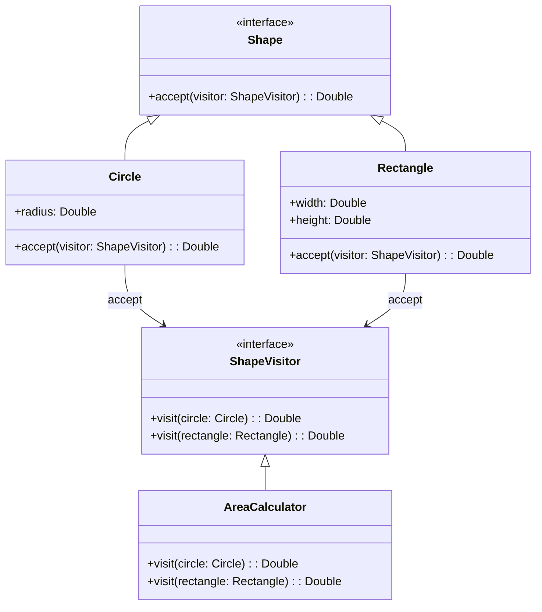

## 6.11 Visitor Pattern

The Visitor Pattern is a powerful behavioral design pattern that allows you to separate algorithms from the objects on which they operate. This separation facilitates adding new operations to existing object structures without modifying those structures. In Scala, the Visitor Pattern can be elegantly implemented using pattern matching, a feature that aligns well with the functional programming paradigm.

### Intent

The primary intent of the Visitor Pattern is to define a new operation without changing the classes of the elements on which it operates. It is particularly useful when you have a complex object structure and you want to perform various operations on these objects without cluttering their classes with numerous methods.

### Key Participants

- **Visitor**: An interface or abstract class that declares a visit method for each type of element in the object structure.
- **ConcreteVisitor**: A class that implements the Visitor interface and provides the specific operations to be performed on the elements.
- **Element**: An interface or abstract class that declares an accept method, which takes a visitor as an argument.
- **ConcreteElement**: A class that implements the Element interface and defines the accept method to call the appropriate visit method on the visitor.
- **ObjectStructure**: A class that can enumerate its elements and provide a high-level interface to allow visitors to visit its elements.

### Applicability

Use the Visitor Pattern when:

- You need to perform operations on objects in a complex object structure.
- The operations to be performed are not known at compile time.
- You want to keep the object structure classes separate from the operations performed on them.
- You anticipate frequent changes to the operations performed on the object structure.

### Sample Code Snippet

Let's explore a simple example in Scala to demonstrate the Visitor Pattern. We'll create a structure of different shapes and implement a visitor to calculate their area.

```scala
// Define the Visitor interface
trait ShapeVisitor {
  def visit(circle: Circle): Double
  def visit(rectangle: Rectangle): Double
}

// Define the Element interface
trait Shape {
  def accept(visitor: ShapeVisitor): Double
}

// ConcreteElement: Circle
case class Circle(radius: Double) extends Shape {
  override def accept(visitor: ShapeVisitor): Double = visitor.visit(this)
}

// ConcreteElement: Rectangle
case class Rectangle(width: Double, height: Double) extends Shape {
  override def accept(visitor: ShapeVisitor): Double = visitor.visit(this)
}

// ConcreteVisitor: AreaCalculator
class AreaCalculator extends ShapeVisitor {
  override def visit(circle: Circle): Double = Math.PI * circle.radius * circle.radius

  override def visit(rectangle: Rectangle): Double = rectangle.width * rectangle.height
}

// Usage
object VisitorPatternExample extends App {
  val shapes: List[Shape] = List(Circle(5), Rectangle(4, 6))
  val areaCalculator = new AreaCalculator

  shapes.foreach { shape =>
    println(s"Area: ${shape.accept(areaCalculator)}")
  }
}
```

### Design Considerations

- **Extensibility**: The Visitor Pattern makes it easy to add new operations. You simply create a new visitor class that implements the desired operations.
- **Double Dispatch**: The pattern uses double dispatch to determine the correct method to call on the visitor. This is achieved by the element calling the visitor's visit method, passing itself as an argument.
- **Complexity**: The pattern can introduce complexity, especially if the object structure is large or the operations are numerous. Careful design is needed to manage this complexity.
- **Scala Specific Features**: Scala's case classes and pattern matching can simplify the implementation of the Visitor Pattern. Pattern matching can be used to replace the traditional visit methods, making the code more concise and expressive.

### Differences and Similarities

The Visitor Pattern is often compared to the Strategy Pattern. While both patterns allow you to define a family of algorithms, the Visitor Pattern is specifically designed for operations on object structures, whereas the Strategy Pattern is more general-purpose.

### Implementing Visitors with Pattern Matching

Scala's pattern matching provides a powerful tool for implementing the Visitor Pattern. Instead of defining a separate visit method for each element type, you can use pattern matching to handle different element types in a single method.

Here's an example of how you can use pattern matching to implement the Visitor Pattern in Scala:

```scala
// Define the Shape trait
sealed trait Shape

// ConcreteElement: Circle
case class Circle(radius: Double) extends Shape

// ConcreteElement: Rectangle
case class Rectangle(width: Double, height: Double) extends Shape

// Visitor using pattern matching
object AreaCalculator {
  def calculate(shape: Shape): Double = shape match {
    case Circle(radius) => Math.PI * radius * radius
    case Rectangle(width, height) => width * height
  }
}

// Usage
object PatternMatchingVisitorExample extends App {
  val shapes: List[Shape] = List(Circle(5), Rectangle(4, 6))

  shapes.foreach { shape =>
    println(s"Area: ${AreaCalculator.calculate(shape)}")
  }
}
```

In this example, the `AreaCalculator` object uses pattern matching to determine the type of shape and calculate its area. This approach eliminates the need for separate visit methods and makes the code more concise.

### Visualizing the Visitor Pattern

To better understand the Visitor Pattern, let's visualize the interaction between the different components using a class diagram.



This diagram illustrates the relationships between the `Shape`, `Circle`, `Rectangle`, `ShapeVisitor`, and `AreaCalculator` classes. The `Circle` and `Rectangle` classes implement the `Shape` interface, and the `AreaCalculator` class implements the `ShapeVisitor` interface.

### Try It Yourself

Experiment with the Visitor Pattern by extending the example to include additional shapes, such as `Triangle` or `Square`. Implement new visitors to perform different operations, such as calculating the perimeter or drawing the shapes.

### Knowledge Check

- **Question**: What is the primary intent of the Visitor Pattern?
- **Challenge**: Modify the example to include a new shape and a new visitor operation.

### Embrace the Journey

Remember, mastering design patterns is a journey. The Visitor Pattern is just one of many tools in your software engineering toolkit. As you continue to explore and experiment, you'll gain a deeper understanding of how to apply these patterns effectively in your projects.

### Quiz Time!



### What is the primary intent of the Visitor Pattern?

- [x] To define a new operation without changing the classes of the elements on which it operates.
- [ ] To encapsulate a request as an object.
- [ ] To provide a way to access the elements of an aggregate object sequentially.
- [ ] To define a family of algorithms.

> **Explanation:** The Visitor Pattern allows you to define new operations without modifying the classes of the elements on which they operate.

### Which of the following is a key participant in the Visitor Pattern?

- [x] Visitor
- [ ] Observer
- [ ] Adapter
- [ ] Command

> **Explanation:** The Visitor is a key participant in the Visitor Pattern, responsible for defining operations on elements.

### How does the Visitor Pattern achieve double dispatch?

- [x] By having the element call the visitor's visit method, passing itself as an argument.
- [ ] By using inheritance to determine the method to call.
- [ ] By encapsulating requests as objects.
- [ ] By defining a family of algorithms.

> **Explanation:** The Visitor Pattern achieves double dispatch by having the element call the visitor's visit method, passing itself as an argument.

### What is a benefit of using pattern matching in Scala for the Visitor Pattern?

- [x] It makes the code more concise and expressive.
- [ ] It eliminates the need for interfaces.
- [ ] It allows for dynamic method dispatch.
- [ ] It simplifies the object structure.

> **Explanation:** Pattern matching in Scala makes the code more concise and expressive by handling different element types in a single method.

### Which of the following is NOT a use case for the Visitor Pattern?

- [ ] Performing operations on objects in a complex object structure.
- [x] Implementing a publish-subscribe model.
- [ ] Keeping object structure classes separate from operations.
- [ ] Adding new operations to an object structure.

> **Explanation:** The Visitor Pattern is not typically used for implementing a publish-subscribe model; it is used for operations on object structures.

### What is a potential drawback of the Visitor Pattern?

- [x] It can introduce complexity, especially with large object structures.
- [ ] It does not support adding new operations.
- [ ] It tightly couples operations with object structures.
- [ ] It requires modifying existing classes.

> **Explanation:** The Visitor Pattern can introduce complexity, particularly when dealing with large object structures or numerous operations.

### How can you extend the Visitor Pattern example to include a new shape?

- [x] By adding a new case class for the shape and updating the visitor to handle it.
- [ ] By modifying the existing visitor methods.
- [ ] By creating a new visitor interface.
- [ ] By using inheritance to extend the existing shapes.

> **Explanation:** To include a new shape, you add a new case class for the shape and update the visitor to handle it.

### What is the role of the ConcreteVisitor in the Visitor Pattern?

- [x] To implement the specific operations to be performed on the elements.
- [ ] To declare a visit method for each type of element.
- [ ] To define the accept method in elements.
- [ ] To enumerate the elements of the object structure.

> **Explanation:** The ConcreteVisitor implements the specific operations to be performed on the elements.

### Which Scala feature can simplify the implementation of the Visitor Pattern?

- [x] Pattern matching
- [ ] Implicit conversions
- [ ] Lazy evaluation
- [ ] Higher-order functions

> **Explanation:** Pattern matching can simplify the implementation of the Visitor Pattern by handling different element types in a single method.

### True or False: The Visitor Pattern is often used to implement a publish-subscribe model.

- [ ] True
- [x] False

> **Explanation:** The Visitor Pattern is not typically used for implementing a publish-subscribe model; it is used for operations on object structures.


