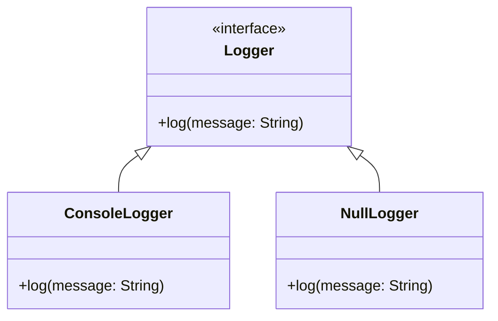

## 6.12 Null Object Pattern

In the world of software development, null references have been a notorious source of bugs and system crashes. The Null Object Pattern is a behavioral design pattern that provides a way to avoid null references and null checks by using a default behavior. In Scala, this pattern is often implemented using `Option` types, which encapsulate the presence or absence of a value in a type-safe manner.

### Intent

The Null Object Pattern aims to eliminate the need for null checks by providing a default object that represents the absence of a value. This pattern helps in simplifying code and reducing the risk of `NullPointerException`.

### Key Participants

- **Abstract Class or Interface**: Defines the expected behavior.
- **Real Object**: Implements the behavior.
- **Null Object**: Provides a default implementation that does nothing or returns a neutral value.

### Applicability

Use the Null Object Pattern when:

- You want to avoid null checks and `NullPointerException`.
- You need a default behavior for absent values.
- You want to simplify client code by eliminating conditional logic for null handling.

### Sample Code Snippet

Let's explore how the Null Object Pattern can be implemented in Scala using `Option` types.

```scala
// Define a trait representing a Logger
trait Logger {
  def log(message: String): Unit
}

// Implement a Real Logger that writes to the console
class ConsoleLogger extends Logger {
  def log(message: String): Unit = println(s"Logging message: $message")
}

// Implement a Null Logger that does nothing
class NullLogger extends Logger {
  def log(message: String): Unit = {} // No operation
}

// Function that uses a Logger
def process(data: String, logger: Logger): Unit = {
  logger.log(s"Processing data: $data")
  // Processing logic here
}

// Using the Null Object Pattern
val logger: Logger = new NullLogger
process("Sample Data", logger)
```

In this example, the `NullLogger` class acts as a Null Object, providing a no-operation implementation of the `Logger` trait. This allows the `process` function to be called without worrying about null checks.

### Design Considerations

- **When to Use**: The Null Object Pattern is ideal when you want to provide a default behavior for absent values and avoid null checks.
- **Scala-Specific Features**: Scala's `Option` type is a powerful tool for implementing the Null Object Pattern, as it encapsulates the presence or absence of a value in a type-safe manner.

### Differences and Similarities

The Null Object Pattern is often compared to the use of `Option` types in Scala. While both approaches aim to handle the absence of a value, the Null Object Pattern provides a default behavior, whereas `Option` types provide a way to handle optional values explicitly.

### Using Option Types

Scala's `Option` type is a container that can hold either a value (`Some`) or no value (`None`). It is a powerful tool for avoiding null references and null checks.

```scala
// Using Option to represent an optional value
def findUser(username: String): Option[String] = {
  // Simulate a user lookup
  if (username == "admin") Some("Admin User")
  else None
}

// Using Option in client code
val user: Option[String] = findUser("guest")
user match {
  case Some(name) => println(s"User found: $name")
  case None => println("User not found")
}
```

In this example, the `findUser` function returns an `Option[String]`, which can be either `Some("Admin User")` or `None`. This eliminates the need for null checks and provides a type-safe way to handle optional values.

### Visualizing the Null Object Pattern

To better understand the Null Object Pattern, let's visualize the interactions between the key participants using a class diagram.



**Diagram Description**: This class diagram illustrates the relationship between the `Logger` interface, `ConsoleLogger`, and `NullLogger`. The `ConsoleLogger` provides a real implementation, while the `NullLogger` provides a no-operation implementation.

### Try It Yourself

To deepen your understanding, try modifying the code examples:

- Implement a `FileLogger` that writes logs to a file.
- Use `Option` types to handle optional configurations in a configuration loader.

### Knowledge Check

- What is the primary intent of the Null Object Pattern?
- How does the Null Object Pattern differ from using `Option` types in Scala?
- Why is the Null Object Pattern useful in avoiding `NullPointerException`?

### Embrace the Journey

Remember, mastering design patterns is a journey. As you continue to explore and apply these patterns, you'll gain a deeper understanding of how to write clean, maintainable, and robust Scala code. Keep experimenting, stay curious, and enjoy the journey!

### Quiz Time!



### What is the primary intent of the Null Object Pattern?

- [x] To provide a default behavior for absent values
- [ ] To handle exceptions in a centralized manner
- [ ] To optimize performance by reducing memory usage
- [ ] To simplify user interface design

> **Explanation:** The Null Object Pattern aims to provide a default behavior for absent values, eliminating the need for null checks.

### How does the Null Object Pattern differ from using `Option` types in Scala?

- [x] Null Object Pattern provides a default behavior, while `Option` types provide a way to handle optional values explicitly
- [ ] Null Object Pattern is used for error handling, while `Option` types are used for logging
- [ ] Null Object Pattern is a creational pattern, while `Option` types are a structural pattern
- [ ] Null Object Pattern is specific to Scala, while `Option` types are universal

> **Explanation:** The Null Object Pattern provides a default behavior for absent values, whereas `Option` types provide a way to handle optional values explicitly.

### Which of the following is a key participant in the Null Object Pattern?

- [x] Null Object
- [ ] Singleton
- [ ] Factory
- [ ] Adapter

> **Explanation:** The Null Object is a key participant in the Null Object Pattern, providing a default implementation for absent values.

### What is a common use case for the Null Object Pattern?

- [x] Avoiding null checks and `NullPointerException`
- [ ] Implementing complex algorithms
- [ ] Enhancing user interface design
- [ ] Managing database connections

> **Explanation:** The Null Object Pattern is commonly used to avoid null checks and `NullPointerException` by providing a default behavior.

### In Scala, which type is commonly used to implement the Null Object Pattern?

- [x] Option
- [ ] List
- [ ] Map
- [ ] Set

> **Explanation:** In Scala, the `Option` type is commonly used to implement the Null Object Pattern, as it encapsulates the presence or absence of a value.

### What is the role of a Null Object in the Null Object Pattern?

- [x] To provide a no-operation or neutral behavior
- [ ] To manage database transactions
- [ ] To handle user input
- [ ] To optimize memory usage

> **Explanation:** The role of a Null Object in the Null Object Pattern is to provide a no-operation or neutral behavior for absent values.

### Which of the following is a benefit of using the Null Object Pattern?

- [x] Simplifies client code by eliminating conditional logic for null handling
- [ ] Increases memory usage
- [ ] Complicates error handling
- [ ] Reduces code readability

> **Explanation:** The Null Object Pattern simplifies client code by eliminating conditional logic for null handling, making the code cleaner and more maintainable.

### How can you modify the code example to implement a `FileLogger`?

- [x] Implement a new class `FileLogger` that extends the `Logger` trait and writes logs to a file
- [ ] Modify the `NullLogger` class to write logs to a file
- [ ] Use the `ConsoleLogger` class to write logs to a file
- [ ] Implement a new class `DatabaseLogger` that extends the `Logger` trait

> **Explanation:** To implement a `FileLogger`, you can create a new class `FileLogger` that extends the `Logger` trait and writes logs to a file.

### What is the purpose of the `Option` type in Scala?

- [x] To encapsulate the presence or absence of a value in a type-safe manner
- [ ] To manage memory allocation
- [ ] To handle user authentication
- [ ] To optimize algorithm performance

> **Explanation:** The `Option` type in Scala is used to encapsulate the presence or absence of a value in a type-safe manner, avoiding null references.

### True or False: The Null Object Pattern is only applicable in object-oriented programming languages.

- [ ] True
- [x] False

> **Explanation:** False. The Null Object Pattern can be applied in both object-oriented and functional programming languages, including Scala.


