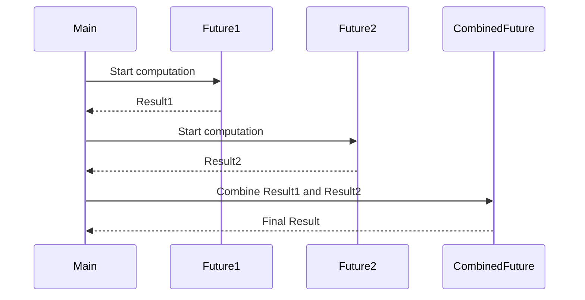

## 6.13 Future-Based Patterns

In modern software development, the ability to handle asynchronous computations efficiently is crucial. Scala, with its powerful `Future` abstraction, offers a robust mechanism for managing asynchronous operations. This section explores Future-Based Patterns in Scala, focusing on composing futures and handling failures in asynchronous contexts.

### Understanding Futures in Scala

#### What is a Future?

A `Future` in Scala represents a computation that may not have completed yet. It provides a way to perform operations asynchronously and retrieve results once they are available. Futures are particularly useful in scenarios where blocking operations, such as network calls or file I/O, are involved.

#### Key Characteristics of Futures

- **Non-blocking**: Futures allow you to perform computations without blocking the main thread.
- **Immutable**: Once a future is completed, its result cannot change.
- **Compositional**: Futures can be combined and transformed using various combinators.

### Creating and Using Futures

To create a future in Scala, you typically use the `Future` companion object and provide a block of code to execute asynchronously. Here's a simple example:

```scala
import scala.concurrent._
import ExecutionContext.Implicits.global

val future: Future[Int] = Future {
  // Simulate a long-running computation
  Thread.sleep(1000)
  42
}
```

In this example, the future encapsulates a computation that returns the integer `42` after a delay. The `ExecutionContext` is responsible for managing the thread pool used to execute the future.

### Composing Futures

One of the most powerful features of futures is their ability to be composed. Scala provides several combinators to transform and combine futures, making it easier to build complex asynchronous workflows.

#### Transforming Futures

You can transform the result of a future using the `map` method. This method applies a function to the result of the future once it is completed:

```scala
val transformedFuture: Future[String] = future.map(result => s"The answer is $result")
```

In this example, `transformedFuture` will contain the string "The answer is 42" once the original future completes.

#### Chaining Futures with `flatMap`

To chain multiple asynchronous operations, use the `flatMap` method. This method allows you to create a new future based on the result of an existing one:

```scala
val chainedFuture: Future[Int] = future.flatMap(result => Future(result * 2))
```

Here, `chainedFuture` will contain the result `84`, as it multiplies the original result by 2.

#### Combining Multiple Futures

When you need to wait for multiple futures to complete, you can use the `for` comprehension, which provides a clean syntax for combining futures:

```scala
val future1 = Future(10)
val future2 = Future(20)

val combinedFuture: Future[Int] = for {
  result1 <- future1
  result2 <- future2
} yield result1 + result2
```

The `combinedFuture` will complete with the sum of `result1` and `result2`.

### Handling Failures in Futures

Handling failures is an essential aspect of working with futures. Scala provides several mechanisms to manage errors and exceptions in asynchronous computations.

#### Recovering from Failures

Use the `recover` method to handle failures and provide an alternative result:

```scala
val recoveredFuture: Future[Int] = future.recover {
  case _: Exception => 0
}
```

In this example, if the original future fails with an exception, `recoveredFuture` will complete with the value `0`.

#### Chaining Recovery with `recoverWith`

For more complex recovery scenarios, use the `recoverWith` method, which allows you to return a new future in case of failure:

```scala
val recoveredWithFuture: Future[Int] = future.recoverWith {
  case _: Exception => Future(0)
}
```

#### Handling Success and Failure with `onComplete`

The `onComplete` method allows you to specify callbacks for both success and failure cases:

```scala
future.onComplete {
  case Success(value) => println(s"Success: $value")
  case Failure(exception) => println(s"Failure: ${exception.getMessage}")
}
```

### Advanced Future Patterns

#### Using `Future.sequence` for Batch Processing

When dealing with a collection of futures, use `Future.sequence` to transform a `List[Future[T]]` into a `Future[List[T]]`:

```scala
val futures: List[Future[Int]] = List(Future(1), Future(2), Future(3))
val futureList: Future[List[Int]] = Future.sequence(futures)
```

This pattern is useful for batch processing and aggregating results.

#### Implementing Timeout for Futures

To implement a timeout for a future, you can use the `Future.firstCompletedOf` method along with a delayed future:

```scala
import scala.concurrent.duration._

val timeoutFuture: Future[Int] = Future {
  Thread.sleep(5000)
  42
}

val delayedFuture: Future[Int] = Future {
  Thread.sleep(1000)
  throw new TimeoutException("Operation timed out")
}

val resultFuture: Future[Int] = Future.firstCompletedOf(Seq(timeoutFuture, delayedFuture))
```

In this example, `resultFuture` will complete with a `TimeoutException` if `timeoutFuture` takes longer than 1 second.

### Visualizing Future Composition

To better understand how futures are composed, let's visualize the process using a sequence diagram.



In this diagram, we see how two futures (`Future1` and `Future2`) are started, and their results are combined into a `CombinedFuture`.

### Design Considerations

When using futures in Scala, consider the following:

- **Execution Context**: Choose an appropriate `ExecutionContext` to manage thread pools and avoid blocking operations on the main thread.
- **Error Handling**: Implement robust error handling to manage exceptions and failures gracefully.
- **Performance**: Be mindful of the overhead introduced by futures, especially in high-performance applications.

### Differences and Similarities with Other Patterns

Futures are often compared to other asynchronous patterns, such as:

- **Promises**: While futures represent a read-only view of a computation, promises allow you to complete a future manually.
- **Reactive Streams**: Futures are suitable for single asynchronous operations, whereas reactive streams handle continuous data flows.

### Try It Yourself

Experiment with the following code examples to deepen your understanding of futures in Scala:

1. Modify the `chainedFuture` example to include a third computation.
2. Implement a future that simulates a network request and handles potential failures.
3. Use `Future.sequence` to process a list of URLs and retrieve their contents.

### Knowledge Check

Before moving on, consider the following questions:

1. How does the `flatMap` method differ from `map` when working with futures?
2. What is the role of the `ExecutionContext` in future-based computations?
3. How can you implement a timeout for a future in Scala?

### Embrace the Journey

Remember, mastering futures in Scala is a journey. As you continue to explore and experiment, you'll gain a deeper understanding of asynchronous programming patterns. Keep pushing your boundaries, stay curious, and enjoy the process!

## Quiz Time!



### What is a key characteristic of a `Future` in Scala?

- [x] Non-blocking
- [ ] Mutable
- [ ] Blocking
- [ ] Synchronous

> **Explanation:** Futures in Scala are non-blocking, allowing computations to proceed without waiting for the result.

### How can you transform the result of a future?

- [x] Using the `map` method
- [ ] Using the `filter` method
- [ ] Using the `collect` method
- [ ] Using the `reduce` method

> **Explanation:** The `map` method is used to transform the result of a future once it is completed.

### Which method allows chaining of multiple asynchronous operations?

- [x] `flatMap`
- [ ] `map`
- [ ] `filter`
- [ ] `reduce`

> **Explanation:** `flatMap` allows you to chain multiple asynchronous operations by creating a new future based on the result of an existing one.

### How can you handle failures in a future?

- [x] Using the `recover` method
- [ ] Using the `map` method
- [ ] Using the `filter` method
- [ ] Using the `reduce` method

> **Explanation:** The `recover` method is used to handle failures and provide an alternative result for a future.

### What is the purpose of `Future.sequence`?

- [x] To transform a `List[Future[T]]` into a `Future[List[T]]`
- [ ] To transform a `Future[List[T]]` into a `List[Future[T]]`
- [ ] To transform a `Future[T]` into a `List[Future[T]]`
- [ ] To transform a `List[T]` into a `Future[T]`

> **Explanation:** `Future.sequence` is used to transform a `List[Future[T]]` into a `Future[List[T]]`, allowing for batch processing.

### Which method allows you to specify callbacks for both success and failure cases?

- [x] `onComplete`
- [ ] `map`
- [ ] `flatMap`
- [ ] `recover`

> **Explanation:** The `onComplete` method allows you to specify callbacks for both success and failure cases of a future.

### How can you implement a timeout for a future?

- [x] Using `Future.firstCompletedOf` with a delayed future
- [ ] Using `Future.sequence`
- [ ] Using `Future.reduce`
- [ ] Using `Future.collect`

> **Explanation:** You can implement a timeout for a future using `Future.firstCompletedOf` with a delayed future that throws a `TimeoutException`.

### What is the role of the `ExecutionContext`?

- [x] To manage thread pools for executing futures
- [ ] To manage memory allocation
- [ ] To manage network connections
- [ ] To manage file I/O operations

> **Explanation:** The `ExecutionContext` is responsible for managing thread pools used to execute futures.

### Which pattern is suitable for handling continuous data flows?

- [x] Reactive Streams
- [ ] Futures
- [ ] Promises
- [ ] Synchronous operations

> **Explanation:** Reactive Streams are suitable for handling continuous data flows, whereas futures are used for single asynchronous operations.

### True or False: Futures in Scala are mutable.

- [ ] True
- [x] False

> **Explanation:** Futures in Scala are immutable. Once a future is completed, its result cannot change.


