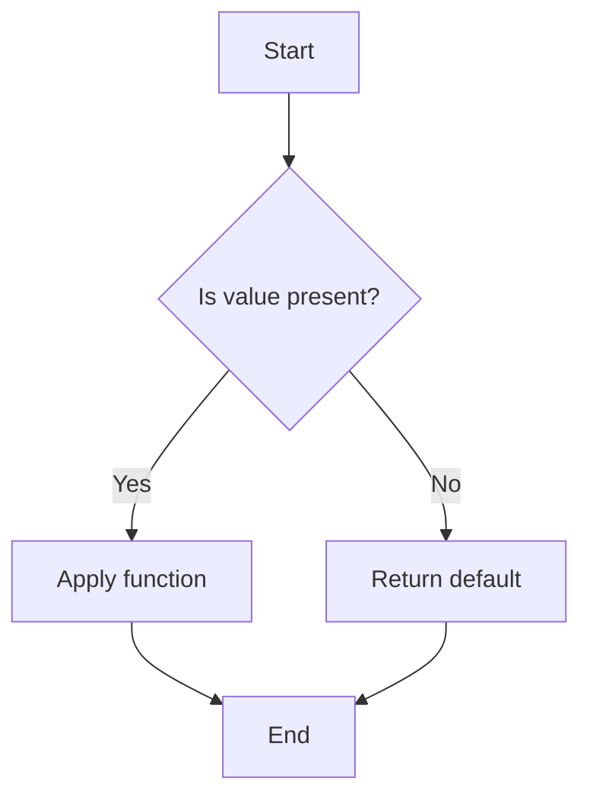

## 6.14 Functional Patterns with Monads

Monads are a fundamental concept in functional programming that provide a powerful abstraction for handling various computational contexts, such as optionality, error handling, and asynchronous computations. In Scala, monads like `Option`, `Either`, and `Try` are commonly used to manage control flow and encapsulate side effects. This section delves into the use of these monads, demonstrating how they can simplify complex logic and improve code reliability.

### Understanding Monads

Before we dive into specific monads, let's establish a foundational understanding of what a monad is. In essence, a monad is a design pattern used to handle program-wide concerns in a functional way. It is a type that encapsulates a value and provides two primary operations:

1. **`flatMap` (or `bind`)**: This operation allows you to chain operations on the encapsulated value, handling the computational context seamlessly.
2. **`unit` (or `pure`)**: This operation wraps a value in the monad, creating the monadic context.

Monads must satisfy three laws to ensure consistency:

- **Left Identity**: Wrapping a value in a monad and then applying a function should be the same as applying the function directly.
- **Right Identity**: Applying `flatMap` with a function that wraps a value should have no effect.
- **Associativity**: The order of applying `flatMap` should not matter.

### The `Option` Monad

#### Intent

The `Option` monad represents a value that may or may not be present. It is a safer alternative to using `null` and helps avoid `NullPointerException` by explicitly handling the absence of a value.

#### Key Participants

- **`Some`**: Represents a value that is present.
- **`None`**: Represents the absence of a value.

#### Applicability

Use `Option` when a function might not return a value, and you want to handle this case explicitly.

#### Sample Code Snippet

```scala
def findUserById(id: Int): Option[User] = {
  // Simulate a database lookup
  if (id == 1) Some(User(1, "Alice"))
  else None
}

val userId = 1
val userName = findUserById(userId).map(_.name).getOrElse("Unknown User")
println(userName) // Output: Alice
```

#### Design Considerations

- **Avoid using `get`**: Always prefer safe methods like `map`, `flatMap`, and `getOrElse` to handle `Option` values.
- **Pattern Matching**: Use pattern matching for more complex logic when handling `Option`.

#### Differences and Similarities

- **Similar to `Optional` in Java**: Both handle optional values, but Scala's `Option` is more idiomatic in functional programming.
- **Different from `Either`**: `Option` does not provide information about the absence of a value, unlike `Either`, which can carry an error message.

### The `Either` Monad

#### Intent

`Either` is used to represent a value of one of two possible types. It is commonly used for error handling, where one type represents a success and the other an error.

#### Key Participants

- **`Left`**: Typically represents an error or failure.
- **`Right`**: Represents a successful computation.

#### Applicability

Use `Either` when you need to handle errors and want to provide more context than `Option`.

#### Sample Code Snippet

```scala
def divide(a: Int, b: Int): Either[String, Int] = {
  if (b == 0) Left("Division by zero")
  else Right(a / b)
}

val result = divide(4, 2) match {
  case Right(value) => s"Result: $value"
  case Left(error) => s"Error: $error"
}

println(result) // Output: Result: 2
```

#### Design Considerations

- **Bias towards `Right`**: Scala's `Either` is right-biased, meaning it is designed to work with `Right` values by default.
- **Use `map` and `flatMap`**: These operations work on the `Right` value, allowing you to chain computations.

#### Differences and Similarities

- **Similar to `Try`**: Both can represent success or failure, but `Try` is specifically for exceptions.
- **Different from `Option`**: `Either` provides more information about failure, whereas `Option` only indicates presence or absence.

### The `Try` Monad

#### Intent

`Try` is used to handle computations that may throw exceptions. It encapsulates a computation that can either succeed with a result or fail with an exception.

#### Key Participants

- **`Success`**: Represents a successful computation.
- **`Failure`**: Represents a failed computation with an exception.

#### Applicability

Use `Try` when dealing with operations that can throw exceptions, such as I/O operations or parsing.

#### Sample Code Snippet

```scala
import scala.util.{Try, Success, Failure}

def parseInt(s: String): Try[Int] = Try(s.toInt)

val result = parseInt("123") match {
  case Success(value) => s"Parsed number: $value"
  case Failure(exception) => s"Error: ${exception.getMessage}"
}

println(result) // Output: Parsed number: 123
```

#### Design Considerations

- **Avoid using `get`**: Use `getOrElse`, `recover`, or pattern matching to handle `Try` values safely.
- **Chaining with `map` and `flatMap`**: These operations allow chaining computations that might fail.

#### Differences and Similarities

- **Similar to `Either`**: Both handle success and failure, but `Try` is specifically for exceptions.
- **Different from `Option`**: `Try` provides exception handling, whereas `Option` only indicates presence or absence.

### Monad Composition

Monads can be composed to handle more complex scenarios. For example, you might want to combine `Option` and `Try` to handle optional values that can also throw exceptions.

#### Sample Code Snippet

```scala
def safeDivide(a: Int, b: Int): Option[Try[Int]] = {
  if (b == 0) None
  else Some(Try(a / b))
}

val result = safeDivide(4, 2).flatMap(_.toOption).getOrElse(-1)
println(result) // Output: 2
```

### Visualizing Monad Operations

To better understand how monads work, let's visualize the flow of operations using a flowchart.



**Diagram Description:** This flowchart represents the decision-making process when applying a function to a monadic value. If the value is present, the function is applied; otherwise, a default value is returned.

### Error Handling and Effect Tracking

Monads like `Option`, `Either`, and `Try` are instrumental in managing errors and tracking effects in a functional way. They allow you to:

- **Encapsulate side effects**: By wrapping computations in monads, you can manage side effects explicitly.
- **Chain operations safely**: Use `map` and `flatMap` to chain operations without worrying about intermediate failures.
- **Provide meaningful error messages**: With `Either` and `Try`, you can convey detailed error information.

### Try It Yourself

Experiment with the following code examples to deepen your understanding of monads:

1. **Modify the `divide` function** to handle more complex error scenarios, such as negative numbers.
2. **Create a new function** that combines `Option` and `Try` to parse and validate user input.
3. **Implement a custom monad** for a specific use case in your application.

### Knowledge Check

- **What are the three laws of monads?**
- **How does `Either` differ from `Option`?**
- **Why is it important to avoid using `get` with `Option` and `Try`?**

### Embrace the Journey

Remember, mastering monads is a journey. As you continue to explore functional programming in Scala, you'll discover new ways to leverage monads for cleaner, more reliable code. Keep experimenting, stay curious, and enjoy the process!

## Quiz Time!



### What is a monad in functional programming?

- [x] A design pattern that handles program-wide concerns in a functional way.
- [ ] A type that represents a collection of elements.
- [ ] A function that takes another function as an argument.
- [ ] A data structure used for storing key-value pairs.

> **Explanation:** A monad is a design pattern used to handle program-wide concerns, providing a way to chain operations and manage computational contexts.

### Which monad is used to represent a value that may or may not be present?

- [x] Option
- [ ] Either
- [ ] Try
- [ ] List

> **Explanation:** The `Option` monad is used to represent a value that may or may not be present, providing a safer alternative to `null`.

### What does the `Right` value in an `Either` monad typically represent?

- [x] A successful computation
- [ ] An error or failure
- [ ] An optional value
- [ ] An exception

> **Explanation:** In the `Either` monad, the `Right` value typically represents a successful computation, while `Left` represents an error.

### What is the purpose of the `Try` monad?

- [x] To handle computations that may throw exceptions
- [ ] To represent a value that may or may not be present
- [ ] To encapsulate a collection of elements
- [ ] To manage asynchronous computations

> **Explanation:** The `Try` monad is used to handle computations that may throw exceptions, encapsulating success or failure.

### Which operation allows you to chain operations on the encapsulated value in a monad?

- [x] flatMap
- [ ] map
- [ ] filter
- [ ] foreach

> **Explanation:** The `flatMap` operation allows you to chain operations on the encapsulated value in a monad, handling the computational context seamlessly.

### What is the primary difference between `Option` and `Either`?

- [x] `Option` does not provide information about the absence of a value, while `Either` can carry an error message.
- [ ] `Option` is used for error handling, while `Either` is used for optional values.
- [ ] `Option` is a collection, while `Either` is not.
- [ ] `Option` is right-biased, while `Either` is not.

> **Explanation:** `Option` does not provide information about the absence of a value, whereas `Either` can carry an error message, providing more context.

### Why should you avoid using `get` with `Option` and `Try`?

- [x] It can lead to runtime exceptions if the value is not present.
- [ ] It is slower than using `map` and `flatMap`.
- [ ] It does not work with `Either`.
- [ ] It is deprecated in Scala 3.

> **Explanation:** Using `get` with `Option` and `Try` can lead to runtime exceptions if the value is not present, so it's safer to use methods like `getOrElse`.

### How can you handle errors with the `Try` monad?

- [x] Using pattern matching with `Success` and `Failure`
- [ ] Using `get` to retrieve the value
- [ ] Using `filter` to check for errors
- [ ] Using `foreach` to handle errors

> **Explanation:** You can handle errors with the `Try` monad by using pattern matching with `Success` and `Failure` to safely manage the computation's outcome.

### What is a key benefit of using monads for error handling?

- [x] They allow chaining operations without worrying about intermediate failures.
- [ ] They make code execution faster.
- [ ] They eliminate the need for error messages.
- [ ] They automatically retry failed operations.

> **Explanation:** Monads allow chaining operations without worrying about intermediate failures, making error handling more seamless and reliable.

### True or False: Monads must satisfy three laws: Left Identity, Right Identity, and Associativity.

- [x] True
- [ ] False

> **Explanation:** True. Monads must satisfy the three laws of Left Identity, Right Identity, and Associativity to ensure consistent behavior.


