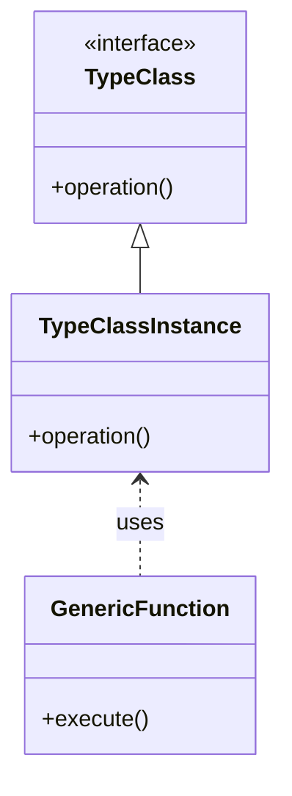

## 6.15 Type Classes and Implicits in Behavioral Patterns

In this chapter, we delve into the powerful concepts of type classes and implicits in Scala, and how they can be used to extend behavior and inject functionality in a seamless and expressive manner. These features are integral to Scala's ability to elegantly handle behavioral patterns, making your code more modular, reusable, and easier to maintain.

### Introduction to Type Classes

**Type classes** are a programming pattern that allows you to define behavior for types without modifying their source code. They are a way of achieving ad-hoc polymorphism, which is the ability to define generic functions that can operate on different types.

#### Intent

The intent of type classes is to provide a mechanism for extending the functionality of existing types in a modular and non-intrusive way. They allow you to define operations that can be applied to a variety of types, without requiring those types to be aware of the operations.

#### Key Participants

1. **Type Class**: A trait or interface that defines a set of operations.
2. **Type Class Instance**: An implementation of the type class for a specific type.
3. **Generic Function**: A function that operates on any type that has a type class instance.

#### Applicability

Type classes are applicable in scenarios where you need to define operations that can be applied to a variety of types, especially when you cannot modify the types themselves. They are particularly useful in libraries where you want to provide additional functionality to user-defined types.

#### Sample Code Snippet

Let's start with a simple example to illustrate the concept of type classes in Scala.

```scala
// Define a type class
trait Show[A] {
  def show(a: A): String
}

// Define a type class instance for Int
implicit val intShow: Show[Int] = new Show[Int] {
  def show(a: Int): String = s"Int: $a"
}

// Define a type class instance for String
implicit val stringShow: Show[String] = new Show[String] {
  def show(a: String): String = s"String: $a"
}

// Define a generic function that uses the type class
def printShow[A](a: A)(implicit showInstance: Show[A]): Unit = {
  println(showInstance.show(a))
}

// Usage
printShow(42)       // Output: Int: 42
printShow("Hello")  // Output: String: Hello
```

In this example, we define a `Show` type class with a single method `show`. We then provide instances of this type class for `Int` and `String`. The `printShow` function is a generic function that takes an implicit `Show` instance and uses it to print the representation of the value.

### Understanding Implicits

**Implicits** in Scala are a way to automatically pass arguments to functions, provide default values, or extend existing types with new methods. They are a cornerstone of Scala's flexibility and power, allowing for concise and expressive code.

#### Intent

The intent of implicits is to reduce boilerplate and enhance code readability by allowing certain parameters to be automatically provided by the compiler. They are also used to implement type classes and provide type class instances.

#### Key Participants

1. **Implicit Parameters**: Parameters that are automatically provided by the compiler.
2. **Implicit Conversions**: Conversions that are automatically applied by the compiler to convert one type to another.
3. **Implicit Classes**: Classes that provide additional methods to existing types.

#### Applicability

Implicits are applicable in scenarios where you want to reduce boilerplate, provide default behavior, or extend existing types with additional functionality. They are particularly useful in libraries and frameworks where you want to provide a seamless user experience.

#### Sample Code Snippet

Here's a simple example of using implicits to extend existing types with additional methods.

```scala
// Define an implicit class to extend Int with a new method
implicit class IntOps(val x: Int) extends AnyVal {
  def isEven: Boolean = x % 2 == 0
}

// Usage
println(4.isEven)  // Output: true
println(3.isEven)  // Output: false
```

In this example, we define an implicit class `IntOps` that extends `Int` with a new method `isEven`. This allows us to call `isEven` on any `Int` value without modifying the `Int` class itself.

### Combining Type Classes and Implicits

The true power of Scala's type classes and implicits comes when they are combined. Implicits are used to provide type class instances, allowing for seamless integration of type classes into your code.

#### Design Considerations

- **Type Safety**: Type classes provide a type-safe way to extend behavior without modifying existing types.
- **Modularity**: Type classes and implicits promote modularity by decoupling behavior from data structures.
- **Readability**: While implicits can reduce boilerplate, they can also make code harder to understand if overused. Use them judiciously.

#### Differences and Similarities

- **Type Classes vs. Inheritance**: Type classes provide a more flexible and modular way to extend behavior compared to traditional inheritance.
- **Implicits vs. Default Parameters**: Implicits provide more flexibility than default parameters, allowing for context-sensitive behavior.

### Advanced Type Class Patterns

Let's explore some advanced patterns and techniques for using type classes and implicits in Scala.

#### Context Bounds

Context bounds are a syntactic sugar for using type classes with implicits. They allow you to specify that a type must have a type class instance available.

```scala
def printShow[A: Show](a: A): Unit = {
  val showInstance = implicitly[Show[A]]
  println(showInstance.show(a))
}
```

In this example, the context bound `[A: Show]` is a shorthand for requiring an implicit `Show[A]` instance.

#### Higher-Kinded Types

Type classes can be extended to work with higher-kinded types, allowing for more abstract and powerful patterns.

```scala
trait Functor[F[_]] {
  def map[A, B](fa: F[A])(f: A => B): F[B]
}

// Example instance for List
implicit val listFunctor: Functor[List] = new Functor[List] {
  def map[A, B](fa: List[A])(f: A => B): List[B] = fa.map(f)
}

// Usage
def double[F[_]: Functor](fa: F[Int]): F[Int] = {
  val functor = implicitly[Functor[F]]
  functor.map(fa)(_ * 2)
}

println(double(List(1, 2, 3)))  // Output: List(2, 4, 6)
```

In this example, we define a `Functor` type class for higher-kinded types `F[_]`. We provide an instance for `List` and use it to double the elements of a list.

### Visualizing Type Classes and Implicits

To better understand the relationship between type classes and implicits, let's visualize the flow of how these concepts interact in Scala.



**Diagram Description**: This diagram illustrates the relationship between a type class, its instance, and a generic function that uses the type class instance. The type class defines an interface, the instance provides a concrete implementation, and the generic function utilizes the instance to perform operations.

### Practical Applications

#### Extending Libraries

Type classes and implicits are commonly used to extend libraries with additional functionality. For example, you can define a type class for serialization and provide instances for different types.

```scala
trait Serializer[A] {
  def serialize(a: A): String
}

implicit val intSerializer: Serializer[Int] = new Serializer[Int] {
  def serialize(a: Int): String = a.toString
}

implicit val stringSerializer: Serializer[String] = new Serializer[String] {
  def serialize(a: String): String = a
}

def toJson[A: Serializer](a: A): String = {
  val serializer = implicitly[Serializer[A]]
  s"""{"value": "${serializer.serialize(a)}"}"""
}

println(toJson(42))       // Output: {"value": "42"}
println(toJson("Hello"))  // Output: {"value": "Hello"}
```

#### Enhancing Domain Models

Type classes can be used to enhance domain models with additional behavior without modifying the models themselves. This is particularly useful in large systems where you want to add new functionality without touching existing code.

#### Building DSLs

Type classes and implicits are powerful tools for building domain-specific languages (DSLs) in Scala. They allow you to define expressive and flexible APIs that can be easily extended by users.

### Try It Yourself

To solidify your understanding, try modifying the code examples provided. For instance, add a new type class instance for a custom type, or create a new type class with different operations. Experiment with context bounds and higher-kinded types to see how they affect the behavior of your functions.

### Knowledge Check

- **Question**: What is the primary purpose of type classes in Scala?
- **Question**: How do implicits help in implementing type classes?
- **Question**: What are some potential pitfalls of overusing implicits?

### Conclusion

Type classes and implicits are powerful features of Scala that enable you to write flexible, modular, and expressive code. By understanding and applying these concepts, you can extend the behavior of existing types, build powerful abstractions, and create seamless APIs. Remember to use these tools judiciously, as overuse can lead to code that is difficult to understand and maintain.

### References and Links

- [Scala Documentation on Implicits](https://docs.scala-lang.org/tour/implicit-parameters.html)
- [Type Classes in Scala](https://www.scala-lang.org/blog/2016/12/19/scala-implicit-design-patterns.html)
- [Functional Programming in Scala](https://www.manning.com/books/functional-programming-in-scala)

## Quiz Time!



### What is a type class in Scala?

- [x] A pattern that allows defining behavior for types without modifying them
- [ ] A class that inherits from another class
- [ ] A function that operates on a single type
- [ ] A way to define default values for parameters

> **Explanation:** Type classes provide a mechanism for defining behavior for types without modifying them, allowing for ad-hoc polymorphism.

### How are implicits used in Scala?

- [x] To automatically provide arguments to functions
- [ ] To define new types
- [ ] To create new instances of classes
- [ ] To enforce strict typing

> **Explanation:** Implicits in Scala are used to automatically provide arguments to functions, reducing boilerplate and enhancing code readability.

### What is the purpose of context bounds in Scala?

- [x] To specify that a type must have a type class instance available
- [ ] To enforce inheritance hierarchies
- [ ] To define default values for parameters
- [ ] To restrict the visibility of a class

> **Explanation:** Context bounds are a syntactic sugar for requiring that a type has a type class instance available, simplifying the use of type classes.

### Which of the following is a benefit of using type classes?

- [x] They provide a type-safe way to extend behavior without modifying existing types
- [ ] They enforce strict inheritance hierarchies
- [ ] They allow for mutable state management
- [ ] They simplify exception handling

> **Explanation:** Type classes provide a type-safe way to extend behavior without modifying existing types, promoting modularity and flexibility.

### What is a potential downside of overusing implicits?

- [x] It can make code harder to understand
- [ ] It can lead to runtime errors
- [ ] It enforces strict typing
- [ ] It simplifies code readability

> **Explanation:** Overusing implicits can make code harder to understand, as it may not be immediately clear where certain values or behaviors are coming from.

### How can type classes enhance domain models?

- [x] By adding new behavior without modifying existing code
- [ ] By enforcing strict inheritance
- [ ] By introducing mutable state
- [ ] By simplifying exception handling

> **Explanation:** Type classes can enhance domain models by adding new behavior without modifying existing code, allowing for more flexible and maintainable systems.

### What is the role of implicit classes in Scala?

- [x] To extend existing types with additional methods
- [ ] To define new types
- [ ] To enforce strict typing
- [ ] To manage mutable state

> **Explanation:** Implicit classes in Scala are used to extend existing types with additional methods, providing a way to add functionality without modifying the original type.

### Which of the following is an example of a higher-kinded type?

- [x] `F[_]`
- [ ] `Int`
- [ ] `String`
- [ ] `Boolean`

> **Explanation:** Higher-kinded types, like `F[_]`, are types that take other types as parameters, allowing for more abstract and powerful patterns.

### What is the relationship between type classes and implicits?

- [x] Implicits are used to provide type class instances
- [ ] Type classes are used to define implicits
- [ ] They are unrelated concepts
- [ ] Implicits enforce type class constraints

> **Explanation:** Implicits are used to provide type class instances, allowing for seamless integration of type classes into Scala code.

### True or False: Type classes and implicits can be used to build domain-specific languages (DSLs) in Scala.

- [x] True
- [ ] False

> **Explanation:** True. Type classes and implicits are powerful tools for building domain-specific languages (DSLs) in Scala, allowing for expressive and flexible APIs.


