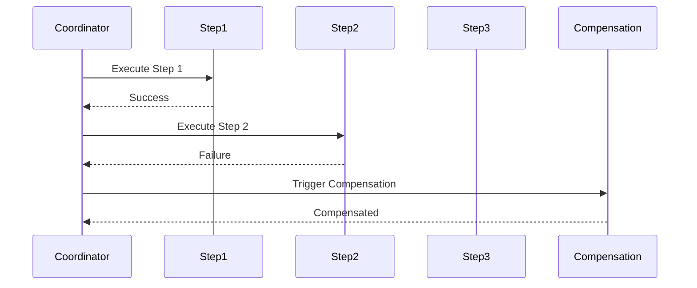

## 6.16 Saga Pattern

In the world of distributed systems and microservices, managing transactions that span multiple services can be challenging. The Saga Pattern is a design pattern that provides a way to manage complex transactions across distributed systems by breaking them into a series of smaller, manageable transactions. This pattern is particularly useful in microservices architectures where traditional ACID transactions are not feasible. In this section, we will explore the Saga Pattern, its implementation using Akka in Scala, and how to handle compensation actions to maintain data consistency.

### Intent

The primary intent of the Saga Pattern is to manage distributed transactions by splitting them into a series of smaller, independent transactions. Each transaction in a saga is a step that can be executed independently, and if a step fails, a compensation action is triggered to undo the changes made by the previous steps. This approach ensures eventual consistency across distributed systems without relying on distributed locks or two-phase commits.

### Key Participants

1. **Saga Coordinator**: Manages the execution of the saga, coordinating the sequence of transactions and handling failures by triggering compensation actions.

2. **Saga Participants**: Each service involved in the saga acts as a participant, executing its part of the transaction and reporting success or failure to the coordinator.

3. **Compensation Actions**: Actions that are executed to undo the effects of a transaction step if it fails, ensuring that the system remains consistent.

### Applicability

The Saga Pattern is applicable in scenarios where:

- Transactions span multiple microservices or distributed systems.
- Traditional ACID transactions are not feasible due to the distributed nature of the system.
- Eventual consistency is acceptable, and compensating actions can be defined for each transaction step.

### Implementing Sagas with Akka

Akka is a powerful toolkit for building concurrent, distributed, and fault-tolerant applications on the JVM. It provides a robust framework for implementing the Saga Pattern in Scala. Let's explore how to implement sagas using Akka, focusing on the coordination of transactions and handling of compensation actions.

#### Step 1: Define the Saga Steps

Each step in a saga represents a transaction that can be executed independently. In Akka, we can define each step as an actor that performs a specific task and reports its success or failure to the saga coordinator.

```scala
import akka.actor.{Actor, ActorLogging, Props}

object SagaStep {
  def props(stepName: String): Props = Props(new SagaStep(stepName))
}

class SagaStep(stepName: String) extends Actor with ActorLogging {
  override def receive: Receive = {
    case "execute" =>
      log.info(s"Executing step: $stepName")
      // Simulate step execution
      if (scala.util.Random.nextBoolean()) {
        sender() ! "success"
      } else {
        sender() ! "failure"
      }
  }
}
```

#### Step 2: Implement the Saga Coordinator

The saga coordinator is responsible for managing the execution of the saga, coordinating the sequence of steps, and handling failures by triggering compensation actions.

```scala
import akka.actor.{Actor, ActorLogging, ActorRef, Props}

object SagaCoordinator {
  def props(steps: List[ActorRef]): Props = Props(new SagaCoordinator(steps))
}

class SagaCoordinator(steps: List[ActorRef]) extends Actor with ActorLogging {
  private var currentStep = 0

  override def receive: Receive = {
    case "start" =>
      log.info("Starting saga")
      executeNextStep()

    case "success" =>
      log.info(s"Step ${currentStep + 1} succeeded")
      currentStep += 1
      if (currentStep < steps.length) {
        executeNextStep()
      } else {
        log.info("Saga completed successfully")
        context.stop(self)
      }

    case "failure" =>
      log.info(s"Step ${currentStep + 1} failed, triggering compensation")
      triggerCompensation()
      context.stop(self)
  }

  private def executeNextStep(): Unit = {
    log.info(s"Executing step ${currentStep + 1}")
    steps(currentStep) ! "execute"
  }

  private def triggerCompensation(): Unit = {
    // Implement compensation logic here
    log.info("Compensation actions executed")
  }
}
```

#### Step 3: Define Compensation Actions

Compensation actions are crucial for maintaining consistency in the event of a failure. Each step should have a corresponding compensation action that can undo its effects.

```scala
object CompensationAction {
  def props(actionName: String): Props = Props(new CompensationAction(actionName))
}

class CompensationAction(actionName: String) extends Actor with ActorLogging {
  override def receive: Receive = {
    case "compensate" =>
      log.info(s"Executing compensation action: $actionName")
      // Simulate compensation action
      sender() ! "compensated"
  }
}
```

#### Step 4: Execute the Saga

To execute the saga, we create the saga coordinator and the steps, then send a "start" message to the coordinator to begin the process.

```scala
import akka.actor.ActorSystem

object SagaExample extends App {
  val system = ActorSystem("SagaSystem")

  val step1 = system.actorOf(SagaStep.props("Step 1"))
  val step2 = system.actorOf(SagaStep.props("Step 2"))
  val step3 = system.actorOf(SagaStep.props("Step 3"))

  val steps = List(step1, step2, step3)
  val coordinator = system.actorOf(SagaCoordinator.props(steps))

  coordinator ! "start"
}
```

### Design Considerations

When implementing the Saga Pattern, consider the following:

- **Idempotency**: Ensure that each step and compensation action is idempotent, meaning it can be executed multiple times without adverse effects.
- **Error Handling**: Define clear error handling strategies for each step and compensation action.
- **Timeouts and Retries**: Implement timeouts and retries for steps that may take longer to execute or may fail intermittently.
- **Monitoring and Logging**: Use monitoring and logging to track the progress of the saga and diagnose issues.

### Differences and Similarities

The Saga Pattern is often compared to the Two-Phase Commit (2PC) protocol. However, unlike 2PC, which relies on locking resources and can lead to blocking, the Saga Pattern allows for non-blocking execution and eventual consistency. It is more suitable for distributed systems where long-running transactions are common.

### Visualizing the Saga Pattern

To better understand the flow of the Saga Pattern, let's visualize the process using a sequence diagram.



### Try It Yourself

To gain a deeper understanding of the Saga Pattern, try modifying the code examples provided:

- **Add More Steps**: Extend the saga with additional steps and observe how the coordinator manages them.
- **Implement Real Compensation Logic**: Replace the simulated compensation actions with real logic that undoes changes made by the steps.
- **Experiment with Failures**: Introduce failures at different steps and observe how the coordinator handles them.

### Knowledge Check

- **What is the primary intent of the Saga Pattern?**
- **How does the Saga Pattern differ from the Two-Phase Commit protocol?**
- **What role does the Saga Coordinator play in the pattern?**

### References and Links

- [Akka Documentation](https://doc.akka.io/docs/akka/current/)
- [Microservices Patterns](https://microservices.io/patterns/data/saga.html)

## Quiz Time!



### What is the primary intent of the Saga Pattern?

- [x] To manage distributed transactions by splitting them into smaller, independent transactions.
- [ ] To lock resources during transactions to ensure consistency.
- [ ] To execute transactions in parallel for faster processing.
- [ ] To use distributed locks for transaction management.

> **Explanation:** The Saga Pattern aims to manage distributed transactions by breaking them into smaller, independent transactions, ensuring eventual consistency.

### How does the Saga Pattern differ from the Two-Phase Commit protocol?

- [x] It allows for non-blocking execution and eventual consistency.
- [ ] It relies on locking resources for consistency.
- [ ] It is more suitable for single-node systems.
- [ ] It requires a central coordinator for all transactions.

> **Explanation:** Unlike 2PC, which relies on locking resources and can lead to blocking, the Saga Pattern allows for non-blocking execution and eventual consistency.

### What role does the Saga Coordinator play in the pattern?

- [x] It manages the execution of the saga, coordinating the sequence of steps and handling failures.
- [ ] It executes each step of the saga independently.
- [ ] It locks resources during the transaction.
- [ ] It provides a user interface for transaction management.

> **Explanation:** The Saga Coordinator is responsible for managing the execution of the saga, coordinating the sequence of steps, and handling failures by triggering compensation actions.

### What is a compensation action in the context of the Saga Pattern?

- [x] An action that undoes the effects of a transaction step if it fails.
- [ ] A step that executes in parallel with the main transaction.
- [ ] A mechanism to lock resources during a transaction.
- [ ] A method to speed up transaction execution.

> **Explanation:** Compensation actions are executed to undo the effects of a transaction step if it fails, ensuring that the system remains consistent.

### Which tool is commonly used to implement the Saga Pattern in Scala?

- [x] Akka
- [ ] Play Framework
- [ ] Slick
- [ ] Cats

> **Explanation:** Akka is a powerful toolkit for building concurrent, distributed, and fault-tolerant applications, making it suitable for implementing the Saga Pattern in Scala.

### What is a key consideration when implementing the Saga Pattern?

- [x] Ensuring that each step and compensation action is idempotent.
- [ ] Locking resources during each transaction step.
- [ ] Executing all steps in parallel.
- [ ] Using distributed locks for consistency.

> **Explanation:** Idempotency is crucial to ensure that each step and compensation action can be executed multiple times without adverse effects.

### What is the benefit of using the Saga Pattern over traditional ACID transactions?

- [x] It provides eventual consistency without relying on distributed locks.
- [ ] It ensures immediate consistency across all systems.
- [ ] It simplifies transaction management by using a single database.
- [ ] It reduces the need for compensation actions.

> **Explanation:** The Saga Pattern provides eventual consistency without relying on distributed locks, making it suitable for distributed systems.

### How can failures be handled in the Saga Pattern?

- [x] By triggering compensation actions to undo the effects of previous steps.
- [ ] By locking resources until the transaction is complete.
- [ ] By retrying the entire transaction from the beginning.
- [ ] By using distributed locks to ensure consistency.

> **Explanation:** Failures are handled by triggering compensation actions to undo the effects of previous steps, ensuring consistency.

### What is a common use case for the Saga Pattern?

- [x] Managing transactions that span multiple microservices or distributed systems.
- [ ] Executing transactions within a single database.
- [ ] Locking resources for immediate consistency.
- [ ] Simplifying transaction management in monolithic applications.

> **Explanation:** The Saga Pattern is commonly used for managing transactions that span multiple microservices or distributed systems, where traditional ACID transactions are not feasible.

### True or False: The Saga Pattern is suitable for systems where eventual consistency is acceptable.

- [x] True
- [ ] False

> **Explanation:** The Saga Pattern is designed for systems where eventual consistency is acceptable, as it allows for non-blocking execution and compensation actions.


