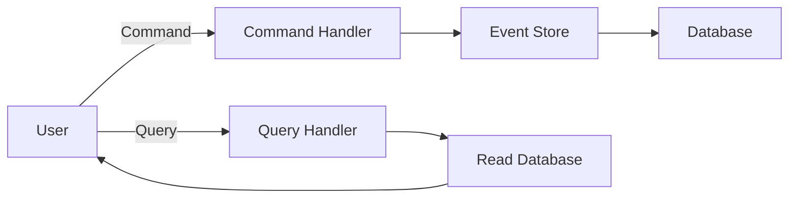

## 6.17 Command Query Responsibility Segregation (CQRS)

Command Query Responsibility Segregation (CQRS) is a powerful architectural pattern that separates the read and write operations of a system. This separation allows for optimized handling of queries and commands, leading to improved performance, scalability, and maintainability. In this section, we will explore the CQRS pattern in the context of Scala, providing a comprehensive understanding of its implementation and benefits.

### Intent

The primary intent of CQRS is to decouple the read and write operations of a system, allowing each to be optimized independently. By separating these concerns, developers can tailor their solutions to the specific needs of each operation, such as optimizing read operations for speed and write operations for consistency.

### Key Participants

- **Command**: Represents an action that changes the state of the system. Commands are typically handled by a command handler.
- **Query**: Represents a request for information without modifying the state. Queries are handled by a query handler.
- **Command Handler**: Processes commands and updates the system state.
- **Query Handler**: Retrieves data from the system without altering its state.
- **Event Store**: Stores events that represent state changes, often used in conjunction with Event Sourcing.

### Applicability

CQRS is particularly useful in scenarios where:

- The system has complex business logic that benefits from separation of concerns.
- Read and write operations have different performance and scalability requirements.
- The system requires high availability and responsiveness.
- There is a need for audit trails or history tracking of changes.

### Implementing CQRS in Scala

Let's dive into the implementation of CQRS in a Scala application. We will build a simple e-commerce system that uses CQRS to manage product inventory.

#### Step 1: Define Commands and Queries

First, we define the commands and queries for our system. Commands will be used to update the inventory, while queries will retrieve product information.

```scala
// Command to add a product
case class AddProductCommand(productId: String, name: String, quantity: Int)

// Command to update product quantity
case class UpdateProductQuantityCommand(productId: String, quantity: Int)

// Query to get product details
case class GetProductQuery(productId: String)
```

#### Step 2: Implement Command Handlers

Command handlers process commands and update the system state. In our example, we will use a simple in-memory data store to manage product inventory.

```scala
trait CommandHandler[C] {
  def handle(command: C): Unit
}

class AddProductHandler extends CommandHandler[AddProductCommand] {
  override def handle(command: AddProductCommand): Unit = {
    // Logic to add product to inventory
    println(s"Adding product: ${command.name} with quantity: ${command.quantity}")
    // Update in-memory store or database
  }
}

class UpdateProductQuantityHandler extends CommandHandler[UpdateProductQuantityCommand] {
  override def handle(command: UpdateProductQuantityCommand): Unit = {
    // Logic to update product quantity
    println(s"Updating product: ${command.productId} with new quantity: ${command.quantity}")
    // Update in-memory store or database
  }
}
```

#### Step 3: Implement Query Handlers

Query handlers retrieve information from the system without modifying its state. They are optimized for fast data retrieval.

```scala
trait QueryHandler[Q, R] {
  def handle(query: Q): R
}

class GetProductQueryHandler extends QueryHandler[GetProductQuery, Option[Product]] {
  override def handle(query: GetProductQuery): Option[Product] = {
    // Logic to retrieve product details
    println(s"Retrieving product details for: ${query.productId}")
    // Fetch from in-memory store or database
    Some(Product(query.productId, "Sample Product", 100))
  }
}
```

#### Step 4: Define the Product Model

The `Product` model represents the data structure for products in our inventory.

```scala
case class Product(productId: String, name: String, quantity: Int)
```

#### Step 5: Integrate Command and Query Handlers

We integrate the command and query handlers into our application, allowing us to process commands and queries.

```scala
object CQRSExample {
  def main(args: Array[String]): Unit = {
    val addProductHandler = new AddProductHandler
    val updateProductQuantityHandler = new UpdateProductQuantityHandler
    val getProductQueryHandler = new GetProductQueryHandler

    // Example usage
    val addCommand = AddProductCommand("1", "Laptop", 50)
    addProductHandler.handle(addCommand)

    val updateCommand = UpdateProductQuantityCommand("1", 75)
    updateProductQuantityHandler.handle(updateCommand)

    val query = GetProductQuery("1")
    val product = getProductQueryHandler.handle(query)
    println(s"Product details: $product")
  }
}
```

### Design Considerations

When implementing CQRS, consider the following design aspects:

- **Consistency**: Ensure that the system maintains consistency between the command and query models. Eventual consistency is often used in CQRS systems.
- **Scalability**: Separate read and write operations can be scaled independently, allowing for better resource utilization.
- **Complexity**: CQRS can introduce additional complexity, so it should be used when the benefits outweigh the costs.
- **Event Sourcing**: Often used in conjunction with CQRS to provide a complete history of state changes.

### Differences and Similarities

CQRS is often compared to Event Sourcing, as both patterns deal with state changes. However, they serve different purposes:

- **CQRS** focuses on separating read and write operations.
- **Event Sourcing** focuses on storing state changes as events.

These patterns can be used together to create a robust and scalable system architecture.

### Visualizing CQRS

To better understand the CQRS pattern, let's visualize the separation of command and query responsibilities.



**Diagram Description**: This diagram illustrates the flow of commands and queries in a CQRS system. Commands are processed by command handlers and stored in an event store, while queries are handled separately to retrieve data from a read-optimized database.

### Try It Yourself

Experiment with the provided code examples by adding new commands and queries. For instance, try implementing a `RemoveProductCommand` and a corresponding handler. Consider how you might handle errors or invalid commands in your system.

### References and Links

For further reading on CQRS and related patterns, consider the following resources:

- [Martin Fowler's CQRS](https://martinfowler.com/bliki/CQRS.html)
- [Event Sourcing](https://martinfowler.com/eaaDev/EventSourcing.html)
- [CQRS and Event Sourcing](https://docs.microsoft.com/en-us/azure/architecture/patterns/cqrs)

### Knowledge Check

- What are the main benefits of using CQRS?
- How does CQRS improve system scalability?
- What is the role of a command handler in a CQRS system?
- How can CQRS be combined with Event Sourcing?

### Embrace the Journey

Remember, mastering CQRS is a journey. As you continue to explore and implement this pattern, you'll discover new ways to optimize your systems for performance and scalability. Keep experimenting, stay curious, and enjoy the journey!

## Quiz Time!



### What is the primary intent of CQRS?

- [x] To separate read and write operations for optimized handling.
- [ ] To combine read and write operations for simplicity.
- [ ] To increase the complexity of system architecture.
- [ ] To store events as a history of state changes.

> **Explanation:** CQRS aims to separate read and write operations to optimize each independently.

### Which component in CQRS handles commands?

- [x] Command Handler
- [ ] Query Handler
- [ ] Event Store
- [ ] Read Database

> **Explanation:** The Command Handler processes commands and updates the system state.

### What is a common pattern used alongside CQRS?

- [x] Event Sourcing
- [ ] Singleton
- [ ] Factory Method
- [ ] Observer

> **Explanation:** Event Sourcing is often used with CQRS to store state changes as events.

### How does CQRS improve scalability?

- [x] By allowing read and write operations to be scaled independently.
- [ ] By combining read and write operations into a single model.
- [ ] By reducing the number of database queries.
- [ ] By increasing system complexity.

> **Explanation:** CQRS separates read and write operations, allowing them to be scaled independently.

### What is the role of a Query Handler in CQRS?

- [x] To retrieve data without modifying the system state.
- [ ] To process commands and update the system state.
- [ ] To store events in an event store.
- [ ] To handle user authentication.

> **Explanation:** The Query Handler retrieves data without altering the system state.

### What is a potential drawback of using CQRS?

- [x] Increased complexity in system architecture.
- [ ] Decreased system performance.
- [ ] Reduced scalability.
- [ ] Lack of data consistency.

> **Explanation:** CQRS can introduce additional complexity, which must be managed carefully.

### How does CQRS handle consistency?

- [x] Often through eventual consistency between command and query models.
- [ ] By ensuring immediate consistency at all times.
- [ ] By ignoring consistency concerns.
- [ ] By using a single database for all operations.

> **Explanation:** CQRS systems often use eventual consistency to manage data between command and query models.

### What is the purpose of an Event Store in CQRS?

- [x] To store events that represent state changes.
- [ ] To handle queries and retrieve data.
- [ ] To process commands and update the system state.
- [ ] To authenticate users.

> **Explanation:** The Event Store in CQRS stores events that represent changes in the system state.

### Can CQRS be used without Event Sourcing?

- [x] True
- [ ] False

> **Explanation:** CQRS can be implemented without Event Sourcing, though they are often used together.

### What is a key benefit of separating read and write operations in CQRS?

- [x] Improved performance and scalability.
- [ ] Simplified system architecture.
- [ ] Reduced need for database indexing.
- [ ] Elimination of data redundancy.

> **Explanation:** Separating read and write operations allows for optimized performance and scalability.


