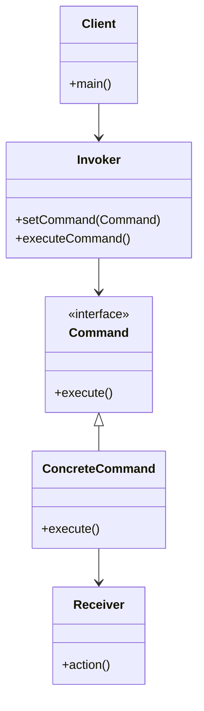
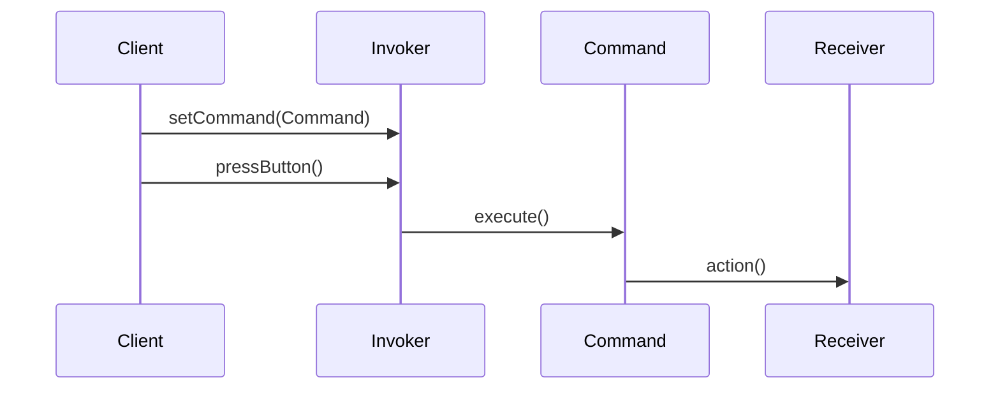

## 6.2 Command Pattern

The Command Pattern is a behavioral design pattern that turns a request into a stand-alone object that contains all the information about the request. This transformation allows for parameterization of methods with different requests, queuing of requests, and logging of the requests. It also provides support for undoable operations. In Scala, the Command Pattern can be elegantly implemented using first-class functions or case classes, leveraging Scala's functional programming capabilities to create immutable command objects.

### Intent

The primary intent of the Command Pattern is to encapsulate a request as an object, thereby allowing for parameterization of clients with queues, requests, and operations. It also provides a way to decouple the sender of a request from its receiver.

### Key Participants

1. **Command**: Declares an interface for executing an operation.
2. **ConcreteCommand**: Implements the Command interface and defines a binding between a Receiver object and an action.
3. **Client**: Creates a ConcreteCommand object and sets its receiver.
4. **Invoker**: Asks the command to carry out the request.
5. **Receiver**: Knows how to perform the operations associated with carrying out a request.

### Applicability

Use the Command Pattern when you want to:

- Parameterize objects with operations.
- Queue operations for later execution.
- Support undo operations.
- Log changes to support auditing.

### Diagrams

Let's visualize the Command Pattern using a class diagram to understand the relationships between the components.



**Diagram Description**: This class diagram illustrates the Command Pattern's structure, showing how the `Invoker` interacts with the `Command` interface, which is implemented by `ConcreteCommand`. The `ConcreteCommand` is associated with a `Receiver` that performs the actual work.

### Sample Code Snippet

Let's explore a simple example of the Command Pattern in Scala, where we encapsulate actions as case classes.

```scala
// The Command interface
trait Command {
  def execute(): Unit
}

// Receiver class
class Light {
  def turnOn(): Unit = println("The light is on")
  def turnOff(): Unit = println("The light is off")
}

// ConcreteCommand classes
case class TurnOnCommand(light: Light) extends Command {
  override def execute(): Unit = light.turnOn()
}

case class TurnOffCommand(light: Light) extends Command {
  override def execute(): Unit = light.turnOff()
}

// Invoker class
class RemoteControl {
  private var command: Option[Command] = None

  def setCommand(command: Command): Unit = {
    this.command = Some(command)
  }

  def pressButton(): Unit = {
    command.foreach(_.execute())
  }
}

// Client code
object CommandPatternExample extends App {
  val light = new Light
  val turnOn = TurnOnCommand(light)
  val turnOff = TurnOffCommand(light)

  val remote = new RemoteControl
  remote.setCommand(turnOn)
  remote.pressButton()

  remote.setCommand(turnOff)
  remote.pressButton()
}
```

**Code Explanation**: In this example, we have a `Light` class as the receiver, which has methods to turn the light on and off. The `TurnOnCommand` and `TurnOffCommand` are concrete implementations of the `Command` trait. The `RemoteControl` acts as the invoker, which can execute any command it is given.

### Design Considerations

- **Immutability**: By using case classes, we ensure that our command objects are immutable, which is a key aspect of functional programming in Scala.
- **First-Class Functions**: Scala allows us to use functions as first-class citizens, which means we can pass them around as parameters, return them from other functions, and assign them to variables. This feature can be used to implement the Command Pattern without explicitly defining command classes.
- **Undo Functionality**: To support undo operations, commands can store the state of the receiver before executing the command, allowing them to revert the receiver to its previous state.

### Differences and Similarities

- **Command vs. Strategy Pattern**: Both patterns encapsulate behavior, but the Command Pattern is more focused on executing operations, while the Strategy Pattern is about selecting algorithms at runtime.
- **Command vs. Chain of Responsibility**: The Command Pattern encapsulates a request, whereas the Chain of Responsibility passes the request along a chain of handlers.

### Advanced Concepts

#### Commands as First-Class Functions

In Scala, we can leverage first-class functions to implement the Command Pattern in a more concise way. Here's how you can achieve this:

```scala
// Receiver class
class Light {
  def turnOn(): Unit = println("The light is on")
  def turnOff(): Unit = println("The light is off")
}

// Invoker class
class RemoteControl {
  private var command: Option[() => Unit] = None

  def setCommand(command: () => Unit): Unit = {
    this.command = Some(command)
  }

  def pressButton(): Unit = {
    command.foreach(_.apply())
  }
}

// Client code
object CommandPatternWithFunctions extends App {
  val light = new Light

  val turnOnCommand: () => Unit = () => light.turnOn()
  val turnOffCommand: () => Unit = () => light.turnOff()

  val remote = new RemoteControl
  remote.setCommand(turnOnCommand)
  remote.pressButton()

  remote.setCommand(turnOffCommand)
  remote.pressButton()
}
```

**Code Explanation**: In this version, we use functions to represent commands. The `RemoteControl` class stores a function that it can execute, demonstrating the flexibility of using first-class functions in Scala.

#### Implementing Undo Functionality

To implement undo functionality, we need to store the state of the receiver before executing a command. Here's an example:

```scala
// The Command interface with undo functionality
trait Command {
  def execute(): Unit
  def undo(): Unit
}

// Receiver class
class Light {
  private var isOn = false

  def turnOn(): Unit = {
    isOn = true
    println("The light is on")
  }

  def turnOff(): Unit = {
    isOn = false
    println("The light is off")
  }

  def getState: Boolean = isOn
}

// ConcreteCommand classes with undo
case class TurnOnCommand(light: Light) extends Command {
  private var prevState: Boolean = _

  override def execute(): Unit = {
    prevState = light.getState
    light.turnOn()
  }

  override def undo(): Unit = {
    if (!prevState) light.turnOff()
  }
}

case class TurnOffCommand(light: Light) extends Command {
  private var prevState: Boolean = _

  override def execute(): Unit = {
    prevState = light.getState
    light.turnOff()
  }

  override def undo(): Unit = {
    if (prevState) light.turnOn()
  }
}

// Client code
object CommandPatternWithUndo extends App {
  val light = new Light
  val turnOn = TurnOnCommand(light)
  val turnOff = TurnOffCommand(light)

  turnOn.execute()
  turnOn.undo()

  turnOff.execute()
  turnOff.undo()
}
```

**Code Explanation**: In this example, the `Command` interface includes an `undo` method. Each concrete command class stores the previous state of the `Light` before executing its action, allowing it to revert the state if needed.

### Visualizing Command Execution Flow

To better understand the flow of command execution, let's visualize it using a sequence diagram.



**Diagram Description**: This sequence diagram illustrates the flow of command execution, showing how the `Client` sets a command in the `Invoker`, which then executes the command, resulting in an action performed by the `Receiver`.

### Try It Yourself

To deepen your understanding of the Command Pattern, try modifying the code examples:

- Implement additional commands for the `Light`, such as dimming or changing colors.
- Experiment with using first-class functions to create more complex command sequences.
- Implement a command history in the `RemoteControl` to allow multiple undo operations.

### Knowledge Check

- What are the key participants in the Command Pattern?
- How does the Command Pattern support undo operations?
- What are the advantages of using first-class functions for implementing the Command Pattern in Scala?

### Embrace the Journey

Remember, mastering design patterns is a journey. The Command Pattern is just one tool in your toolkit for building flexible and maintainable software. As you continue to explore Scala and its rich ecosystem, you'll discover new ways to apply these patterns to solve complex problems. Keep experimenting, stay curious, and enjoy the journey!

## Quiz Time!



### What is the primary intent of the Command Pattern?

- [x] To encapsulate a request as an object
- [ ] To create a family of related algorithms
- [ ] To define a one-to-many dependency
- [ ] To provide a simplified interface to a complex system

> **Explanation:** The primary intent of the Command Pattern is to encapsulate a request as an object, allowing for parameterization of clients with queues, requests, and operations.

### Which of the following is NOT a key participant in the Command Pattern?

- [ ] Command
- [ ] ConcreteCommand
- [x] Strategy
- [ ] Invoker

> **Explanation:** Strategy is not a participant in the Command Pattern. The key participants are Command, ConcreteCommand, Invoker, Client, and Receiver.

### How can the Command Pattern support undo operations?

- [x] By storing the state of the receiver before executing the command
- [ ] By using a singleton pattern
- [ ] By creating a new command for each undo operation
- [ ] By using a factory pattern

> **Explanation:** The Command Pattern can support undo operations by storing the state of the receiver before executing the command, allowing it to revert to the previous state if needed.

### What is a benefit of using first-class functions in the Command Pattern?

- [x] They allow for more concise and flexible command implementations
- [ ] They ensure thread safety
- [ ] They automatically provide undo functionality
- [ ] They eliminate the need for a receiver

> **Explanation:** Using first-class functions allows for more concise and flexible command implementations, as functions can be passed around and executed without needing to define explicit command classes.

### In Scala, how can immutability be ensured in command objects?

- [x] By using case classes
- [ ] By using mutable variables
- [ ] By using singleton objects
- [ ] By using inheritance

> **Explanation:** In Scala, immutability can be ensured in command objects by using case classes, which are immutable by default.

### Which pattern is more focused on executing operations rather than selecting algorithms?

- [x] Command Pattern
- [ ] Strategy Pattern
- [ ] Observer Pattern
- [ ] Factory Pattern

> **Explanation:** The Command Pattern is more focused on executing operations, while the Strategy Pattern is about selecting algorithms at runtime.

### What is the role of the Invoker in the Command Pattern?

- [x] To execute the command
- [ ] To create the command
- [ ] To perform the action
- [ ] To store the command's state

> **Explanation:** The role of the Invoker in the Command Pattern is to execute the command.

### How can the Command Pattern be implemented in a more concise way in Scala?

- [x] By using first-class functions
- [ ] By using inheritance
- [ ] By using abstract classes
- [ ] By using singletons

> **Explanation:** The Command Pattern can be implemented in a more concise way in Scala by using first-class functions, which can represent commands without needing explicit command classes.

### What is the advantage of using the Command Pattern for queuing operations?

- [x] It allows for operations to be queued and executed later
- [ ] It simplifies the creation of complex algorithms
- [ ] It reduces the need for multiple receivers
- [ ] It automatically logs all operations

> **Explanation:** The advantage of using the Command Pattern for queuing operations is that it allows for operations to be queued and executed later, providing flexibility in execution timing.

### True or False: The Command Pattern is used to provide a simplified interface to a complex system.

- [ ] True
- [x] False

> **Explanation:** False. The Command Pattern is used to encapsulate a request as an object, not to provide a simplified interface to a complex system.


