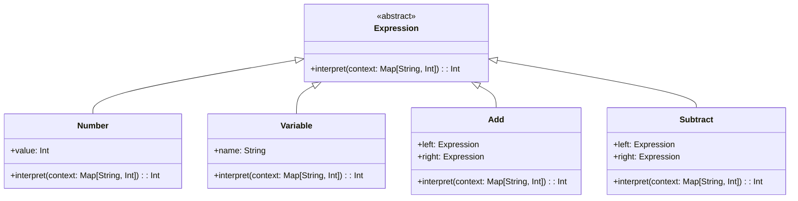

## 6.3 Interpreter Pattern

The Interpreter Pattern is a powerful design pattern used to evaluate sentences in a language. In Scala, this pattern is particularly effective due to the language's support for pattern matching and functional programming paradigms. This section will guide you through understanding the Interpreter Pattern, its implementation in Scala, and how it can be used to build domain-specific languages (DSLs).

### Design Pattern Name

**Interpreter Pattern**

### Category

Behavioral Patterns

### Intent

The primary intent of the Interpreter Pattern is to define a representation for a grammar of a language and provide an interpreter to evaluate sentences in that language. This pattern is particularly useful when you need to interpret expressions or commands that are frequently repeated in a specific domain.

### Key Participants

1. **Abstract Expression**: Declares an abstract `interpret` operation.
2. **Terminal Expression**: Implements an `interpret` operation associated with terminal symbols in the grammar.
3. **Nonterminal Expression**: Implements an `interpret` operation for nonterminal symbols in the grammar.
4. **Context**: Contains information that's global to the interpreter.
5. **Client**: Builds (or is given) an abstract syntax tree representing a particular sentence in the language.

### Applicability

- When you have a language to interpret and can represent statements in the language as an abstract syntax tree.
- When the grammar is simple and relatively stable.
- When efficiency is not a critical concern, as the Interpreter Pattern can be less efficient than other parsing techniques for complex grammars.

### Sample Code Snippet

Let's explore a simple example of the Interpreter Pattern in Scala by creating an interpreter for a basic arithmetic language.

```scala
// Define the abstract expression trait
trait Expression {
  def interpret(context: Map[String, Int]): Int
}

// Terminal expression for numbers
case class Number(value: Int) extends Expression {
  override def interpret(context: Map[String, Int]): Int = value
}

// Terminal expression for variables
case class Variable(name: String) extends Expression {
  override def interpret(context: Map[String, Int]): Int = context.getOrElse(name, 0)
}

// Nonterminal expression for addition
case class Add(left: Expression, right: Expression) extends Expression {
  override def interpret(context: Map[String, Int]): Int = left.interpret(context) + right.interpret(context)
}

// Nonterminal expression for subtraction
case class Subtract(left: Expression, right: Expression) extends Expression {
  override def interpret(context: Map[String, Int]): Int = left.interpret(context) - right.interpret(context)
}

// Client code
object InterpreterPatternExample extends App {
  val expression: Expression = Add(Variable("x"), Subtract(Number(10), Variable("y")))
  val context = Map("x" -> 5, "y" -> 2)
  println(s"Result: ${expression.interpret(context)}") // Output: Result: 13
}
```

### Explanation

In this example, we define a simple arithmetic language with numbers and variables as terminal expressions, and addition and subtraction as nonterminal expressions. The `interpret` method evaluates the expression based on the provided context, which maps variable names to their values.

### Design Considerations

- **When to Use**: The Interpreter Pattern is ideal for simple grammars and when you need to evaluate expressions frequently.
- **Scala Features**: Scala's pattern matching and case classes make it easier to implement the Interpreter Pattern. The immutability of case classes ensures that expressions are safely shared and reused.
- **Pitfalls**: The pattern can become inefficient for complex grammars. Consider using parser combinators or other parsing techniques for more complex languages.

### Differences and Similarities

The Interpreter Pattern is often confused with the Strategy Pattern, as both involve encapsulating behavior. However, the Interpreter Pattern focuses on defining a grammar and interpreting sentences, while the Strategy Pattern involves selecting an algorithm at runtime.

### Using Pattern Matching for Interpreters

Scala's pattern matching is a powerful feature that simplifies the implementation of interpreters. By using pattern matching, we can easily deconstruct expressions and apply the appropriate interpretation logic.

#### Example: Boolean Expressions

Let's extend our interpreter to handle boolean expressions.

```scala
// Define the abstract expression trait for boolean expressions
trait BooleanExpression {
  def interpret(context: Map[String, Boolean]): Boolean
}

// Terminal expression for boolean literals
case class BooleanLiteral(value: Boolean) extends BooleanExpression {
  override def interpret(context: Map[String, Boolean]): Boolean = value
}

// Terminal expression for boolean variables
case class BooleanVariable(name: String) extends BooleanExpression {
  override def interpret(context: Map[String, Boolean]): Boolean = context.getOrElse(name, false)
}

// Nonterminal expression for logical AND
case class And(left: BooleanExpression, right: BooleanExpression) extends BooleanExpression {
  override def interpret(context: Map[String, Boolean]): Boolean = left.interpret(context) && right.interpret(context)
}

// Nonterminal expression for logical OR
case class Or(left: BooleanExpression, right: BooleanExpression) extends BooleanExpression {
  override def interpret(context: Map[String, Boolean]): Boolean = left.interpret(context) || right.interpret(context)
}

// Nonterminal expression for logical NOT
case class Not(expression: BooleanExpression) extends BooleanExpression {
  override def interpret(context: Map[String, Boolean]): Boolean = !expression.interpret(context)
}

// Client code
object BooleanInterpreterExample extends App {
  val expression: BooleanExpression = And(BooleanVariable("a"), Or(BooleanLiteral(true), Not(BooleanVariable("b"))))
  val context = Map("a" -> true, "b" -> false)
  println(s"Result: ${expression.interpret(context)}") // Output: Result: true
}
```

### Building Domain-Specific Languages (DSLs) in Scala

Domain-Specific Languages (DSLs) are specialized languages tailored to a specific problem domain. Scala's expressive syntax and powerful type system make it an excellent choice for building DSLs.

#### Example: A Simple Arithmetic DSL

Let's create a simple arithmetic DSL using the Interpreter Pattern.

```scala
// Define the DSL
object ArithmeticDSL {
  sealed trait Expr {
    def eval: Int
  }

  case class Num(n: Int) extends Expr {
    def eval: Int = n
  }

  case class Sum(e1: Expr, e2: Expr) extends Expr {
    def eval: Int = e1.eval + e2.eval
  }

  case class Prod(e1: Expr, e2: Expr) extends Expr {
    def eval: Int = e1.eval * e2.eval
  }

  // Implicit conversions for a more natural DSL syntax
  implicit def intToNum(n: Int): Num = Num(n)
  implicit class ExprOps(e1: Expr) {
    def +(e2: Expr): Sum = Sum(e1, e2)
    def *(e2: Expr): Prod = Prod(e1, e2)
  }
}

// Client code
object ArithmeticDSLExample extends App {
  import ArithmeticDSL._

  val expression: Expr = 3 + (4 * 5)
  println(s"Result: ${expression.eval}") // Output: Result: 23
}
```

### Explanation

In this DSL, we define arithmetic expressions using case classes. We leverage Scala's implicit conversions and extension methods to create a natural syntax for arithmetic operations. This allows us to write expressions like `3 + (4 * 5)` directly.

### Visualizing the Interpreter Pattern

To better understand the structure of the Interpreter Pattern, let's visualize it using a class diagram.



### Try It Yourself

Experiment with the code examples by adding new operations or extending the DSL. For instance, try implementing division or exponentiation in the arithmetic interpreter. Consider how you might handle error cases, such as division by zero.

### Knowledge Check

- Explain how the Interpreter Pattern can be used to evaluate sentences in a language.
- Describe how pattern matching simplifies the implementation of interpreters in Scala.
- Discuss the benefits of using Scala for building DSLs.

### Embrace the Journey

Remember, this is just the beginning. As you progress, you'll be able to build more complex interpreters and DSLs. Keep experimenting, stay curious, and enjoy the journey!

## Quiz Time!



### What is the primary intent of the Interpreter Pattern?

- [x] To define a representation for a grammar and provide an interpreter to evaluate sentences in that language.
- [ ] To encapsulate a family of algorithms and make them interchangeable.
- [ ] To provide a way to access the elements of an aggregate object sequentially.
- [ ] To define a one-to-many dependency between objects so that when one object changes state, all its dependents are notified.

> **Explanation:** The Interpreter Pattern is designed to define a grammar and provide an interpreter for evaluating sentences in that language.

### Which Scala feature is particularly useful for implementing the Interpreter Pattern?

- [x] Pattern matching
- [ ] Implicit conversions
- [ ] For-comprehensions
- [ ] Lazy evaluation

> **Explanation:** Pattern matching is a powerful feature in Scala that simplifies the implementation of interpreters by allowing easy deconstruction of expressions.

### What is a Domain-Specific Language (DSL)?

- [x] A specialized language tailored to a specific problem domain.
- [ ] A general-purpose programming language.
- [ ] A language used for web development.
- [ ] A language used for database management.

> **Explanation:** A DSL is a specialized language designed to solve problems in a specific domain, offering more expressiveness and simplicity for that domain.

### In the arithmetic interpreter example, what does the `interpret` method do?

- [x] Evaluates the expression based on the provided context.
- [ ] Parses the expression into an abstract syntax tree.
- [ ] Transforms the expression into a different format.
- [ ] Compiles the expression into bytecode.

> **Explanation:** The `interpret` method evaluates the expression using the context, which maps variable names to their values.

### What is the role of the `Context` in the Interpreter Pattern?

- [x] Contains information that's global to the interpreter.
- [ ] Defines the grammar of the language.
- [ ] Provides a way to access elements of an aggregate object.
- [ ] Encapsulates a family of algorithms.

> **Explanation:** The `Context` holds global information needed by the interpreter, such as variable values.

### How can Scala's implicit conversions be used in building DSLs?

- [x] To create a more natural syntax for the DSL.
- [ ] To improve performance of the DSL.
- [ ] To enforce type safety in the DSL.
- [ ] To simplify error handling in the DSL.

> **Explanation:** Implicit conversions can be used to create a more natural and expressive syntax for the DSL, making it easier to use.

### What is a potential drawback of the Interpreter Pattern?

- [x] It can become inefficient for complex grammars.
- [ ] It is difficult to implement in Scala.
- [ ] It does not support pattern matching.
- [ ] It cannot be used for evaluating expressions.

> **Explanation:** The Interpreter Pattern can become inefficient for complex grammars due to its recursive nature and the overhead of interpreting each node in the syntax tree.

### Which of the following is a terminal expression in the arithmetic interpreter example?

- [x] Number
- [ ] Add
- [ ] Subtract
- [ ] Context

> **Explanation:** `Number` is a terminal expression because it represents a constant value in the language's grammar.

### True or False: The Interpreter Pattern is suitable for languages with complex and rapidly changing grammars.

- [ ] True
- [x] False

> **Explanation:** The Interpreter Pattern is not ideal for complex or rapidly changing grammars due to its inefficiency and difficulty in maintaining large syntax trees.

### What is the benefit of using case classes in Scala for implementing the Interpreter Pattern?

- [x] They provide immutability and pattern matching support.
- [ ] They allow for dynamic typing.
- [ ] They improve runtime performance.
- [ ] They simplify error handling.

> **Explanation:** Case classes in Scala offer immutability and built-in support for pattern matching, making them ideal for representing expressions in the Interpreter Pattern.


