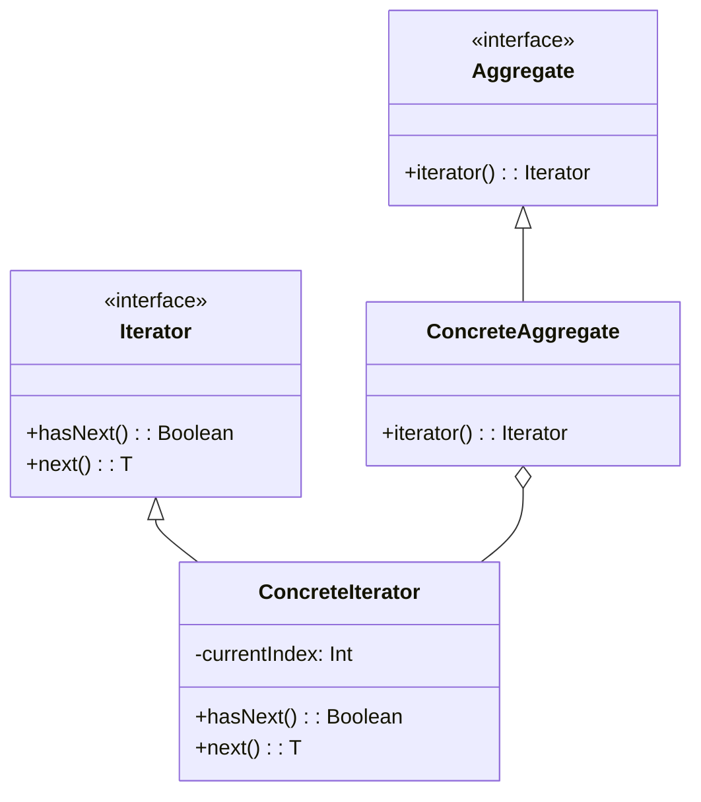

## 6.4 Iterator Pattern

The Iterator Pattern is a fundamental behavioral design pattern that provides a way to access the elements of an aggregate object sequentially without exposing its underlying representation. In Scala, this pattern is seamlessly integrated into the language through its rich collections API, allowing developers to traverse collections in a consistent and efficient manner.

### Intent

The primary intent of the Iterator Pattern is to provide a standard way to traverse a collection of elements, regardless of its specific type or structure. This pattern decouples the traversal logic from the collection itself, enabling flexibility and reusability of code.

### Key Participants

1. **Iterator**: An interface that defines methods for accessing and traversing elements.
2. **Concrete Iterator**: Implements the Iterator interface and maintains the current position in the traversal.
3. **Aggregate**: An interface that defines a method to create an iterator.
4. **Concrete Aggregate**: Implements the Aggregate interface and returns an instance of the Concrete Iterator.

### Applicability

The Iterator Pattern is applicable when:

- You need to access the elements of a collection without exposing its internal structure.
- You want to provide multiple traversal methods over a collection.
- You need a uniform interface for traversing different types of collections.

### Sample Code Snippet

Let's explore how to implement the Iterator Pattern in Scala using the collections API.

```scala
// Define a simple collection
class BookCollection(val books: List[String]) {
  // Create an iterator for the collection
  def iterator: Iterator[String] = new BookIterator(books)
}

// Concrete Iterator implementation
class BookIterator(books: List[String]) extends Iterator[String] {
  private var currentIndex = 0

  // Check if there are more elements
  override def hasNext: Boolean = currentIndex < books.length

  // Return the next element
  override def next(): String = {
    if (!hasNext) throw new NoSuchElementException("No more books")
    val book = books(currentIndex)
    currentIndex += 1
    book
  }
}

// Usage
val myBooks = new BookCollection(List("Scala Programming", "Design Patterns", "Functional Programming"))
val bookIterator = myBooks.iterator

while (bookIterator.hasNext) {
  println(bookIterator.next())
}
```

### Design Considerations

- **Efficiency**: Iterators should be designed to be efficient in terms of both time and space complexity. Avoid unnecessary computations or state storage.
- **Concurrency**: Consider thread safety if the collection is accessed concurrently. Scala's collections API provides thread-safe options like `ConcurrentHashMap`.
- **Scala-Specific Features**: Scala's collections API provides built-in iterators, making it easy to implement the Iterator Pattern without manually defining iterator classes.

### Differences and Similarities

The Iterator Pattern is often compared to the **Visitor Pattern**, as both involve traversing elements. However, the Iterator Pattern focuses on sequential access, while the Visitor Pattern is more about applying operations to elements.

### Using Scala's Collections API

Scala's collections API provides a rich set of methods to work with iterators. Let's explore some of these methods:

#### Creating Iterators

Scala collections like `List`, `Set`, and `Map` provide built-in methods to create iterators.

```scala
val numbers = List(1, 2, 3, 4, 5)
val iterator = numbers.iterator

while (iterator.hasNext) {
  println(iterator.next())
}
```

#### Transforming Collections

Scala's collections API allows you to transform collections using methods like `map`, `filter`, and `flatMap`, which internally use iterators.

```scala
val doubledNumbers = numbers.map(_ * 2)
doubledNumbers.foreach(println)
```

#### Custom Iterators

You can create custom iterators by extending the `Iterator` trait and implementing the `hasNext` and `next` methods.

```scala
class EvenNumberIterator(numbers: List[Int]) extends Iterator[Int] {
  private val evenNumbers = numbers.filter(_ % 2 == 0)
  private var currentIndex = 0

  override def hasNext: Boolean = currentIndex < evenNumbers.length

  override def next(): Int = {
    if (!hasNext) throw new NoSuchElementException("No more even numbers")
    val number = evenNumbers(currentIndex)
    currentIndex += 1
    number
  }
}

// Usage
val evenIterator = new EvenNumberIterator(List(1, 2, 3, 4, 5))
while (evenIterator.hasNext) {
  println(evenIterator.next())
}
```

### Visualizing the Iterator Pattern

To better understand the Iterator Pattern, let's visualize the relationship between the key participants using a class diagram.



### Try It Yourself

Experiment with the code examples provided. Try modifying the `BookIterator` to include additional functionality, such as filtering books by a specific author or genre. This will help reinforce your understanding of the Iterator Pattern and its flexibility.

### Knowledge Check

- What is the primary purpose of the Iterator Pattern?
- How does the Iterator Pattern decouple traversal logic from the collection?
- What are some key considerations when implementing iterators in Scala?

### Embrace the Journey

Remember, mastering design patterns like the Iterator Pattern is a journey. As you continue to explore Scala's rich collections API, you'll discover new ways to apply these patterns to solve complex problems. Keep experimenting, stay curious, and enjoy the journey!

## Quiz Time!



### What is the primary purpose of the Iterator Pattern?

- [x] To provide a way to access elements of a collection sequentially without exposing its underlying representation.
- [ ] To modify the elements of a collection.
- [ ] To sort elements in a collection.
- [ ] To delete elements from a collection.

> **Explanation:** The Iterator Pattern is designed to provide a standard way to traverse a collection of elements without exposing its internal structure.

### Which method is NOT part of the Iterator interface in Scala?

- [ ] hasNext
- [ ] next
- [x] add
- [ ] foreach

> **Explanation:** The `Iterator` interface in Scala includes methods like `hasNext` and `next`, but not `add`. The `foreach` method is a higher-order function available on collections.

### What does the `hasNext` method do in an iterator?

- [x] Checks if there are more elements to iterate over.
- [ ] Returns the next element in the iteration.
- [ ] Removes the current element from the collection.
- [ ] Resets the iterator to the beginning.

> **Explanation:** The `hasNext` method checks if there are more elements to iterate over, ensuring that the `next` method can be called safely.

### In Scala, which of the following is a built-in method to create an iterator from a List?

- [x] iterator
- [ ] createIterator
- [ ] generateIterator
- [ ] newIterator

> **Explanation:** Scala collections like `List` provide a built-in `iterator` method to create an iterator.

### How does Scala's collections API enhance the use of the Iterator Pattern?

- [x] By providing built-in methods for creating and using iterators.
- [ ] By requiring manual implementation of iterators for each collection.
- [ ] By limiting the types of collections that can be iterated.
- [ ] By removing the need for iterators altogether.

> **Explanation:** Scala's collections API provides built-in methods for creating and using iterators, making it easier to implement the Iterator Pattern.

### What is a key benefit of using the Iterator Pattern?

- [x] It decouples the traversal logic from the collection structure.
- [ ] It allows for direct modification of collection elements.
- [ ] It automatically sorts the collection.
- [ ] It provides a graphical interface for collections.

> **Explanation:** The Iterator Pattern decouples the traversal logic from the collection structure, allowing for flexible and reusable code.

### Which of the following is a Scala-specific feature that aids in implementing the Iterator Pattern?

- [x] Rich collections API
- [ ] Automatic memory management
- [ ] Static typing
- [ ] JVM compatibility

> **Explanation:** Scala's rich collections API provides built-in support for iterators, aiding in the implementation of the Iterator Pattern.

### What is the role of the Concrete Iterator in the Iterator Pattern?

- [x] It implements the Iterator interface and maintains the current position in the traversal.
- [ ] It defines the collection structure.
- [ ] It manages the lifecycle of the collection.
- [ ] It provides a user interface for the collection.

> **Explanation:** The Concrete Iterator implements the Iterator interface and maintains the current position in the traversal, enabling sequential access to elements.

### True or False: The Iterator Pattern is only applicable to collections in Scala.

- [ ] True
- [x] False

> **Explanation:** The Iterator Pattern is applicable to any aggregate object that requires sequential access to its elements, not just collections.

### Which of the following is a common use case for custom iterators in Scala?

- [x] Filtering elements based on specific criteria.
- [ ] Sorting elements in ascending order.
- [ ] Automatically updating collection elements.
- [ ] Providing a graphical representation of the collection.

> **Explanation:** Custom iterators in Scala can be used to filter elements based on specific criteria, among other use cases.


