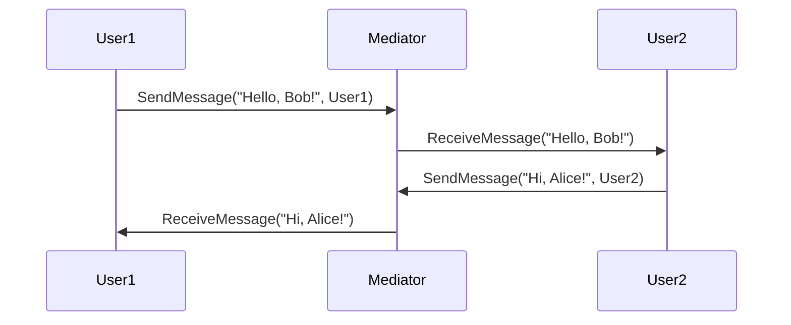

## 6.5 Mediator Pattern

In the realm of software design patterns, the Mediator Pattern stands out as a powerful tool for managing complex object interactions. By centralizing communication through a mediator, we can decouple objects, reduce dependencies, and enhance the maintainability of our code. In this section, we'll delve into the Mediator Pattern, particularly its implementation in Scala using Akka Actors. 

### Intent

The Mediator Pattern aims to simplify communication between objects by introducing a mediator object. Instead of objects communicating directly, they interact through the mediator, which handles the coordination and control of their interactions. This pattern is particularly useful in scenarios where multiple objects need to collaborate, and direct communication would lead to a tangled web of dependencies.

### Key Participants

1. **Mediator**: The central object that facilitates communication between other objects.
2. **Colleagues**: The objects that interact with each other through the mediator.

### Applicability

- Use the Mediator Pattern when you have a set of objects that communicate in complex ways, and you want to simplify their interactions.
- It is particularly useful in GUI applications where multiple components need to interact.
- Ideal for scenarios where you want to reduce coupling between objects and centralize control logic.

### Sample Code Snippet

Let's start with a simple example to illustrate the Mediator Pattern in Scala. We'll create a chat room where users can send messages to each other through a mediator.

```scala
// Define the Colleague trait
trait Colleague {
  def send(message: String): Unit
  def receive(message: String): Unit
}

// Define the Mediator trait
trait Mediator {
  def sendMessage(message: String, sender: Colleague): Unit
  def addColleague(colleague: Colleague): Unit
}

// Implement the ChatRoomMediator
class ChatRoomMediator extends Mediator {
  private var colleagues: List[Colleague] = List()

  override def sendMessage(message: String, sender: Colleague): Unit = {
    colleagues.foreach { colleague =>
      if (colleague != sender) {
        colleague.receive(message)
      }
    }
  }

  override def addColleague(colleague: Colleague): Unit = {
    colleagues = colleague :: colleagues
  }
}

// Implement the User class as a Colleague
class User(name: String, mediator: Mediator) extends Colleague {
  mediator.addColleague(this)

  override def send(message: String): Unit = {
    println(s"$name sends: $message")
    mediator.sendMessage(message, this)
  }

  override def receive(message: String): Unit = {
    println(s"$name receives: $message")
  }
}

// Usage
val mediator = new ChatRoomMediator
val user1 = new User("Alice", mediator)
val user2 = new User("Bob", mediator)

user1.send("Hello, Bob!")
user2.send("Hi, Alice!")
```

In this example, `ChatRoomMediator` acts as the mediator, coordinating messages between `User` objects, which are the colleagues.

### Implementing the Mediator with Akka Actors

Akka Actors provide a robust framework for implementing the Mediator Pattern in Scala, especially in concurrent and distributed systems. By leveraging actors, we can efficiently manage communication between objects, handle concurrency, and scale our applications.

#### Akka Actors Overview

Akka is a toolkit for building highly concurrent, distributed, and resilient message-driven applications. Actors in Akka are lightweight, isolated units of computation that communicate through asynchronous message passing.

#### Mediator Pattern with Akka Actors

To implement the Mediator Pattern using Akka Actors, we'll create an actor that serves as the mediator, coordinating messages between other actor colleagues.

```scala
import akka.actor.{Actor, ActorRef, ActorSystem, Props}

// Define the message protocol
case class SendMessage(message: String, sender: ActorRef)
case class ReceiveMessage(message: String)

// Define the Mediator Actor
class ChatRoomActor extends Actor {
  private var colleagues: List[ActorRef] = List()

  override def receive: Receive = {
    case SendMessage(message, sender) =>
      colleagues.foreach { colleague =>
        if (colleague != sender) {
          colleague ! ReceiveMessage(message)
        }
      }
    case colleague: ActorRef =>
      colleagues = colleague :: colleagues
  }
}

// Define the User Actor
class UserActor(name: String, mediator: ActorRef) extends Actor {
  mediator ! self

  override def receive: Receive = {
    case ReceiveMessage(message) =>
      println(s"$name receives: $message")
  }

  def send(message: String): Unit = {
    println(s"$name sends: $message")
    mediator ! SendMessage(message, self)
  }
}

// Usage
val system = ActorSystem("ChatRoomSystem")
val mediator = system.actorOf(Props[ChatRoomActor], "mediator")
val user1 = system.actorOf(Props(new UserActor("Alice", mediator)), "user1")
val user2 = system.actorOf(Props(new UserActor("Bob", mediator)), "user2")

user1 ! SendMessage("Hello, Bob!", user1)
user2 ! SendMessage("Hi, Alice!", user2)
```

In this implementation, `ChatRoomActor` acts as the mediator, while `UserActor` represents the colleagues. The actors communicate through messages, with the mediator coordinating the interactions.

### Design Considerations

- **Decoupling**: The Mediator Pattern helps decouple objects, making the system more modular and easier to maintain.
- **Complexity**: While the mediator simplifies object interactions, it can become a bottleneck if it grows too complex. Ensure the mediator's responsibilities are well-defined and manageable.
- **Performance**: In a distributed system, consider the performance implications of using a centralized mediator. Akka's actor model can help mitigate some performance concerns by distributing the load across multiple actors.

### Differences and Similarities

- **Mediator vs. Observer**: Both patterns deal with communication between objects, but the Mediator Pattern centralizes communication through a mediator, while the Observer Pattern involves direct notification from subjects to observers.
- **Mediator vs. Facade**: The Facade Pattern provides a simplified interface to a complex subsystem, while the Mediator Pattern focuses on controlling communication between objects.

### Visualizing the Mediator Pattern

To better understand the Mediator Pattern, let's visualize the interactions between the mediator and its colleagues using a sequence diagram.



In this diagram, `User1` and `User2` communicate through the `Mediator`, which coordinates the message exchange.

### Try It Yourself

Experiment with the Mediator Pattern by modifying the code examples. Here are some ideas:

- Add more users to the chat room and observe how the mediator handles increased communication.
- Implement a priority system where certain messages are given precedence.
- Introduce logging to track the flow of messages through the mediator.

### Knowledge Check

- What are the key benefits of using the Mediator Pattern?
- How does the Mediator Pattern differ from the Observer Pattern?
- What are some potential drawbacks of using a centralized mediator?

### References and Links

- [Akka Documentation](https://doc.akka.io/docs/akka/current/index.html)
- [Design Patterns: Elements of Reusable Object-Oriented Software](https://en.wikipedia.org/wiki/Design_Patterns)

### Embrace the Journey

Remember, mastering design patterns is a journey. As you explore the Mediator Pattern, consider how it can simplify object interactions in your projects. Keep experimenting, stay curious, and enjoy the process of refining your software design skills!

## Quiz Time!



### What is the primary role of the Mediator Pattern?

- [x] To centralize communication between objects
- [ ] To provide a simplified interface to a complex subsystem
- [ ] To notify observers of changes in a subject
- [ ] To encapsulate a request as an object

> **Explanation:** The Mediator Pattern centralizes communication between objects, reducing dependencies and simplifying interactions.

### How does the Mediator Pattern differ from the Observer Pattern?

- [x] The Mediator Pattern centralizes communication, while the Observer Pattern involves direct notification.
- [ ] The Observer Pattern centralizes communication, while the Mediator Pattern involves direct notification.
- [ ] Both patterns centralize communication.
- [ ] Both patterns involve direct notification.

> **Explanation:** The Mediator Pattern centralizes communication through a mediator, while the Observer Pattern involves direct notification from subjects to observers.

### Which Akka component is used to implement the Mediator Pattern?

- [x] Actor
- [ ] Future
- [ ] Stream
- [ ] Scheduler

> **Explanation:** Akka Actors are used to implement the Mediator Pattern by managing communication between actor colleagues.

### What is a potential drawback of using a centralized mediator?

- [x] It can become a bottleneck if it grows too complex.
- [ ] It increases coupling between objects.
- [ ] It makes the system less modular.
- [ ] It simplifies object interactions.

> **Explanation:** A centralized mediator can become a bottleneck if it grows too complex, so its responsibilities should be well-defined and manageable.

### In the provided code example, what role does `ChatRoomActor` play?

- [x] Mediator
- [ ] Colleague
- [ ] Observer
- [ ] Facade

> **Explanation:** `ChatRoomActor` acts as the mediator, coordinating messages between `UserActor` colleagues.

### What is the benefit of using Akka Actors for the Mediator Pattern?

- [x] They handle concurrency and scalability efficiently.
- [ ] They simplify object interactions.
- [ ] They provide a simplified interface to a complex subsystem.
- [ ] They notify observers of changes in a subject.

> **Explanation:** Akka Actors handle concurrency and scalability efficiently, making them suitable for implementing the Mediator Pattern in distributed systems.

### How can you experiment with the provided code examples?

- [x] Add more users to the chat room.
- [x] Implement a priority system for messages.
- [x] Introduce logging to track message flow.
- [ ] Remove the mediator and have direct communication.

> **Explanation:** Experiment by adding more users, implementing a priority system, and introducing logging to track message flow.

### What is a key benefit of the Mediator Pattern?

- [x] It reduces dependencies between objects.
- [ ] It increases coupling between objects.
- [ ] It makes the system less modular.
- [ ] It simplifies object interactions.

> **Explanation:** The Mediator Pattern reduces dependencies between objects, making the system more modular and maintainable.

### True or False: The Mediator Pattern is ideal for scenarios where multiple objects need to collaborate.

- [x] True
- [ ] False

> **Explanation:** True. The Mediator Pattern is ideal for scenarios where multiple objects need to collaborate, as it simplifies their interactions.

### What is the purpose of the `SendMessage` case class in the Akka example?

- [x] To define a message protocol for sending messages between actors
- [ ] To encapsulate a request as an object
- [ ] To provide a simplified interface to a complex subsystem
- [ ] To notify observers of changes in a subject

> **Explanation:** The `SendMessage` case class defines a message protocol for sending messages between actors in the Akka example.


