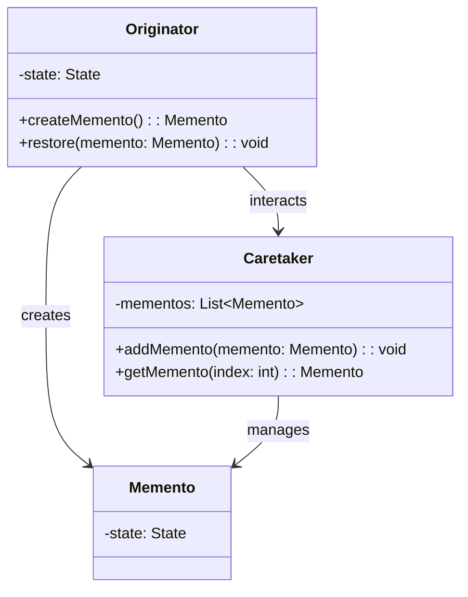

## 6.6 Memento Pattern

The Memento Pattern is a behavioral design pattern that allows you to capture and restore an object's state without violating encapsulation. This pattern is particularly useful in scenarios where you need to implement undo functionality or rollback changes. In Scala, leveraging immutability for mementos aligns well with the language's functional programming paradigms, making the Memento Pattern both efficient and safe.

### Intent

The primary intent of the Memento Pattern is to provide a way to capture an object's internal state so that it can be restored later. This is done without exposing the details of the object's implementation, thus preserving encapsulation. The pattern involves three key participants: the Originator, the Memento, and the Caretaker.

### Key Participants

1. **Originator**: The object whose state needs to be saved and restored. It creates a memento containing a snapshot of its current state and uses the memento to restore its state.
   
2. **Memento**: A value object that acts as a snapshot of the Originator's state. It is immutable and does not expose any of the Originator's internal details.

3. **Caretaker**: Manages the memento's lifecycle. It requests a memento from the Originator, stores it, and later provides it back to the Originator to restore its state.

### Applicability

The Memento Pattern is applicable in the following scenarios:

- Implementing undo/redo functionality in applications.
- Restoring an object to a previous state, such as in transactional systems.
- Maintaining a history of changes for auditing purposes.

### Diagrams

Let's visualize the Memento Pattern using a class diagram to understand the relationships between the participants.



**Diagram Description**: The diagram illustrates the interaction between the Originator, Memento, and Caretaker. The Originator creates a Memento to capture its state. The Caretaker manages these Mementos, allowing the Originator to restore its state when needed.

### Sample Code Snippet

Let's dive into a Scala implementation of the Memento Pattern. We'll create a simple text editor that can save and restore its state.

```scala
// Define the state of the text editor
case class EditorState(content: String)

// Define the Memento class
class Memento(private val state: EditorState) {
  def getState: EditorState = state
}

// Define the Originator class
class TextEditor {
  private var content: String = ""

  def typeText(text: String): Unit = {
    content += text
  }

  def save(): Memento = new Memento(EditorState(content))

  def restore(memento: Memento): Unit = {
    content = memento.getState.content
  }

  def getContent: String = content
}

// Define the Caretaker class
class Caretaker {
  private var mementos: List[Memento] = List()

  def addMemento(memento: Memento): Unit = {
    mementos = mementos :+ memento
  }

  def getMemento(index: Int): Memento = mementos(index)
}

// Usage
object MementoPatternExample extends App {
  val editor = new TextEditor
  val caretaker = new Caretaker

  editor.typeText("Hello, ")
  caretaker.addMemento(editor.save())

  editor.typeText("World!")
  caretaker.addMemento(editor.save())

  println(editor.getContent) // Output: Hello, World!

  editor.restore(caretaker.getMemento(0))
  println(editor.getContent) // Output: Hello, 
}
```

**Code Explanation**: 
- **EditorState**: Represents the state of the text editor.
- **Memento**: Stores the state of the text editor.
- **TextEditor**: Acts as the Originator, allowing text to be typed, saved, and restored.
- **Caretaker**: Manages the list of mementos, enabling the text editor to revert to previous states.

### Leveraging Immutability for Mementos

In Scala, immutability is a core concept that enhances the safety and predictability of code. By using immutable data structures for mementos, we ensure that once a state is captured, it cannot be altered. This aligns perfectly with the functional programming paradigm and makes the Memento Pattern more robust.

### Design Considerations

When implementing the Memento Pattern in Scala, consider the following:

- **State Size**: Be mindful of the size of the state being captured. Large states can lead to memory overhead.
- **Frequency of State Capture**: Frequent state captures can impact performance. Optimize by capturing state only when necessary.
- **Encapsulation**: Ensure that the Memento does not expose any internal details of the Originator.

### Differences and Similarities

The Memento Pattern is often confused with the Command Pattern, as both can be used to implement undo functionality. However, the Command Pattern encapsulates operations, while the Memento Pattern focuses on capturing state. Understanding these distinctions is crucial for selecting the appropriate pattern for your use case.

### Try It Yourself

Experiment with the provided code by making the following modifications:

- Add functionality to undo multiple steps by storing multiple mementos.
- Implement a redo feature that allows reapplying undone changes.
- Extend the TextEditor to support more complex operations, such as formatting text.

### Knowledge Check

- **Question**: What is the primary purpose of the Memento Pattern?
- **Question**: How does immutability enhance the Memento Pattern in Scala?
- **Question**: What are the key participants in the Memento Pattern?

### Embrace the Journey

Remember, mastering design patterns is a journey. As you explore the Memento Pattern, you'll gain insights into capturing and restoring object states effectively. Keep experimenting, stay curious, and enjoy the journey!

## Quiz Time!



### What is the primary purpose of the Memento Pattern?

- [x] To capture and restore an object's state without violating encapsulation.
- [ ] To encapsulate operations for undo functionality.
- [ ] To manage complex algorithms.
- [ ] To simplify object creation.

> **Explanation:** The Memento Pattern is designed to capture and restore an object's state without exposing its internal details, thus preserving encapsulation.

### Which of the following is a key participant in the Memento Pattern?

- [x] Originator
- [ ] Command
- [ ] Adapter
- [ ] Decorator

> **Explanation:** The Originator is responsible for creating and restoring mementos, making it a key participant in the pattern.

### How does immutability benefit the Memento Pattern in Scala?

- [x] It ensures that captured states cannot be altered, enhancing safety.
- [ ] It allows for dynamic state changes.
- [ ] It simplifies object creation.
- [ ] It reduces memory usage.

> **Explanation:** Immutability ensures that once a state is captured in a memento, it cannot be changed, which aligns with Scala's functional programming paradigms.

### What role does the Caretaker play in the Memento Pattern?

- [x] It manages the lifecycle of mementos.
- [ ] It creates mementos.
- [ ] It modifies the Originator's state.
- [ ] It encapsulates operations.

> **Explanation:** The Caretaker is responsible for storing and providing mementos to the Originator, managing their lifecycle.

### In the Memento Pattern, what does the Memento object represent?

- [x] A snapshot of the Originator's state.
- [ ] A command to execute.
- [ ] A strategy for algorithms.
- [ ] A bridge between interfaces.

> **Explanation:** The Memento object acts as a snapshot of the Originator's state, allowing it to be restored later.

### What is a potential downside of frequent state captures in the Memento Pattern?

- [x] Performance impact due to memory overhead.
- [ ] Increased complexity in algorithms.
- [ ] Difficulty in managing operations.
- [ ] Reduced encapsulation.

> **Explanation:** Frequent state captures can lead to memory overhead, impacting performance.

### How can the Memento Pattern be used in applications?

- [x] Implementing undo/redo functionality.
- [ ] Simplifying object creation.
- [ ] Managing complex algorithms.
- [ ] Bridging incompatible interfaces.

> **Explanation:** The Memento Pattern is ideal for implementing undo/redo functionality by capturing and restoring states.

### What is a common misconception about the Memento Pattern?

- [x] It is often confused with the Command Pattern.
- [ ] It simplifies object creation.
- [ ] It is used for managing complex algorithms.
- [ ] It reduces memory usage.

> **Explanation:** The Memento Pattern is often confused with the Command Pattern, but they serve different purposes.

### Which Scala feature aligns well with the Memento Pattern?

- [x] Immutability
- [ ] Dynamic typing
- [ ] Reflection
- [ ] Inheritance

> **Explanation:** Immutability aligns well with the Memento Pattern, ensuring captured states remain unchanged.

### True or False: The Memento Pattern violates encapsulation by exposing internal details.

- [ ] True
- [x] False

> **Explanation:** The Memento Pattern preserves encapsulation by capturing and restoring state without exposing internal details.


