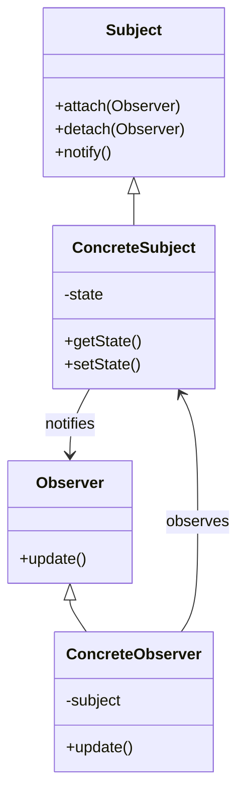
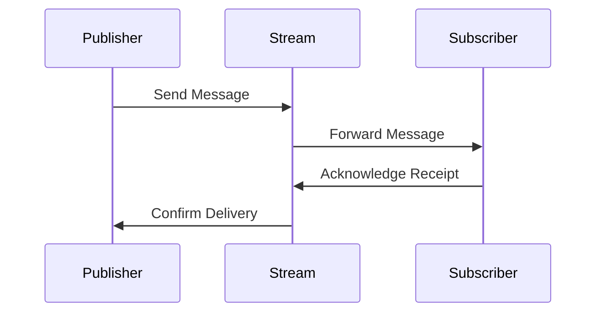

## 6.7 Observer Pattern

The Observer Pattern is a fundamental design pattern in software engineering, commonly used to implement the publish-subscribe model. It is particularly useful in scenarios where a change in one object requires notification and subsequent updates to other dependent objects. In this guide, we will delve into the Observer Pattern in Scala, focusing on its implementation using Reactive Streams and Akka Streams.

### Intent

The primary intent of the Observer Pattern is to define a one-to-many dependency between objects so that when one object changes state, all its dependents are notified and updated automatically. This pattern is especially beneficial in decoupling the subject from its observers, promoting a more modular and maintainable codebase.

### Key Participants

1. **Subject**: The entity that holds the state and notifies observers of any changes.
2. **Observer**: The entity that receives updates from the subject.
3. **ConcreteSubject**: A specific implementation of the subject.
4. **ConcreteObserver**: A specific implementation of the observer.

### Applicability

Use the Observer Pattern when:

- An abstraction has two aspects, one dependent on the other. Encapsulating these aspects in separate objects allows you to vary and reuse them independently.
- A change to one object requires changing others, and you don't know how many objects need to be changed.
- An object should be able to notify other objects without making assumptions about who these objects are.

### Diagram

Below is a Mermaid.js diagram illustrating the Observer Pattern's structure:



### Implementing the Observer Pattern in Scala

Scala, with its functional programming capabilities, offers elegant ways to implement the Observer Pattern. We will explore two primary methods: using Reactive Streams and Akka Streams.

#### Reactive Streams

Reactive Streams is a standard for asynchronous stream processing with non-blocking backpressure. It is designed to handle potentially infinite streams of data in a resource-efficient manner.

**Example: Implementing Observer Pattern with Reactive Streams**

Let's implement a simple example using Reactive Streams in Scala.

```scala
import org.reactivestreams.{Publisher, Subscriber, Subscription}

class SimplePublisher extends Publisher[String] {
  private var subscribers: List[Subscriber[_ >: String]] = List()

  def subscribe(subscriber: Subscriber[_ >: String]): Unit = {
    subscribers = subscriber :: subscribers
    subscriber.onSubscribe(new SimpleSubscription(subscriber))
  }

  def publish(data: String): Unit = {
    subscribers.foreach(_.onNext(data))
  }

  private class SimpleSubscription(subscriber: Subscriber[_ >: String]) extends Subscription {
    def request(n: Long): Unit = {
      // Handle request logic
    }

    def cancel(): Unit = {
      subscribers = subscribers.filterNot(_ == subscriber)
    }
  }
}

class SimpleSubscriber extends Subscriber[String] {
  def onSubscribe(subscription: Subscription): Unit = {
    subscription.request(1)
  }

  def onNext(item: String): Unit = {
    println(s"Received: $item")
  }

  def onError(throwable: Throwable): Unit = {
    println(s"Error: ${throwable.getMessage}")
  }

  def onComplete(): Unit = {
    println("Completed")
  }
}

// Usage
val publisher = new SimplePublisher
val subscriber = new SimpleSubscriber

publisher.subscribe(subscriber)
publisher.publish("Hello, Observer Pattern!")
```

**Key Points:**

- **Publisher**: The `SimplePublisher` class implements the `Publisher` interface, managing a list of subscribers and notifying them of new data.
- **Subscriber**: The `SimpleSubscriber` class implements the `Subscriber` interface, receiving data from the publisher and handling it accordingly.
- **Subscription**: The `SimpleSubscription` class manages the subscription lifecycle, allowing subscribers to request data and cancel subscriptions.

#### Akka Streams

Akka Streams is a powerful library built on top of Akka Actors, providing a high-level API for stream processing. It supports backpressure and integrates seamlessly with the Akka ecosystem.

**Example: Implementing Observer Pattern with Akka Streams**

Let's implement the Observer Pattern using Akka Streams.

```scala
import akka.actor.ActorSystem
import akka.stream.scaladsl.{Sink, Source}
import akka.stream.{ActorMaterializer, OverflowStrategy}

object AkkaStreamsObserverPattern extends App {
  implicit val system: ActorSystem = ActorSystem("ObserverPatternSystem")
  implicit val materializer: ActorMaterializer = ActorMaterializer()

  val source = Source.actorRef[String](bufferSize = 10, overflowStrategy = OverflowStrategy.dropHead)

  val sink = Sink.foreach[String](println)

  val (actorRef, future) = source.toMat(sink)(Keep.both).run()

  actorRef ! "Hello, Akka Streams!"
  actorRef ! "Observer Pattern in Action"

  future.onComplete(_ => system.terminate())
}
```

**Key Points:**

- **Source**: The `Source` represents the publisher, emitting data to the stream.
- **Sink**: The `Sink` represents the subscriber, consuming data from the stream.
- **ActorRef**: The `actorRef` acts as a bridge between the Akka actor system and the stream, allowing messages to be sent to the stream.

### Design Considerations

When implementing the Observer Pattern in Scala, consider the following:

- **Concurrency**: Both Reactive Streams and Akka Streams handle concurrency and backpressure, ensuring efficient resource usage.
- **Scalability**: These libraries are designed to scale, making them suitable for high-throughput applications.
- **Error Handling**: Implement robust error handling to manage failures gracefully.

### Differences and Similarities

- **Reactive Streams vs. Akka Streams**: While both support the Observer Pattern, Akka Streams is built on Akka Actors, providing more integration with the Akka ecosystem. Reactive Streams is a more general-purpose API, suitable for various implementations.
- **Functional vs. Object-Oriented**: Scala's functional programming features, such as immutability and higher-order functions, can enhance the Observer Pattern's implementation, making it more concise and expressive.

### Try It Yourself

Experiment with the provided code examples by:

- Modifying the data published by the `SimplePublisher` or the messages sent to the `actorRef` in the Akka Streams example.
- Adding additional subscribers to observe how multiple entities can react to changes.
- Implementing error handling in the Reactive Streams example to manage exceptions.

### Visualizing the Observer Pattern with Akka Streams

Below is a Mermaid.js sequence diagram illustrating the flow of data in the Akka Streams implementation of the Observer Pattern:



### Knowledge Check

- **Question**: What are the key differences between Reactive Streams and Akka Streams?
- **Challenge**: Implement a custom subscriber that filters messages based on specific criteria before processing them.

### Embrace the Journey

Remember, mastering the Observer Pattern in Scala is just the beginning. As you progress, you'll discover more complex patterns and techniques that will enhance your ability to build robust, scalable applications. Keep experimenting, stay curious, and enjoy the journey!

## Quiz Time!



### What is the primary intent of the Observer Pattern?

- [x] To define a one-to-many dependency between objects.
- [ ] To encapsulate object creation.
- [ ] To provide a simplified interface to a complex system.
- [ ] To separate abstraction from implementation.

> **Explanation:** The Observer Pattern's primary intent is to define a one-to-many dependency between objects so that when one object changes state, all its dependents are notified and updated automatically.

### In the Observer Pattern, what role does the Subject play?

- [x] It holds the state and notifies observers of changes.
- [ ] It receives updates from the observers.
- [ ] It provides a simplified interface to the observers.
- [ ] It separates abstraction from implementation.

> **Explanation:** The Subject in the Observer Pattern holds the state and is responsible for notifying observers of any changes.

### Which library in Scala provides a high-level API for stream processing and integrates with Akka?

- [x] Akka Streams
- [ ] Reactive Streams
- [ ] Play Framework
- [ ] Scalaz

> **Explanation:** Akka Streams is a library that provides a high-level API for stream processing and integrates seamlessly with the Akka ecosystem.

### What is a key feature of Reactive Streams?

- [x] Asynchronous stream processing with non-blocking backpressure.
- [ ] Synchronous data processing.
- [ ] Simplified interface for complex systems.
- [ ] Encapsulation of object creation.

> **Explanation:** Reactive Streams is designed for asynchronous stream processing with non-blocking backpressure, making it suitable for handling potentially infinite streams of data.

### In the Akka Streams example, what does the `actorRef` represent?

- [x] A bridge between the Akka actor system and the stream.
- [ ] A simplified interface to the stream.
- [ ] A subscriber that consumes data from the stream.
- [ ] A publisher that emits data to the stream.

> **Explanation:** In the Akka Streams example, the `actorRef` acts as a bridge between the Akka actor system and the stream, allowing messages to be sent to the stream.

### What is the role of the `SimpleSubscription` class in the Reactive Streams example?

- [x] It manages the subscription lifecycle.
- [ ] It holds the state and notifies observers.
- [ ] It provides a simplified interface to the subscribers.
- [ ] It separates abstraction from implementation.

> **Explanation:** The `SimpleSubscription` class in the Reactive Streams example manages the subscription lifecycle, allowing subscribers to request data and cancel subscriptions.

### How does Akka Streams handle concurrency?

- [x] Through message passing and backpressure.
- [ ] By encapsulating object creation.
- [ ] By providing a simplified interface.
- [ ] By separating abstraction from implementation.

> **Explanation:** Akka Streams handles concurrency through message passing and backpressure, ensuring efficient resource usage.

### What is a benefit of using the Observer Pattern?

- [x] Decoupling the subject from its observers.
- [ ] Simplifying object creation.
- [ ] Providing a simplified interface to complex systems.
- [ ] Separating abstraction from implementation.

> **Explanation:** The Observer Pattern benefits from decoupling the subject from its observers, promoting a more modular and maintainable codebase.

### True or False: Reactive Streams and Akka Streams both support the Observer Pattern.

- [x] True
- [ ] False

> **Explanation:** Both Reactive Streams and Akka Streams support the Observer Pattern, allowing for efficient stream processing and notification handling.

### Which of the following is NOT a key participant in the Observer Pattern?

- [ ] Subject
- [ ] Observer
- [ ] ConcreteSubject
- [x] Adapter

> **Explanation:** The Adapter is not a key participant in the Observer Pattern. The key participants are Subject, Observer, ConcreteSubject, and ConcreteObserver.


