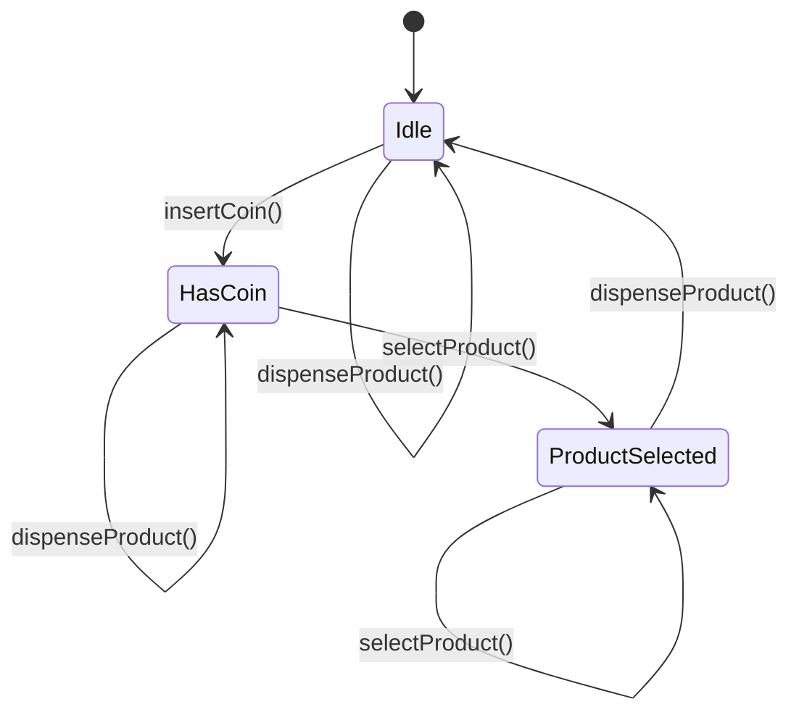

## 6.8 State Pattern

The State Pattern is a behavioral design pattern that allows an object to change its behavior when its internal state changes. This pattern is particularly useful in scenarios where an object must exhibit different behaviors based on its current state. In Scala, the State Pattern can be elegantly implemented using case objects and pattern matching, leveraging Scala's powerful type system and functional programming paradigms.

### Intent

The primary intent of the State Pattern is to allow an object to alter its behavior when its internal state changes. This pattern encapsulates state-specific behavior and delegates state-specific requests to the current state object. It is particularly useful in scenarios where an object must change its behavior dynamically at runtime without resorting to large conditional statements.

### Key Participants

1. **Context**: The object whose behavior varies based on its state. It maintains a reference to an instance of a State subclass that defines the current state.
2. **State**: An interface or abstract class defining the behavior associated with a particular state of the Context.
3. **Concrete States**: Subclasses that implement the behavior associated with a state of the Context.

### Applicability

Use the State Pattern when:

- An object's behavior depends on its state and it must change its behavior at runtime depending on that state.
- Operations have large, multipart conditional statements that depend on the object's state.
- You want to avoid using a lot of conditional logic to manage state transitions.

### Sample Code Snippet

Let's consider a simple example of a `TrafficLight` system that changes its behavior based on its current state.

```scala
// Define the State trait
trait TrafficLightState {
  def nextState(): TrafficLightState
  def display(): String
}

// Define Concrete States
case object Red extends TrafficLightState {
  override def nextState(): TrafficLightState = Green
  override def display(): String = "Stop"
}

case object Green extends TrafficLightState {
  override def nextState(): TrafficLightState = Yellow
  override def display(): String = "Go"
}

case object Yellow extends TrafficLightState {
  override def nextState(): TrafficLightState = Red
  override def display(): String = "Caution"
}

// Context class
class TrafficLight(var state: TrafficLightState) {
  def changeState(): Unit = {
    state = state.nextState()
  }

  def showSignal(): String = {
    state.display()
  }
}

// Usage
object TrafficLightDemo extends App {
  val trafficLight = new TrafficLight(Red)

  for (_ <- 1 to 6) {
    println(s"Signal: ${trafficLight.showSignal()}")
    trafficLight.changeState()
  }
}
```

### Design Considerations

- **State Transitions**: Ensure that state transitions are well-defined and that the system can handle all possible transitions.
- **Immutability**: Consider using immutable state objects to ensure thread safety and avoid unintended side effects.
- **Pattern Matching**: Leverage Scala's pattern matching to simplify the implementation of state transitions and behavior changes.

### Differences and Similarities

The State Pattern is often confused with the Strategy Pattern. While both patterns involve changing behavior, the State Pattern is used when the behavior change is due to a change in the object's state, whereas the Strategy Pattern is used to change behavior based on a strategy that is passed to the object.

### Implementing the State Pattern in Scala

Scala's case objects and pattern matching provide a natural way to implement the State Pattern. Case objects are ideal for representing states because they are singletons and can be easily matched using pattern matching.

#### Using Case Objects

Case objects in Scala are a perfect fit for representing states because they are immutable and singleton by nature. This ensures that there is only one instance of each state, which simplifies state management.

#### Pattern Matching

Pattern matching in Scala allows you to handle different states and their transitions cleanly. It eliminates the need for complex conditional logic and makes the code more readable and maintainable.

### Advanced Example: Vending Machine

Let's explore a more complex example of a vending machine that changes its behavior based on its state.

```scala
// Define the State trait
trait VendingMachineState {
  def insertCoin(): VendingMachineState
  def selectProduct(): VendingMachineState
  def dispenseProduct(): VendingMachineState
}

// Define Concrete States
case object Idle extends VendingMachineState {
  override def insertCoin(): VendingMachineState = HasCoin
  override def selectProduct(): VendingMachineState = {
    println("Please insert a coin first.")
    this
  }
  override def dispenseProduct(): VendingMachineState = {
    println("Please insert a coin and select a product first.")
    this
  }
}

case object HasCoin extends VendingMachineState {
  override def insertCoin(): VendingMachineState = {
    println("Coin already inserted.")
    this
  }
  override def selectProduct(): VendingMachineState = ProductSelected
  override def dispenseProduct(): VendingMachineState = {
    println("Please select a product first.")
    this
  }
}

case object ProductSelected extends VendingMachineState {
  override def insertCoin(): VendingMachineState = {
    println("Product already selected.")
    this
  }
  override def selectProduct(): VendingMachineState = {
    println("Product already selected.")
    this
  }
  override def dispenseProduct(): VendingMachineState = {
    println("Dispensing product...")
    Idle
  }
}

// Context class
class VendingMachine(var state: VendingMachineState) {
  def insertCoin(): Unit = {
    state = state.insertCoin()
  }

  def selectProduct(): Unit = {
    state = state.selectProduct()
  }

  def dispenseProduct(): Unit = {
    state = state.dispenseProduct()
  }
}

// Usage
object VendingMachineDemo extends App {
  val vendingMachine = new VendingMachine(Idle)

  vendingMachine.insertCoin()
  vendingMachine.selectProduct()
  vendingMachine.dispenseProduct()

  vendingMachine.insertCoin()
  vendingMachine.dispenseProduct()
}
```

### Visualizing State Transitions

To better understand how the State Pattern works, let's visualize the state transitions using a state diagram.



### Design Considerations

- **State Transition Logic**: Ensure that the logic for transitioning between states is clear and well-defined. This will help prevent invalid state transitions and ensure that the system behaves as expected.
- **Concurrency**: Consider thread safety when implementing the State Pattern in a concurrent environment. Immutable state objects can help ensure that state transitions are safe and predictable.
- **Testing**: Thoroughly test each state and its transitions to ensure that the system behaves correctly under all possible scenarios.

### Differences and Similarities

The State Pattern is similar to the Strategy Pattern in that both involve changing behavior. However, the key difference is that the State Pattern changes behavior based on the object's state, while the Strategy Pattern changes behavior based on a strategy that is passed to the object.

### Try It Yourself

To gain a deeper understanding of the State Pattern, try modifying the vending machine example to add more states or behaviors. For instance, you could add a state for when the machine is out of stock, or implement a refund mechanism.

### Knowledge Check

- Explain the primary intent of the State Pattern.
- How does the State Pattern differ from the Strategy Pattern?
- Why are case objects and pattern matching well-suited for implementing the State Pattern in Scala?
- What are some design considerations to keep in mind when implementing the State Pattern?

### Embrace the Journey

Remember, mastering design patterns is an ongoing journey. As you continue to explore and implement different patterns, you'll gain a deeper understanding of how to build robust and maintainable software systems. Keep experimenting, stay curious, and enjoy the journey!

## Quiz Time!



### What is the primary intent of the State Pattern?

- [x] To allow an object to change its behavior when its internal state changes.
- [ ] To encapsulate a family of algorithms and make them interchangeable.
- [ ] To provide a way to access the elements of an aggregate object sequentially.
- [ ] To define a one-to-many dependency between objects.

> **Explanation:** The State Pattern's primary intent is to allow an object to change its behavior when its internal state changes, enabling dynamic behavior management.

### Which Scala feature is particularly useful for implementing the State Pattern?

- [x] Case objects
- [ ] Mutable variables
- [ ] Anonymous functions
- [ ] Singleton objects

> **Explanation:** Case objects are particularly useful for implementing the State Pattern in Scala because they are immutable and singleton by nature, making them ideal for representing states.

### How does the State Pattern differ from the Strategy Pattern?

- [x] The State Pattern changes behavior based on the object's state, while the Strategy Pattern changes behavior based on a strategy passed to the object.
- [ ] The State Pattern is used for encapsulating algorithms, while the Strategy Pattern is used for managing state transitions.
- [ ] The State Pattern is used for managing state transitions, while the Strategy Pattern is used for encapsulating algorithms.
- [ ] The State Pattern and Strategy Pattern are identical in functionality.

> **Explanation:** The State Pattern changes behavior based on the object's state, while the Strategy Pattern changes behavior based on a strategy passed to the object.

### What is a key benefit of using pattern matching in the State Pattern?

- [x] It eliminates the need for complex conditional logic and makes the code more readable.
- [ ] It allows for the creation of mutable state objects.
- [ ] It enables the use of anonymous functions for state transitions.
- [ ] It simplifies the implementation of singleton objects.

> **Explanation:** Pattern matching eliminates the need for complex conditional logic and makes the code more readable, which is a key benefit when implementing the State Pattern.

### In the TrafficLight example, what is the initial state of the traffic light?

- [x] Red
- [ ] Green
- [ ] Yellow
- [ ] Idle

> **Explanation:** In the TrafficLight example, the initial state of the traffic light is set to Red.

### What is the role of the Context class in the State Pattern?

- [x] It maintains a reference to an instance of a State subclass that defines the current state.
- [ ] It defines the behavior associated with a particular state of the Context.
- [ ] It provides a simplified interface to a complex system.
- [ ] It encapsulates a family of algorithms and makes them interchangeable.

> **Explanation:** The Context class maintains a reference to an instance of a State subclass that defines the current state, allowing it to change behavior dynamically.

### What should you consider when implementing the State Pattern in a concurrent environment?

- [x] Thread safety and immutability of state objects
- [ ] Use of mutable variables for state transitions
- [ ] Avoiding the use of pattern matching
- [ ] Implementing complex conditional logic

> **Explanation:** When implementing the State Pattern in a concurrent environment, it's important to consider thread safety and the immutability of state objects to ensure predictable behavior.

### How can you test the State Pattern effectively?

- [x] Thoroughly test each state and its transitions to ensure correct behavior under all scenarios.
- [ ] Use complex conditional logic to manage state transitions.
- [ ] Implement mutable state objects for easier testing.
- [ ] Avoid testing state transitions to simplify the testing process.

> **Explanation:** To test the State Pattern effectively, thoroughly test each state and its transitions to ensure correct behavior under all possible scenarios.

### What is a potential pitfall when implementing the State Pattern?

- [x] Undefined or invalid state transitions
- [ ] Overuse of mutable variables
- [ ] Excessive use of pattern matching
- [ ] Lack of singleton objects for states

> **Explanation:** A potential pitfall when implementing the State Pattern is having undefined or invalid state transitions, which can lead to unexpected behavior.

### True or False: The State Pattern is only applicable in object-oriented programming.

- [ ] True
- [x] False

> **Explanation:** False. The State Pattern can be applied in both object-oriented and functional programming paradigms, as demonstrated in Scala.


