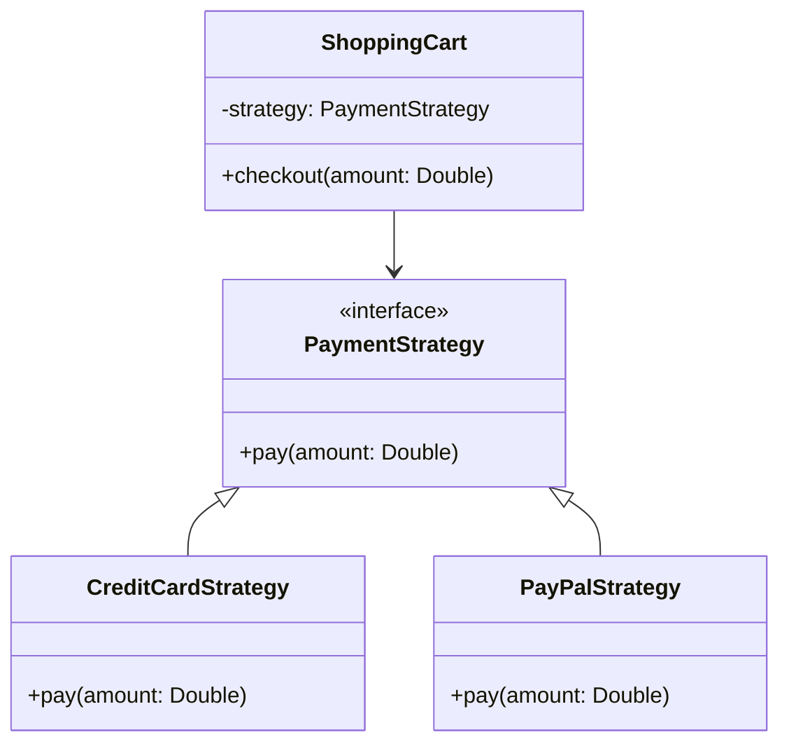

## 6.9 Strategy Pattern

The Strategy Pattern is a powerful behavioral design pattern that enables you to define a family of interchangeable algorithms and make them easily swappable within your application. This pattern is particularly useful when you need to choose an algorithm at runtime, providing flexibility and promoting code reuse. In this section, we'll explore how to implement the Strategy Pattern in Scala, leveraging its functional programming capabilities and object-oriented features.

### Intent

The primary intent of the Strategy Pattern is to define a set of algorithms, encapsulate each one, and make them interchangeable. This allows the algorithm to vary independently from the clients that use it. In Scala, we can achieve this by using traits and passing strategies as function parameters.

### Key Participants

- **Strategy**: The interface or abstract class that defines the algorithm's structure.
- **Concrete Strategy**: Classes that implement the Strategy interface, each providing a specific algorithm.
- **Context**: The class that uses a Strategy to perform its task. It maintains a reference to a Strategy object and delegates the algorithm execution to it.

### Applicability

Use the Strategy Pattern when:

- You have multiple algorithms for a specific task and want to switch between them easily.
- You want to avoid conditional statements for selecting algorithms.
- You need to encapsulate algorithms to make them interchangeable and reusable.

### Implementing the Strategy Pattern in Scala

Scala's rich type system and functional programming features make it an ideal language for implementing the Strategy Pattern. We'll explore two approaches: using traits and passing strategies as function parameters.

#### Using Traits

In Scala, traits can be used to define the Strategy interface. Each concrete strategy will implement this trait, providing its own version of the algorithm.

```scala
// Define the Strategy trait
trait PaymentStrategy {
  def pay(amount: Double): Unit
}

// Implement Concrete Strategies
class CreditCardStrategy(cardNumber: String, cvv: String) extends PaymentStrategy {
  override def pay(amount: Double): Unit = {
    println(s"Paying $$amount using Credit Card ending with ${cardNumber.takeRight(4)}")
  }
}

class PayPalStrategy(email: String) extends PaymentStrategy {
  override def pay(amount: Double): Unit = {
    println(s"Paying $$amount using PayPal account $email")
  }
}

// Context class that uses the Strategy
class ShoppingCart(var strategy: PaymentStrategy) {
  def checkout(amount: Double): Unit = {
    strategy.pay(amount)
  }
}

// Example usage
object StrategyPatternExample extends App {
  val cart = new ShoppingCart(new CreditCardStrategy("1234567890123456", "123"))
  cart.checkout(100.0)

  cart.strategy = new PayPalStrategy("user@example.com")
  cart.checkout(200.0)
}
```

In this example, `PaymentStrategy` is the trait that defines the algorithm interface. `CreditCardStrategy` and `PayPalStrategy` are concrete implementations of this trait. The `ShoppingCart` class acts as the context, using a `PaymentStrategy` to perform the payment operation.

#### Passing Strategies as Function Parameters

Scala's support for first-class functions allows us to pass strategies as function parameters, offering a more functional approach to the Strategy Pattern.

```scala
// Define the Strategy as a function type
type PaymentStrategy = Double => Unit

// Implement Concrete Strategies as functions
val creditCardStrategy: PaymentStrategy = amount => {
  println(s"Paying $$amount using Credit Card")
}

val payPalStrategy: PaymentStrategy = amount => {
  println(s"Paying $$amount using PayPal")
}

// Context class that uses the Strategy
class ShoppingCart(var strategy: PaymentStrategy) {
  def checkout(amount: Double): Unit = {
    strategy(amount)
  }
}

// Example usage
object StrategyPatternExample extends App {
  val cart = new ShoppingCart(creditCardStrategy)
  cart.checkout(100.0)

  cart.strategy = payPalStrategy
  cart.checkout(200.0)
}
```

Here, we define `PaymentStrategy` as a function type `Double => Unit`. The concrete strategies are implemented as functions, which are then passed to the `ShoppingCart` class.

### Design Considerations

When implementing the Strategy Pattern in Scala, consider the following:

- **Immutability**: If possible, design your strategies to be immutable. This ensures thread safety and makes your code easier to reason about.
- **Type Safety**: Leverage Scala's type system to enforce correct usage of strategies. Consider using type parameters if your strategies need to operate on different types.
- **Performance**: Be mindful of the performance implications of using higher-order functions, especially in performance-critical sections of your code.

### Differences and Similarities

The Strategy Pattern is often confused with the State Pattern. While both patterns involve changing behavior at runtime, the key difference is that the Strategy Pattern is used to switch between algorithms, whereas the State Pattern is used to change the object's behavior when its state changes.

### Visualizing the Strategy Pattern

Let's visualize the Strategy Pattern using a class diagram to better understand the relationships between the components.



This diagram illustrates how the `ShoppingCart` class interacts with the `PaymentStrategy` interface and its concrete implementations.

### Try It Yourself

Experiment with the Strategy Pattern by modifying the code examples:

- Add a new payment strategy, such as a `BitcoinStrategy`.
- Implement a strategy that applies a discount before making a payment.
- Modify the `ShoppingCart` class to accept multiple strategies and apply them in sequence.

### Knowledge Check

- What is the primary intent of the Strategy Pattern?
- How does the Strategy Pattern promote code reuse?
- What are the advantages of using function parameters for strategies in Scala?
- How does the Strategy Pattern differ from the State Pattern?

### Conclusion

The Strategy Pattern is a versatile tool in your design pattern toolkit, enabling you to define a family of interchangeable algorithms and select them at runtime. By leveraging Scala's traits and first-class functions, you can implement this pattern in a way that is both flexible and maintainable. Remember, the key to mastering design patterns is practice and experimentation. Keep exploring, and you'll find new ways to apply these concepts in your projects.

## Quiz Time!



### What is the primary intent of the Strategy Pattern?

- [x] To define a family of interchangeable algorithms and make them easily swappable.
- [ ] To encapsulate object creation logic.
- [ ] To provide a simplified interface to a complex system.
- [ ] To separate abstraction from implementation.

> **Explanation:** The Strategy Pattern is designed to define a family of algorithms, encapsulate each one, and make them interchangeable, allowing the algorithm to vary independently from the clients that use it.

### Which of the following is a key participant in the Strategy Pattern?

- [x] Strategy
- [ ] Singleton
- [ ] Facade
- [ ] Adapter

> **Explanation:** The Strategy Pattern involves key participants such as the Strategy, Concrete Strategy, and Context.

### How can strategies be passed in Scala?

- [x] As function parameters
- [x] As traits
- [ ] As abstract classes
- [ ] As singletons

> **Explanation:** In Scala, strategies can be passed as function parameters or implemented using traits.

### What is a benefit of using function parameters for strategies in Scala?

- [x] It allows for more functional and concise code.
- [ ] It enforces immutability.
- [ ] It simplifies object creation.
- [ ] It reduces the need for inheritance.

> **Explanation:** Using function parameters for strategies in Scala allows for more functional and concise code, leveraging Scala's support for first-class functions.

### How does the Strategy Pattern differ from the State Pattern?

- [x] Strategy Pattern switches between algorithms, while State Pattern changes behavior based on state.
- [ ] Strategy Pattern changes behavior based on state, while State Pattern switches between algorithms.
- [ ] Both patterns are used for object creation.
- [ ] Both patterns are used for simplifying interfaces.

> **Explanation:** The Strategy Pattern is used to switch between algorithms, whereas the State Pattern is used to change the object's behavior when its state changes.

### What is a design consideration when implementing the Strategy Pattern in Scala?

- [x] Immutability
- [ ] Singleton usage
- [ ] Abstract class inheritance
- [ ] Deep inheritance hierarchies

> **Explanation:** Immutability is an important design consideration when implementing the Strategy Pattern in Scala to ensure thread safety and ease of reasoning.

### What is a common pitfall when using the Strategy Pattern?

- [x] Overcomplicating the design with too many strategies.
- [ ] Using too few strategies.
- [ ] Not using enough inheritance.
- [ ] Over-reliance on singletons.

> **Explanation:** A common pitfall when using the Strategy Pattern is overcomplicating the design with too many strategies, which can lead to unnecessary complexity.

### Which Scala feature can be leveraged to enforce correct usage of strategies?

- [x] Type system
- [ ] Singleton pattern
- [ ] Abstract classes
- [ ] Deep inheritance hierarchies

> **Explanation:** Scala's type system can be leveraged to enforce correct usage of strategies, ensuring type safety and correctness.

### Can the Strategy Pattern be implemented using Scala's first-class functions?

- [x] True
- [ ] False

> **Explanation:** Yes, the Strategy Pattern can be implemented using Scala's first-class functions, allowing strategies to be passed as function parameters.

### Is the Strategy Pattern applicable when you have multiple algorithms for a specific task?

- [x] True
- [ ] False

> **Explanation:** True, the Strategy Pattern is applicable when you have multiple algorithms for a specific task and want to switch between them easily.


