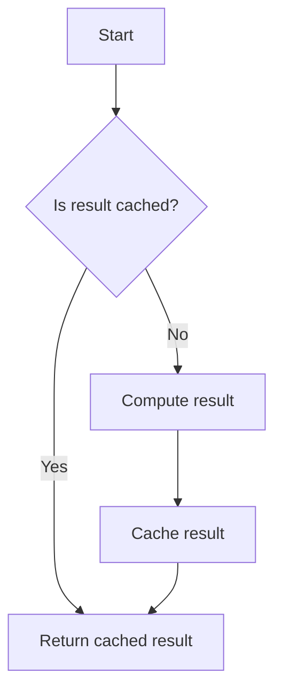

## 7.10 Memoization

Memoization is a powerful optimization technique used in software engineering to improve the performance of functions by caching their results. This approach is particularly effective in functional programming languages like Scala, where functions are often pure and deterministic. In this section, we will explore the concept of memoization in detail, understand its benefits, and learn how to implement it in Scala.

### Understanding Memoization

Memoization is a specific form of caching that involves storing the results of expensive function calls and returning the cached result when the same inputs occur again. This technique is especially useful for functions that are called repeatedly with the same arguments, as it avoids redundant calculations and reduces computational overhead.

#### Key Concepts

- **Cache**: A storage layer that holds the results of previous computations.
- **Function Purity**: Memoization works best with pure functions, which always produce the same output for the same input and have no side effects.
- **Determinism**: The function's output is solely determined by its input values.

### Benefits of Memoization

Memoization offers several advantages, particularly in performance-critical applications:

- **Improved Performance**: By avoiding repeated calculations, memoization can significantly speed up function execution.
- **Reduced Computational Load**: It decreases the overall computational resources required, which is beneficial in resource-constrained environments.
- **Enhanced Scalability**: Applications can handle larger workloads more efficiently.

### Implementing Memoization in Scala

Scala, with its functional programming capabilities, provides an ideal environment for implementing memoization. Let's explore different techniques to achieve memoization in Scala.

#### Basic Memoization with Mutable Maps

One of the simplest ways to implement memoization in Scala is by using a mutable map to store cached results. Here's a basic example:

```scala
object MemoizationExample {
  def memoize[A, B](f: A => B): A => B = {
    val cache = scala.collection.mutable.Map.empty[A, B]
    (x: A) =>
      cache.getOrElseUpdate(x, f(x))
  }

  def expensiveComputation(x: Int): Int = {
    println(s"Computing for $x")
    x * x // Example of an expensive computation
  }

  def main(args: Array[String]): Unit = {
    val memoizedComputation = memoize(expensiveComputation)
    println(memoizedComputation(5)) // Computes and caches
    println(memoizedComputation(5)) // Retrieves from cache
  }
}
```

In this example, the `memoize` function takes a function `f` and returns a new function that caches results in a mutable map. The `getOrElseUpdate` method is used to either retrieve a cached result or compute and store a new result.

#### Immutable Memoization with Functional Collections

While mutable maps are straightforward, they don't align with Scala's functional programming principles. Let's implement memoization using immutable collections:

```scala
object ImmutableMemoization {
  def memoize[A, B](f: A => B): A => B = {
    var cache = Map.empty[A, B]
    (x: A) =>
      cache.get(x) match {
        case Some(result) => result
        case None =>
          val result = f(x)
          cache += (x -> result)
          result
      }
  }

  def expensiveComputation(x: Int): Int = {
    println(s"Computing for $x")
    x * x
  }

  def main(args: Array[String]): Unit = {
    val memoizedComputation = memoize(expensiveComputation)
    println(memoizedComputation(5))
    println(memoizedComputation(5))
  }
}
```

Here, we use an immutable `Map` to store cached results. The cache is updated by creating a new map with the additional entry, preserving immutability.

### Advanced Memoization Techniques

For more advanced use cases, we can leverage Scala's powerful features and libraries to implement memoization.

#### Using Scala's `Lazy` for Memoization

Scala's `lazy` keyword can be used to defer computation until a value is needed, which can be combined with memoization:

```scala
object LazyMemoization {
  def memoize[A, B](f: A => B): A => B = {
    val cache = scala.collection.mutable.Map.empty[A, B]
    (x: A) => cache.getOrElseUpdate(x, f(x))
  }

  lazy val expensiveComputation: Int => Int = memoize { x =>
    println(s"Computing for $x")
    x * x
  }

  def main(args: Array[String]): Unit = {
    println(expensiveComputation(5))
    println(expensiveComputation(5))
  }
}
```

In this example, `expensiveComputation` is defined as a lazy value, ensuring that it is only computed when accessed.

#### Memoization with `Cats` Library

The `Cats` library provides functional programming abstractions that can be used to implement memoization in a more idiomatic way. Here's an example using `Cats`:

```scala
import cats.effect.IO
import scala.collection.mutable

object CatsMemoization {
  def memoize[A, B](f: A => IO[B]): A => IO[B] = {
    val cache = mutable.Map.empty[A, IO[B]]
    (x: A) => cache.getOrElseUpdate(x, f(x))
  }

  def expensiveComputation(x: Int): IO[Int] = IO {
    println(s"Computing for $x")
    x * x
  }

  def main(args: Array[String]): Unit = {
    val memoizedComputation = memoize(expensiveComputation)
    memoizedComputation(5).unsafeRunSync()
    memoizedComputation(5).unsafeRunSync()
  }
}
```

The `Cats` library allows us to work with effects, making it suitable for memoizing computations that involve side effects.

### Design Considerations

When implementing memoization, consider the following:

- **Cache Size**: Limit the size of the cache to prevent excessive memory usage.
- **Concurrency**: Ensure thread safety when accessing and updating the cache.
- **Eviction Policy**: Implement strategies to remove stale or least-used entries from the cache.

### Differences and Similarities with Other Patterns

Memoization is often confused with other caching techniques. Here are some distinctions:

- **Memoization vs. Caching**: While both store results for reuse, memoization is specific to function calls, whereas caching can apply to broader contexts.
- **Memoization vs. Lazy Evaluation**: Lazy evaluation defers computation, while memoization caches results. They can be used together for optimal performance.

### Try It Yourself

Experiment with the memoization examples provided. Try modifying the `expensiveComputation` function to simulate different scenarios, such as varying computational complexity or introducing side effects. Observe how memoization impacts performance and behavior.

### Visualizing Memoization

To better understand memoization, let's visualize the process using a flowchart:



This flowchart illustrates the decision-making process in a memoized function: checking the cache, computing the result if necessary, and storing the result for future use.

### References and Further Reading

- [Scala Documentation](https://docs.scala-lang.org/)
- [Cats Library](https://typelevel.org/cats/)
- [Functional Programming in Scala](https://www.manning.com/books/functional-programming-in-scala)

### Knowledge Check

- What is memoization, and how does it differ from general caching?
- How can memoization improve the performance of a Scala application?
- What are some considerations when implementing memoization in a concurrent environment?

### Embrace the Journey

Remember, memoization is just one of many techniques available to optimize Scala applications. As you continue your journey in functional programming, explore other patterns and techniques to build efficient, scalable, and maintainable software. Keep experimenting, stay curious, and enjoy the process of learning and discovery!

## Quiz Time!



### What is memoization primarily used for in programming?

- [x] Caching function results to avoid redundant computations
- [ ] Encrypting sensitive data
- [ ] Managing concurrent processes
- [ ] Optimizing memory allocation

> **Explanation:** Memoization is used to cache function results, preventing redundant computations and improving performance.

### Which type of functions benefit most from memoization?

- [x] Pure functions
- [ ] Functions with side effects
- [ ] Asynchronous functions
- [ ] Functions that modify global state

> **Explanation:** Pure functions, which always produce the same output for the same input, benefit most from memoization.

### What is a key difference between memoization and lazy evaluation?

- [x] Memoization caches results, while lazy evaluation defers computation
- [ ] Memoization is used for asynchronous tasks, while lazy evaluation is not
- [ ] Lazy evaluation caches results, while memoization defers computation
- [ ] They are the same concept

> **Explanation:** Memoization caches results of function calls, whereas lazy evaluation defers computation until the result is needed.

### In Scala, which data structure is commonly used for implementing memoization?

- [x] Map
- [ ] List
- [ ] Set
- [ ] Queue

> **Explanation:** A `Map` is commonly used to store cached results in memoization implementations.

### What is a potential drawback of using mutable maps for memoization in Scala?

- [x] Lack of immutability
- [ ] Increased computational complexity
- [ ] Difficulty in accessing elements
- [ ] Limited storage capacity

> **Explanation:** Mutable maps lack immutability, which can lead to issues in functional programming paradigms.

### How can concurrency issues be addressed in memoization?

- [x] Using synchronized blocks or concurrent data structures
- [ ] Avoiding memoization altogether
- [ ] Increasing the cache size
- [ ] Using more complex algorithms

> **Explanation:** Concurrency issues can be addressed by using synchronized blocks or concurrent data structures to ensure thread safety.

### Which library provides functional programming abstractions that can aid in memoization?

- [x] Cats
- [ ] Akka
- [ ] Play Framework
- [ ] Spark

> **Explanation:** The `Cats` library provides functional programming abstractions that can be useful in implementing memoization.

### What is an eviction policy in the context of memoization?

- [x] A strategy to remove stale or least-used entries from the cache
- [ ] A method to increase cache size
- [ ] A technique to encrypt cached data
- [ ] A process to optimize memory allocation

> **Explanation:** An eviction policy is a strategy to remove stale or least-used entries from the cache to manage memory usage.

### True or False: Memoization is only applicable to functions with side effects.

- [ ] True
- [x] False

> **Explanation:** Memoization is most effective for pure functions, which do not have side effects.

### What is a common use case for memoization in software applications?

- [x] Optimizing recursive algorithms
- [ ] Managing user sessions
- [ ] Encrypting data
- [ ] Handling network requests

> **Explanation:** Memoization is commonly used to optimize recursive algorithms by caching previously computed results.


