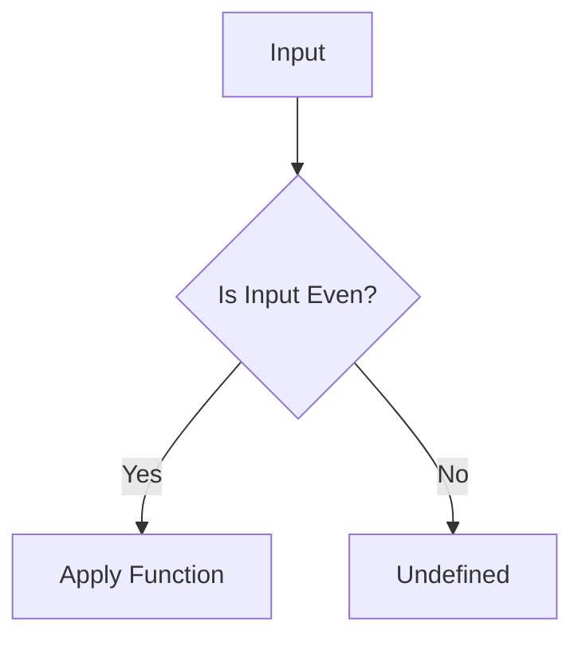
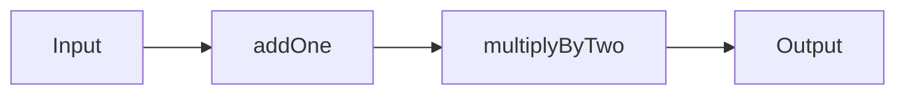

## 7.11 Partial Functions and Function Composition

In this section, we delve into the powerful concepts of partial functions and function composition in Scala. These concepts are pivotal in functional programming, allowing for more expressive, modular, and reusable code. We will explore their definitions, applications, and how they can be effectively utilized in Scala to solve complex problems.

### Introduction to Partial Functions

**Partial Functions** are a fundamental concept in Scala that allow you to define functions that are not necessarily defined for all possible inputs. This is particularly useful when dealing with cases where only a subset of inputs is valid or meaningful. Partial functions provide a way to handle such scenarios elegantly.

#### Defining Partial Functions

A partial function in Scala is defined using the `PartialFunction` trait. It consists of two main components:

1. **Domain of Definition**: The set of inputs for which the function is defined.
2. **Function Body**: The logic that is applied to the inputs within the domain.

Here's a simple example of a partial function that only handles even numbers:

```scala
val evenNumbers: PartialFunction[Int, String] = {
  case x if x % 2 == 0 => s"$x is even"
}

// Usage
if (evenNumbers.isDefinedAt(4)) {
  println(evenNumbers(4)) // Output: 4 is even
}

if (!evenNumbers.isDefinedAt(3)) {
  println("3 is not defined in the partial function")
}
```

In this example, `evenNumbers` is a partial function that is only defined for even integers. The `isDefinedAt` method is used to check if the function can handle a particular input.

#### Visualizing Partial Functions

To better understand how partial functions work, let's visualize their behavior using a simple flowchart:



This flowchart illustrates that the partial function checks if the input is even. If it is, the function is applied; otherwise, it remains undefined.

#### Key Participants

- **PartialFunction Trait**: The core trait that defines a partial function.
- **isDefinedAt Method**: Checks if the function is applicable to a given input.
- **apply Method**: Executes the function logic if the input is within the domain.

### Function Composition

Function composition is a powerful technique in functional programming that allows you to combine simple functions to build more complex ones. In Scala, function composition is achieved using the `compose` and `andThen` methods.

#### Composing Functions with `andThen` and `compose`

- **`andThen`**: Chains two functions such that the output of the first function becomes the input of the second.
- **`compose`**: Chains two functions such that the output of the second function becomes the input of the first.

Here's an example to illustrate both:

```scala
val addOne: Int => Int = _ + 1
val multiplyByTwo: Int => Int = _ * 2

val addThenMultiply = addOne andThen multiplyByTwo
val multiplyThenAdd = addOne compose multiplyByTwo

println(addThenMultiply(3)) // Output: 8
println(multiplyThenAdd(3)) // Output: 7
```

In this example, `addThenMultiply` first adds one to the input and then multiplies the result by two. Conversely, `multiplyThenAdd` first multiplies the input by two and then adds one.

#### Visualizing Function Composition

Let's visualize the flow of data through composed functions:



This diagram shows the sequence of operations when using `andThen`. For `compose`, the flow would be reversed.

#### Applicability

Function composition is applicable in scenarios where:

- You want to build complex operations from simpler ones.
- You need to maintain a clear separation of concerns.
- You aim to enhance code reusability and readability.

### Advanced Partial Functions

Partial functions can be extended and composed to handle more complex scenarios. Scala provides several utilities to work with partial functions effectively.

#### Combining Partial Functions

You can combine multiple partial functions using the `orElse` method. This allows you to define a sequence of partial functions, each handling different cases.

```scala
val evenHandler: PartialFunction[Int, String] = {
  case x if x % 2 == 0 => s"$x is even"
}

val oddHandler: PartialFunction[Int, String] = {
  case x if x % 2 != 0 => s"$x is odd"
}

val numberHandler = evenHandler orElse oddHandler

println(numberHandler(2)) // Output: 2 is even
println(numberHandler(3)) // Output: 3 is odd
```

In this example, `numberHandler` is a combination of `evenHandler` and `oddHandler`, capable of handling both even and odd numbers.

#### Partial Function Lifting

The `lift` method converts a partial function into a total function that returns an `Option` type. This is useful for safely handling inputs that may not be defined in the original partial function.

```scala
val safeEvenNumbers = evenNumbers.lift

println(safeEvenNumbers(4)) // Output: Some(4 is even)
println(safeEvenNumbers(3)) // Output: None
```

Here, `safeEvenNumbers` is a lifted version of `evenNumbers`, returning `Some` for defined inputs and `None` for undefined ones.

### Practical Applications

Partial functions and function composition are widely used in Scala applications. Let's explore some practical scenarios where these concepts shine.

#### Error Handling with Partial Functions

Partial functions can be used to handle specific error cases elegantly. Consider a scenario where you need to process a list of inputs, but only a subset is valid:

```scala
val processValidInputs: PartialFunction[Int, String] = {
  case x if x > 0 => s"Processed $x"
}

val inputs = List(1, -1, 2, 0, 3)

inputs.collect(processValidInputs).foreach(println)
// Output:
// Processed 1
// Processed 2
// Processed 3
```

In this example, `collect` is used to apply the partial function only to valid inputs, ignoring the rest.

#### Building Pipelines with Function Composition

Function composition is ideal for building data processing pipelines. By composing simple functions, you can create complex transformations with ease.

```scala
val trim: String => String = _.trim
val toUpperCase: String => String = _.toUpperCase
val addExclamation: String => String = _ + "!"

val shout = trim andThen toUpperCase andThen addExclamation

println(shout(" hello ")) // Output: HELLO!
```

This example demonstrates how to build a text processing pipeline that trims, converts to uppercase, and adds an exclamation mark to a string.

### Design Considerations

When working with partial functions and function composition, consider the following:

- **Readability**: Ensure that composed functions remain readable and maintainable.
- **Performance**: Be mindful of the overhead introduced by multiple function calls.
- **Error Handling**: Use partial functions to handle specific cases gracefully.

### Differences and Similarities

Partial functions and function composition are often used together but serve different purposes:

- **Partial Functions**: Handle specific cases within a domain.
- **Function Composition**: Combine functions to build complex operations.

### Try It Yourself

Experiment with the concepts covered in this section by modifying the provided examples. Try creating your own partial functions and composing them to solve a problem of your choice.

### Knowledge Check

- Explain the difference between a partial function and a total function.
- Demonstrate how to use `andThen` and `compose` in Scala.
- Describe a scenario where partial functions are more beneficial than total functions.

### Conclusion

Partial functions and function composition are powerful tools in Scala's functional programming arsenal. By mastering these concepts, you can write more expressive, modular, and reusable code. Remember, this is just the beginning. As you progress, you'll discover even more ways to leverage these patterns in your Scala applications. Keep experimenting, stay curious, and enjoy the journey!

## Quiz Time!



### What is a partial function in Scala?

- [x] A function that is not defined for all possible inputs.
- [ ] A function that is defined for all possible inputs.
- [ ] A function that always returns an `Option` type.
- [ ] A function that is always composed with another function.

> **Explanation:** A partial function is defined only for a subset of possible inputs, unlike a total function which is defined for all inputs.

### How do you check if a partial function is defined for a specific input?

- [x] Using the `isDefinedAt` method.
- [ ] Using the `apply` method.
- [ ] Using the `orElse` method.
- [ ] Using the `lift` method.

> **Explanation:** The `isDefinedAt` method checks if a partial function can handle a specific input.

### What does the `andThen` method do in function composition?

- [x] Chains two functions such that the output of the first becomes the input of the second.
- [ ] Chains two functions such that the output of the second becomes the input of the first.
- [ ] Converts a partial function into a total function.
- [ ] Combines two partial functions into one.

> **Explanation:** The `andThen` method allows you to chain functions in a sequence where the first function's output is passed to the second function.

### What is the result of `multiplyThenAdd(3)` if `multiplyThenAdd` is defined as `addOne compose multiplyByTwo`?

- [x] 7
- [ ] 8
- [ ] 6
- [ ] 9

> **Explanation:** `multiplyThenAdd` first multiplies by two (3 * 2 = 6) and then adds one (6 + 1 = 7).

### How can you safely handle inputs that are not defined in a partial function?

- [x] Use the `lift` method to convert it into a total function returning an `Option`.
- [ ] Use the `apply` method to handle exceptions.
- [ ] Use the `orElse` method to provide a default case.
- [ ] Use the `andThen` method to handle undefined inputs.

> **Explanation:** The `lift` method converts a partial function into a total function that returns `Some` for defined inputs and `None` for undefined ones.

### What is the purpose of the `orElse` method in partial functions?

- [x] To combine multiple partial functions, each handling different cases.
- [ ] To convert a partial function into a total function.
- [ ] To check if a partial function is defined for a specific input.
- [ ] To compose two functions into one.

> **Explanation:** The `orElse` method allows you to combine multiple partial functions, enabling them to handle different cases.

### Which method would you use to reverse the order of function composition?

- [x] `compose`
- [ ] `andThen`
- [ ] `orElse`
- [ ] `lift`

> **Explanation:** The `compose` method reverses the order of function composition, where the second function's output becomes the first function's input.

### What is a key benefit of using function composition?

- [x] Building complex operations from simpler ones.
- [ ] Ensuring all inputs are handled by a function.
- [ ] Handling errors in asynchronous code.
- [ ] Improving performance by reducing function calls.

> **Explanation:** Function composition allows you to build complex operations by combining simpler functions, enhancing code modularity and reusability.

### What is the output of `shout(" hello ")` if `shout` is defined as `trim andThen toUpperCase andThen addExclamation`?

- [x] HELLO!
- [ ] hello!
- [ ] HELLO
- [ ] hello

> **Explanation:** The `shout` function trims the input, converts it to uppercase, and adds an exclamation mark, resulting in "HELLO!".

### True or False: Partial functions in Scala can only be used with integer inputs.

- [ ] True
- [x] False

> **Explanation:** Partial functions in Scala can be defined for any type, not just integers.


