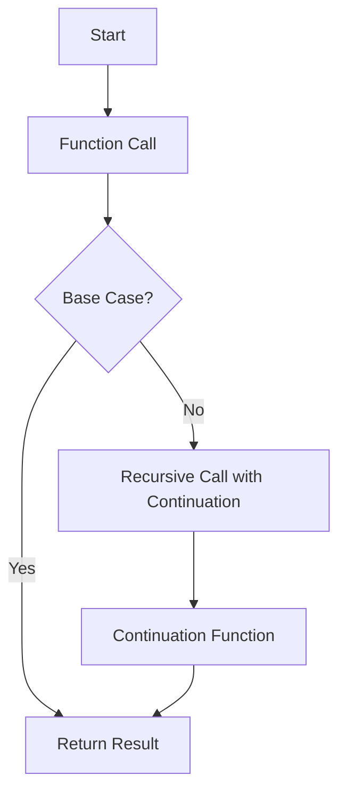

## 7.12 Continuation Passing Style (CPS)

### Introduction to Continuation Passing Style (CPS)

Continuation Passing Style (CPS) is a powerful programming pattern that allows developers to control the flow of computations explicitly. In CPS, functions do not return values in the traditional sense. Instead, they take an additional argument: a continuation function that represents the rest of the computation. This approach provides greater flexibility in managing control flow, error handling, and asynchronous operations.

In this section, we will explore the concepts of CPS, its implementation in Scala, and its applications in functional programming. We will delve into code examples, diagrams, and exercises to solidify your understanding of CPS.

### Understanding Continuations

A continuation is an abstraction that represents "the rest of the computation" at any given point in a program. In traditional programming, when a function completes, it returns a value to its caller. In CPS, instead of returning a value, the function calls another function (the continuation) with the result.

#### Key Concepts

- **Continuation Function**: A function that represents the next step in the computation. It takes the result of the current computation as an argument.
- **Tail Call Optimization (TCO)**: A technique that optimizes recursive function calls to prevent stack overflow. CPS naturally benefits from TCO due to its structure.
- **Asynchronous Programming**: CPS is particularly useful in asynchronous programming, where the flow of execution is non-linear.

### Implementing CPS in Scala

Let's start by implementing a simple function in CPS. Consider a function that adds two numbers:

```scala
def add(a: Int, b: Int): Int = a + b
```

In CPS, this function would be rewritten as:

```scala
def addCPS(a: Int, b: Int, cont: Int => Unit): Unit = {
  cont(a + b)
}
```

Here, `cont` is the continuation function that takes the result of `a + b` and performs the next computation.

#### Example: Factorial in CPS

Let's implement the factorial function using CPS:

```scala
def factorialCPS(n: Int, cont: Int => Unit): Unit = {
  if (n == 0) cont(1)
  else factorialCPS(n - 1, (result: Int) => cont(n * result))
}

// Usage
factorialCPS(5, println) // Output: 120
```

In this example, the continuation function is used to accumulate the result of the factorial computation.

### Visualizing CPS

To better understand CPS, let's visualize the flow of a CPS-based computation using a diagram.



**Diagram Description**: This flowchart illustrates the CPS process. The function checks for a base case. If true, it returns the result. Otherwise, it makes a recursive call with a continuation function, which eventually leads to the result.

### Benefits of CPS

- **Explicit Control Flow**: CPS makes control flow explicit, which can simplify reasoning about complex computations.
- **Asynchronous Programming**: CPS is well-suited for asynchronous programming, as it naturally handles non-linear execution flows.
- **Tail Call Optimization**: CPS benefits from TCO, allowing deep recursion without stack overflow.

### Applications of CPS

CPS is widely used in various programming scenarios, including:

- **Compiler Design**: CPS is used in compilers to transform code into a form that is easier to optimize and analyze.
- **Asynchronous I/O**: CPS is a natural fit for handling asynchronous I/O operations, such as reading from or writing to files.
- **Error Handling**: CPS can be used to implement sophisticated error handling mechanisms by passing error continuations.

### Code Examples

Let's explore more code examples to deepen our understanding of CPS.

#### Example: Asynchronous File Reading

Consider a scenario where we need to read a file asynchronously. CPS can be used to handle the asynchronous nature of file I/O:

```scala
import scala.io.Source
import scala.concurrent.ExecutionContext.Implicits.global
import scala.concurrent.Future

def readFileCPS(filename: String, cont: String => Unit, errorCont: Throwable => Unit): Unit = {
  Future {
    val source = Source.fromFile(filename)
    try {
      val content = source.getLines().mkString("\n")
      cont(content)
    } catch {
      case e: Exception => errorCont(e)
    } finally {
      source.close()
    }
  }
}

// Usage
readFileCPS("example.txt", println, e => println(s"Error: ${e.getMessage}"))
```

In this example, `readFileCPS` reads a file asynchronously and uses continuations to handle the result or any errors.

### Design Considerations

When using CPS, consider the following:

- **Complexity**: CPS can introduce complexity, especially in large codebases. It's important to balance the benefits of CPS with the added complexity.
- **Performance**: While CPS benefits from TCO, it may introduce overhead due to additional function calls. Profiling and optimization may be necessary.
- **Readability**: CPS can make code harder to read for developers unfamiliar with the pattern. Clear documentation and comments are essential.

### Differences and Similarities with Other Patterns

CPS shares similarities with other patterns, such as:

- **Monads**: Both CPS and monads handle computations in a structured way. However, CPS focuses on explicit control flow, while monads abstract side effects.
- **Callbacks**: CPS is similar to callback-based programming, but it provides a more structured approach to managing control flow.

### Try It Yourself

Experiment with the provided code examples by modifying them:

- Change the continuation function to perform different operations, such as logging or transforming the result.
- Implement a CPS version of a common algorithm, such as sorting or searching.

### Knowledge Check

- What is a continuation in the context of CPS?
- How does CPS benefit asynchronous programming?
- What are some common applications of CPS?

### Conclusion

Continuation Passing Style (CPS) is a powerful pattern for controlling computation flow explicitly. By understanding and applying CPS, you can gain greater control over complex computations, asynchronous operations, and error handling. Remember, this is just the beginning. As you progress, you'll discover more advanced applications of CPS in functional programming. Keep experimenting, stay curious, and enjoy the journey!

## Quiz Time!



### What is a continuation in CPS?

- [x] A function representing the rest of the computation
- [ ] A variable storing the current state
- [ ] A loop controlling iteration
- [ ] A data structure for managing state

> **Explanation:** In CPS, a continuation is a function that represents the rest of the computation after a certain point.

### How does CPS benefit asynchronous programming?

- [x] By naturally handling non-linear execution flows
- [ ] By simplifying synchronous code
- [ ] By reducing memory usage
- [ ] By eliminating the need for callbacks

> **Explanation:** CPS allows for explicit control of execution flow, making it well-suited for asynchronous programming where execution is non-linear.

### What is a key advantage of CPS?

- [x] Tail Call Optimization
- [ ] Increased code complexity
- [ ] Reduced readability
- [ ] Higher memory usage

> **Explanation:** CPS benefits from Tail Call Optimization, allowing deep recursion without stack overflow.

### Which of the following is a common application of CPS?

- [x] Compiler Design
- [ ] Database Management
- [ ] UI Design
- [ ] Network Configuration

> **Explanation:** CPS is commonly used in compiler design to transform code for optimization and analysis.

### What is a potential drawback of using CPS?

- [x] Increased complexity
- [ ] Improved readability
- [ ] Simplified error handling
- [ ] Enhanced performance

> **Explanation:** CPS can introduce complexity, especially in large codebases, due to its explicit control flow.

### How does CPS differ from monads?

- [x] CPS focuses on explicit control flow
- [ ] CPS abstracts side effects
- [ ] CPS simplifies state management
- [ ] CPS enhances type safety

> **Explanation:** CPS focuses on explicit control flow, while monads abstract side effects in computations.

### What is a similarity between CPS and callbacks?

- [x] Both manage control flow
- [ ] Both simplify error handling
- [ ] Both enhance type safety
- [ ] Both reduce code complexity

> **Explanation:** Both CPS and callbacks manage control flow, but CPS provides a more structured approach.

### What is Tail Call Optimization (TCO)?

- [x] A technique to optimize recursive calls
- [ ] A method to increase code readability
- [ ] A strategy for error handling
- [ ] A pattern for data management

> **Explanation:** TCO is a technique that optimizes recursive function calls to prevent stack overflow.

### How can you experiment with CPS?

- [x] By modifying continuation functions
- [ ] By reducing function calls
- [ ] By increasing code complexity
- [ ] By simplifying algorithms

> **Explanation:** Experimenting with CPS involves modifying continuation functions to perform different operations.

### True or False: CPS can be used for error handling.

- [x] True
- [ ] False

> **Explanation:** CPS can be used to implement sophisticated error handling mechanisms by passing error continuations.




