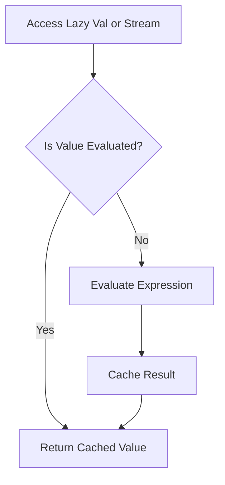

## 7.13 Lazy Evaluation Patterns

Lazy evaluation is a powerful concept in functional programming that allows computations to be deferred until their results are needed. This can lead to significant performance improvements, especially in scenarios where not all computed values are used. In Scala, lazy evaluation is primarily achieved using `lazy val` and `Stream`. In this section, we will explore these concepts in depth, providing you with the knowledge to leverage lazy evaluation patterns effectively in your Scala applications.

### Understanding Lazy Evaluation

Lazy evaluation is a strategy that delays the evaluation of an expression until its value is actually required. This can help in reducing unnecessary computations, thereby saving time and resources. Let's break down the key components of lazy evaluation:

1. **Deferred Computation**: Computations are not performed until the result is needed.
2. **Memoization**: Once a lazy expression is evaluated, its result is cached for future use, avoiding redundant calculations.
3. **Efficiency**: By avoiding unnecessary evaluations, lazy evaluation can lead to more efficient code execution.

#### Benefits of Lazy Evaluation

- **Performance Optimization**: By deferring computations, you can avoid unnecessary processing, which can be especially beneficial in large data processing tasks.
- **Resource Management**: Lazy evaluation can help manage resources more effectively by only using them when absolutely necessary.
- **Improved Code Clarity**: Lazy evaluation can lead to cleaner and more readable code by abstracting away complex computations until they are needed.

### Lazy Val in Scala

In Scala, `lazy val` is a construct that allows you to define a value that is evaluated only once, upon its first access. After the initial evaluation, the result is cached, and subsequent accesses return the cached value.

#### Syntax and Usage

The syntax for defining a `lazy val` is straightforward:

```scala
lazy val x = {
  println("Evaluating x")
  42
}
```

In this example, the expression `42` is not evaluated until `x` is accessed for the first time. The `println` statement will only execute once, demonstrating the deferred computation.

#### Key Characteristics of Lazy Val

- **Single Evaluation**: The expression is evaluated only once, and the result is reused.
- **Thread Safety**: `lazy val` is thread-safe, ensuring that the expression is evaluated only once even in concurrent scenarios.
- **Use Cases**: Ideal for expensive computations that may not always be needed, such as initializing a large data structure or performing a complex calculation.

#### Example: Lazy Initialization

Consider a scenario where you need to initialize a heavy resource, such as a database connection, only if it's required:

```scala
class DatabaseConnection {
  println("Connecting to database...")
  // Simulate a connection setup
}

object LazyValExample {
  lazy val dbConnection = new DatabaseConnection

  def main(args: Array[String]): Unit = {
    println("Program started")
    // The database connection is not initialized yet
    println("Accessing database connection")
    dbConnection // This triggers the initialization
  }
}
```

In this example, the `DatabaseConnection` is only initialized when it is first accessed, demonstrating the lazy evaluation pattern.

### Stream in Scala

`Stream` is a lazy collection in Scala that allows you to work with potentially infinite sequences of data. Elements of a `Stream` are computed lazily, meaning they are only evaluated when accessed.

#### Creating and Using Streams

A `Stream` can be created using the `#::` operator, which constructs a stream by prepending an element to an existing stream:

```scala
val stream = 1 #:: 2 #:: 3 #:: Stream.empty
```

In this example, the stream contains the elements `1`, `2`, and `3`. The elements are not evaluated until they are accessed.

#### Infinite Streams

One of the powerful features of `Stream` is its ability to represent infinite sequences. For example, you can create a stream of natural numbers:

```scala
def naturals(n: Int): Stream[Int] = n #:: naturals(n + 1)

val naturalNumbers = naturals(1)
```

This stream represents an infinite sequence of natural numbers starting from 1. You can access elements as needed, and only the accessed elements are evaluated.

#### Key Characteristics of Stream

- **Lazy Evaluation**: Elements are evaluated only when accessed.
- **Infinite Sequences**: Streams can represent infinite sequences, making them suitable for scenarios where the entire sequence is not needed at once.
- **Memory Efficiency**: Since elements are computed on demand, streams can be more memory-efficient than fully realized collections.

#### Example: Fibonacci Sequence

Let's create a stream to generate the Fibonacci sequence:

```scala
def fibonacci(a: Int, b: Int): Stream[Int] = a #:: fibonacci(b, a + b)

val fibs = fibonacci(0, 1)
println(fibs.take(10).toList) // Prints the first 10 Fibonacci numbers
```

In this example, the `fibonacci` function generates an infinite stream of Fibonacci numbers, and we use `take` to access the first 10 elements.

### Visualizing Lazy Evaluation

To better understand how lazy evaluation works, let's visualize the process using a flowchart. This flowchart illustrates the evaluation process of a `lazy val` and a `Stream`.



**Description**: This flowchart shows the decision-making process when accessing a `lazy val` or a `Stream`. If the value is already evaluated, the cached result is returned. Otherwise, the expression is evaluated, cached, and then returned.

### Design Considerations

When using lazy evaluation patterns in Scala, consider the following design considerations:

- **Performance Trade-offs**: While lazy evaluation can improve performance by deferring computations, it can also introduce overhead if not used judiciously. Ensure that the benefits outweigh the costs in your specific use case.
- **Memory Usage**: Lazy evaluation can reduce memory usage by avoiding unnecessary computations, but it can also increase memory usage if many values are cached. Monitor memory usage to ensure it remains within acceptable limits.
- **Thread Safety**: `lazy val` is thread-safe, but ensure that any side effects within the lazy expression are also thread-safe to avoid concurrency issues.
- **Use Cases**: Lazy evaluation is particularly useful in scenarios where computations are expensive and may not always be needed, such as initializing resources, processing large datasets, or working with infinite sequences.

### Differences and Similarities

Lazy evaluation patterns in Scala, such as `lazy val` and `Stream`, share similarities with other functional programming languages but also have distinct differences:

- **Similarities**: Like Haskell, Scala uses lazy evaluation to defer computations and manage resources efficiently. Both languages support lazy collections and deferred computations.
- **Differences**: Unlike Haskell, which is purely lazy, Scala is eager by default and provides lazy evaluation as an opt-in feature. This allows developers to choose between eager and lazy evaluation based on their specific needs.

### Try It Yourself

Now that we've explored lazy evaluation patterns in Scala, let's experiment with some code examples. Try modifying the following code to see how lazy evaluation affects performance and resource usage:

```scala
object LazyEvaluationExperiment {
  def main(args: Array[String]): Unit = {
    // Experiment with lazy val
    lazy val expensiveComputation = {
      println("Performing expensive computation...")
      (1 to 1000000).sum
    }

    println("Before accessing lazy val")
    println(s"Result: ${expensiveComputation}")
    println("After accessing lazy val")

    // Experiment with Stream
    def infiniteStream(n: Int): Stream[Int] = n #:: infiniteStream(n + 1)

    val stream = infiniteStream(1)
    println(stream.take(5).toList) // Access the first 5 elements
  }
}
```

**Suggestions for Experimentation**:

- Modify the range in `expensiveComputation` to see how it affects performance.
- Access different elements of the `stream` to observe lazy evaluation in action.
- Introduce additional computations or side effects to explore their impact on lazy evaluation.

### Knowledge Check

To reinforce your understanding of lazy evaluation patterns in Scala, consider the following questions:

- What are the key benefits of using lazy evaluation in Scala?
- How does `lazy val` ensure thread safety during evaluation?
- In what scenarios would you choose to use a `Stream` over a fully realized collection?
- How does lazy evaluation impact memory usage in Scala applications?

### Conclusion

Lazy evaluation patterns in Scala, such as `lazy val` and `Stream`, provide powerful tools for optimizing performance and managing resources efficiently. By deferring computations and leveraging lazy collections, you can write more efficient and expressive code. As you continue to explore Scala's functional programming capabilities, remember to experiment with lazy evaluation patterns to fully harness their potential.

## Quiz Time!



### What is lazy evaluation?

- [x] A strategy that delays the evaluation of an expression until its value is needed
- [ ] A method of eagerly evaluating all expressions at once
- [ ] A technique for caching all computed values in memory
- [ ] A way to evaluate expressions in parallel

> **Explanation:** Lazy evaluation defers computation until the result is required, optimizing performance and resource usage.

### How many times is a `lazy val` evaluated in Scala?

- [x] Once
- [ ] Twice
- [ ] Every time it is accessed
- [ ] It depends on the context

> **Explanation:** A `lazy val` is evaluated only once upon its first access, and the result is cached for future use.

### What is a key characteristic of a `Stream` in Scala?

- [x] Elements are evaluated lazily
- [ ] Elements are evaluated eagerly
- [ ] Streams cannot represent infinite sequences
- [ ] Streams are mutable collections

> **Explanation:** Streams in Scala are lazy collections, meaning elements are evaluated only when accessed.

### Which of the following is a benefit of lazy evaluation?

- [x] Performance optimization
- [ ] Increased memory usage
- [ ] Immediate computation of all expressions
- [ ] Complexity in code

> **Explanation:** Lazy evaluation optimizes performance by deferring unnecessary computations.

### How does `lazy val` ensure thread safety?

- [x] It uses synchronization to ensure the expression is evaluated only once
- [ ] It evaluates expressions in parallel
- [ ] It does not ensure thread safety
- [ ] It caches values for each thread separately

> **Explanation:** `lazy val` uses synchronization to ensure that the expression is evaluated only once, even in concurrent scenarios.

### What is a potential downside of using lazy evaluation?

- [x] Increased complexity in debugging
- [ ] Immediate resource consumption
- [ ] Inefficient memory usage
- [ ] Lack of performance benefits

> **Explanation:** Lazy evaluation can introduce complexity in debugging due to deferred computations.

### In what scenario would you use a `Stream`?

- [x] When working with potentially infinite sequences
- [ ] When all elements need to be computed immediately
- [ ] When elements need to be mutable
- [ ] When memory usage is not a concern

> **Explanation:** Streams are ideal for working with potentially infinite sequences due to their lazy nature.

### What happens when you access a `lazy val` for the first time?

- [x] The expression is evaluated and cached
- [ ] The expression is ignored
- [ ] The expression is evaluated every time
- [ ] The expression is evaluated in parallel

> **Explanation:** When a `lazy val` is accessed for the first time, its expression is evaluated and the result is cached.

### True or False: Scala is purely lazy by default.

- [ ] True
- [x] False

> **Explanation:** Scala is eager by default, but provides lazy evaluation as an opt-in feature.

### Which operator is used to construct a `Stream` in Scala?

- [x] #::
- [ ] ::
- [ ] ++
- [ ] --

> **Explanation:** The `#::` operator is used to construct a `Stream` by prepending an element to an existing stream.


