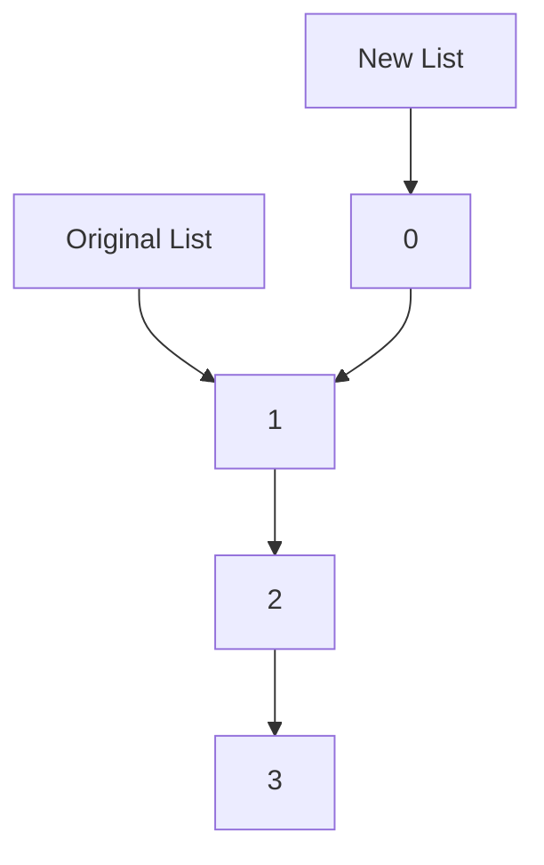
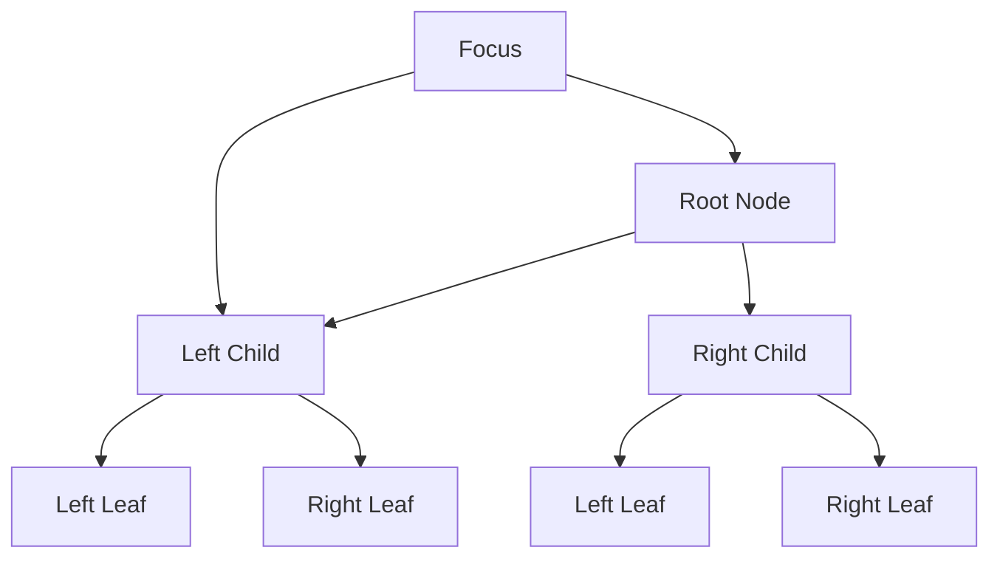

## 7.14 Functional Data Structures

Functional data structures are at the heart of functional programming, offering ways to manage data that align with the principles of immutability and referential transparency. In this section, we will delve into two key concepts: **Persistent Data Structures** and **Zippers**. These structures are essential for building efficient, immutable, and expressive Scala applications.

### Introduction to Functional Data Structures

Functional data structures are designed to be immutable, meaning once they are created, they cannot be altered. This immutability provides several benefits, such as simplifying reasoning about code, enabling safe concurrent execution, and avoiding side effects. In Scala, functional data structures are often implemented using persistent data structures, which allow for efficient updates by sharing structure between versions.

### Persistent Data Structures

#### What Are Persistent Data Structures?

Persistent data structures are a type of data structure that preserves the previous version of itself when modified. Instead of altering the structure in place, a new version is created that shares as much of the existing structure as possible. This sharing of structure minimizes the overhead of creating new versions and is a cornerstone of functional programming.

#### Benefits of Persistent Data Structures

- **Immutability**: Ensures that data cannot be altered unexpectedly, leading to safer and more predictable code.
- **Efficiency**: By sharing structure, persistent data structures can often perform updates in logarithmic time, making them efficient for many applications.
- **Concurrency**: Since data is immutable, persistent data structures are inherently thread-safe, which simplifies concurrent programming.

#### Common Persistent Data Structures in Scala

Scala's standard library provides several persistent data structures, such as `List`, `Vector`, and `Map`. Let's explore these in more detail.

##### List

The `List` is a classic example of a persistent data structure. It is a singly linked list, where each element points to the next. When a new element is added, a new list is created with the new element pointing to the existing list.

```scala
val originalList = List(1, 2, 3)
val newList = 0 :: originalList // newList is List(0, 1, 2, 3)
```

In this example, `newList` shares the structure of `originalList`, with only the head of the list being new.

##### Vector

`Vector` is another persistent data structure that provides efficient random access and updates. It uses a tree-like structure to achieve this efficiency.

```scala
val originalVector = Vector(1, 2, 3)
val updatedVector = originalVector.updated(1, 42) // updatedVector is Vector(1, 42, 3)
```

Here, `updatedVector` shares most of its structure with `originalVector`, making the update operation efficient.

##### Map

`Map` is a key-value store that also supports persistence. It allows for efficient lookups and updates by sharing structure.

```scala
val originalMap = Map("a" -> 1, "b" -> 2)
val updatedMap = originalMap + ("b" -> 3) // updatedMap is Map("a" -> 1, "b" -> 3)
```

In this case, `updatedMap` shares structure with `originalMap`, only modifying the necessary parts.

#### Implementing Custom Persistent Data Structures

While Scala provides many built-in persistent data structures, there may be cases where you need to implement your own. Let's explore how you might do this with a simple binary tree.

```scala
sealed trait Tree[+A]
case object Empty extends Tree[Nothing]
case class Node[A](value: A, left: Tree[A], right: Tree[A]) extends Tree[A]

def insert[A](tree: Tree[A], newValue: A)(implicit ord: Ordering[A]): Tree[A] = tree match {
  case Empty => Node(newValue, Empty, Empty)
  case Node(value, left, right) =>
    if (ord.lt(newValue, value)) Node(value, insert(left, newValue), right)
    else Node(value, left, insert(right, newValue))
}
```

In this example, `insert` creates a new tree with the new value, sharing as much structure as possible with the original tree.

### Zippers

#### What Are Zippers?

Zippers are a technique for navigating and updating data structures efficiently. They provide a way to focus on a specific part of a data structure, allowing for localized updates without needing to recreate the entire structure.

#### How Zippers Work

A zipper consists of two parts: a focus and a context. The focus is the part of the data structure currently being examined or modified, while the context contains the information needed to reconstruct the entire structure.

#### Implementing Zippers in Scala

Let's implement a simple zipper for a binary tree.

```scala
sealed trait Tree[+A]
case object Empty extends Tree[Nothing]
case class Node[A](value: A, left: Tree[A], right: Tree[A]) extends Tree[A]

case class TreeZipper[A](focus: Tree[A], context: List[Context[A]])

sealed trait Context[+A]
case class LeftContext[A](value: A, right: Tree[A]) extends Context[A]
case class RightContext[A](value: A, left: Tree[A]) extends Context[A]

def goLeft[A](zipper: TreeZipper[A]): Option[TreeZipper[A]] = zipper.focus match {
  case Node(value, left, right) => Some(TreeZipper(left, LeftContext(value, right) :: zipper.context))
  case Empty => None
}

def goRight[A](zipper: TreeZipper[A]): Option[TreeZipper[A]] = zipper.focus match {
  case Node(value, left, right) => Some(TreeZipper(right, RightContext(value, left) :: zipper.context))
  case Empty => None
}

def goUp[A](zipper: TreeZipper[A]): Option[TreeZipper[A]] = zipper.context match {
  case LeftContext(value, right) :: rest => Some(TreeZipper(Node(value, zipper.focus, right), rest))
  case RightContext(value, left) :: rest => Some(TreeZipper(Node(value, left, zipper.focus), rest))
  case Nil => None
}
```

In this implementation, `TreeZipper` allows us to navigate a binary tree. We can move left or right, and we can also move up to the parent node. Each movement updates the focus and context, allowing us to reconstruct the tree as needed.

#### Benefits of Zippers

- **Efficiency**: Zippers allow for efficient updates by focusing on a specific part of the data structure.
- **Expressiveness**: They provide a clear and concise way to navigate and modify complex structures.
- **Immutability**: Like other functional data structures, zippers maintain immutability, ensuring safe concurrent access.

### Visualizing Functional Data Structures

To better understand how persistent data structures and zippers work, let's visualize these concepts using Mermaid.js diagrams.

#### Persistent Data Structure Sharing



**Caption**: This diagram shows how a new list shares structure with the original list. Only the head of the new list is different, while the rest of the structure is shared.

#### Zipper Navigation



**Caption**: This diagram illustrates how a zipper navigates a binary tree. The focus is on the left child, with the context allowing us to reconstruct the tree.

### Try It Yourself

To get hands-on experience with functional data structures, try modifying the code examples provided. Here are some suggestions:

- **Extend the Binary Tree**: Add functionality to delete nodes while maintaining persistence.
- **Enhance the Zipper**: Implement additional navigation functions, such as moving to the root or finding a specific value.
- **Experiment with Other Structures**: Implement a persistent queue or stack and explore how they can be used in your applications.

### Knowledge Check

As you explore functional data structures, consider the following questions:

- How do persistent data structures improve efficiency in functional programming?
- What are the key benefits of using zippers for navigation and updates?
- How does immutability contribute to the safety and predictability of concurrent programs?

### Conclusion

Functional data structures are a powerful tool in the Scala programmer's toolkit. By leveraging persistent data structures and zippers, we can build efficient, immutable, and expressive applications. These structures not only simplify reasoning about code but also enable safe concurrent execution, making them ideal for modern software development.

Remember, this is just the beginning. As you continue to explore Scala and functional programming, you'll discover even more ways to apply these concepts to build robust and scalable applications. Keep experimenting, stay curious, and enjoy the journey!

## Quiz Time!



### What is a key benefit of persistent data structures?

- [x] They allow for efficient updates by sharing structure.
- [ ] They require more memory than mutable structures.
- [ ] They are always faster than mutable structures.
- [ ] They are only useful in concurrent programming.

> **Explanation:** Persistent data structures share structure between versions, allowing for efficient updates without duplicating the entire structure.

### How does immutability contribute to concurrent programming?

- [x] It ensures thread safety by preventing data from being altered.
- [ ] It makes code harder to understand.
- [ ] It requires more complex synchronization mechanisms.
- [ ] It is only useful in single-threaded applications.

> **Explanation:** Immutability ensures that data cannot be altered unexpectedly, which simplifies reasoning about code and ensures thread safety in concurrent programming.

### What is a zipper in functional programming?

- [x] A technique for navigating and updating data structures efficiently.
- [ ] A type of persistent data structure.
- [ ] A method for compressing data.
- [ ] A way to sort data structures.

> **Explanation:** Zippers provide a way to focus on a specific part of a data structure, allowing for localized updates without needing to recreate the entire structure.

### Which Scala data structure is a classic example of persistence?

- [x] List
- [ ] Array
- [ ] HashMap
- [ ] Set

> **Explanation:** The `List` in Scala is a classic example of a persistent data structure, where each element points to the next, and new elements can be added by creating a new list.

### What does a zipper consist of?

- [x] A focus and a context.
- [ ] A head and a tail.
- [ ] A root and a leaf.
- [ ] A key and a value.

> **Explanation:** A zipper consists of a focus, which is the part of the data structure currently being examined or modified, and a context, which contains the information needed to reconstruct the entire structure.

### How do persistent data structures achieve efficiency?

- [x] By sharing structure between versions.
- [ ] By duplicating data for each update.
- [ ] By using mutable state.
- [ ] By compressing data.

> **Explanation:** Persistent data structures achieve efficiency by sharing structure between versions, minimizing the overhead of creating new versions.

### What is the primary advantage of using zippers?

- [x] They allow for efficient navigation and updates.
- [ ] They compress data structures.
- [ ] They simplify data serialization.
- [ ] They are faster than all other data structures.

> **Explanation:** Zippers allow for efficient navigation and updates by focusing on a specific part of the data structure and maintaining immutability.

### What is a common use case for persistent data structures?

- [x] Implementing thread-safe collections.
- [ ] Compressing large datasets.
- [ ] Sorting data structures.
- [ ] Serializing data to JSON.

> **Explanation:** Persistent data structures are commonly used to implement thread-safe collections, as their immutability ensures safe concurrent access.

### Which of the following is not a persistent data structure in Scala?

- [ ] List
- [ ] Vector
- [x] Array
- [ ] Map

> **Explanation:** `Array` is not a persistent data structure in Scala; it is mutable and does not share structure between versions.

### True or False: Zippers can only be used with binary trees.

- [ ] True
- [x] False

> **Explanation:** Zippers can be used with various data structures, not just binary trees. They provide a way to navigate and update any data structure efficiently.


