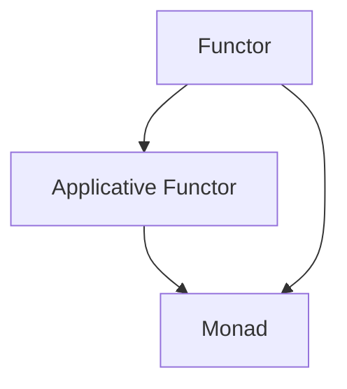

## 7.15 Category Theory Concepts

Category theory provides a high-level, abstract framework that can be applied to various areas of mathematics and computer science. In the context of Scala and functional programming, category theory concepts such as functors and monads play a crucial role in creating robust and scalable software designs. This section will delve into these concepts, explaining their significance and application in Scala.

### Introduction to Category Theory

Category theory is a branch of mathematics that deals with abstract structures and relationships between them. It provides a unified way to describe and analyze mathematical concepts by focusing on the relationships (morphisms) between objects rather than the objects themselves.

#### Key Concepts

- **Objects and Morphisms**: In category theory, objects can be anything (e.g., sets, types, spaces), and morphisms are the arrows or functions that map one object to another.
- **Categories**: A category consists of objects and morphisms that satisfy certain properties, such as identity and composition.
- **Functors**: Functors map objects and morphisms from one category to another, preserving the structure of the categories.
- **Natural Transformations**: These are mappings between functors, maintaining the structure between categories.

### Functors in Scala

Functors are a fundamental concept in category theory, representing a mapping between categories that preserves the categorical structure. In Scala, functors are typically represented by the `Functor` type class, which provides a way to apply a function over a wrapped value.

#### Understanding Functors

A functor is a type class that defines how to map a function over a structure without altering the structure itself. In Scala, this is often seen in collections like `List`, `Option`, and `Future`.

```scala
trait Functor[F[_]] {
  def map[A, B](fa: F[A])(f: A => B): F[B]
}
```

- **`F[_]`**: Represents a type constructor that takes one type parameter.
- **`map`**: A method that applies a function `f` to a value inside the context `F`, producing a new context `F[B]`.

#### Example: Functor for Option

Let's implement a functor for the `Option` type in Scala:

```scala
object OptionFunctor extends Functor[Option] {
  def map[A, B](fa: Option[A])(f: A => B): Option[B] = fa match {
    case Some(a) => Some(f(a))
    case None    => None
  }
}

// Usage
val optionValue: Option[Int] = Some(2)
val result: Option[Int] = OptionFunctor.map(optionValue)(_ * 2)
// result: Some(4)
```

### Monads in Scala

Monads are another critical concept in category theory, providing a way to handle computations in a context. They extend functors by adding the ability to chain operations.

#### Understanding Monads

A monad is a type class that encapsulates a computation context, allowing for the composition of operations within that context. In Scala, a monad is defined by two primary operations: `flatMap` and `unit` (or `pure`).

```scala
trait Monad[M[_]] extends Functor[M] {
  def flatMap[A, B](ma: M[A])(f: A => M[B]): M[B]
  def unit[A](a: A): M[A]
}
```

- **`flatMap`**: Chains operations, allowing the output of one function to be the input of another.
- **`unit`**: Wraps a value in the monadic context.

#### Example: Monad for Option

Here's how you might implement a monad for the `Option` type:

```scala
object OptionMonad extends Monad[Option] {
  def flatMap[A, B](ma: Option[A])(f: A => Option[B]): Option[B] = ma match {
    case Some(a) => f(a)
    case None    => None
  }

  def unit[A](a: A): Option[A] = Some(a)
}

// Usage
val optionValue: Option[Int] = Some(2)
val result: Option[Int] = OptionMonad.flatMap(optionValue)(x => Some(x * 2))
// result: Some(4)
```

### Applicative Functors

Applicative functors are a middle ground between functors and monads. They allow for the application of functions within a context, but unlike monads, they do not allow for chaining operations that depend on previous results.

#### Understanding Applicative Functors

An applicative functor is defined by two operations: `ap` and `pure`.

```scala
trait Applicative[F[_]] extends Functor[F] {
  def ap[A, B](ff: F[A => B])(fa: F[A]): F[B]
  def pure[A](a: A): F[A]
}
```

- **`ap`**: Applies a function wrapped in the context `F` to a value wrapped in the same context.
- **`pure`**: Similar to `unit` in monads, it wraps a value in the context.

#### Example: Applicative for Option

Here's an example of an applicative functor for `Option`:

```scala
object OptionApplicative extends Applicative[Option] {
  def ap[A, B](ff: Option[A => B])(fa: Option[A]): Option[B] = (ff, fa) match {
    case (Some(f), Some(a)) => Some(f(a))
    case _                  => None
  }

  def pure[A](a: A): Option[A] = Some(a)
}

// Usage
val optionFunc: Option[Int => Int] = Some(_ * 2)
val optionValue: Option[Int] = Some(2)
val result: Option[Int] = OptionApplicative.ap(optionFunc)(optionValue)
// result: Some(4)
```

### Natural Transformations

Natural transformations provide a way to transform one functor into another while preserving the structure. In Scala, this can be seen as a function that transforms `F[A]` into `G[A]` for all types `A`.

#### Example: Natural Transformation between List and Option

```scala
def listToOption[A](list: List[A]): Option[A] = list.headOption

// Usage
val list = List(1, 2, 3)
val option = listToOption(list)
// option: Some(1)
```

### Monad Transformers

Monad transformers are used to combine multiple monadic contexts, allowing for more complex computations.

#### Understanding Monad Transformers

A monad transformer takes a monad as a parameter and returns a new monad that combines the effects of both.

```scala
case class OptionT[F[_], A](value: F[Option[A]])

object OptionT {
  def liftF[F[_]: Monad, A](fa: F[A]): OptionT[F, A] = OptionT(fa.map(Some(_)))

  implicit def optionTMonad[F[_]: Monad]: Monad[OptionT[F, *]] = new Monad[OptionT[F, *]] {
    def flatMap[A, B](fa: OptionT[F, A])(f: A => OptionT[F, B]): OptionT[F, B] =
      OptionT(fa.value.flatMap {
        case Some(a) => f(a).value
        case None    => Monad[F].unit(None)
      })

    def unit[A](a: A): OptionT[F, A] = OptionT(Monad[F].unit(Some(a)))
  }
}
```

### Try It Yourself

To deepen your understanding, try modifying the examples above. For instance, implement a functor for a custom data type or create a monad transformer for a different combination of monads. Experiment with chaining operations using `flatMap` and see how the behavior changes with different contexts.

### Visualizing Category Theory Concepts

Below is a diagram illustrating the relationship between functors, applicative functors, and monads:



**Diagram Description**: This diagram shows the hierarchy of category theory concepts in functional programming. A functor is the base concept, which can be extended to an applicative functor, and further to a monad.

### References and Further Reading

- [Scala Cats Library](https://typelevel.org/cats/)
- [Category Theory for Programmers](https://bartoszmilewski.com/category/category-theory/)
- [Functional Programming in Scala](https://www.manning.com/books/functional-programming-in-scala)

### Knowledge Check

- What is the primary role of a functor in Scala?
- How does a monad differ from a functor?
- What are the key operations of an applicative functor?
- How can monad transformers be used to combine multiple monadic contexts?

### Embrace the Journey

Remember, understanding category theory concepts like functors and monads can greatly enhance your ability to write robust and maintainable Scala code. Keep experimenting, stay curious, and enjoy the journey!

## Quiz Time!



### What is a functor in Scala?

- [x] A type class that defines how to map a function over a structure.
- [ ] A type that encapsulates a computation context.
- [ ] A function that transforms one functor into another.
- [ ] A type class that allows chaining operations.

> **Explanation:** A functor is a type class that defines how to map a function over a structure without altering the structure itself.

### Which method is essential for a monad in Scala?

- [x] flatMap
- [ ] map
- [ ] ap
- [ ] compose

> **Explanation:** `flatMap` is essential for a monad as it allows chaining operations within the monadic context.

### What does an applicative functor allow you to do?

- [x] Apply a function within a context to a value within the same context.
- [ ] Chain operations that depend on previous results.
- [ ] Transform one functor into another.
- [ ] Map a function over a structure.

> **Explanation:** An applicative functor allows you to apply a function wrapped in a context to a value wrapped in the same context.

### What is a natural transformation in category theory?

- [x] A mapping between functors that preserves the structure between categories.
- [ ] A type class that defines how to map a function over a structure.
- [ ] A function that allows chaining operations within a monadic context.
- [ ] A method for applying functions within a context.

> **Explanation:** A natural transformation is a mapping between functors that maintains the structure between categories.

### How can monad transformers be used?

- [x] To combine multiple monadic contexts.
- [ ] To map a function over a structure.
- [x] To allow chaining operations within a single context.
- [ ] To transform one functor into another.

> **Explanation:** Monad transformers are used to combine multiple monadic contexts, allowing for more complex computations.

### What is the role of `unit` in a monad?

- [x] To wrap a value in the monadic context.
- [ ] To apply a function within a context.
- [ ] To chain operations within a monadic context.
- [ ] To transform one functor into another.

> **Explanation:** `unit` (or `pure`) wraps a value in the monadic context, creating a monadic value.

### Which concept is a middle ground between functors and monads?

- [x] Applicative functors
- [ ] Natural transformations
- [ ] Monad transformers
- [ ] Category theory

> **Explanation:** Applicative functors are a middle ground between functors and monads, allowing for the application of functions within a context.

### What is the purpose of `ap` in an applicative functor?

- [x] To apply a function wrapped in a context to a value wrapped in the same context.
- [ ] To chain operations within a monadic context.
- [ ] To map a function over a structure.
- [ ] To transform one functor into another.

> **Explanation:** `ap` applies a function wrapped in a context to a value wrapped in the same context.

### What is the significance of category theory in functional programming?

- [x] It provides a high-level, abstract framework for describing and analyzing mathematical concepts.
- [ ] It allows for the application of functions within a context.
- [ ] It enables chaining operations within a monadic context.
- [ ] It transforms one functor into another.

> **Explanation:** Category theory provides a high-level, abstract framework for describing and analyzing mathematical concepts, which is crucial in functional programming.

### True or False: A monad is a type class that encapsulates a computation context.

- [x] True
- [ ] False

> **Explanation:** True. A monad is a type class that encapsulates a computation context, allowing for the composition of operations within that context.


