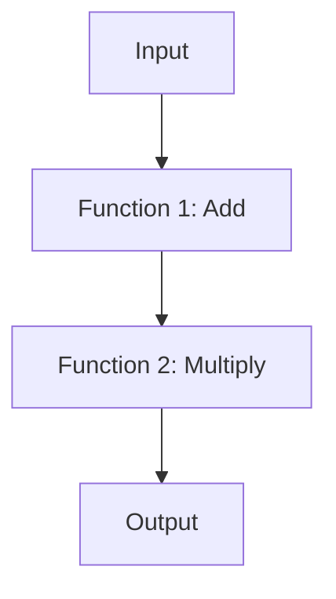

## 7.16 Declarative Programming Patterns

In the realm of software engineering, the shift from imperative to declarative programming represents a significant evolution in how we approach problem-solving. Declarative programming emphasizes *what* the program should accomplish rather than *how* to achieve it. This paradigm shift is particularly relevant in Scala, a language that seamlessly integrates functional programming principles with object-oriented paradigms. In this section, we will delve into declarative programming patterns in Scala, exploring how they enhance code clarity, maintainability, and scalability.

### Understanding Declarative Programming

Declarative programming is a style of building programs that expresses the logic of computation without describing its control flow. This contrasts with imperative programming, where the focus is on explicitly defining the steps to achieve a result. In declarative programming, we describe *what* we want to achieve, leaving the *how* to the underlying system or framework.

#### Key Characteristics

- **Abstraction**: Declarative programming abstracts the complexity of operations, allowing developers to focus on the desired outcome.
- **Immutability**: Emphasizes immutable data structures, reducing side effects and enhancing predictability.
- **Composability**: Encourages the composition of smaller, reusable functions to build complex logic.

### Declarative Patterns in Scala

Scala's rich type system and functional programming capabilities make it an ideal language for implementing declarative patterns. Let's explore some key declarative patterns and how they can be applied in Scala.

#### 1. Functional Composition

Functional composition is a core concept in declarative programming, allowing developers to build complex functions by composing simpler ones. This pattern leverages Scala's first-class functions and higher-order functions.

**Example:**

```scala
// Define simple functions
val add: Int => Int = _ + 1
val multiply: Int => Int = _ * 2

// Compose functions
val addThenMultiply: Int => Int = add andThen multiply

// Use the composed function
val result = addThenMultiply(5) // Result: 12
```

In this example, we define two simple functions, `add` and `multiply`, and compose them using `andThen`. The composed function `addThenMultiply` first adds 1 to the input and then multiplies the result by 2.

#### 2. Monadic Patterns

Monads are a powerful abstraction for handling computations with context, such as optional values, errors, or asynchronous operations. In Scala, the `Option`, `Either`, and `Future` types are commonly used monads.

**Example:**

```scala
// Using Option to handle optional values
def divide(a: Int, b: Int): Option[Int] =
  if (b != 0) Some(a / b) else None

val result = for {
  x <- divide(10, 2)
  y <- divide(x, 2)
} yield y

// Result: Some(2)
```

Here, we use the `Option` monad to safely perform division, avoiding division by zero errors. The `for` comprehension allows us to chain operations declaratively.

#### 3. Pattern Matching

Pattern matching is a powerful feature in Scala that allows for declarative data decomposition and control flow. It is particularly useful for handling algebraic data types and case classes.

**Example:**

```scala
// Define a sealed trait and case classes
sealed trait Shape
case class Circle(radius: Double) extends Shape
case class Rectangle(width: Double, height: Double) extends Shape

// Function using pattern matching
def area(shape: Shape): Double = shape match {
  case Circle(radius) => Math.PI * radius * radius
  case Rectangle(width, height) => width * height
}

// Calculate area
val circleArea = area(Circle(5)) // Result: 78.53981633974483
```

In this example, pattern matching is used to calculate the area of different shapes. The `match` expression provides a clear and concise way to handle different cases.

#### 4. Declarative Collections

Scala's collection library is designed with declarative programming in mind, offering a wide range of operations that abstract away the underlying iteration logic.

**Example:**

```scala
// Using map, filter, and reduce
val numbers = List(1, 2, 3, 4, 5)
val result = numbers
  .filter(_ % 2 == 0)
  .map(_ * 2)
  .reduce(_ + _)

// Result: 12
```

Here, we use `filter`, `map`, and `reduce` to process a list of numbers declaratively. This approach is more concise and expressive than using loops.

### Visualizing Declarative Programming

To better understand the flow of declarative programming, let's visualize the process of functional composition using a flowchart.



In this diagram, we see how an input flows through a series of composed functions, resulting in an output. This visual representation highlights the simplicity and clarity of declarative programming.

### Key Participants in Declarative Patterns

- **Functions**: The building blocks of declarative programming, enabling abstraction and composition.
- **Monads**: Provide a framework for handling computations with context.
- **Pattern Matching**: Facilitates declarative control flow and data decomposition.
- **Collections**: Offer a rich set of operations for declarative data processing.

### Applicability of Declarative Patterns

Declarative patterns are applicable in a wide range of scenarios, including:

- **Data Processing**: Simplifying complex data transformations and aggregations.
- **Error Handling**: Managing errors and exceptions in a concise and predictable manner.
- **Concurrency**: Handling asynchronous operations declaratively with `Future` and `Promise`.
- **Domain Modeling**: Using algebraic data types and pattern matching for clear and maintainable domain logic.

### Design Considerations

When adopting declarative patterns, consider the following:

- **Readability**: Declarative code is often more readable and easier to understand than imperative code.
- **Maintainability**: Declarative patterns promote code that is easier to maintain and extend.
- **Performance**: While declarative code can be more expressive, it may introduce performance overhead in certain scenarios. Profiling and optimization may be necessary.

### Differences and Similarities

Declarative programming shares similarities with functional programming, as both emphasize immutability, composability, and abstraction. However, declarative programming is a broader paradigm that can encompass other styles, such as logic programming.

### Try It Yourself

To gain a deeper understanding of declarative programming in Scala, try modifying the code examples provided. Experiment with different functions, monads, and pattern matching scenarios to see how declarative patterns can simplify complex logic.

### Knowledge Check

Before we conclude, let's reinforce what we've learned:

- **What is the primary focus of declarative programming?**
- **How do monads facilitate declarative error handling?**
- **Why is pattern matching a powerful tool in Scala?**

### Embrace the Journey

Remember, declarative programming is a journey towards more expressive and maintainable code. As you continue to explore Scala's capabilities, you'll discover new ways to apply declarative patterns to solve complex problems. Stay curious, keep experimenting, and enjoy the journey!

### Conclusion

Declarative programming patterns in Scala offer a powerful approach to building robust and maintainable software. By focusing on *what* the program should do, rather than *how* to do it, developers can create code that is both expressive and efficient. As you continue to explore Scala and its functional programming capabilities, consider how declarative patterns can enhance your software design.

## Quiz Time!



### What is the primary focus of declarative programming?

- [x] Describing what the program should accomplish
- [ ] Describing how the program should accomplish tasks
- [ ] Optimizing performance
- [ ] Managing memory allocation

> **Explanation:** Declarative programming focuses on describing what the program should accomplish, leaving the how to the underlying system or framework.

### Which Scala feature is commonly used for declarative error handling?

- [x] Monads
- [ ] Loops
- [ ] Variables
- [ ] Classes

> **Explanation:** Monads, such as `Option` and `Either`, are commonly used in Scala for declarative error handling, providing a framework for handling computations with context.

### What is the benefit of using pattern matching in Scala?

- [x] Facilitates declarative control flow and data decomposition
- [ ] Increases code verbosity
- [ ] Requires more boilerplate code
- [ ] Limits code flexibility

> **Explanation:** Pattern matching facilitates declarative control flow and data decomposition, allowing for clear and concise handling of different cases.

### How does functional composition enhance declarative programming?

- [x] By allowing complex functions to be built from simpler ones
- [ ] By increasing code complexity
- [ ] By reducing code readability
- [ ] By limiting function reuse

> **Explanation:** Functional composition enhances declarative programming by allowing complex functions to be built from simpler ones, promoting code reuse and abstraction.

### What is a key characteristic of declarative programming?

- [x] Abstraction
- [ ] Explicit control flow
- [ ] Mutable state
- [ ] Low-level operations

> **Explanation:** Abstraction is a key characteristic of declarative programming, allowing developers to focus on the desired outcome rather than the implementation details.

### Which of the following is a common use case for declarative patterns?

- [x] Data Processing
- [ ] Low-level memory management
- [ ] Manual thread management
- [ ] Explicit loop control

> **Explanation:** Declarative patterns are commonly used in data processing, simplifying complex data transformations and aggregations.

### How does Scala's collection library support declarative programming?

- [x] By offering a wide range of operations that abstract away iteration logic
- [ ] By requiring explicit loops for data processing
- [ ] By limiting the use of higher-order functions
- [ ] By enforcing mutable data structures

> **Explanation:** Scala's collection library supports declarative programming by offering a wide range of operations, such as `map`, `filter`, and `reduce`, that abstract away the underlying iteration logic.

### What is a potential drawback of declarative programming?

- [x] Performance overhead in certain scenarios
- [ ] Increased code verbosity
- [ ] Reduced code readability
- [ ] Limited use of functions

> **Explanation:** While declarative code can be more expressive, it may introduce performance overhead in certain scenarios, requiring profiling and optimization.

### Which of the following is NOT a key participant in declarative patterns?

- [x] Variables
- [ ] Functions
- [ ] Monads
- [ ] Pattern Matching

> **Explanation:** Variables are not a key participant in declarative patterns, which focus on functions, monads, and pattern matching for abstraction and composition.

### Declarative programming is primarily concerned with:

- [x] What the program should do
- [ ] How the program should do it
- [ ] Low-level implementation details
- [ ] Memory management

> **Explanation:** Declarative programming is primarily concerned with what the program should do, abstracting away the implementation details.


