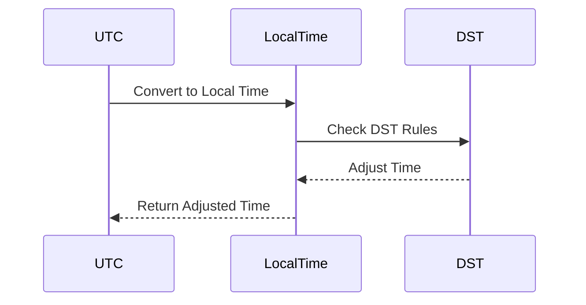

## 7.17 Time Handling and Temporal Patterns

Handling time and temporal data in software applications is a complex yet crucial task. As expert software engineers and architects, it is vital to understand the intricacies of time zones, daylight saving time, and temporal data modeling. This section will guide you through these concepts and provide practical insights into using libraries like *Joda-Time* and *java.time* in Scala for effective time management.

### Understanding Time Zones and Daylight Saving Time

Time zones and daylight saving time (DST) are two significant challenges when dealing with temporal data. Time zones are regions of the Earth that have the same standard time. DST is the practice of setting the clock forward by one hour during warmer months to extend evening daylight.

#### Key Concepts

- **Coordinated Universal Time (UTC):** The primary time standard by which the world regulates clocks and time. It is not adjusted for daylight saving time.
- **Offset:** The difference in hours and minutes from UTC. For example, UTC+2 means two hours ahead of UTC.
- **Daylight Saving Time (DST):** A seasonal time adjustment where clocks are set forward by one hour in spring and set back by one hour in autumn.

#### Challenges

1. **Ambiguity:** The same local time can occur twice on the day DST ends, leading to ambiguity.
2. **Complexity:** Different regions have different rules for DST, making it challenging to handle time consistently.
3. **Variability:** DST rules can change, requiring updates to software systems.

### Modeling Temporal Data in Scala

Scala provides robust libraries for handling temporal data. Two of the most popular libraries are *Joda-Time* and *java.time*. These libraries offer a comprehensive set of classes to manage dates, times, time zones, and durations.

#### Joda-Time

*Joda-Time* was the de facto standard for date and time handling in Java before the introduction of *java.time* in Java 8. It offers a rich API for managing time zones and DST.

```scala
import org.joda.time.{DateTime, DateTimeZone}

val dateTime = new DateTime(2024, 11, 17, 12, 0, DateTimeZone.UTC)
println(s"UTC Time: $dateTime")

val dateTimeInNewYork = dateTime.withZone(DateTimeZone.forID("America/New_York"))
println(s"New York Time: $dateTimeInNewYork")
```

In this example, we create a `DateTime` object in UTC and convert it to New York time, considering the time zone offset and DST.

#### java.time

The *java.time* package, introduced in Java 8, is now the standard for date and time handling. It is inspired by *Joda-Time* and offers a more modern and comprehensive API.

```scala
import java.time.{ZonedDateTime, ZoneId}

val utcTime = ZonedDateTime.now(ZoneId.of("UTC"))
println(s"UTC Time: $utcTime")

val newYorkTime = utcTime.withZoneSameInstant(ZoneId.of("America/New_York"))
println(s"New York Time: $newYorkTime")
```

Here, we use `ZonedDateTime` to handle time zones and DST seamlessly. The `withZoneSameInstant` method ensures that the instant in time remains the same while converting to a different time zone.

### Avoiding Common Pitfalls in Time Calculations

Handling time correctly requires attention to detail. Here are some common pitfalls and how to avoid them:

#### Pitfall 1: Ignoring Time Zones

Always consider time zones when dealing with time data. Use `ZonedDateTime` or `DateTime` with a specified time zone to avoid errors.

#### Pitfall 2: Miscalculating Durations

When calculating durations, be mindful of DST transitions. Use library functions that account for these changes.

```scala
import java.time.{Duration, LocalDateTime, ZoneId}

val start = LocalDateTime.of(2024, 3, 31, 1, 0)
val end = LocalDateTime.of(2024, 3, 31, 3, 0)
val duration = Duration.between(start, end)
println(s"Duration in hours: ${duration.toHours}")
```

In this example, the duration calculation considers the DST transition on March 31, 2024.

#### Pitfall 3: Hardcoding Time Zone Offsets

Avoid hardcoding time zone offsets, as they can change. Use time zone IDs and rely on libraries to handle offsets and DST.

### Visualizing Time Handling

To better understand time handling, let's visualize the relationship between UTC, local time, and DST using a sequence diagram.



This diagram illustrates the process of converting UTC to local time, considering DST adjustments.

### Try It Yourself

Experiment with the code examples provided. Try changing the time zones and observing the effects of DST. Modify the duration calculation to see how it handles different scenarios.

### References and Links

- [Java SE 8 Date and Time](https://docs.oracle.com/javase/8/docs/api/java/time/package-summary.html)
- [Joda-Time](http://www.joda.org/joda-time/)
- [Time Zone Database](https://www.iana.org/time-zones)

### Knowledge Check

- Why is it important to consider time zones when handling temporal data?
- What are the advantages of using `java.time` over `Joda-Time`?
- How does DST affect time calculations?

### Embrace the Journey

Remember, mastering time handling is an ongoing journey. As you continue to work with temporal data, you'll gain a deeper understanding of its complexities. Keep experimenting, stay curious, and enjoy the process!

## Quiz Time!



### What is the primary time standard used globally?

- [x] Coordinated Universal Time (UTC)
- [ ] Greenwich Mean Time (GMT)
- [ ] Eastern Standard Time (EST)
- [ ] Central European Time (CET)

> **Explanation:** Coordinated Universal Time (UTC) is the primary time standard by which the world regulates clocks and time.

### Which library is now the standard for date and time handling in Java?

- [x] java.time
- [ ] Joda-Time
- [ ] java.util.Date
- [ ] java.sql.Time

> **Explanation:** The java.time package, introduced in Java 8, is now the standard for date and time handling.

### What method is used in java.time to convert time zones while keeping the same instant?

- [x] withZoneSameInstant
- [ ] withZoneSameLocal
- [ ] toLocalTime
- [ ] toInstant

> **Explanation:** The withZoneSameInstant method ensures that the instant in time remains the same while converting to a different time zone.

### What is a common pitfall when handling time zones?

- [x] Ignoring time zones
- [ ] Using UTC
- [ ] Calculating durations
- [ ] Using java.time

> **Explanation:** Ignoring time zones can lead to errors in time calculations, especially when dealing with global applications.

### Which of the following is a challenge with daylight saving time?

- [x] Ambiguity
- [ ] Consistency
- [ ] Simplicity
- [ ] Predictability

> **Explanation:** Daylight saving time can lead to ambiguity, as the same local time can occur twice on the day DST ends.

### What is the recommended way to handle time zone offsets?

- [x] Use time zone IDs
- [ ] Hardcode offsets
- [ ] Use UTC only
- [ ] Ignore offsets

> **Explanation:** Using time zone IDs and relying on libraries to handle offsets and DST is recommended to avoid errors.

### Which method is used to calculate durations in java.time?

- [x] Duration.between
- [ ] Period.between
- [ ] ChronoUnit.between
- [ ] TimeUnit.between

> **Explanation:** The Duration.between method is used to calculate durations between two temporal objects in java.time.

### What is a benefit of using java.time over Joda-Time?

- [x] More modern API
- [ ] Simpler syntax
- [ ] Less functionality
- [ ] Better performance

> **Explanation:** java.time offers a more modern and comprehensive API inspired by Joda-Time.

### True or False: Daylight saving time rules are consistent across all regions.

- [ ] True
- [x] False

> **Explanation:** Daylight saving time rules vary by region, making it challenging to handle time consistently.

### Which of the following is a key concept in time handling?

- [x] Offset
- [ ] Latitude
- [ ] Longitude
- [ ] Altitude

> **Explanation:** Offset is the difference in hours and minutes from UTC, which is crucial in time handling.


