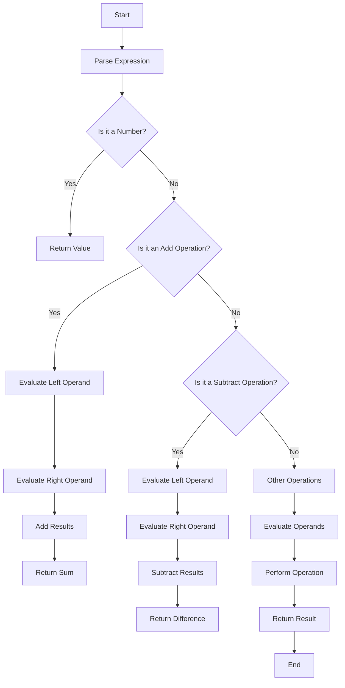

## 7.18 Designing Embedded Domain-Specific Languages (EDSLs)

Domain-Specific Languages (DSLs) are specialized languages tailored to a particular aspect of a software application. When these languages are embedded within a host language, they are referred to as Embedded Domain-Specific Languages (EDSLs). Scala, with its rich type system and functional programming capabilities, provides an excellent platform for designing EDSLs. In this section, we will explore the design and implementation of EDSLs in Scala, leveraging its powerful features like operator overloading, implicit classes, and higher-kinded types.

### Introduction to EDSLs

An EDSL is a subset of a programming language that is designed to solve problems in a specific domain. Unlike general-purpose programming languages, DSLs focus on a particular problem space, providing constructs that are more expressive and concise for that domain. EDSLs are implemented using the syntax and semantics of a host language, allowing developers to leverage existing language features and tools.

#### Benefits of EDSLs

- **Expressiveness**: EDSLs allow developers to express domain concepts more naturally and succinctly.
- **Abstraction**: They provide higher-level abstractions that hide the complexity of underlying implementations.
- **Maintainability**: By focusing on domain-specific concerns, EDSLs can make code easier to read and maintain.
- **Reusability**: EDSLs can be reused across different projects within the same domain.

#### Challenges of EDSLs

- **Complexity**: Designing an EDSL can introduce complexity, especially if it requires significant language extensions.
- **Performance**: The abstraction layers in EDSLs can sometimes lead to performance overhead.
- **Learning Curve**: Developers need to learn the new language constructs introduced by the EDSL.

### Leveraging Scala Features for EDSLs

Scala's features make it an ideal choice for creating EDSLs. Let's explore some of these features and how they can be used effectively.

#### Operator Overloading

Scala allows operators to be overloaded, enabling developers to define custom behavior for existing operators. This is particularly useful in EDSLs for creating intuitive and expressive syntax.

```scala
class Vector(val x: Double, val y: Double) {
  def +(other: Vector): Vector = new Vector(this.x + other.x, this.y + other.y)
  def -(other: Vector): Vector = new Vector(this.x - other.x, this.y - other.y)
  override def toString: String = s"Vector($x, $y)"
}

val v1 = new Vector(1.0, 2.0)
val v2 = new Vector(3.0, 4.0)
val v3 = v1 + v2 // Using overloaded + operator
println(v3) // Output: Vector(4.0, 6.0)
```

#### Implicit Classes and Conversions

Implicit classes and conversions allow for the extension of existing types without modifying their source code. This feature is instrumental in creating EDSLs that feel native to the host language.

```scala
implicit class RichInt(val x: Int) extends AnyVal {
  def square: Int = x * x
}

val result = 5.square // Implicit conversion to RichInt
println(result) // Output: 25
```

#### Higher-Kinded Types

Higher-kinded types enable the creation of more generic and reusable abstractions, which are essential for building flexible EDSLs.

```scala
trait Functor[F[_]] {
  def map[A, B](fa: F[A])(f: A => B): F[B]
}

implicit val optionFunctor: Functor[Option] = new Functor[Option] {
  def map[A, B](fa: Option[A])(f: A => B): Option[B] = fa.map(f)
}

def lift[F[_]: Functor, A, B](f: A => B)(fa: F[A]): F[B] = {
  implicitly[Functor[F]].map(fa)(f)
}

val liftedOption = lift((x: Int) => x + 1)(Some(1))
println(liftedOption) // Output: Some(2)
```

### Pattern Matching and Custom Control Structures

Scala's pattern matching capabilities can be leveraged to create custom control structures, enhancing the expressiveness of EDSLs.

```scala
sealed trait Expr
case class Number(value: Int) extends Expr
case class Add(left: Expr, right: Expr) extends Expr
case class Multiply(left: Expr, right: Expr) extends Expr

def eval(expr: Expr): Int = expr match {
  case Number(value) => value
  case Add(left, right) => eval(left) + eval(right)
  case Multiply(left, right) => eval(left) * eval(right)
}

val expression = Add(Number(1), Multiply(Number(2), Number(3)))
println(eval(expression)) // Output: 7
```

### Case Studies

#### Building a DSL for Mathematical Expressions

Let's build a simple DSL for mathematical expressions using Scala's features. This DSL will allow users to define and evaluate expressions in a natural and intuitive way.

```scala
sealed trait Expr
case class Number(value: Double) extends Expr
case class Add(left: Expr, right: Expr) extends Expr
case class Subtract(left: Expr, right: Expr) extends Expr
case class Multiply(left: Expr, right: Expr) extends Expr
case class Divide(left: Expr, right: Expr) extends Expr

object MathDSL {
  def eval(expr: Expr): Double = expr match {
    case Number(value) => value
    case Add(left, right) => eval(left) + eval(right)
    case Subtract(left, right) => eval(left) - eval(right)
    case Multiply(left, right) => eval(left) * eval(right)
    case Divide(left, right) => eval(left) / eval(right)
  }
}

import MathDSL._

val expression = Add(Number(5), Multiply(Number(2), Number(3)))
println(eval(expression)) // Output: 11.0
```

#### Implementing Configuration Languages

Configuration languages are another common use case for EDSLs. They allow users to define application configurations in a structured and readable format.

```scala
case class Config(host: String, port: Int, useSSL: Boolean)

object ConfigDSL {
  def parse(configString: String): Config = {
    val lines = configString.split("\n")
    val host = lines.find(_.startsWith("host")).map(_.split("=")(1).trim).getOrElse("localhost")
    val port = lines.find(_.startsWith("port")).map(_.split("=")(1).trim.toInt).getOrElse(80)
    val useSSL = lines.find(_.startsWith("useSSL")).map(_.split("=")(1).trim.toBoolean).getOrElse(false)
    Config(host, port, useSSL)
  }
}

val configString =
  """
    |host = example.com
    |port = 443
    |useSSL = true
  """.stripMargin

val config = ConfigDSL.parse(configString)
println(config) // Output: Config(example.com,443,true)
```

### Best Practices

#### Balancing Brevity and Clarity

When designing EDSLs, it's crucial to strike a balance between brevity and clarity. While concise syntax is desirable, it should not come at the expense of readability. Ensure that the EDSL syntax is intuitive and aligns with the domain concepts it represents.

#### Avoiding Common Pitfalls

- **Overcomplication**: Avoid making the EDSL overly complex. Focus on the core domain concepts and provide a minimal set of features that solve the problem effectively.
- **Performance Overhead**: Be mindful of the performance implications of the abstractions introduced by the EDSL. Optimize critical paths and avoid unnecessary computations.
- **Documentation**: Provide comprehensive documentation for the EDSL, including examples and use cases, to help users understand and adopt it effectively.

### Try It Yourself

Experiment with the code examples provided in this section. Try modifying the mathematical expression DSL to include additional operations like exponentiation or logarithms. For the configuration language, consider adding support for nested configurations or environment-specific overrides.

### Visualizing EDSL Design

To better understand the structure and flow of an EDSL, let's visualize the process of evaluating a mathematical expression using a flowchart.



### Knowledge Check

- What are the key benefits of using EDSLs in software development?
- How can Scala's implicit classes be used to extend existing types in an EDSL?
- Describe how higher-kinded types can enhance the flexibility of an EDSL.
- What are some common pitfalls to avoid when designing an EDSL?

### Embrace the Journey

Designing EDSLs is a rewarding endeavor that allows you to tailor solutions to specific domains, enhancing expressiveness and maintainability. Remember, this is just the beginning. As you progress, you'll build more complex and interactive EDSLs. Keep experimenting, stay curious, and enjoy the journey!

## Quiz Time!



### What is an EDSL?

- [x] An Embedded Domain-Specific Language
- [ ] An External Domain-Specific Language
- [ ] An Enterprise Domain-Specific Language
- [ ] An Enhanced Domain-Specific Language

> **Explanation:** An EDSL is an Embedded Domain-Specific Language, which is implemented within a host language.

### Which Scala feature allows for extending existing types without modifying their source code?

- [x] Implicit Classes
- [ ] Operator Overloading
- [ ] Higher-Kinded Types
- [ ] Pattern Matching

> **Explanation:** Implicit classes in Scala allow for extending existing types without modifying their source code.

### What is a common benefit of using EDSLs?

- [x] Increased expressiveness in domain-specific contexts
- [ ] Reduced performance overhead
- [ ] Simplified language syntax
- [ ] Enhanced general-purpose programming capabilities

> **Explanation:** EDSLs increase expressiveness in domain-specific contexts by providing constructs tailored to specific problems.

### Which feature is particularly useful for creating intuitive and expressive syntax in EDSLs?

- [x] Operator Overloading
- [ ] Pattern Matching
- [ ] Higher-Kinded Types
- [ ] Implicit Conversions

> **Explanation:** Operator overloading is useful for creating intuitive and expressive syntax in EDSLs.

### What is a potential challenge when designing an EDSL?

- [x] Introducing complexity
- [ ] Simplifying code maintenance
- [ ] Enhancing performance
- [ ] Reducing abstraction levels

> **Explanation:** Designing an EDSL can introduce complexity, especially if it requires significant language extensions.

### How can higher-kinded types benefit an EDSL?

- [x] By enabling generic and reusable abstractions
- [ ] By simplifying syntax
- [ ] By reducing type safety
- [ ] By enhancing performance

> **Explanation:** Higher-kinded types enable the creation of generic and reusable abstractions, which are essential for building flexible EDSLs.

### What is a common pitfall to avoid when designing an EDSL?

- [x] Overcomplication
- [ ] Underutilizing abstractions
- [ ] Simplifying syntax
- [ ] Enhancing performance

> **Explanation:** Overcomplication is a common pitfall to avoid when designing an EDSL, as it can make the language difficult to use and understand.

### What is a key consideration for balancing brevity and clarity in an EDSL?

- [x] Ensuring the syntax is intuitive and aligns with domain concepts
- [ ] Reducing the number of language constructs
- [ ] Enhancing performance
- [ ] Simplifying syntax

> **Explanation:** Ensuring the syntax is intuitive and aligns with domain concepts is key to balancing brevity and clarity in an EDSL.

### Which Scala feature allows for creating custom control structures in an EDSL?

- [x] Pattern Matching
- [ ] Operator Overloading
- [ ] Implicit Classes
- [ ] Higher-Kinded Types

> **Explanation:** Pattern matching in Scala can be used to create custom control structures, enhancing the expressiveness of EDSLs.

### True or False: EDSLs are always more performant than general-purpose languages.

- [ ] True
- [x] False

> **Explanation:** EDSLs can introduce performance overhead due to abstraction layers, and they are not always more performant than general-purpose languages.


