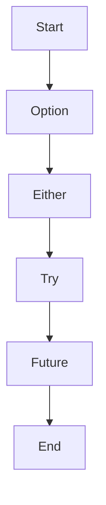

## 7.2 Monads in Scala

Monads are a powerful abstraction in functional programming, providing a way to handle computations that include context, such as optionality, failure, or asynchronicity. In Scala, monads are used extensively to manage side effects and control flow in a functional style. This section will delve into the most commonly used monads in Scala: `Option`, `Either`, `Try`, and `Future`. We will also explore how to create custom monads using for-comprehensions.

### Understanding Monads

Before diving into specific monads, let's clarify what a monad is. A monad is a design pattern used to handle program-wide concerns in a functional way. It provides a way to chain operations together, handling the context automatically. Monads must satisfy three laws:

1. **Left Identity**: Wrapping a value with `unit` and then applying `flatMap` with a function should be the same as applying the function directly.
2. **Right Identity**: Applying `flatMap` with `unit` should return the original monad.
3. **Associativity**: Chaining operations with `flatMap` should be associative.

These laws ensure that monads behave predictably and can be composed reliably.

### The `Option` Monad

The `Option` monad is used to represent optional values, providing a way to handle the absence of a value without resorting to null references. It can be either `Some(value)` or `None`.

#### Handling Optional Values Cleanly

Using `Option`, we can avoid null pointer exceptions and write cleaner code. Here's a simple example:

```scala
def findUserById(id: Int): Option[String] = {
  val users = Map(1 -> "Alice", 2 -> "Bob")
  users.get(id)
}

val userName = findUserById(1).getOrElse("Unknown User")
println(userName) // Output: Alice
```

In this example, `findUserById` returns an `Option[String]`. We use `getOrElse` to provide a default value if the user is not found.

#### For-Comprehensions with `Option`

For-comprehensions offer a concise way to work with monads. They allow us to chain operations while handling the context automatically:

```scala
val result = for {
  user <- findUserById(1)
  email <- findEmailByUser(user)
} yield email

println(result.getOrElse("No email found"))
```

Here, `findEmailByUser` is another function returning an `Option`. The for-comprehension chains these operations, yielding `None` if any step fails.

### The `Either` Monad

`Either` is used to represent a value of one of two possible types, commonly used for error handling. By convention, `Right` is used for success and `Left` for failure.

#### Managing Computations That Can Fail

`Either` is useful for computations that can fail, allowing us to return an error message or value:

```scala
def divide(a: Int, b: Int): Either[String, Int] = {
  if (b == 0) Left("Division by zero")
  else Right(a / b)
}

val result = divide(10, 2) match {
  case Right(value) => s"Result: $value"
  case Left(error) => s"Error: $error"
}

println(result) // Output: Result: 5
```

#### For-Comprehensions with `Either`

For-comprehensions simplify error handling by propagating the first `Left` encountered:

```scala
val result = for {
  x <- divide(10, 2)
  y <- divide(x, 0) // This will fail
} yield y

println(result.fold(identity, _.toString)) // Output: Division by zero
```

### The `Try` Monad

`Try` is designed to handle exceptions as values, encapsulating computations that may throw exceptions.

#### Exception Handling as Values

`Try` can be either `Success` or `Failure`, providing a way to work with exceptions functionally:

```scala
import scala.util.{Try, Success, Failure}

def parseNumber(s: String): Try[Int] = Try(s.toInt)

val result = parseNumber("123") match {
  case Success(value) => s"Parsed number: $value"
  case Failure(exception) => s"Failed to parse: ${exception.getMessage}"
}

println(result) // Output: Parsed number: 123
```

#### For-Comprehensions with `Try`

For-comprehensions allow us to chain operations that may fail, propagating exceptions:

```scala
val result = for {
  x <- parseNumber("123")
  y <- parseNumber("0")
  z <- Try(x / y) // This will fail
} yield z

println(result.getOrElse("Computation failed")) // Output: Computation failed
```

### The `Future` Monad

`Future` is used for handling asynchronous computations, allowing us to work with operations that will complete in the future.

#### Composing Asynchronous Operations

`Future` provides a way to compose asynchronous operations without blocking:

```scala
import scala.concurrent.Future
import scala.concurrent.ExecutionContext.Implicits.global

def fetchDataFromServer(): Future[String] = Future {
  // Simulate a long-running operation
  Thread.sleep(1000)
  "Data from server"
}

val result = fetchDataFromServer().map(data => s"Received: $data")
result.foreach(println) // Output: Received: Data from server
```

#### For-Comprehensions with `Future`

For-comprehensions allow us to compose multiple asynchronous operations:

```scala
val result = for {
  data1 <- fetchDataFromServer()
  data2 <- fetchDataFromServer()
} yield s"Combined data: $data1 and $data2"

result.foreach(println)
```

### Custom Monads with For-Comprehensions

Scala's for-comprehensions can be used to craft custom monads, allowing us to define domain-specific computation flows.

#### Crafting Domain-Specific Computation Flows

To create a custom monad, we need to define `map`, `flatMap`, and `withFilter` methods. Here's a simple example:

```scala
case class Box[A](value: A) {
  def map[B](f: A => B): Box[B] = Box(f(value))
  def flatMap[B](f: A => Box[B]): Box[B] = f(value)
  def withFilter(p: A => Boolean): Box[A] = if (p(value)) this else Box(value)
}

val result = for {
  x <- Box(10)
  y <- Box(20)
} yield x + y

println(result) // Output: Box(30)
```

### Visualizing Monad Operations

To better understand how monads work, let's visualize the flow of operations using a simple diagram.



This diagram illustrates the flow from one monad to another, showing how each handles different contexts.

### Design Considerations

When using monads, consider the following:

- **Context Management**: Monads encapsulate context, making it easier to manage side effects.
- **Error Propagation**: Monads like `Either` and `Try` automatically propagate errors, simplifying error handling.
- **Asynchronous Composition**: `Future` allows for non-blocking operations, improving performance in concurrent applications.

### Differences and Similarities

Monads often serve similar purposes but differ in their context:

- **Option vs. Either**: `Option` is simpler, representing presence or absence, while `Either` provides more information with `Left` and `Right`.
- **Try vs. Either**: `Try` is specifically for exception handling, while `Either` can represent any two types.
- **Future**: Unlike the others, `Future` handles asynchronicity, making it suitable for concurrent tasks.

### Try It Yourself

Experiment with the code examples provided. Try modifying them to see how different monads handle various scenarios. For instance, change the input values in the `divide` function to test error handling with `Either`.

### Knowledge Check

- What is the primary purpose of a monad in functional programming?
- How does `Option` differ from `Either` in handling optional values?
- Explain how `Try` can be used to handle exceptions as values.
- How does `Future` enable asynchronous programming in Scala?
- What are the key methods required to define a custom monad?

### Embrace the Journey

Remember, mastering monads is a journey. As you continue to explore Scala's functional capabilities, you'll find monads to be an invaluable tool in your programming arsenal. Keep experimenting, stay curious, and enjoy the journey!

## Quiz Time!



### What is a monad primarily used for in functional programming?

- [x] Handling computations with context
- [ ] Managing memory allocation
- [ ] Optimizing performance
- [ ] Simplifying syntax

> **Explanation:** Monads are used to handle computations that include context, such as optionality, failure, or asynchronicity.

### Which monad is best suited for handling optional values in Scala?

- [x] Option
- [ ] Either
- [ ] Try
- [ ] Future

> **Explanation:** The `Option` monad is specifically designed to handle optional values, representing either a value (`Some`) or no value (`None`).

### How does the `Either` monad differ from `Option`?

- [x] `Either` can represent two types, typically success and failure
- [ ] `Either` is used for asynchronous operations
- [ ] `Either` is only for handling exceptions
- [ ] `Either` is a subtype of `Option`

> **Explanation:** `Either` can represent a value of one of two possible types, commonly used for error handling with `Right` for success and `Left` for failure.

### What is the purpose of the `Try` monad?

- [x] Handling exceptions as values
- [ ] Managing asynchronous operations
- [ ] Optimizing memory usage
- [ ] Simplifying syntax

> **Explanation:** The `Try` monad is designed to handle exceptions as values, encapsulating computations that may throw exceptions.

### How does `Future` enable asynchronous programming in Scala?

- [x] By allowing non-blocking operations
- [ ] By simplifying syntax
- [ ] By managing memory allocation
- [ ] By optimizing performance

> **Explanation:** `Future` provides a way to compose asynchronous operations without blocking, making it suitable for concurrent tasks.

### What are the key methods required to define a custom monad?

- [x] map, flatMap, withFilter
- [ ] add, subtract, multiply
- [ ] open, close, read
- [ ] start, stop, pause

> **Explanation:** To create a custom monad, you need to define `map`, `flatMap`, and `withFilter` methods.

### Which monad is specifically designed for exception handling?

- [x] Try
- [ ] Option
- [ ] Either
- [ ] Future

> **Explanation:** The `Try` monad is specifically designed for handling exceptions as values.

### What is the associativity law in monads?

- [x] Chaining operations with `flatMap` should be associative
- [ ] Wrapping a value with `unit` and then applying `flatMap` should be the same as applying the function directly
- [ ] Applying `flatMap` with `unit` should return the original monad
- [ ] None of the above

> **Explanation:** The associativity law states that chaining operations with `flatMap` should be associative.

### How can for-comprehensions be used with monads?

- [x] To chain operations while handling context automatically
- [ ] To manage memory allocation
- [ ] To optimize performance
- [ ] To simplify syntax

> **Explanation:** For-comprehensions offer a concise way to work with monads, allowing us to chain operations while handling the context automatically.

### True or False: `Future` is used for handling optional values in Scala.

- [ ] True
- [x] False

> **Explanation:** `Future` is used for handling asynchronous computations, not for handling optional values.


