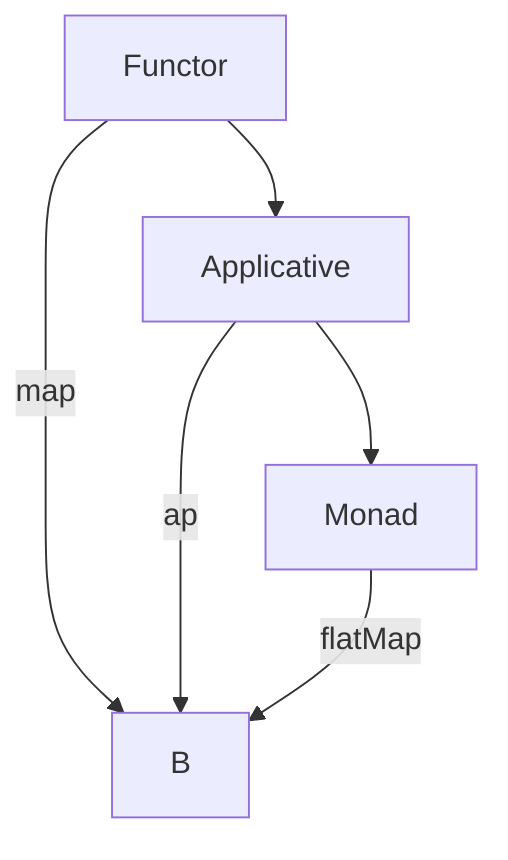

## 7.3 Functors, Applicatives, and Monads

In the realm of functional programming, Functors, Applicatives, and Monads are fundamental concepts that allow developers to apply functions in computational contexts. These abstractions provide powerful tools for managing side effects, handling asynchronous operations, and composing complex computations. In this section, we will delve into each of these concepts, explore their relationships, and demonstrate their application in Scala.

### Understanding the Hierarchy and Relationships

Before we dive into each concept, it's crucial to understand the hierarchy and relationships between Functors, Applicatives, and Monads. These abstractions form a hierarchy where each level builds upon the previous one:

1. **Functor**: The most basic abstraction, allowing you to apply a function to a wrapped value.
2. **Applicative**: Extends Functor by allowing functions that are themselves wrapped to be applied to wrapped values.
3. **Monad**: Builds on Applicative by allowing the chaining of operations that produce wrapped values.

Let's explore each of these abstractions in detail.

### Functors

#### Definition and Intent

A Functor is a type class that represents a computational context in which you can apply a function to a value inside a context. The primary operation of a Functor is `map`, which applies a function to the wrapped value.

#### Key Participants

- **Type Constructor**: A type that takes another type as a parameter (e.g., `List`, `Option`).
- **`map` Function**: A function that applies a given function to the value inside the context.

#### Applicability

Use Functors when you need to apply a function to a value that is wrapped in a context, such as a list or an option.

#### Sample Code Snippet

```scala
// Define a Functor trait
trait Functor[F[_]] {
  def map[A, B](fa: F[A])(f: A => B): F[B]
}

// Implement Functor for Option
implicit val optionFunctor: Functor[Option] = new Functor[Option] {
  def map[A, B](fa: Option[A])(f: A => B): Option[B] = fa match {
    case Some(value) => Some(f(value))
    case None => None
  }
}

// Example usage
val optionValue: Option[Int] = Some(2)
val incrementedValue: Option[Int] = optionFunctor.map(optionValue)(_ + 1)
println(incrementedValue) // Output: Some(3)
```

#### Design Considerations

- **Immutability**: Ensure that the context remains immutable when applying functions.
- **Consistency**: The `map` operation should not alter the structure of the context, only the values inside it.

#### Differences and Similarities

- **Similar to Applicatives**: Both allow function application, but Applicatives can apply functions that are themselves wrapped.
- **Different from Monads**: Functors do not allow chaining of operations that produce wrapped values.

### Applicatives

#### Definition and Intent

An Applicative is a type class that extends Functor by allowing you to apply functions that are themselves wrapped in a context to values in a context. The primary operations are `pure` and `ap`.

#### Key Participants

- **`pure` Function**: Lifts a value into the context.
- **`ap` Function**: Applies a wrapped function to a wrapped value.

#### Applicability

Use Applicatives when you need to apply functions that are wrapped in a context to values in a context.

#### Sample Code Snippet

```scala
// Define an Applicative trait
trait Applicative[F[_]] extends Functor[F] {
  def pure[A](a: A): F[A]
  def ap[A, B](ff: F[A => B])(fa: F[A]): F[B]
}

// Implement Applicative for Option
implicit val optionApplicative: Applicative[Option] = new Applicative[Option] {
  def pure[A](a: A): Option[A] = Some(a)
  
  def map[A, B](fa: Option[A])(f: A => B): Option[B] = fa match {
    case Some(value) => Some(f(value))
    case None => None
  }

  def ap[A, B](ff: Option[A => B])(fa: Option[A]): Option[B] = (ff, fa) match {
    case (Some(f), Some(a)) => Some(f(a))
    case _ => None
  }
}

// Example usage
val optionFunc: Option[Int => Int] = Some(_ * 2)
val optionValue: Option[Int] = Some(3)
val result: Option[Int] = optionApplicative.ap(optionFunc)(optionValue)
println(result) // Output: Some(6)
```

#### Design Considerations

- **Composability**: Applicatives allow for more composability than Functors by enabling the application of wrapped functions.
- **Parallelism**: Applicatives can be used to model computations that can be performed in parallel, unlike Monads which are inherently sequential.

#### Differences and Similarities

- **Similar to Functors**: Both allow function application, but Applicatives extend this capability to wrapped functions.
- **Different from Monads**: Applicatives do not allow chaining of operations that produce wrapped values.

### Monads

#### Definition and Intent

A Monad is a type class that extends Applicative by allowing you to chain operations that produce wrapped values. The primary operations are `flatMap` (or `bind`) and `pure`.

#### Key Participants

- **`flatMap` Function**: Chains operations that produce wrapped values.
- **`pure` Function**: Lifts a value into the context (inherited from Applicative).

#### Applicability

Use Monads when you need to chain operations that produce wrapped values, such as handling asynchronous computations or managing side effects.

#### Sample Code Snippet

```scala
// Define a Monad trait
trait Monad[F[_]] extends Applicative[F] {
  def flatMap[A, B](fa: F[A])(f: A => F[B]): F[B]
}

// Implement Monad for Option
implicit val optionMonad: Monad[Option] = new Monad[Option] {
  def pure[A](a: A): Option[A] = Some(a)

  def map[A, B](fa: Option[A])(f: A => B): Option[B] = fa match {
    case Some(value) => Some(f(value))
    case None => None
  }

  def ap[A, B](ff: Option[A => B])(fa: Option[A]): Option[B] = (ff, fa) match {
    case (Some(f), Some(a)) => Some(f(a))
    case _ => None
  }

  def flatMap[A, B](fa: Option[A])(f: A => Option[B]): Option[B] = fa match {
    case Some(value) => f(value)
    case None => None
  }
}

// Example usage
val optionValue: Option[Int] = Some(5)
val result: Option[Int] = optionMonad.flatMap(optionValue)(x => Some(x * 2))
println(result) // Output: Some(10)
```

#### Design Considerations

- **Sequential Composition**: Monads allow for sequential composition of operations, making them suitable for workflows that depend on the results of previous computations.
- **Error Handling**: Monads like `Option`, `Either`, and `Try` provide a way to handle errors in a functional style.

#### Differences and Similarities

- **Similar to Applicatives**: Both allow function application, but Monads extend this capability to chaining operations.
- **Different from Functors**: Monads allow chaining of operations, while Functors only allow function application.

### Visualizing the Relationships

To better understand the relationships between Functors, Applicatives, and Monads, let's visualize them using a diagram.



**Diagram Description**: This diagram illustrates the hierarchy of Functors, Applicatives, and Monads. Each level builds upon the previous one, with Functors providing the `map` operation, Applicatives adding the `ap` operation, and Monads introducing `flatMap`.

### Practical Applications in Scala

#### Handling Optional Values with Option

One of the most common use cases for Functors, Applicatives, and Monads in Scala is handling optional values with the `Option` type. By leveraging these abstractions, you can write concise and expressive code for dealing with optional data.

```scala
val optionValue: Option[Int] = Some(10)

// Using Functor
val incremented: Option[Int] = optionValue.map(_ + 1)

// Using Applicative
val multiplyFunc: Option[Int => Int] = Some(_ * 2)
val multiplied: Option[Int] = optionApplicative.ap(multiplyFunc)(optionValue)

// Using Monad
val doubled: Option[Int] = optionMonad.flatMap(optionValue)(x => Some(x * 2))

println(incremented) // Output: Some(11)
println(multiplied)  // Output: Some(20)
println(doubled)     // Output: Some(20)
```

#### Managing Asynchronous Computations with Future

Another practical application is managing asynchronous computations with the `Future` type. Monads provide a powerful way to compose asynchronous operations.

```scala
import scala.concurrent.Future
import scala.concurrent.ExecutionContext.Implicits.global

val futureValue: Future[Int] = Future(5)

// Using Functor
val incrementedFuture: Future[Int] = futureValue.map(_ + 1)

// Using Monad
val doubledFuture: Future[Int] = futureValue.flatMap(x => Future(x * 2))

incrementedFuture.foreach(println) // Output: 6
doubledFuture.foreach(println)     // Output: 10
```

### Try It Yourself

To deepen your understanding of Functors, Applicatives, and Monads, try modifying the code examples above. Experiment with different contexts, such as `List` or `Either`, and observe how these abstractions simplify complex operations.

### Knowledge Check

- **Question**: What is the primary operation of a Functor?
- **Question**: How does an Applicative extend the capabilities of a Functor?
- **Question**: Why are Monads suitable for chaining operations?

### Summary

In this section, we've explored the powerful abstractions of Functors, Applicatives, and Monads in Scala. These concepts provide a robust framework for applying functions in computational contexts, managing side effects, and composing complex workflows. By mastering these patterns, you can write more expressive and maintainable Scala code.

### Embrace the Journey

Remember, mastering Functors, Applicatives, and Monads is a journey. As you continue to explore these concepts, you'll discover new ways to leverage them in your Scala projects. Keep experimenting, stay curious, and enjoy the journey!

## Quiz Time!



### What is the primary operation of a Functor?

- [x] `map`
- [ ] `flatMap`
- [ ] `ap`
- [ ] `pure`

> **Explanation:** The primary operation of a Functor is `map`, which applies a function to a value inside a context.

### How does an Applicative extend the capabilities of a Functor?

- [x] By allowing functions that are themselves wrapped to be applied to wrapped values
- [ ] By allowing chaining of operations that produce wrapped values
- [ ] By providing a `flatMap` operation
- [ ] By introducing immutability

> **Explanation:** An Applicative extends a Functor by allowing functions that are themselves wrapped in a context to be applied to values in a context.

### Why are Monads suitable for chaining operations?

- [x] Because they provide a `flatMap` operation
- [ ] Because they allow parallel execution
- [ ] Because they are immutable
- [ ] Because they use `map` for function application

> **Explanation:** Monads are suitable for chaining operations because they provide a `flatMap` operation, which allows for sequential composition of operations that produce wrapped values.

### Which of the following is NOT a key participant in a Monad?

- [ ] `flatMap`
- [ ] `pure`
- [x] `ap`
- [ ] `map`

> **Explanation:** The `ap` function is not a key participant in a Monad; it is part of the Applicative type class.

### What is the purpose of the `pure` function in Applicatives?

- [x] To lift a value into the context
- [ ] To apply a function to a value inside a context
- [ ] To chain operations that produce wrapped values
- [ ] To handle errors in a functional style

> **Explanation:** The `pure` function in Applicatives is used to lift a value into the context.

### Which abstraction allows for parallelism in computations?

- [x] Applicative
- [ ] Functor
- [ ] Monad
- [ ] None of the above

> **Explanation:** Applicatives can model computations that can be performed in parallel, unlike Monads which are inherently sequential.

### What operation does a Functor provide that a Monad does not?

- [ ] `flatMap`
- [ ] `pure`
- [x] None, Monads provide all Functor operations
- [ ] `ap`

> **Explanation:** Monads provide all Functor operations, including `map`.

### Which abstraction is most suitable for handling optional values?

- [ ] Applicative
- [ ] Functor
- [x] Monad
- [ ] None of the above

> **Explanation:** Monads are most suitable for handling optional values, as they allow chaining of operations that may produce `None`.

### What is the primary benefit of using Monads for asynchronous computations?

- [x] They allow for sequential composition of asynchronous operations
- [ ] They enable parallel execution
- [ ] They provide immutability
- [ ] They simplify error handling

> **Explanation:** The primary benefit of using Monads for asynchronous computations is that they allow for sequential composition of asynchronous operations.

### True or False: Functors, Applicatives, and Monads are specific to Scala.

- [ ] True
- [x] False

> **Explanation:** Functors, Applicatives, and Monads are not specific to Scala; they are fundamental concepts in functional programming and are used in many programming languages.




