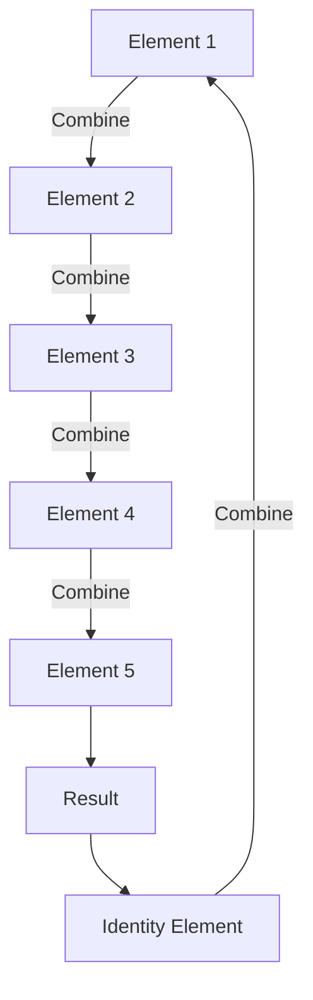

## 7.4 Monoid Pattern

In this section, we delve into the Monoid Pattern, a fundamental concept in functional programming that provides a powerful abstraction for combining elements with an associative operation. We will explore how to implement monoids in Scala using the Cats library, and understand their significance in building robust, scalable applications.

### Introduction to Monoids

#### What is a Monoid?

A **Monoid** is an algebraic structure with a single associative binary operation and an identity element. In simpler terms, a monoid is a way to combine elements together in a consistent manner. The concept of monoids is widely used in functional programming to abstract and simplify operations on data structures.

#### Key Characteristics of Monoids

1. **Associativity**: The operation must be associative, meaning that the order in which operations are performed does not affect the result. For example, in addition, `(a + b) + c` is the same as `a + (b + c)`.

2. **Identity Element**: There must be an identity element that, when combined with any other element, returns the other element unchanged. For addition, the identity element is `0`, since `a + 0 = a`.

#### Examples of Monoids

- **Addition of Integers**: The operation is addition (`+`), and the identity element is `0`.
- **Multiplication of Integers**: The operation is multiplication (`*`), and the identity element is `1`.
- **String Concatenation**: The operation is concatenation, and the identity element is the empty string `""`.

### Implementing Monoids in Scala

Scala, with its strong type system and functional programming capabilities, is well-suited for implementing monoids. We will use the Cats library, a popular functional programming library for Scala, to demonstrate how to define and use monoids.

#### Setting Up Cats

To use Cats in your Scala project, add the following dependency to your `build.sbt` file:

```scala
libraryDependencies += "org.typelevel" %% "cats-core" % "2.6.1"
```

#### Defining a Monoid

In Cats, a monoid is defined by extending the `Monoid` trait. Let's define a simple monoid for integer addition:

```scala
import cats.Monoid

object IntAdditionMonoid extends Monoid[Int] {
  def combine(x: Int, y: Int): Int = x + y
  def empty: Int = 0
}
```

- **`combine` Method**: This method defines the associative operation. In this case, it is integer addition.
- **`empty` Method**: This method returns the identity element, which is `0` for addition.

#### Using the Monoid

Once a monoid is defined, you can use it to combine elements. Here's an example of using the `IntAdditionMonoid`:

```scala
val numbers = List(1, 2, 3, 4, 5)
val sum = numbers.foldLeft(IntAdditionMonoid.empty)(IntAdditionMonoid.combine)
println(s"The sum is: $sum") // Output: The sum is: 15
```

### Monoids in Cats

Cats provides a rich set of predefined monoids for various data types, making it easy to work with common operations.

#### Predefined Monoids

Cats includes monoids for basic data types such as `Int`, `String`, and `List`. Here's how you can use them:

```scala
import cats.implicits._

val intSum = Monoid[Int].combine(1, 2)
println(s"Int Sum: $intSum") // Output: Int Sum: 3

val stringConcat = Monoid[String].combine("Hello, ", "World!")
println(s"String Concatenation: $stringConcat") // Output: String Concatenation: Hello, World!

val listConcat = Monoid[List[Int]].combine(List(1, 2), List(3, 4))
println(s"List Concatenation: $listConcat") // Output: List Concatenation: List(1, 2, 3, 4)
```

#### Custom Monoids

You can also define custom monoids for your own data types. Let's define a monoid for a `Person` class that combines names and ages:

```scala
case class Person(name: String, age: Int)

implicit val personMonoid: Monoid[Person] = new Monoid[Person] {
  def combine(p1: Person, p2: Person): Person = 
    Person(p1.name + " & " + p2.name, p1.age + p2.age)
  
  def empty: Person = Person("", 0)
}

val person1 = Person("Alice", 30)
val person2 = Person("Bob", 25)
val combinedPerson = person1 |+| person2
println(s"Combined Person: $combinedPerson") // Output: Combined Person: Person(Alice & Bob, 55)
```

### Visualizing Monoids

To better understand how monoids work, let's visualize the process of combining elements using a monoid.



**Diagram Description**: This diagram illustrates the process of combining elements using a monoid. Each element is combined with the next, and the result is combined with the identity element to demonstrate the associative property.

### Applicability of Monoids

Monoids are applicable in a wide range of scenarios, particularly in functional programming and data processing. Here are some common use cases:

1. **Data Aggregation**: Monoids are ideal for aggregating data, such as summing numbers or concatenating strings.

2. **Parallel Processing**: The associative property of monoids makes them suitable for parallel processing, as elements can be combined in any order.

3. **Reducing Complexity**: By abstracting the combination logic, monoids reduce complexity and improve code readability.

### Design Considerations

When using monoids, consider the following design considerations:

- **Associativity**: Ensure that the operation is truly associative, as this is a fundamental requirement for monoids.

- **Identity Element**: Define a meaningful identity element that does not alter the result when combined with other elements.

- **Performance**: Consider the performance implications of the combine operation, especially for large data sets.

### Differences and Similarities with Other Patterns

Monoids are often compared to other algebraic structures, such as semigroups and groups. Here's how they differ:

- **Semigroup**: A semigroup is similar to a monoid but lacks an identity element. Every monoid is a semigroup, but not every semigroup is a monoid.

- **Group**: A group extends a monoid by adding an inverse element for each element, allowing for "undoing" the operation. Not all monoids are groups.

### Try It Yourself

To deepen your understanding of monoids, try modifying the code examples provided. Here are some suggestions:

- Create a monoid for a custom data type, such as a `Product` class with fields for name and price.
- Experiment with different combine operations, such as multiplication or subtraction.
- Use monoids to aggregate data from a large collection, and observe the performance benefits.

### Conclusion

The Monoid Pattern is a powerful abstraction in functional programming that simplifies the process of combining elements. By leveraging the Cats library in Scala, you can easily define and use monoids to build robust, scalable applications. Remember, this is just the beginning. As you progress, you'll discover more advanced patterns and techniques that will enhance your functional programming skills.

## Quiz Time!



### What is a monoid?

- [x] An algebraic structure with an associative operation and an identity element.
- [ ] A data structure with a fixed size.
- [ ] A type of loop in programming.
- [ ] A method for sorting data.

> **Explanation:** A monoid is defined by its associative operation and identity element, making it a fundamental concept in algebra and functional programming.

### Which of the following is an example of a monoid?

- [x] Integer addition with 0 as the identity element.
- [ ] Integer subtraction with 0 as the identity element.
- [ ] String reversal with an empty string as the identity element.
- [ ] List removal with an empty list as the identity element.

> **Explanation:** Integer addition is a monoid because it satisfies both associativity and has 0 as the identity element.

### What is the identity element for string concatenation?

- [x] An empty string `""`.
- [ ] A space `" "`.
- [ ] A null value.
- [ ] A newline character `"\n"`.

> **Explanation:** The identity element for string concatenation is an empty string, as concatenating it with any other string leaves the other string unchanged.

### How does Cats define a monoid?

- [x] By extending the `Monoid` trait and implementing `combine` and `empty` methods.
- [ ] By creating a new class with a `combine` method.
- [ ] By using a `for` loop to iterate over elements.
- [ ] By defining a `case class` with a `combine` method.

> **Explanation:** In Cats, a monoid is defined by extending the `Monoid` trait and providing implementations for the `combine` and `empty` methods.

### What is the purpose of the `combine` method in a monoid?

- [x] To define the associative operation for combining elements.
- [ ] To initialize a new data structure.
- [ ] To sort elements in a collection.
- [ ] To filter elements based on a condition.

> **Explanation:** The `combine` method defines how two elements are combined in a monoid, ensuring the operation is associative.

### Which library is commonly used in Scala for functional programming and monoids?

- [x] Cats
- [ ] Akka
- [ ] Play Framework
- [ ] Spark

> **Explanation:** Cats is a popular library in Scala for functional programming, providing tools for working with monoids and other algebraic structures.

### What is a key benefit of using monoids in parallel processing?

- [x] Their associative property allows elements to be combined in any order.
- [ ] They require less memory than other data structures.
- [ ] They automatically parallelize computations.
- [ ] They eliminate the need for synchronization.

> **Explanation:** The associative property of monoids allows elements to be combined in any order, making them suitable for parallel processing.

### What is a semigroup?

- [x] An algebraic structure with an associative operation but no identity element.
- [ ] A group with an inverse element.
- [ ] A monoid with a fixed size.
- [ ] A data structure for sorting elements.

> **Explanation:** A semigroup is similar to a monoid but lacks an identity element, making it a simpler algebraic structure.

### Can a monoid be used for data aggregation?

- [x] Yes
- [ ] No

> **Explanation:** Monoids are ideal for data aggregation, as they provide a consistent way to combine elements.

### What is the identity element for integer multiplication?

- [x] 1
- [ ] 0
- [ ] -1
- [ ] Infinity

> **Explanation:** The identity element for integer multiplication is 1, as multiplying any number by 1 leaves the number unchanged.


