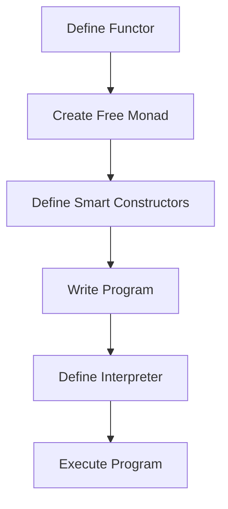
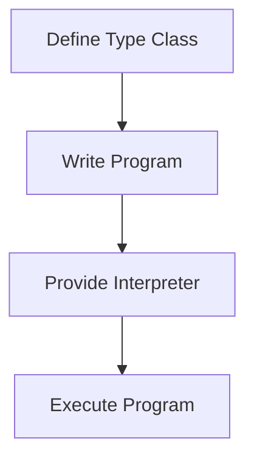

## 7.5 Free Monads and Tagless Final

In the realm of functional programming, the concepts of Free Monads and Tagless Final are pivotal for building modular, composable, and highly abstracted code. These patterns allow developers to separate concerns, enhance code reusability, and manage effects in a purely functional way. In this section, we will delve into these concepts, understand their implementation, and explore practical applications in Scala.

### Understanding Free Monads

#### What Are Free Monads?

Free Monads are a powerful abstraction that allows developers to construct complex computations in a modular and composable manner. They provide a way to represent computations as data, enabling the separation of program description from execution. This separation allows for greater flexibility, as the same description can be interpreted in different ways.

#### Key Concepts

- **Monads**: A Monad is a design pattern used to handle computations as a series of steps. It encapsulates values and provides a way to chain operations on these values.
- **Free Monad**: A Free Monad is a Monad that is constructed from a functor. It allows you to build a computation without specifying how it will be executed.

#### Why Use Free Monads?

Free Monads are particularly useful in scenarios where you want to decouple the description of a computation from its execution. This can be beneficial in:

- **Testing**: By separating the computation from its execution, you can easily test the logic without executing side effects.
- **Interpreters**: You can create multiple interpreters for the same computation, allowing you to execute it in different contexts (e.g., synchronous vs. asynchronous).

#### Implementing Free Monads in Scala

Let's explore how to implement Free Monads in Scala with a simple example.

```scala
// Define a functor for a simple DSL
sealed trait Console[A]
case class PrintLine(line: String) extends Console[Unit]
case class ReadLine() extends Console[String]

// Define a Free Monad
import cats.free.Free
import cats.free.Free.liftF

type ConsoleFree[A] = Free[Console, A]

// Smart constructors
def printLine(line: String): ConsoleFree[Unit] = liftF(PrintLine(line))
def readLine(): ConsoleFree[String] = liftF(ReadLine())

// Program using the Free Monad
def program: ConsoleFree[Unit] = for {
  _ <- printLine("What's your name?")
  name <- readLine()
  _ <- printLine(s"Hello, $name!")
} yield ()

// Interpreter for the Free Monad
import cats.~>
import scala.io.StdIn

val interpreter: Console ~> Id = new (Console ~> Id) {
  def apply[A](fa: Console[A]): Id[A] = fa match {
    case PrintLine(line) => println(line)
    case ReadLine() => StdIn.readLine()
  }
}

// Running the program
import cats.Id
program.foldMap(interpreter)
```

In this example, we define a simple DSL for console operations using a Free Monad. The `Console` trait represents the operations, and the `ConsoleFree` type alias represents the Free Monad. We then define smart constructors for the operations and create a simple program that reads a name from the console and greets the user. Finally, we define an interpreter that executes the program by mapping the operations to actual console I/O.

#### Visualizing Free Monads

To better understand the flow of Free Monads, let's visualize the process using a diagram.



This diagram illustrates the steps involved in using Free Monads: defining a functor, creating a Free Monad, defining smart constructors, writing a program, defining an interpreter, and executing the program.

### Implementing Tagless Final Encodings

#### What is Tagless Final?

Tagless Final is an alternative approach to Free Monads for representing computations. It uses type classes and higher-kinded types to achieve similar goals but with different trade-offs. In Tagless Final, computations are described using polymorphic functions, and interpreters are provided as implementations of these functions.

#### Key Concepts

- **Type Classes**: A type class is a way to define behavior that can be implemented by different types.
- **Higher-Kinded Types**: These are types that take other types as parameters, allowing for more abstract and flexible code.

#### Why Use Tagless Final?

Tagless Final offers several advantages over Free Monads:

- **Performance**: Tagless Final can be more performant because it avoids the overhead of constructing and interpreting a data structure.
- **Flexibility**: It allows for more flexible and composable code by leveraging Scala's type system.

#### Implementing Tagless Final in Scala

Let's implement a similar console program using Tagless Final.

```scala
// Define a type class for console operations
trait Console[F[_]] {
  def printLine(line: String): F[Unit]
  def readLine(): F[String]
}

// Program using Tagless Final
def program[F[_]: Console]: F[Unit] = {
  val console = implicitly[Console[F]]
  import console._
  for {
    _ <- printLine("What's your name?")
    name <- readLine()
    _ <- printLine(s"Hello, $name!")
  } yield ()
}

// Interpreter for the Console type class
implicit val consoleInterpreter: Console[Id] = new Console[Id] {
  def printLine(line: String): Id[Unit] = println(line)
  def readLine(): Id[String] = scala.io.StdIn.readLine()
}

// Running the program
program[Id]
```

In this example, we define a `Console` type class that represents console operations. The `program` function describes the computation using the type class. We then provide an interpreter for the `Console` type class and execute the program.

#### Visualizing Tagless Final

Let's visualize the Tagless Final approach using a diagram.



This diagram illustrates the steps involved in using Tagless Final: defining a type class, writing a program, providing an interpreter, and executing the program.

### Practical Applications in Scala

#### When to Use Free Monads vs. Tagless Final

Both Free Monads and Tagless Final have their strengths and weaknesses. The choice between them depends on the specific requirements of your application.

- **Free Monads**: Use Free Monads when you need to separate the description of a computation from its execution, especially if you need multiple interpreters or want to test the logic independently of side effects.
- **Tagless Final**: Use Tagless Final when performance is a concern, or when you want to leverage Scala's type system for more flexible and composable code.

#### Combining Free Monads and Tagless Final

In some cases, you may want to combine both approaches to take advantage of their respective strengths. For example, you can use Free Monads to define a high-level DSL and Tagless Final for low-level operations that require more performance.

#### Real-World Applications

- **Domain-Specific Languages (DSLs)**: Both Free Monads and Tagless Final are well-suited for building DSLs that separate the description of a domain from its execution.
- **Effect Management**: Use these patterns to manage side effects in a purely functional way, allowing for more predictable and testable code.
- **Modular and Composable Code**: By separating concerns and leveraging Scala's type system, you can build highly modular and composable applications.

### Design Considerations

When implementing Free Monads and Tagless Final, consider the following:

- **Complexity**: Both patterns introduce a level of abstraction that can increase complexity. Ensure that the benefits outweigh the costs in terms of code readability and maintainability.
- **Performance**: Tagless Final can offer better performance, but Free Monads provide more flexibility. Choose the approach that best aligns with your application's needs.
- **Interoperability**: Consider how these patterns will interact with other parts of your codebase, especially if you are integrating with existing systems.

### Differences and Similarities

While Free Monads and Tagless Final serve similar purposes, they have distinct differences:

- **Free Monads**: Focus on separating computation description from execution, allowing for multiple interpreters.
- **Tagless Final**: Focus on leveraging Scala's type system for more flexible and performant code.

Both patterns aim to achieve modularity, composability, and separation of concerns, but they do so through different mechanisms.

### Try It Yourself

To deepen your understanding of Free Monads and Tagless Final, try modifying the code examples provided:

- **Experiment with Different Interpreters**: Create additional interpreters for the Free Monad example, such as logging or testing interpreters.
- **Extend the DSL**: Add more operations to the DSL and see how they can be integrated into the existing framework.
- **Optimize with Tagless Final**: Refactor the Free Monad example using Tagless Final to compare performance and flexibility.

### Conclusion

Free Monads and Tagless Final are powerful patterns in functional programming that enable developers to build modular, composable, and highly abstracted code. By understanding and applying these patterns, you can create more flexible and maintainable Scala applications. Remember, this is just the beginning. As you progress, you'll build more complex and interactive systems. Keep experimenting, stay curious, and enjoy the journey!

## Quiz Time!



### What is a Free Monad?

- [x] A Monad constructed from a functor that allows building computations without specifying execution.
- [ ] A Monad that is always free to use without constraints.
- [ ] A Monad that only works with free software.
- [ ] A Monad that is used exclusively for asynchronous programming.

> **Explanation:** A Free Monad is a Monad constructed from a functor, allowing for the separation of computation description from execution.

### What is the main advantage of using Tagless Final over Free Monads?

- [x] Better performance due to avoiding data structure overhead.
- [ ] Easier to understand for beginners.
- [ ] Requires less code to implement.
- [ ] Automatically generates interpreters.

> **Explanation:** Tagless Final can be more performant because it avoids the overhead of constructing and interpreting a data structure.

### In the context of Free Monads, what is an interpreter?

- [x] A function or object that maps operations to actual implementations.
- [ ] A tool that translates Scala code into machine code.
- [ ] A library that provides free monads for Scala.
- [ ] A type class that defines monadic operations.

> **Explanation:** An interpreter maps the operations described by a Free Monad to actual implementations, allowing the computation to be executed.

### What is a key benefit of using Free Monads?

- [x] Decoupling the description of a computation from its execution.
- [ ] Automatically optimizing code for performance.
- [ ] Simplifying the syntax of Scala programs.
- [ ] Eliminating all side effects from a program.

> **Explanation:** Free Monads allow for the separation of computation description from execution, enabling flexibility and testability.

### How does Tagless Final achieve flexibility in code?

- [x] By using type classes and higher-kinded types.
- [ ] By relying on mutable state and side effects.
- [ ] By using global variables and singletons.
- [ ] By avoiding the use of any type system features.

> **Explanation:** Tagless Final uses type classes and higher-kinded types to achieve flexibility and composability in code.

### Which pattern is more suitable for performance-critical applications?

- [x] Tagless Final
- [ ] Free Monads
- [ ] Both are equally suitable
- [ ] Neither is suitable

> **Explanation:** Tagless Final is often more suitable for performance-critical applications due to its avoidance of data structure overhead.

### What is a common use case for Free Monads?

- [x] Building domain-specific languages (DSLs).
- [ ] Implementing low-level system programming.
- [ ] Writing imperative-style code.
- [ ] Managing global state in applications.

> **Explanation:** Free Monads are well-suited for building DSLs that separate the description of a domain from its execution.

### How can Free Monads and Tagless Final be combined?

- [x] Use Free Monads for high-level DSLs and Tagless Final for low-level operations.
- [ ] Use Tagless Final for high-level DSLs and Free Monads for low-level operations.
- [ ] They cannot be combined.
- [ ] Use both patterns interchangeably without any specific strategy.

> **Explanation:** Combining Free Monads for high-level DSLs and Tagless Final for low-level operations can leverage the strengths of both patterns.

### What is a potential downside of using Free Monads?

- [x] Increased complexity due to abstraction.
- [ ] Lack of support for side effects.
- [ ] Limited to synchronous programming.
- [ ] Incompatibility with Scala's type system.

> **Explanation:** Free Monads introduce a level of abstraction that can increase complexity, which may affect code readability and maintainability.

### True or False: Tagless Final relies on constructing and interpreting a data structure.

- [ ] True
- [x] False

> **Explanation:** Tagless Final does not rely on constructing and interpreting a data structure, which is one of its advantages over Free Monads.


