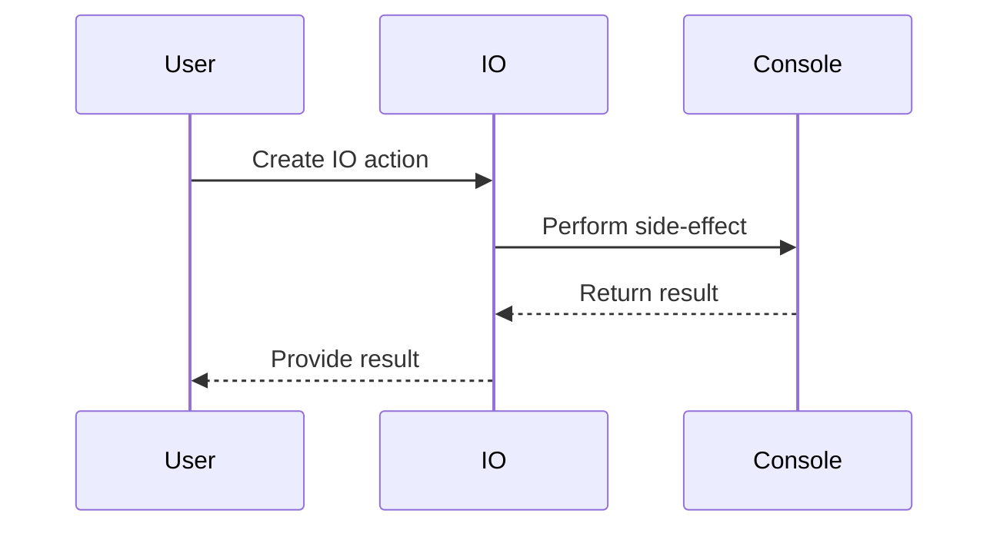

## 7.6 Effect Systems and Side-Effect Management

In the realm of functional programming, managing side-effects is crucial for maintaining the purity and composability of your code. Scala, with its robust type system and functional programming capabilities, offers powerful libraries like Cats Effect and ZIO to handle side-effects effectively. In this section, we will explore how these effect systems work, their underlying principles, and how they can be applied to build reliable, maintainable, and efficient applications.

### Understanding Side-Effects in Functional Programming

Before diving into effect systems, it's essential to understand what side-effects are and why they pose a challenge in functional programming. A side-effect occurs when a function interacts with the outside world or alters the state outside its scope. Common examples include:

- Modifying a global variable
- Performing I/O operations (e.g., reading from or writing to a file)
- Interacting with a database
- Sending a network request

In functional programming, we strive to write pure functions—functions that, given the same input, always produce the same output without altering any external state. Side-effects break this purity, making code harder to reason about, test, and maintain.

### Introducing Effect Systems

Effect systems provide a structured way to handle side-effects while preserving the benefits of functional programming. They encapsulate side-effects in a controlled manner, allowing you to compose and sequence effectful computations without executing them immediately. This deferred execution ensures that the effects are managed explicitly and predictably.

Two prominent effect systems in the Scala ecosystem are Cats Effect and ZIO. Both provide powerful abstractions for managing side-effects, but they have different design philosophies and features.

### Cats Effect

Cats Effect is a library built on top of the Cats library, which provides abstractions for functional programming in Scala. It introduces the `IO` monad, a powerful construct for encapsulating effectful computations.

#### The `IO` Monad

The `IO` monad represents a computation that performs side-effects. It is lazy, meaning that the computation is not executed until explicitly run. This laziness allows you to compose and transform `IO` values without triggering the side-effects.

Here's a simple example of using the `IO` monad:

```scala
import cats.effect.IO

// Define an IO action that prints a message
val sayHello: IO[Unit] = IO(println("Hello, world!"))

// Define another IO action that returns a value
val getNumber: IO[Int] = IO(42)

// Combine IO actions using flatMap
val combined: IO[Unit] = for {
  _ <- sayHello
  number <- getNumber
  _ <- IO(println(s"The number is $number"))
} yield ()

// Run the combined IO action
combined.unsafeRunSync()
```

In this example, `sayHello` and `getNumber` are `IO` actions that encapsulate side-effects. They are composed using a `for`-comprehension, and the combined action is executed using `unsafeRunSync()`. The `unsafeRunSync()` method is aptly named to remind you that running side-effects is inherently unsafe and should be done at the program's edge.

#### Key Features of Cats Effect

- **Concurrency**: Cats Effect provides powerful concurrency primitives like `Fiber`, which allows you to run computations concurrently and join their results.
- **Resource Management**: The `Resource` data type helps manage resources that need to be acquired and released, such as file handles or database connections.
- **Error Handling**: Cats Effect integrates seamlessly with Scala's error handling mechanisms, allowing you to handle exceptions in a functional way.

### ZIO

ZIO (ZIO Is an IO) is another effect system for Scala that provides a comprehensive set of tools for managing side-effects. It is designed to be highly performant and type-safe, offering a rich set of features for building robust applications.

#### The `ZIO` Type

At the core of ZIO is the `ZIO` type, which represents an effectful computation. It is parameterized by three types: `R`, `E`, and `A`, where:

- `R` is the environment required by the computation.
- `E` is the type of error that the computation can produce.
- `A` is the type of the result produced by the computation.

Here's a basic example of using ZIO:

```scala
import zio._

val sayHello: ZIO[Any, Nothing, Unit] = ZIO.succeed(println("Hello, ZIO!"))

val getNumber: ZIO[Any, Nothing, Int] = ZIO.succeed(42)

val combined: ZIO[Any, Nothing, Unit] = for {
  _ <- sayHello
  number <- getNumber
  _ <- ZIO.succeed(println(s"The number is $number"))
} yield ()

// Run the combined ZIO action
Runtime.default.unsafeRun(combined)
```

In this example, `sayHello` and `getNumber` are ZIO effects that encapsulate side-effects. They are composed using a `for`-comprehension, and the combined effect is executed using `Runtime.default.unsafeRun()`.

#### Key Features of ZIO

- **Type Safety**: ZIO's type parameters provide fine-grained control over the environment, errors, and results, enhancing type safety.
- **Concurrency**: ZIO offers powerful concurrency primitives, including fibers and supervisors, for managing concurrent computations.
- **Resource Management**: ZIO's `ZManaged` type provides a declarative way to manage resources, ensuring they are acquired and released safely.
- **Error Handling**: ZIO provides robust error handling capabilities, allowing you to model and recover from errors effectively.

### Implementing Effectful Computations in a Pure Way

Both Cats Effect and ZIO enable you to implement effectful computations in a pure way, maintaining the benefits of functional programming. Let's explore some common patterns and techniques for working with these effect systems.

#### Composing Effects

One of the strengths of effect systems is their ability to compose effects. You can combine multiple effectful computations into a single, larger computation using combinators like `map`, `flatMap`, and `for`-comprehensions.

Here's an example of composing effects with Cats Effect:

```scala
import cats.effect.IO

val readLine: IO[String] = IO(scala.io.StdIn.readLine())
val printLine: String => IO[Unit] = line => IO(println(line))

val echo: IO[Unit] = for {
  line <- readLine
  _ <- printLine(line)
} yield ()
```

And here's a similar example with ZIO:

```scala
import zio._

val readLine: ZIO[Any, Throwable, String] = ZIO.effect(scala.io.StdIn.readLine())
val printLine: String => ZIO[Any, Nothing, Unit] = line => ZIO.succeed(println(line))

val echo: ZIO[Any, Throwable, Unit] = for {
  line <- readLine
  _ <- printLine(line)
} yield ()
```

In both examples, `readLine` and `printLine` are effectful computations that are composed using a `for`-comprehension to create an `echo` effect that reads a line from the console and prints it back.

#### Managing Resources

Effect systems provide abstractions for managing resources that need to be acquired and released, such as file handles or database connections. This ensures that resources are properly cleaned up, even in the presence of errors.

Here's an example of managing resources with Cats Effect:

```scala
import cats.effect.{IO, Resource}
import scala.io.Source

def readFile(filePath: String): IO[String] = {
  val acquire = IO(Source.fromFile(filePath))
  val release = (source: Source) => IO(source.close())

  Resource.make(acquire)(release).use { source =>
    IO(source.getLines().mkString("\n"))
  }
}

val fileContent: IO[String] = readFile("example.txt")
fileContent.unsafeRunSync()
```

And here's a similar example with ZIO:

```scala
import zio._
import zio.blocking.Blocking
import scala.io.Source

def readFile(filePath: String): ZManaged[Blocking, Throwable, String] = {
  val acquire = ZIO.effect(Source.fromFile(filePath))
  val release = (source: Source) => ZIO.effectTotal(source.close())

  ZManaged.make(acquire)(release).mapM { source =>
    ZIO.effect(source.getLines().mkString("\n"))
  }
}

val fileContent: ZIO[Blocking, Throwable, String] = readFile("example.txt").use(ZIO.succeed)
Runtime.default.unsafeRun(fileContent)
```

In these examples, `Resource` in Cats Effect and `ZManaged` in ZIO are used to manage the lifecycle of a `Source` object, ensuring it is closed after use.

#### Handling Errors

Effect systems provide robust mechanisms for handling errors in a functional way. You can model errors using types and recover from them using combinators like `attempt`, `handleErrorWith`, and `catchAll`.

Here's an example of error handling with Cats Effect:

```scala
import cats.effect.IO

val riskyComputation: IO[Int] = IO(throw new RuntimeException("Oops!"))

val safeComputation: IO[Int] = riskyComputation.handleErrorWith { _ =>
  IO(0) // Fallback to a default value
}

println(safeComputation.unsafeRunSync()) // Prints 0
```

And here's a similar example with ZIO:

```scala
import zio._

val riskyComputation: ZIO[Any, Throwable, Int] = ZIO.fail(new RuntimeException("Oops!"))

val safeComputation: ZIO[Any, Nothing, Int] = riskyComputation.catchAll { _ =>
  ZIO.succeed(0) // Fallback to a default value
}

println(Runtime.default.unsafeRun(safeComputation)) // Prints 0
```

In these examples, `handleErrorWith` in Cats Effect and `catchAll` in ZIO are used to recover from errors by providing a fallback computation.

### Visualizing Effect Systems

To better understand how effect systems work, let's visualize the flow of effectful computations using a sequence diagram.



This diagram illustrates the interaction between a user, an `IO` action, and the console. The user creates an `IO` action, which performs a side-effect by interacting with the console. The result is then returned to the user.

### Try It Yourself

To deepen your understanding of effect systems, try modifying the code examples provided in this section. Here are some suggestions:

- **Experiment with Concurrency**: Use Cats Effect's `Fiber` or ZIO's `fork` to run computations concurrently. Observe how the results change when computations are run in parallel.
- **Handle Different Errors**: Introduce different types of errors in the computations and use the error handling combinators to recover from them.
- **Manage Different Resources**: Try managing different types of resources, such as network connections or database sessions, using `Resource` or `ZManaged`.

### Knowledge Check

- **What is a side-effect in functional programming, and why is it important to manage them?**
- **How does the `IO` monad in Cats Effect help in managing side-effects?**
- **What are the key differences between Cats Effect and ZIO?**
- **How can you compose multiple effectful computations in a pure way?**
- **What are some common patterns for managing resources with effect systems?**

### References and Further Reading

- [Cats Effect Documentation](https://typelevel.org/cats-effect/)
- [ZIO Documentation](https://zio.dev/)
- [Functional Programming in Scala](https://www.manning.com/books/functional-programming-in-scala)

### Conclusion

Effect systems like Cats Effect and ZIO provide powerful tools for managing side-effects in Scala applications. By encapsulating side-effects in a controlled manner, they enable you to write pure, composable, and maintainable code. As you continue to explore these libraries, you'll discover new patterns and techniques for building robust applications that leverage the full power of functional programming.

## Quiz Time!



### What is a side-effect in functional programming?

- [x] An interaction with the outside world or alteration of external state
- [ ] A function that returns a value
- [ ] A computation that is always pure
- [ ] A type of error in the program

> **Explanation:** A side-effect occurs when a function interacts with the outside world or alters the state outside its scope, breaking the purity of functional programming.

### Which library provides the `IO` monad in Scala?

- [x] Cats Effect
- [ ] ZIO
- [ ] Play Framework
- [ ] Akka

> **Explanation:** Cats Effect provides the `IO` monad, which is used to encapsulate effectful computations in Scala.

### What is the primary purpose of effect systems?

- [x] To manage side-effects in a controlled manner
- [ ] To improve performance of pure functions
- [ ] To simplify syntax
- [ ] To handle exceptions

> **Explanation:** Effect systems manage side-effects in a controlled manner, allowing you to compose and sequence effectful computations without executing them immediately.

### How does the `IO` monad in Cats Effect differ from a regular function?

- [x] It encapsulates side-effects and is lazy
- [ ] It executes immediately and is eager
- [ ] It cannot return a value
- [ ] It is only used for error handling

> **Explanation:** The `IO` monad encapsulates side-effects and is lazy, meaning that the computation is not executed until explicitly run.

### What are the key parameters of the `ZIO` type?

- [x] R, E, and A
- [ ] X, Y, and Z
- [ ] A, B, and C
- [ ] M, N, and O

> **Explanation:** The `ZIO` type is parameterized by `R` (environment), `E` (error), and `A` (result).

### How can you run an `IO` action in Cats Effect?

- [x] Using `unsafeRunSync()`
- [ ] Using `execute()`
- [ ] Using `run()`
- [ ] Using `start()`

> **Explanation:** You can run an `IO` action in Cats Effect using `unsafeRunSync()`, which executes the side-effects.

### What is a common use case for the `Resource` type in Cats Effect?

- [x] Managing resources that need to be acquired and released
- [ ] Handling errors in computations
- [ ] Composing pure functions
- [ ] Simplifying syntax

> **Explanation:** The `Resource` type in Cats Effect is used for managing resources that need to be acquired and released, such as file handles or database connections.

### What is the purpose of the `catchAll` combinator in ZIO?

- [x] To recover from errors by providing a fallback computation
- [ ] To execute computations concurrently
- [ ] To manage resources
- [ ] To simplify syntax

> **Explanation:** The `catchAll` combinator in ZIO is used to recover from errors by providing a fallback computation.

### How does ZIO enhance type safety compared to Cats Effect?

- [x] By providing fine-grained control over environment, errors, and results
- [ ] By using simpler syntax
- [ ] By executing computations eagerly
- [ ] By limiting the number of parameters

> **Explanation:** ZIO enhances type safety by providing fine-grained control over the environment, errors, and results through its type parameters.

### Is it true that both Cats Effect and ZIO provide concurrency primitives?

- [x] True
- [ ] False

> **Explanation:** Both Cats Effect and ZIO provide concurrency primitives, allowing you to run computations concurrently and manage their results.


