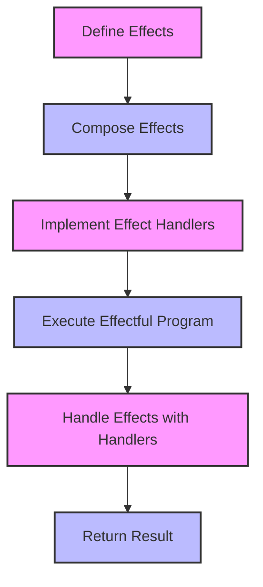

## 7.7 Extensible Effects and Effect Systems

In the realm of functional programming, managing side effects in a clean and modular way is a crucial challenge. Extensible effects and effect systems offer a powerful solution to this problem by allowing developers to compose and manage effects in a flexible and type-safe manner. This section delves into the concept of extensible effects, explores libraries that support them, and demonstrates how to implement effect handlers. We will also discuss the benefits and practical use cases of extensible effects in Scala.

### Understanding Extensible Effects

Extensible effects are a way to handle side effects in a functional programming context without sacrificing composability or type safety. Traditional approaches, such as monads, often lead to complex and nested structures that can be difficult to manage. Extensible effects, on the other hand, provide a more flexible and modular approach.

#### Key Concepts

- **Effect**: An effect represents a computation that interacts with the outside world or alters the program's state. Common examples include I/O operations, state management, and exception handling.
- **Effect System**: An effect system is a framework or library that allows developers to define and compose effects in a type-safe manner.
- **Effect Handler**: An effect handler is a mechanism that interprets and executes effects. It defines how specific effects should be handled and provides the necessary logic to perform the effectful operations.

### Libraries Supporting Extensible Effects

Several libraries in the Scala ecosystem support extensible effects, each with its own approach and features. Two notable libraries are *Eff* and *Bow Effects*.

#### Eff

Eff is a powerful library for managing extensible effects in Scala. It allows developers to define and compose effects using a simple and intuitive API. Eff is built on the concept of effect stacks, which are collections of effects that can be composed and managed together.

```scala
import org.atnos.eff._, all._, syntax.all._

type Stack = Fx.fx2[Option, Either[String, *]]

def program[R: _option: _eitherString]: Eff[R, Int] = for {
  a <- optionSome(1)
  b <- optionSome(2)
  c <- fromEither[String, Int](Right(a + b))
} yield c

val result: Option[Either[String, Int]] = program[Stack].runOption.runEither.run
println(result) // Output: Some(Right(3))
```

In this example, we define a simple program that uses two effects: `Option` and `Either`. The `Eff` library allows us to compose these effects seamlessly, and the result is a computation that can handle both optional values and potential errors.

#### Bow Effects

Bow Effects is another library that provides a comprehensive framework for managing effects in Scala. It is designed to be lightweight and easy to use, with a focus on performance and simplicity.

```scala
import bow.effects._
import bow.effects.syntax.all._

type MyEffects = Fx.fx2[Option, Either[String, *]]

def myProgram[R: _option: _eitherString]: Eff[R, Int] = for {
  x <- optionSome(10)
  y <- optionSome(20)
  z <- fromEither[String, Int](Right(x + y))
} yield z

val myResult: Option[Either[String, Int]] = myProgram[MyEffects].runOption.runEither.run
println(myResult) // Output: Some(Right(30))
```

Bow Effects provides a similar API to Eff, allowing developers to define and compose effects using effect stacks. The library is designed to be extensible, enabling developers to add custom effects and handlers as needed.

### Implementing Effect Handlers

Effect handlers are a crucial part of any effect system, as they define how specific effects should be executed. In Scala, implementing effect handlers typically involves defining a set of rules or functions that interpret and execute the effects.

#### Example: Implementing a Custom Effect Handler

Let's consider an example where we implement a custom effect handler for logging. We will use the Eff library to define a logging effect and its handler.

```scala
import org.atnos.eff._
import org.atnos.eff.syntax.all._

sealed trait Log[A]
case class Info(message: String) extends Log[Unit]

type _log[R] = Log |= R

def info[R: _log](message: String): Eff[R, Unit] =
  Eff.send(Info(message))

def runLog[R, A](effects: Eff[R, A]): Eff[Fx.fx1[Log], A] =
  effects.runReader(LogHandler)

object LogHandler extends Interpret[Log, Fx.fx1[Log]] {
  def onPure[A](a: A): Eff[Fx.fx1[Log], A] = Eff.pure(a)

  def onEffect[X](x: Log[X], continuation: Continuation[Fx.fx1[Log], X, A]): Eff[Fx.fx1[Log], A] = x match {
    case Info(message) =>
      println(s"INFO: $message")
      continuation.run(Unit)
  }
}

val logProgram: Eff[Fx.fx1[Log], Unit] = for {
  _ <- info("Starting the program")
  _ <- info("Performing some operations")
  _ <- info("Ending the program")
} yield ()

runLog(logProgram).run
```

In this example, we define a `Log` effect with a single operation, `Info`, which represents a logging message. We then implement a `LogHandler` that interprets the `Log` effect by printing the message to the console. The `runLog` function is used to execute the effectful program with the custom handler.

### Benefits of Extensible Effects

Extensible effects offer several advantages over traditional approaches to managing effects in functional programming:

- **Modularity**: Effects can be defined and composed independently, allowing for greater modularity and separation of concerns.
- **Type Safety**: Extensible effects provide a type-safe way to manage side effects, reducing the risk of runtime errors and improving code reliability.
- **Composability**: Effects can be easily composed and combined, enabling developers to build complex effectful programs with minimal boilerplate.
- **Flexibility**: Developers can define custom effects and handlers, tailoring the effect system to their specific needs and requirements.

### Use Cases and Examples

Extensible effects are particularly useful in scenarios where multiple effects need to be managed and composed together. Here are some common use cases:

#### Use Case 1: Managing I/O Operations

In many applications, I/O operations such as reading from a file or making network requests are common. Extensible effects provide a clean and modular way to manage these operations.

```scala
import org.atnos.eff._
import org.atnos.eff.syntax.all._

sealed trait IO[A]
case class ReadFile(path: String) extends IO[String]
case class WriteFile(path: String, content: String) extends IO[Unit]

type _io[R] = IO |= R

def readFile[R: _io](path: String): Eff[R, String] =
  Eff.send(ReadFile(path))

def writeFile[R: _io](path: String, content: String): Eff[R, Unit] =
  Eff.send(WriteFile(path, content))

def runIO[R, A](effects: Eff[R, A]): Eff[Fx.fx1[IO], A] =
  effects.runReader(IOHandler)

object IOHandler extends Interpret[IO, Fx.fx1[IO]] {
  def onPure[A](a: A): Eff[Fx.fx1[IO], A] = Eff.pure(a)

  def onEffect[X](x: IO[X], continuation: Continuation[Fx.fx1[IO], X, A]): Eff[Fx.fx1[IO], A] = x match {
    case ReadFile(path) =>
      val content = scala.io.Source.fromFile(path).mkString
      continuation.run(content)
    case WriteFile(path, content) =>
      val writer = new java.io.PrintWriter(path)
      writer.write(content)
      writer.close()
      continuation.run(Unit)
  }
}

val ioProgram: Eff[Fx.fx1[IO], Unit] = for {
  content <- readFile("input.txt")
  _ <- writeFile("output.txt", content.toUpperCase)
} yield ()

runIO(ioProgram).run
```

In this example, we define an `IO` effect with operations for reading and writing files. The `IOHandler` interprets these operations by performing the actual file I/O. The `runIO` function executes the effectful program with the custom handler.

#### Use Case 2: State Management

State management is another common use case for extensible effects. By defining a state effect, developers can manage state in a functional and type-safe manner.

```scala
import org.atnos.eff._
import org.atnos.eff.syntax.all._

sealed trait State[S, A]
case class Get[S]() extends State[S, S]
case class Put[S](s: S) extends State[S, Unit]

type _state[S, R] = State[S, *] |= R

def get[S, R: _state[S, *]]: Eff[R, S] =
  Eff.send(Get[S]())

def put[S, R: _state[S, *]](s: S): Eff[R, Unit] =
  Eff.send(Put(s))

def runState[S, R, A](effects: Eff[R, A], initialState: S): Eff[Fx.fx1[State[S, *]], A] =
  effects.runReader(StateHandler(initialState))

case class StateHandler[S](var state: S) extends Interpret[State[S, *], Fx.fx1[State[S, *]]] {
  def onPure[A](a: A): Eff[Fx.fx1[State[S, *]], A] = Eff.pure(a)

  def onEffect[X](x: State[S, X], continuation: Continuation[Fx.fx1[State[S, *]], X, A]): Eff[Fx.fx1[State[S, *]], A] = x match {
    case Get() =>
      continuation.run(state)
    case Put(s) =>
      state = s
      continuation.run(Unit)
  }
}

val stateProgram: Eff[Fx.fx1[State[Int, *]], Int] = for {
  x <- get[Int, Fx.fx1[State[Int, *]]]
  _ <- put(x + 1)
  y <- get[Int, Fx.fx1[State[Int, *]]]
} yield y

val finalState = runState(stateProgram, 0).run
println(finalState) // Output: 1
```

In this example, we define a `State` effect with operations for getting and putting state. The `StateHandler` manages the state by interpreting these operations. The `runState` function executes the effectful program with the custom handler, starting with an initial state.

### Visualizing Extensible Effects

To better understand how extensible effects work, let's visualize the process of composing and executing effects using a flowchart.



**Diagram Description**: This flowchart illustrates the process of working with extensible effects. We start by defining effects, compose them into a program, implement effect handlers, and then execute the program. The handlers manage the effects, and the final result is returned.

### Try It Yourself

To deepen your understanding of extensible effects, try modifying the code examples provided. Here are some suggestions:

- **Add a New Effect**: Extend the `IO` effect with additional operations, such as deleting a file or listing directory contents.
- **Implement a Custom Handler**: Create a new effect and implement a custom handler for it. For example, you could define a `Timer` effect for measuring execution time.
- **Combine Multiple Effects**: Compose multiple effects into a single program and experiment with different combinations and orderings.

### Knowledge Check

Before we conclude, let's reinforce what we've learned with a few questions:

- What are the key benefits of using extensible effects in functional programming?
- How do effect handlers work, and what role do they play in an effect system?
- Can you describe a scenario where extensible effects would be particularly useful?

### Embrace the Journey

Remember, mastering extensible effects and effect systems is a journey. As you continue to explore and experiment with these concepts, you'll gain a deeper understanding of how to manage side effects in a clean and modular way. Keep experimenting, stay curious, and enjoy the journey!

## Quiz Time!



### What is an effect in the context of extensible effects?

- [x] A computation that interacts with the outside world or alters the program's state
- [ ] A pure function with no side effects
- [ ] A type of data structure used in functional programming
- [ ] A method for optimizing performance

> **Explanation:** An effect represents a computation that interacts with the outside world or alters the program's state, such as I/O operations or state management.

### Which library is known for supporting extensible effects in Scala?

- [x] Eff
- [ ] Cats
- [ ] Scalaz
- [ ] Monix

> **Explanation:** Eff is a library that supports extensible effects in Scala, providing a framework for defining and composing effects.

### What is the role of an effect handler?

- [x] To interpret and execute effects
- [ ] To define new data structures
- [ ] To optimize code performance
- [ ] To manage memory allocation

> **Explanation:** An effect handler interprets and executes effects, providing the necessary logic to perform effectful operations.

### What is a key benefit of extensible effects?

- [x] Modularity and composability
- [ ] Increased code complexity
- [ ] Reduced type safety
- [ ] Limited flexibility

> **Explanation:** Extensible effects offer modularity and composability, allowing developers to define and manage effects independently.

### In the provided example, what does the `runLog` function do?

- [x] Executes the effectful program with the custom handler
- [ ] Defines a new effect
- [ ] Optimizes the program for performance
- [ ] Manages memory allocation

> **Explanation:** The `runLog` function executes the effectful program with the custom handler, interpreting the `Log` effect.

### What is a common use case for extensible effects?

- [x] Managing I/O operations
- [ ] Defining new data structures
- [ ] Optimizing code performance
- [ ] Managing memory allocation

> **Explanation:** Extensible effects are commonly used for managing I/O operations, providing a clean and modular way to handle these tasks.

### How can you add a new effect to an existing program using extensible effects?

- [x] Define the effect and implement a custom handler
- [ ] Modify the existing data structures
- [ ] Optimize the code for performance
- [ ] Allocate more memory

> **Explanation:** To add a new effect, you define the effect and implement a custom handler to interpret and execute it.

### What is the purpose of the `Eff.send` function in the Eff library?

- [x] To send an effect to be interpreted
- [ ] To define a new data structure
- [ ] To optimize code performance
- [ ] To manage memory allocation

> **Explanation:** The `Eff.send` function sends an effect to be interpreted by the effect handler, allowing it to be executed.

### True or False: Extensible effects reduce type safety in functional programming.

- [ ] True
- [x] False

> **Explanation:** False. Extensible effects enhance type safety by providing a type-safe way to manage side effects.

### Which of the following is NOT a benefit of extensible effects?

- [ ] Modularity
- [ ] Type Safety
- [ ] Composability
- [x] Increased code complexity

> **Explanation:** Extensible effects aim to reduce code complexity by providing a modular and composable way to manage effects.


