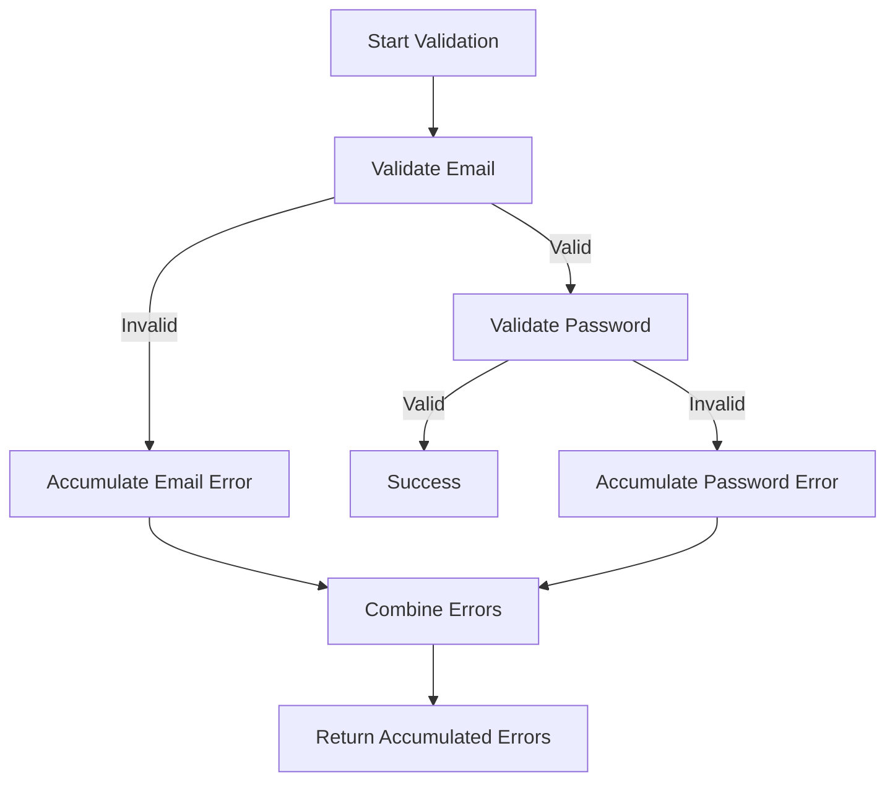

## 7.8 Advanced Error Handling Patterns

In the realm of functional programming, handling errors gracefully and efficiently is a crucial aspect of building robust applications. Scala, with its rich type system and functional programming capabilities, offers several advanced patterns for error handling. This section delves into two powerful constructs: `Validated` and `Either`. We will explore how these constructs can be used to accumulate errors, compare their use cases, and provide comprehensive examples to illustrate their application.

### Introduction to Error Handling in Scala

Error handling in Scala is not just about catching exceptions; it's about designing systems that can gracefully handle unexpected situations and continue to function correctly. Traditional error handling using exceptions can lead to code that is difficult to reason about, especially in a functional programming context where immutability and pure functions are preferred.

Scala provides several constructs for error handling, including `Option`, `Try`, `Either`, and `Validated`. Each of these has its own strengths and is suited to different scenarios. In this section, we will focus on `Either` and `Validated`, which are particularly useful for scenarios where we need to handle multiple errors simultaneously.

### Understanding `Either` in Scala

`Either` is a versatile construct in Scala that represents a value of one of two possible types. An `Either` is either a `Left` or a `Right`. By convention, `Left` is used to hold an error or failure, while `Right` is used to hold a successful result.

#### Key Characteristics of `Either`

- **Bifunctor**: `Either` is a bifunctor, meaning it can map over both the `Left` and `Right` values.
- **Right-biased**: In Scala 2.12 and later, `Either` is right-biased, which means it can be used in for-comprehensions like other monads.
- **Error Handling**: Typically used for computations that can fail, where `Left` represents an error and `Right` represents a success.

#### Basic Usage of `Either`

Let's start with a simple example to illustrate the usage of `Either`:

```scala
def parseInt(str: String): Either[String, Int] = {
  try {
    Right(str.toInt)
  } catch {
    case _: NumberFormatException => Left(s"Unable to parse '$str' as an integer.")
  }
}

// Usage
val result = parseInt("123")
result match {
  case Right(value) => println(s"Parsed value: $value")
  case Left(error)  => println(s"Error: $error")
}
```

In this example, `parseInt` returns an `Either[String, Int]`, where `Left` contains an error message, and `Right` contains the parsed integer.

### Accumulating Errors with `Validated`

While `Either` is great for handling single errors, it falls short when you need to accumulate multiple errors. This is where `Validated` comes into play. `Validated` is part of the Cats library and is designed to accumulate errors in a functional way.

#### Key Characteristics of `Validated`

- **Non-short-circuiting**: Unlike `Either`, `Validated` is non-short-circuiting, meaning it can accumulate multiple errors.
- **Applicative Functor**: `Validated` is an applicative functor, allowing you to combine multiple computations and accumulate errors.
- **Error Accumulation**: Ideal for scenarios where you need to validate multiple inputs and gather all errors.

#### Basic Usage of `Validated`

Here's a simple example to demonstrate `Validated`:

```scala
import cats.data.Validated
import cats.implicits._

def validateName(name: String): Validated[String, String] =
  if (name.nonEmpty) Validated.valid(name)
  else Validated.invalid("Name cannot be empty.")

def validateAge(age: Int): Validated[String, Int] =
  if (age > 0) Validated.valid(age)
  else Validated.invalid("Age must be positive.")

// Usage
val validationResult = (validateName("John"), validateAge(-1)).mapN((name, age) => (name, age))

validationResult match {
  case Validated.Valid((name, age)) => println(s"Valid input: Name = $name, Age = $age")
  case Validated.Invalid(errors)    => println(s"Errors: ${errors.toList.mkString(", ")}")
}
```

In this example, `validateName` and `validateAge` return `Validated` instances. By using the `mapN` method, we can combine these validations and accumulate errors.

### Comparing `Validated` with `Either`

Both `Validated` and `Either` are useful for error handling, but they serve different purposes. Let's compare them to understand when to use each.

#### When to Use `Either`

- **Single Error Handling**: Use `Either` when you need to handle a single error and short-circuit the computation on failure.
- **Monadic Operations**: `Either` is right-biased and supports monadic operations, making it suitable for chaining computations.
- **Simple Error Scenarios**: Ideal for simple error handling scenarios where accumulating errors is not required.

#### When to Use `Validated`

- **Error Accumulation**: Use `Validated` when you need to accumulate multiple errors and provide comprehensive feedback.
- **Applicative Operations**: `Validated` supports applicative operations, allowing you to combine multiple computations.
- **Complex Validation**: Ideal for complex validation scenarios where multiple inputs need to be validated simultaneously.

### Advanced Usage of `Validated`

To fully leverage the power of `Validated`, let's explore some advanced usage patterns and techniques.

#### Combining Multiple Validations

In real-world applications, you often need to validate multiple inputs and accumulate errors. `Validated` makes this easy with its applicative nature.

```scala
import cats.data.Validated
import cats.implicits._

def validateEmail(email: String): Validated[List[String], String] =
  if (email.contains("@")) Validated.valid(email)
  else Validated.invalid(List("Invalid email format."))

def validatePassword(password: String): Validated[List[String], String] =
  if (password.length >= 8) Validated.valid(password)
  else Validated.invalid(List("Password must be at least 8 characters long."))

val emailValidation = validateEmail("example.com")
val passwordValidation = validatePassword("pass")

val combinedValidation = (emailValidation, passwordValidation).mapN((email, password) => (email, password))

combinedValidation match {
  case Validated.Valid((email, password)) => println(s"Valid input: Email = $email, Password = $password")
  case Validated.Invalid(errors)          => println(s"Errors: ${errors.toList.mkString(", ")}")
}
```

In this example, we validate an email and a password, accumulating errors if both validations fail.

#### Custom Error Types

`Validated` allows you to use custom error types, providing more context and information about errors.

```scala
sealed trait ValidationError
case class InvalidEmailFormat(email: String) extends ValidationError
case class PasswordTooShort(length: Int) extends ValidationError

def validateEmailCustom(email: String): Validated[List[ValidationError], String] =
  if (email.contains("@")) Validated.valid(email)
  else Validated.invalid(List(InvalidEmailFormat(email)))

def validatePasswordCustom(password: String): Validated[List[ValidationError], String] =
  if (password.length >= 8) Validated.valid(password)
  else Validated.invalid(List(PasswordTooShort(password.length)))

val customValidation = (validateEmailCustom("example.com"), validatePasswordCustom("pass")).mapN((email, password) => (email, password))

customValidation match {
  case Validated.Valid((email, password)) => println(s"Valid input: Email = $email, Password = $password")
  case Validated.Invalid(errors)          => println(s"Errors: ${errors.map(_.toString).mkString(", ")}")
}
```

Here, we define custom error types `InvalidEmailFormat` and `PasswordTooShort` to provide more detailed error messages.

### Visualizing Error Handling with `Validated`

To better understand how `Validated` accumulates errors, let's visualize the process using a flowchart.



In this flowchart, we see the validation process starting with email validation, followed by password validation. Errors are accumulated and returned if any validation fails.

### Design Considerations

When using `Validated` and `Either`, consider the following design considerations:

- **Error Accumulation**: Use `Validated` when you need to accumulate errors. It provides a clear and concise way to gather multiple errors.
- **Performance**: While `Validated` is powerful, it may introduce overhead due to error accumulation. Consider the performance implications in performance-critical applications.
- **Error Types**: Define custom error types to provide more context and information about errors. This enhances the readability and maintainability of your code.
- **Library Dependencies**: `Validated` is part of the Cats library. Ensure that your project dependencies are properly managed when using Cats.

### Differences and Similarities

`Either` and `Validated` are often compared due to their similar roles in error handling. However, they have distinct differences:

- **Short-circuiting**: `Either` short-circuits on the first error, while `Validated` accumulates errors.
- **Monadic vs. Applicative**: `Either` is monadic, allowing for chaining operations, whereas `Validated` is applicative, enabling parallel validation.
- **Use Cases**: Use `Either` for simple error handling and `Validated` for complex validation scenarios.

### Try It Yourself

To deepen your understanding of `Validated` and `Either`, try modifying the code examples:

- **Add More Validations**: Extend the examples to include additional validations, such as checking for a valid phone number or address.
- **Custom Error Handling**: Implement custom error handling logic to provide more detailed error messages.
- **Performance Testing**: Measure the performance of `Validated` and `Either` in different scenarios to understand their impact on your application.

### Knowledge Check

- **What is the primary difference between `Either` and `Validated`?**
- **How does `Validated` accumulate errors?**
- **When should you use custom error types with `Validated`?**
- **What are the performance considerations when using `Validated`?**

### Conclusion

Advanced error handling patterns in Scala, such as `Either` and `Validated`, provide powerful tools for building robust applications. By understanding the strengths and limitations of each construct, you can choose the right tool for your specific use case. Remember, effective error handling is not just about catching exceptions; it's about designing systems that can gracefully handle unexpected situations and continue to function correctly.

## Quiz Time!



### What is the primary purpose of `Validated` in Scala?

- [x] To accumulate multiple errors during validation
- [ ] To handle exceptions in a try-catch block
- [ ] To provide a monadic interface for error handling
- [ ] To replace `Option` for optional values

> **Explanation:** `Validated` is designed to accumulate multiple errors during validation, unlike `Either`, which short-circuits on the first error.

### How does `Either` differ from `Validated` in terms of error handling?

- [x] `Either` short-circuits on the first error, while `Validated` accumulates errors
- [ ] `Either` accumulates errors, while `Validated` short-circuits on the first error
- [ ] Both `Either` and `Validated` short-circuit on the first error
- [ ] Both `Either` and `Validated` accumulate errors

> **Explanation:** `Either` is monadic and short-circuits on the first error, while `Validated` is applicative and accumulates errors.

### Which library provides the `Validated` construct in Scala?

- [x] Cats
- [ ] Scalaz
- [ ] Akka
- [ ] Play Framework

> **Explanation:** `Validated` is part of the Cats library, which provides functional programming abstractions in Scala.

### When should you prefer `Either` over `Validated`?

- [x] When you need to handle a single error and short-circuit the computation
- [ ] When you need to accumulate multiple errors
- [ ] When you need to perform parallel validations
- [ ] When you need to use applicative operations

> **Explanation:** `Either` is preferred when you need to handle a single error and short-circuit the computation, as it is monadic.

### What is a key advantage of using custom error types with `Validated`?

- [x] They provide more context and information about errors
- [ ] They simplify the validation logic
- [ ] They improve performance
- [ ] They eliminate the need for error handling

> **Explanation:** Custom error types provide more context and information about errors, enhancing code readability and maintainability.

### Which of the following is a characteristic of `Validated`?

- [x] It is an applicative functor
- [ ] It is a monad
- [ ] It short-circuits on the first error
- [ ] It is part of the Scala standard library

> **Explanation:** `Validated` is an applicative functor, allowing for parallel validation and error accumulation.

### What is the role of the `mapN` method in `Validated`?

- [x] To combine multiple validations and accumulate errors
- [ ] To transform a single validation result
- [ ] To short-circuit on the first error
- [ ] To convert `Validated` to `Either`

> **Explanation:** The `mapN` method in `Validated` is used to combine multiple validations and accumulate errors.

### How can you visualize the error accumulation process in `Validated`?

- [x] By using a flowchart to represent the validation steps and error accumulation
- [ ] By writing unit tests for each validation
- [ ] By logging the validation process
- [ ] By using a debugger to step through the code

> **Explanation:** A flowchart can effectively represent the validation steps and error accumulation process in `Validated`.

### What is a potential drawback of using `Validated` in performance-critical applications?

- [x] It may introduce overhead due to error accumulation
- [ ] It lacks support for custom error types
- [ ] It cannot handle multiple validations
- [ ] It is not compatible with the Cats library

> **Explanation:** `Validated` may introduce overhead due to error accumulation, which can impact performance in critical applications.

### True or False: `Either` is right-biased in Scala 2.12 and later.

- [x] True
- [ ] False

> **Explanation:** In Scala 2.12 and later, `Either` is right-biased, meaning it can be used in for-comprehensions like other monads.


