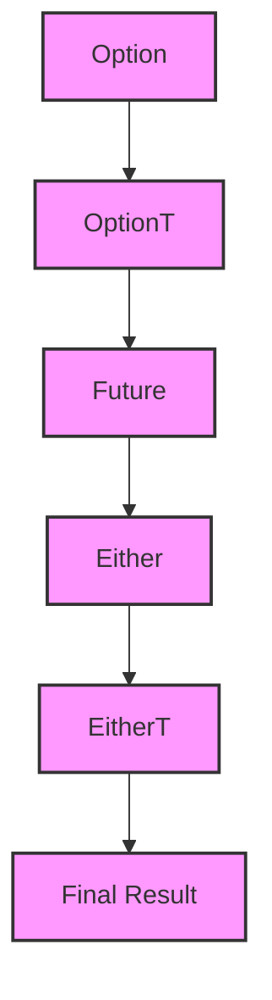

## 7.9 Functional Error Handling with Monad Transformers

In the world of functional programming, handling errors gracefully is crucial for building robust applications. Scala, with its rich type system and functional programming capabilities, provides several tools to manage errors effectively. One of the most powerful techniques for handling errors in a functional way is using monad transformers. This section will guide you through the concepts, usage, and benefits of monad transformers in Scala, enabling you to manage complex computations involving multiple monads seamlessly.

### Introduction to Monads

Before diving into monad transformers, let's briefly revisit the concept of monads. A monad is a design pattern used to encapsulate computations in a context. In Scala, common monads include `Option`, `Either`, `Try`, and `Future`. Each of these monads provides a way to handle computations that might fail, have side effects, or involve asynchronous operations.

#### Key Monad Operations

Monads in Scala typically support two primary operations:

- **`flatMap`**: Chains computations together, allowing you to sequence operations that return monads.
- **`map`**: Transforms the value inside a monad without changing the monad's structure.

Here's a simple example using the `Option` monad:

```scala
val maybeNumber: Option[Int] = Some(42)

val result: Option[Int] = maybeNumber.flatMap { num =>
  if (num > 0) Some(num * 2) else None
}

println(result) // Output: Some(84)
```

### The Need for Monad Transformers

When working with multiple monads, such as `Option` and `Either`, you might encounter a situation known as "monad stacking." This occurs when you have nested monads, leading to cumbersome and unreadable code. Monad transformers provide a solution to this problem by allowing you to combine monads in a way that simplifies their usage.

#### Example of Monad Stacking

Consider a scenario where you have a computation that involves both `Option` and `Either`:

```scala
val maybeValue: Option[Either[String, Int]] = Some(Right(42))

val result: Option[Either[String, Int]] = maybeValue.flatMap {
  case Right(value) => Some(Right(value * 2))
  case Left(error) => Some(Left(error))
}

println(result) // Output: Some(Right(84))
```

As the complexity of your computations increases, managing nested monads becomes challenging. This is where monad transformers come into play.

### Understanding Monad Transformers

Monad transformers are a way to compose monads, allowing you to work with multiple monads as if they were a single monad. They provide a mechanism to "lift" operations from one monad into another, enabling seamless chaining of computations.

#### Common Monad Transformers

Some of the most commonly used monad transformers in Scala include:

- **`OptionT`**: Transforms an `Option` monad.
- **`EitherT`**: Transforms an `Either` monad.
- **`ReaderT`**: Transforms a `Reader` monad.
- **`StateT`**: Transforms a `State` monad.

Let's explore how these transformers work and how they can be used to simplify error handling in Scala.

### Using `OptionT` for Error Handling

The `OptionT` monad transformer allows you to work with computations that return an `Option` inside another monad, such as `Future`. This is particularly useful when you have asynchronous operations that might not return a value.

#### Example: Combining `Option` and `Future`

Suppose you have a function that fetches user data from a database, returning a `Future[Option[User]]`. You want to transform this into a `Future[Option[String]]` containing the user's name:

```scala
import scala.concurrent.Future
import scala.concurrent.ExecutionContext.Implicits.global
import cats.data.OptionT
import cats.implicits._

case class User(name: String)

def fetchUser(id: Int): Future[Option[User]] = Future.successful(Some(User("Alice")))

val userName: OptionT[Future, String] = for {
  user <- OptionT(fetchUser(1))
} yield user.name

userName.value.foreach(println) // Output: Some(Alice)
```

In this example, `OptionT` allows you to work with the `Option` inside the `Future` seamlessly, using a `for`-comprehension to chain operations.

### Using `EitherT` for Error Handling

The `EitherT` monad transformer is useful when you need to handle computations that can fail with an error. It allows you to work with `Either` values inside another monad, such as `Future`.

#### Example: Combining `Either` and `Future`

Consider a function that performs a division operation, returning a `Future[Either[String, Int]]` to indicate success or failure:

```scala
import cats.data.EitherT
import cats.implicits._

def divide(a: Int, b: Int): Future[Either[String, Int]] =
  Future.successful(if (b == 0) Left("Division by zero") else Right(a / b))

val result: EitherT[Future, String, Int] = for {
  quotient <- EitherT(divide(10, 2))
} yield quotient

result.value.foreach(println) // Output: Right(5)
```

Using `EitherT`, you can handle errors in a functional way, chaining operations with a `for`-comprehension.

### Combining `OptionT` and `EitherT`

In some cases, you might need to work with both `Option` and `Either` in your computations. Monad transformers allow you to combine them, simplifying your code.

#### Example: Handling `Option` and `Either` Together

Suppose you have a function that fetches user data and performs a division operation, returning a `Future[Option[Either[String, Int]]]`:

```scala
def fetchUserAndDivide(id: Int, divisor: Int): Future[Option[Either[String, Int]]] = {
  val userOptionT: OptionT[Future, User] = OptionT(fetchUser(id))
  val result: OptionT[Future, Either[String, Int]] = for {
    user <- userOptionT
    quotient <- OptionT.liftF(divide(user.name.length, divisor))
  } yield quotient

  result.value
}

fetchUserAndDivide(1, 2).foreach(println) // Output: Some(Right(2))
```

In this example, `OptionT` and `EitherT` work together to handle both optional values and errors, making the code more readable and maintainable.

### Visualizing Monad Transformers

To better understand how monad transformers work, let's visualize the process of combining monads using a diagram.



**Diagram Explanation:** This diagram illustrates the process of transforming an `Option` into an `OptionT`, which is then combined with a `Future` and transformed into an `EitherT`, resulting in a final computation that handles both optional values and errors.

### Benefits of Using Monad Transformers

Monad transformers offer several benefits for error handling and complex computations in Scala:

- **Simplified Code**: By combining monads, you can write more concise and readable code, reducing the need for nested `flatMap` calls.
- **Composability**: Monad transformers enable you to compose different monads, allowing for more flexible and modular code.
- **Error Handling**: They provide a functional way to handle errors, making it easier to manage failures and recover from them.
- **Asynchronous Operations**: Monad transformers work seamlessly with asynchronous computations, such as `Future`, enabling you to handle errors in a non-blocking way.

### Design Considerations

When using monad transformers, consider the following:

- **Performance**: While monad transformers simplify code, they can introduce additional overhead. Be mindful of performance implications, especially in performance-critical applications.
- **Complexity**: Monad transformers can add complexity to your codebase. Ensure that your team is familiar with functional programming concepts to avoid confusion.
- **Library Support**: Use libraries like Cats or Scalaz, which provide robust implementations of monad transformers and other functional programming tools.

### Differences and Similarities with Other Patterns

Monad transformers are often compared to other patterns for handling errors and managing computations:

- **Try vs. Either**: While `Try` is useful for handling exceptions, `Either` provides more flexibility for error handling. Monad transformers can be used with both to enhance their capabilities.
- **Futures**: Monad transformers work well with `Future`, allowing you to handle asynchronous computations alongside error handling.
- **Error Handling Patterns**: Monad transformers complement other error handling patterns, such as pattern matching and exception handling, by providing a functional approach.

### Try It Yourself

To deepen your understanding of monad transformers, try modifying the code examples provided in this section. Experiment with different combinations of monads and transformers, and observe how they affect the behavior of your computations.

### Knowledge Check

- **Question**: What is the primary purpose of monad transformers?
  - **Answer**: Monad transformers are used to combine multiple monads, simplifying the handling of computations that involve nested monads.

- **Question**: How does `OptionT` help in handling optional values inside another monad?
  - **Answer**: `OptionT` allows you to work with `Option` values inside another monad, such as `Future`, enabling seamless chaining of operations.

### Conclusion

Monad transformers are a powerful tool for managing complex computations and error handling in Scala. By combining monads, they simplify code, enhance composability, and provide a functional approach to error management. As you continue to explore functional programming in Scala, consider incorporating monad transformers into your toolkit to build more robust and maintainable applications.

Remember, mastering monad transformers takes practice and experimentation. Keep exploring, stay curious, and enjoy the journey of functional programming in Scala!

## Quiz Time!



### What is the primary purpose of monad transformers?

- [x] To combine multiple monads and simplify handling of computations
- [ ] To replace monads entirely
- [ ] To handle only asynchronous computations
- [ ] To eliminate the need for error handling

> **Explanation:** Monad transformers are used to combine multiple monads, simplifying the handling of computations that involve nested monads.

### How does `OptionT` help in handling optional values inside another monad?

- [x] It allows seamless chaining of operations with `Option` values inside another monad
- [ ] It converts `Option` to `Either`
- [ ] It only works with synchronous computations
- [ ] It eliminates the need for `flatMap`

> **Explanation:** `OptionT` allows you to work with `Option` values inside another monad, such as `Future`, enabling seamless chaining of operations.

### Which monad transformer is used to handle computations that can fail with an error?

- [x] EitherT
- [ ] OptionT
- [ ] ReaderT
- [ ] StateT

> **Explanation:** `EitherT` is used to handle computations that can fail with an error, allowing you to work with `Either` values inside another monad.

### What is a potential downside of using monad transformers?

- [x] They can introduce additional overhead and complexity
- [ ] They eliminate the need for error handling
- [ ] They only work with synchronous computations
- [ ] They are not compatible with `Future`

> **Explanation:** While monad transformers simplify code, they can introduce additional overhead and complexity, especially in performance-critical applications.

### Which library provides robust implementations of monad transformers in Scala?

- [x] Cats
- [ ] Akka
- [ ] Play Framework
- [ ] Spark

> **Explanation:** Cats is a library that provides robust implementations of monad transformers and other functional programming tools in Scala.

### What is the benefit of using monad transformers with asynchronous operations?

- [x] They enable handling errors in a non-blocking way
- [ ] They eliminate the need for `Future`
- [ ] They only work with synchronous computations
- [ ] They replace monads entirely

> **Explanation:** Monad transformers work seamlessly with asynchronous computations, such as `Future`, enabling you to handle errors in a non-blocking way.

### Which of the following is NOT a common monad transformer in Scala?

- [x] ListT
- [ ] OptionT
- [ ] EitherT
- [ ] StateT

> **Explanation:** `ListT` is not a common monad transformer in Scala. Common monad transformers include `OptionT`, `EitherT`, and `StateT`.

### What is a key advantage of using monad transformers?

- [x] They enhance composability and modularity of code
- [ ] They eliminate the need for error handling
- [ ] They only work with synchronous computations
- [ ] They replace monads entirely

> **Explanation:** Monad transformers enhance composability and modularity of code by allowing you to combine different monads and handle computations more flexibly.

### True or False: Monad transformers can be used with both `Try` and `Either` to enhance their capabilities.

- [x] True
- [ ] False

> **Explanation:** Monad transformers can be used with both `Try` and `Either` to enhance their capabilities, providing more flexibility for error handling.

### What should you consider when using monad transformers in performance-critical applications?

- [x] Be mindful of performance implications and potential overhead
- [ ] They eliminate the need for error handling
- [ ] They only work with synchronous computations
- [ ] They replace monads entirely

> **Explanation:** When using monad transformers in performance-critical applications, be mindful of performance implications and potential overhead.




