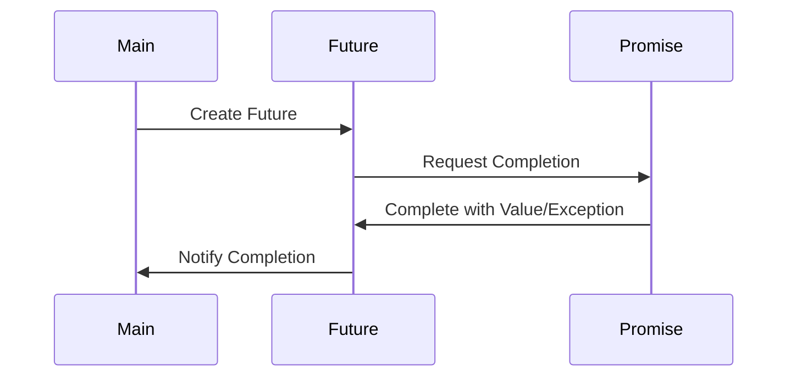

## 8.1 Futures and Promises

In the realm of concurrent and asynchronous programming, Scala provides robust abstractions in the form of `Future` and `Promise`. These constructs are essential for managing asynchronous computations, enabling developers to write non-blocking code that can handle multiple tasks concurrently. This section will delve into the concepts, usage, and best practices for utilizing `Futures` and `Promises` in Scala, providing expert software engineers and architects with the knowledge needed to harness these powerful tools effectively.

### Understanding Futures and Promises

#### What is a Future?

A `Future` in Scala represents a computation that may or may not have completed yet. It is a placeholder for a result that will be available at some point in the future. Futures are particularly useful for performing tasks that are expected to take some time, such as network requests or file I/O operations, without blocking the main thread of execution.

```scala
import scala.concurrent.Future
import scala.concurrent.ExecutionContext.Implicits.global

val futureResult: Future[Int] = Future {
  // Simulate a long-running computation
  Thread.sleep(1000)
  42
}
```

In this example, the `Future` is created to perform a computation that returns the integer `42` after a delay. The computation runs asynchronously, allowing the program to continue executing other tasks.

#### What is a Promise?

A `Promise` is a writable, single-assignment container that completes a `Future`. While a `Future` is read-only, a `Promise` allows you to complete a `Future` with a value or an exception. This separation of concerns allows for more flexible and decoupled code.

```scala
import scala.concurrent.Promise

val promise: Promise[Int] = Promise[Int]()
val future: Future[Int] = promise.future

// Completing the promise with a value
promise.success(42)
```

Here, a `Promise` is created and then completed with the value `42`. The associated `Future` is automatically completed with the same value.

### Key Concepts and Terminology

- **Asynchronous Computation**: A computation that runs independently of the main program flow, allowing other tasks to proceed without waiting for it to complete.
- **Non-blocking**: A programming model where operations do not block the execution of the program, allowing for more efficient use of resources.
- **Callback**: A function that is executed when a `Future` is completed, either successfully or with an error.

### Working with Futures

#### Creating Futures

Futures in Scala are created using the `Future` companion object. The computation is executed asynchronously, typically on a thread pool managed by an `ExecutionContext`.

```scala
import scala.concurrent.Future
import scala.concurrent.ExecutionContext.Implicits.global

val future: Future[String] = Future {
  // Simulate a network call
  Thread.sleep(500)
  "Hello, Future!"
}
```

#### Handling Future Completion

To handle the completion of a `Future`, you can use callbacks such as `onComplete`, `onSuccess`, and `onFailure`.

```scala
future.onComplete {
  case scala.util.Success(value) => println(s"Received: $value")
  case scala.util.Failure(exception) => println(s"Failed with: $exception")
}
```

#### Transforming Futures

Futures can be transformed using methods like `map`, `flatMap`, and `filter`, allowing you to chain operations together.

```scala
val transformedFuture: Future[Int] = future.map(_.length)

transformedFuture.onComplete {
  case scala.util.Success(length) => println(s"String length: $length")
  case scala.util.Failure(exception) => println(s"Failed with: $exception")
}
```

### Combining Futures

#### Sequential Composition

You can compose futures sequentially using `flatMap` to chain operations that depend on the result of a previous computation.

```scala
val future1: Future[Int] = Future { 10 }
val future2: Future[Int] = future1.flatMap { x =>
  Future { x * 2 }
}

future2.onComplete {
  case scala.util.Success(result) => println(s"Result: $result")
  case scala.util.Failure(exception) => println(s"Failed with: $exception")
}
```

#### Parallel Composition

For independent computations, you can combine futures in parallel using `for-comprehensions` or `zip`.

```scala
val futureA: Future[Int] = Future { 10 }
val futureB: Future[Int] = Future { 20 }

val combinedFuture: Future[Int] = for {
  a <- futureA
  b <- futureB
} yield a + b

combinedFuture.onComplete {
  case scala.util.Success(sum) => println(s"Sum: $sum")
  case scala.util.Failure(exception) => println(s"Failed with: $exception")
}
```

### Error Handling with Futures

Futures provide several mechanisms for handling errors, such as `recover`, `recoverWith`, and `fallbackTo`.

```scala
val futureWithError: Future[Int] = Future {
  throw new RuntimeException("Oops!")
}

val recoveredFuture: Future[Int] = futureWithError.recover {
  case _: RuntimeException => 0
}

recoveredFuture.onComplete {
  case scala.util.Success(value) => println(s"Recovered value: $value")
  case scala.util.Failure(exception) => println(s"Failed with: $exception")
}
```

### Promises in Detail

#### Creating and Completing Promises

A `Promise` is created using the `Promise` companion object. You can complete a promise with a value or an exception using `success` or `failure`.

```scala
val promise: Promise[String] = Promise[String]()
val future: Future[String] = promise.future

// Completing the promise with a value
promise.success("Completed successfully")

// Completing the promise with an exception
// promise.failure(new RuntimeException("Failed"))
```

#### Use Cases for Promises

Promises are particularly useful when you need to complete a `Future` from outside the context where it was created, such as in callback-based APIs or when integrating with legacy code.

### Advanced Topics

#### Future Composition Patterns

- **Chaining**: Use `flatMap` to chain dependent computations.
- **Zipping**: Use `zip` to combine independent computations.
- **For-Comprehensions**: Use for-comprehensions for more readable and expressive code.

#### Performance Considerations

- **ExecutionContext**: Choose an appropriate `ExecutionContext` to manage thread pools and avoid blocking operations.
- **Avoid Blocking**: Use non-blocking APIs and avoid blocking operations within futures.

#### Best Practices

- **Error Handling**: Always handle errors in futures to prevent unhandled exceptions.
- **Resource Management**: Ensure resources are properly managed and released, especially in long-running computations.

### Visualizing Future and Promise Workflow

To better understand the workflow of `Futures` and `Promises`, let's visualize the process using a sequence diagram.



This diagram illustrates the interaction between the main program, a `Future`, and a `Promise`. The main program creates a `Future`, which requests completion from a `Promise`. Once the promise is completed, the future notifies the main program of its completion.

### Try It Yourself

Experiment with the following code examples to deepen your understanding of `Futures` and `Promises`. Try modifying the delay times, introducing errors, or chaining additional operations to see how the behavior changes.

```scala
import scala.concurrent.Future
import scala.concurrent.ExecutionContext.Implicits.global
import scala.util.{Success, Failure}

val future1: Future[Int] = Future {
  Thread.sleep(500)
  10
}

val future2: Future[Int] = Future {
  Thread.sleep(300)
  20
}

val combinedFuture: Future[Int] = for {
  result1 <- future1
  result2 <- future2
} yield result1 + result2

combinedFuture.onComplete {
  case Success(sum) => println(s"Sum: $sum")
  case Failure(exception) => println(s"Failed with: $exception")
}
```

### Knowledge Check

- What is the difference between a `Future` and a `Promise`?
- How can you handle errors in a `Future`?
- What are some best practices for using `Futures` in Scala?

### Embrace the Journey

Remember, mastering `Futures` and `Promises` is a journey. As you progress, you'll build more complex and efficient asynchronous systems. Keep experimenting, stay curious, and enjoy the journey!

## Quiz Time!



### What is a `Future` in Scala?

- [x] A placeholder for a result that will be available in the future.
- [ ] A synchronous computation.
- [ ] A mutable container for storing values.
- [ ] A blocking operation.

> **Explanation:** A `Future` in Scala represents a computation that may or may not have completed yet, acting as a placeholder for a result that will be available later.

### How can you handle errors in a `Future`?

- [x] Using `recover` or `recoverWith`.
- [ ] By ignoring them.
- [ ] Using `map` only.
- [ ] By blocking the thread.

> **Explanation:** Errors in a `Future` can be handled using methods like `recover` or `recoverWith`, which allow you to specify fallback logic.

### What is a `Promise` in Scala?

- [x] A writable, single-assignment container that completes a `Future`.
- [ ] A read-only container.
- [ ] A blocking operation.
- [ ] A synchronous computation.

> **Explanation:** A `Promise` is a writable container that allows you to complete a `Future` with a value or an exception.

### Which method is used to chain dependent computations in `Futures`?

- [x] `flatMap`
- [ ] `map`
- [ ] `filter`
- [ ] `zip`

> **Explanation:** `flatMap` is used to chain dependent computations in `Futures`, allowing you to sequence operations that depend on the result of a previous computation.

### What is the purpose of an `ExecutionContext`?

- [x] To manage thread pools and execute asynchronous computations.
- [ ] To block threads.
- [ ] To store values.
- [ ] To handle exceptions.

> **Explanation:** An `ExecutionContext` is responsible for managing thread pools and executing asynchronous computations, ensuring efficient resource utilization.

### What is a common use case for `Promises`?

- [x] Completing a `Future` from outside its creation context.
- [ ] Blocking operations.
- [ ] Synchronous computations.
- [ ] Ignoring errors.

> **Explanation:** `Promises` are useful for completing a `Future` from outside its creation context, such as in callback-based APIs or when integrating with legacy code.

### How can you combine independent computations in `Futures`?

- [x] Using `zip` or for-comprehensions.
- [ ] Using `flatMap` only.
- [ ] By blocking threads.
- [ ] Using `filter`.

> **Explanation:** Independent computations in `Futures` can be combined using `zip` or for-comprehensions, allowing you to execute them in parallel.

### What is a best practice for using `Futures`?

- [x] Always handle errors to prevent unhandled exceptions.
- [ ] Ignore errors.
- [ ] Block threads.
- [ ] Use synchronous computations.

> **Explanation:** A best practice for using `Futures` is to always handle errors to prevent unhandled exceptions, ensuring robust and reliable code.

### What is the benefit of non-blocking operations?

- [x] Efficient use of resources and improved performance.
- [ ] Increased blocking.
- [ ] Slower execution.
- [ ] More errors.

> **Explanation:** Non-blocking operations allow for efficient use of resources and improved performance by enabling the program to continue executing other tasks without waiting for a computation to complete.

### True or False: A `Future` can be completed multiple times.

- [ ] True
- [x] False

> **Explanation:** False. A `Future` is a read-only container and can only be completed once, either successfully or with an exception.


