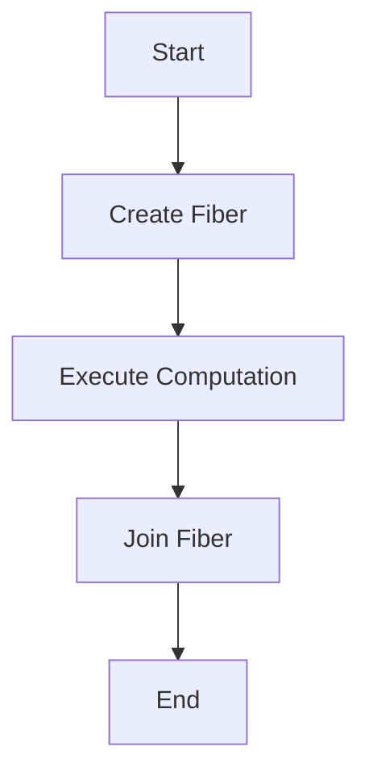

## 8.10 Functional Concurrency with ZIO and Cats Effect

Functional concurrency is a powerful paradigm that allows developers to write concurrent programs in a declarative and composable manner. In the Scala ecosystem, two libraries stand out for managing concurrency in a functional style: **ZIO** and **Cats Effect**. Both libraries provide abstractions for handling side effects, managing resources, and executing asynchronous computations, all while maintaining the purity and composability of functional programming.

### Introduction to Functional Concurrency

Functional concurrency involves managing concurrent computations in a way that aligns with functional programming principles. This means avoiding shared mutable state, using pure functions, and leveraging powerful abstractions like monads and fibers to handle concurrency.

#### Key Concepts

- **Pure Functions**: Functions that have no side effects and return the same output given the same input.
- **Immutability**: Data structures that cannot be modified after they are created.
- **Monads**: Abstractions that allow for the composition of effectful computations.
- **Fibers**: Lightweight, cooperative threads of execution that can be managed by the runtime.

### ZIO: A Comprehensive Effect System

ZIO (Zebra I/O) is a powerful library for asynchronous and concurrent programming in Scala. It provides a rich set of features for managing side effects, handling errors, and composing complex workflows.

#### Core Concepts of ZIO

- **ZIO Data Type**: The central abstraction in ZIO, representing an effectful computation.
- **Fibers**: Lightweight threads managed by ZIO, allowing for concurrent execution.
- **Error Handling**: ZIO provides robust error handling with typed errors.
- **Resource Management**: Automatic management of resources using `ZManaged`.

#### ZIO Data Type

The `ZIO` data type is the core of the ZIO library. It represents a computation that can produce a result, fail with an error, or never complete. The type signature is:

```scala
ZIO[R, E, A]
```

- `R`: The environment required by the computation.
- `E`: The type of error that the computation can fail with.
- `A`: The type of the successful result.

#### Managing Fibers with ZIO

Fibers in ZIO are lightweight, cooperative threads of execution. They allow for concurrent computations without the overhead of traditional threads.

```scala
import zio._

val fiber: ZIO[Any, Nothing, Fiber[Nothing, Int]] = ZIO.succeed(42).fork
```

In this example, a fiber is created to execute the computation `ZIO.succeed(42)` concurrently.

#### Error Handling in ZIO

ZIO provides powerful error handling capabilities, allowing developers to work with typed errors.

```scala
val program: ZIO[Any, String, Int] = ZIO.fail("Error").catchAll(err => ZIO.succeed(0))
```

Here, `catchAll` is used to handle errors and provide a fallback value.

#### Resource Management with ZManaged

`ZManaged` is a resource management abstraction in ZIO that ensures resources are acquired and released safely.

```scala
val managedResource: ZManaged[Any, Throwable, String] = ZManaged.make(acquire)(release)
```

This ensures that the resource is properly released even if an error occurs.

### Cats Effect: A Lightweight Effect System

Cats Effect is another popular library for functional concurrency in Scala. It provides a minimal set of abstractions for managing side effects and asynchronous computations.

#### Core Concepts of Cats Effect

- **IO Monad**: The primary abstraction for effectful computations.
- **Resource Management**: Using the `Resource` data type to manage resources.
- **Concurrency Primitives**: Support for fibers and asynchronous computations.

#### The IO Monad

The `IO` monad is the core abstraction in Cats Effect, representing a computation that can produce a result or fail with an error.

```scala
import cats.effect._

val io: IO[Int] = IO.pure(42)
```

This represents a pure computation that produces the value `42`.

#### Managing Fibers with Cats Effect

Cats Effect provides support for fibers, allowing for concurrent execution of computations.

```scala
import cats.effect._
import cats.effect.unsafe.implicits.global

val fiber: IO[Fiber[IO, Throwable, Int]] = IO.pure(42).start
```

Here, a fiber is created to execute the computation concurrently.

#### Resource Management with Resource

The `Resource` data type in Cats Effect is used to manage resources safely.

```scala
import cats.effect._

val resource: Resource[IO, String] = Resource.make(acquire)(release)
```

This ensures that the resource is released properly, even in the presence of errors.

### Comparing ZIO and Cats Effect

Both ZIO and Cats Effect provide powerful abstractions for functional concurrency, but they differ in their approach and features.

#### Error Handling

- **ZIO**: Provides typed errors, allowing for more precise error handling.
- **Cats Effect**: Uses the `IO` monad, which represents errors as `Throwable`.

#### Resource Management

- **ZIO**: Uses `ZManaged` for resource management, providing a comprehensive solution.
- **Cats Effect**: Uses `Resource`, which is simpler but less feature-rich than `ZManaged`.

#### Concurrency Primitives

- **ZIO**: Offers a rich set of concurrency primitives, including fibers and supervisors.
- **Cats Effect**: Provides basic concurrency support with fibers and asynchronous computations.

### Practical Examples

Let's explore some practical examples to demonstrate how to use ZIO and Cats Effect for functional concurrency.

#### Example 1: Concurrent HTTP Requests with ZIO

```scala
import zio._
import zio.console._
import zio.duration._
import java.net.URL
import scala.io.Source

def fetchURL(url: String): ZIO[Any, Throwable, String] = ZIO.effect {
  Source.fromURL(new URL(url)).mkString
}

val urls = List("http://example.com", "http://example.org")

val program: ZIO[Console, Throwable, Unit] = ZIO.foreachPar(urls)(fetchURL).flatMap { responses =>
  ZIO.foreach(responses)(response => putStrLn(response))
}

Runtime.default.unsafeRun(program)
```

In this example, we use `ZIO.foreachPar` to fetch multiple URLs concurrently and print their responses.

#### Example 2: Concurrent HTTP Requests with Cats Effect

```scala
import cats.effect._
import cats.implicits._
import scala.io.Source
import java.net.URL

def fetchURL(url: String): IO[String] = IO {
  Source.fromURL(new URL(url)).mkString
}

val urls = List("http://example.com", "http://example.org")

val program: IO[Unit] = urls.parTraverse(fetchURL).flatMap { responses =>
  responses.traverse_(response => IO(println(response)))
}

program.unsafeRunSync()
```

Here, we use `parTraverse` to fetch URLs concurrently and print their responses.

### Design Considerations

When choosing between ZIO and Cats Effect, consider the following:

- **Typed Errors**: If you need precise error handling, ZIO's typed errors may be beneficial.
- **Resource Management**: For complex resource management, ZIO's `ZManaged` offers more features.
- **Library Ecosystem**: Consider the libraries and tools available in each ecosystem.

### Differences and Similarities

- **Similarities**: Both libraries provide abstractions for managing side effects, resources, and concurrency.
- **Differences**: ZIO offers more advanced features like typed errors and a richer set of concurrency primitives.

### Try It Yourself

To deepen your understanding, try modifying the examples:

- **Add Error Handling**: Introduce error handling in the HTTP request examples.
- **Experiment with Fibers**: Create and manage fibers for different computations.
- **Resource Management**: Use `ZManaged` and `Resource` to manage resources in your applications.

### Visualizing Functional Concurrency

Let's visualize the flow of a concurrent computation using fibers in ZIO:



In this diagram, we start by creating a fiber, execute a computation concurrently, and then join the fiber to get the result.

### Knowledge Check

Before we conclude, let's reinforce what we've learned:

- **What is the primary abstraction for effectful computations in ZIO?**
- **How does Cats Effect handle resource management?**
- **What are fibers, and how do they differ from traditional threads?**

### Embrace the Journey

Remember, mastering functional concurrency is a journey. As you explore ZIO and Cats Effect, you'll discover new ways to write efficient, concurrent programs in Scala. Keep experimenting, stay curious, and enjoy the process!

## Quiz Time!



### What is the primary abstraction for effectful computations in ZIO?

- [x] ZIO Data Type
- [ ] IO Monad
- [ ] Future
- [ ] Task

> **Explanation:** The ZIO data type is the core abstraction in the ZIO library, representing effectful computations.

### How does Cats Effect handle resource management?

- [x] Using the Resource data type
- [ ] Using ZManaged
- [ ] Using Futures
- [ ] Using Promises

> **Explanation:** Cats Effect uses the `Resource` data type to manage resources safely.

### What are fibers in the context of ZIO?

- [x] Lightweight threads of execution
- [ ] Traditional OS threads
- [ ] Database connections
- [ ] Network sockets

> **Explanation:** Fibers in ZIO are lightweight, cooperative threads of execution managed by the runtime.

### Which library provides typed errors for more precise error handling?

- [x] ZIO
- [ ] Cats Effect
- [ ] Akka
- [ ] Play Framework

> **Explanation:** ZIO provides typed errors, allowing for more precise error handling.

### What is the main advantage of using ZManaged in ZIO?

- [x] Automatic resource management
- [ ] Faster execution
- [ ] Better logging
- [ ] Improved syntax

> **Explanation:** ZManaged in ZIO ensures that resources are acquired and released safely, even in the presence of errors.

### In Cats Effect, what is the purpose of the IO monad?

- [x] To represent effectful computations
- [ ] To manage database connections
- [ ] To handle HTTP requests
- [ ] To perform logging

> **Explanation:** The IO monad in Cats Effect represents effectful computations that can produce a result or fail with an error.

### How can you execute computations concurrently in Cats Effect?

- [x] Using fibers
- [ ] Using threads
- [ ] Using coroutines
- [ ] Using actors

> **Explanation:** Cats Effect provides support for fibers, allowing for concurrent execution of computations.

### What is the benefit of using typed errors in ZIO?

- [x] More precise error handling
- [ ] Faster execution
- [ ] Simpler syntax
- [ ] Better logging

> **Explanation:** Typed errors in ZIO allow for more precise error handling, as the error type is part of the computation's type signature.

### Which library uses the parTraverse method for concurrent computations?

- [x] Cats Effect
- [ ] ZIO
- [ ] Akka
- [ ] Play Framework

> **Explanation:** Cats Effect uses the `parTraverse` method to perform concurrent computations.

### True or False: ZIO and Cats Effect both provide abstractions for managing side effects and concurrency.

- [x] True
- [ ] False

> **Explanation:** Both ZIO and Cats Effect provide powerful abstractions for managing side effects, resources, and concurrency in a functional style.


