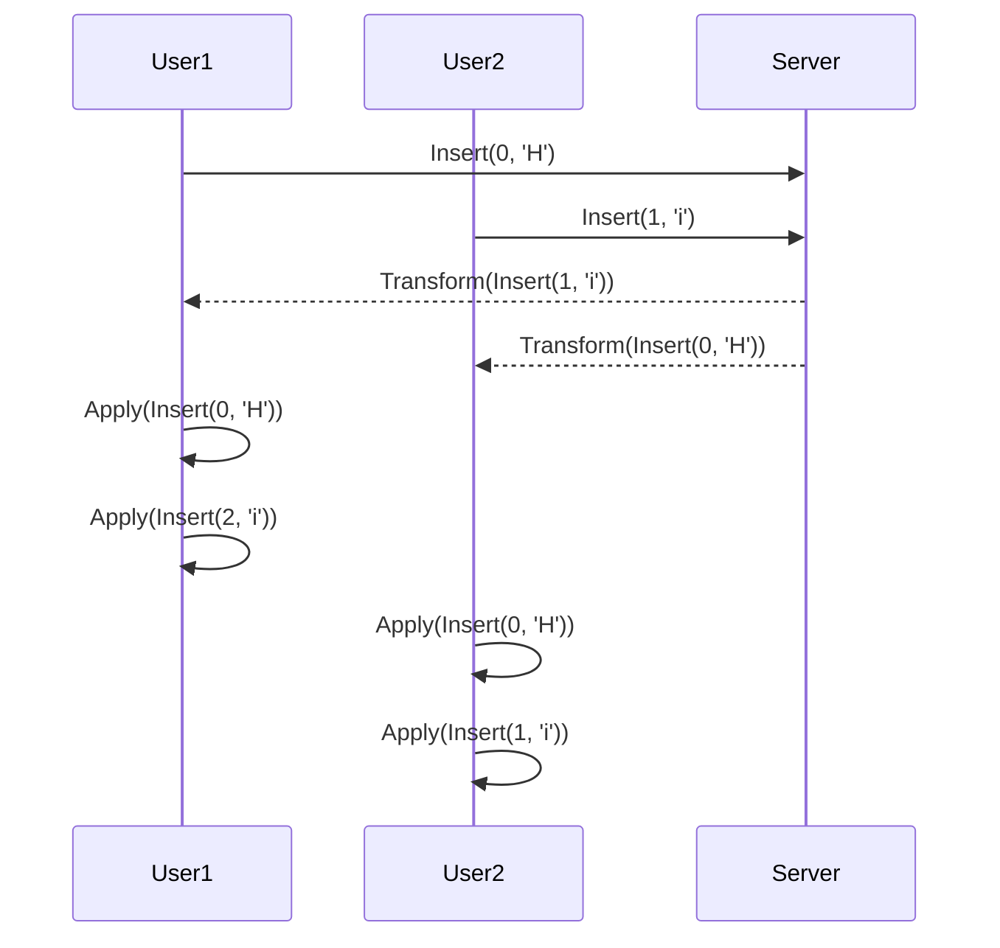

## 8.12 Operational Transformation and CRDTs

In the realm of distributed systems, maintaining consistency across multiple replicas of data is a challenging task. Two powerful techniques that address this challenge are Operational Transformation (OT) and Conflict-Free Replicated Data Types (CRDTs). This section delves into these concepts, their implementation in Scala, and their applications in distributed systems.

### Operational Transformation (OT)

#### Intent

Operational Transformation is a technique used to enable real-time collaborative editing. It allows multiple users to concurrently edit a shared document while ensuring that all changes are consistently applied across all replicas.

#### Key Participants

- **Operations**: Represent changes made to the document, such as insertions, deletions, or updates.
- **Transformation Functions**: Adjust operations to account for concurrent changes made by other users.
- **State**: The current version of the document or data structure being edited.

#### Applicability

OT is particularly useful in collaborative applications like Google Docs, where multiple users need to edit the same document simultaneously without conflicts.

#### Concepts of Operational Transformation

Operational Transformation works by transforming operations to maintain consistency across multiple replicas. When a user performs an operation, it is sent to other replicas, where it is transformed against concurrent operations to ensure that all replicas converge to the same state.

#### Implementing Operational Transformation in Scala

Let's explore a simple implementation of Operational Transformation in Scala. We'll create a collaborative text editor where users can insert and delete characters.

```scala
// Define an operation trait
sealed trait Operation {
  def transform(other: Operation): Operation
}

case class Insert(position: Int, char: Char) extends Operation {
  override def transform(other: Operation): Operation = other match {
    case Insert(otherPos, _) if otherPos <= position => Insert(position + 1, char)
    case Delete(otherPos) if otherPos < position => Insert(position - 1, char)
    case _ => this
  }
}

case class Delete(position: Int) extends Operation {
  override def transform(other: Operation): Operation = other match {
    case Insert(otherPos, _) if otherPos <= position => Delete(position + 1)
    case Delete(otherPos) if otherPos < position => Delete(position - 1)
    case _ => this
  }
}

// Example usage
val op1 = Insert(0, 'H')
val op2 = Insert(1, 'i')
val transformedOp1 = op1.transform(op2)
val transformedOp2 = op2.transform(op1)

println(transformedOp1) // Insert(0, 'H')
println(transformedOp2) // Insert(2, 'i')
```

In this example, we define two operations: `Insert` and `Delete`. Each operation has a `transform` method that adjusts the operation based on another concurrent operation. This ensures that operations can be applied in any order and still result in the same final state.

#### Visualizing Operational Transformation

To better understand how Operational Transformation works, let's visualize the transformation process using a sequence diagram.



This diagram illustrates how two users can concurrently insert characters into a shared document. The server transforms each operation before sending it to the other user, ensuring that both users end up with the same final document.

### Conflict-Free Replicated Data Types (CRDTs)

#### Intent

CRDTs are data structures designed for distributed systems that allow for eventual consistency without requiring coordination between replicas. They enable concurrent updates and ensure that all replicas converge to the same state.

#### Key Participants

- **Data Types**: Specialized data structures that support operations like add, remove, and update.
- **Merge Function**: Combines states from different replicas to ensure convergence.
- **State**: The current version of the data structure at a given replica.

#### Applicability

CRDTs are ideal for distributed systems where low latency and high availability are crucial, such as in collaborative applications, distributed databases, and real-time analytics.

#### Concepts of CRDTs

CRDTs come in two main types: state-based (or convergent) CRDTs and operation-based (or commutative) CRDTs. State-based CRDTs periodically send their entire state to other replicas, while operation-based CRDTs send only the operations performed.

#### Implementing CRDTs in Scala

Let's implement a simple Grow-Only Set (G-Set) CRDT in Scala. A G-Set allows only additions and ensures that all replicas eventually converge to the same set of elements.

```scala
// Define a G-Set CRDT
case class GSet[T](elements: Set[T]) {
  def add(element: T): GSet[T] = GSet(elements + element)

  def merge(other: GSet[T]): GSet[T] = GSet(elements union other.elements)
}

// Example usage
val set1 = GSet(Set(1, 2, 3))
val set2 = GSet(Set(3, 4, 5))

val mergedSet = set1.merge(set2)
println(mergedSet.elements) // Set(1, 2, 3, 4, 5)
```

In this example, we define a `GSet` class with `add` and `merge` methods. The `add` method adds an element to the set, while the `merge` method combines two sets by taking the union of their elements.

#### Visualizing CRDTs

Let's visualize the merging process of two G-Sets using a flowchart.

```mermaid
graph TD
    A[Set 1: {1, 2, 3}] --> B[Merge]
    C[Set 2: {3, 4, 5}] --> B
    B --> D[Result: {1, 2, 3, 4, 5}]
```

This flowchart shows how two G-Sets are merged to produce a set that contains all unique elements from both sets.

### Applications in Distributed Systems

#### Collaborative Applications

Both OT and CRDTs are widely used in collaborative applications where multiple users need to edit shared documents or data structures concurrently. OT is commonly used in real-time collaborative editors, while CRDTs are used in systems that require eventual consistency.

#### Distributed Databases

CRDTs are used in distributed databases to ensure eventual consistency without requiring coordination between replicas. This allows for low-latency reads and writes, making CRDTs ideal for applications that require high availability.

#### Real-Time Analytics

In real-time analytics, CRDTs can be used to aggregate data from multiple sources without requiring synchronization. This enables real-time insights and decision-making.

### Design Considerations

When implementing OT and CRDTs, it's important to consider the following:

- **Latency**: OT requires low-latency communication between replicas to ensure real-time collaboration. CRDTs can tolerate higher latencies as they rely on eventual consistency.
- **Complexity**: OT can be complex to implement due to the need for transformation functions. CRDTs are simpler to implement but may require more bandwidth due to state synchronization.
- **Use Case**: Choose OT for real-time collaborative applications and CRDTs for distributed systems that require eventual consistency.

### Differences and Similarities

While both OT and CRDTs aim to achieve consistency in distributed systems, they differ in their approach. OT relies on transforming operations to maintain consistency, while CRDTs use specialized data structures that converge automatically. OT is more suitable for real-time collaboration, while CRDTs are better for systems that prioritize availability and eventual consistency.

### Try It Yourself

To deepen your understanding of OT and CRDTs, try modifying the code examples provided. For OT, experiment with different types of operations and transformation functions. For CRDTs, implement other types of CRDTs, such as a Grow-Only Counter or a Last-Write-Wins Register.

### Knowledge Check

- Explain the difference between state-based and operation-based CRDTs.
- How does Operational Transformation ensure consistency in collaborative applications?
- What are the advantages of using CRDTs in distributed databases?

### Embrace the Journey

Remember, mastering OT and CRDTs is just the beginning. As you continue to explore distributed systems, you'll encounter more complex scenarios and challenges. Keep experimenting, stay curious, and enjoy the journey!

## Quiz Time!



### What is the primary goal of Operational Transformation (OT)?

- [x] To enable real-time collaborative editing by transforming operations to maintain consistency.
- [ ] To ensure low-latency communication in distributed systems.
- [ ] To provide high availability in distributed databases.
- [ ] To aggregate data from multiple sources in real-time analytics.

> **Explanation:** OT is designed to enable real-time collaborative editing by transforming operations to maintain consistency across multiple replicas.

### How do CRDTs ensure eventual consistency?

- [x] By using specialized data structures that automatically converge.
- [ ] By transforming operations to account for concurrent changes.
- [ ] By requiring low-latency communication between replicas.
- [ ] By synchronizing the entire state periodically.

> **Explanation:** CRDTs use specialized data structures that automatically converge, ensuring eventual consistency without requiring coordination.

### Which of the following is a key participant in Operational Transformation?

- [x] Transformation Functions
- [ ] Merge Function
- [ ] Data Types
- [ ] Eventual Consistency

> **Explanation:** Transformation Functions are key participants in OT, as they adjust operations to account for concurrent changes.

### What is a Grow-Only Set (G-Set) in the context of CRDTs?

- [x] A CRDT that allows only additions and ensures convergence by taking the union of elements.
- [ ] A CRDT that supports both additions and deletions.
- [ ] A CRDT that periodically sends its entire state to other replicas.
- [ ] A CRDT that relies on low-latency communication to maintain consistency.

> **Explanation:** A G-Set is a CRDT that allows only additions and ensures convergence by taking the union of elements from different replicas.

### In which scenario is Operational Transformation more suitable than CRDTs?

- [x] Real-time collaborative applications
- [ ] Distributed databases
- [ ] Real-time analytics
- [ ] High availability systems

> **Explanation:** OT is more suitable for real-time collaborative applications where multiple users need to edit shared documents concurrently.

### What is the primary difference between state-based and operation-based CRDTs?

- [x] State-based CRDTs send their entire state, while operation-based CRDTs send only the operations performed.
- [ ] State-based CRDTs require low-latency communication, while operation-based CRDTs do not.
- [ ] State-based CRDTs are more complex to implement than operation-based CRDTs.
- [ ] State-based CRDTs are used in real-time analytics, while operation-based CRDTs are not.

> **Explanation:** State-based CRDTs send their entire state to other replicas, while operation-based CRDTs send only the operations performed.

### Which of the following is a design consideration when implementing OT and CRDTs?

- [x] Latency
- [ ] Merge Function
- [ ] Data Types
- [ ] Eventual Consistency

> **Explanation:** Latency is a design consideration when implementing OT and CRDTs, as it affects the performance and consistency of the system.

### What is the advantage of using CRDTs in distributed databases?

- [x] They ensure eventual consistency without requiring coordination between replicas.
- [ ] They provide real-time collaboration capabilities.
- [ ] They require low-latency communication to maintain consistency.
- [ ] They simplify the implementation of transformation functions.

> **Explanation:** CRDTs ensure eventual consistency without requiring coordination between replicas, making them ideal for distributed databases.

### How does Operational Transformation handle concurrent operations?

- [x] By transforming operations to account for changes made by other users.
- [ ] By merging the entire state of the document.
- [ ] By requiring low-latency communication between replicas.
- [ ] By using specialized data structures that automatically converge.

> **Explanation:** OT handles concurrent operations by transforming them to account for changes made by other users, ensuring consistency.

### True or False: CRDTs require coordination between replicas to ensure consistency.

- [ ] True
- [x] False

> **Explanation:** False. CRDTs do not require coordination between replicas to ensure consistency; they use specialized data structures that automatically converge.


