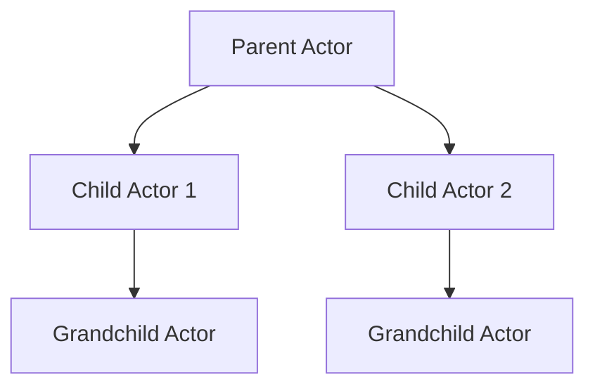
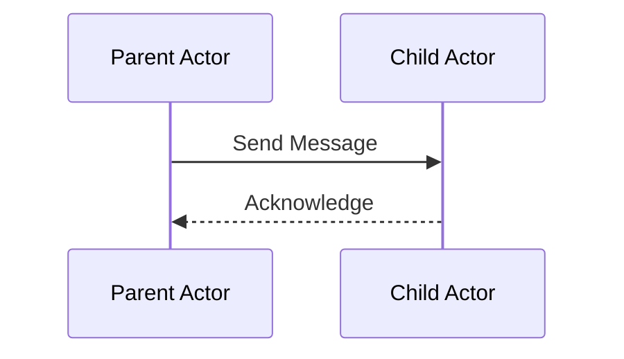

## 8.2 Actors and Akka

Concurrency through message passing is a powerful paradigm that allows developers to build scalable and resilient systems. In this section, we will explore the Akka toolkit, which provides a robust implementation of the Actor Model in Scala. Akka Actors enable developers to design systems that are both concurrent and distributed, leveraging message passing to achieve high levels of performance and fault tolerance.

### Introduction to the Actor Model

The Actor Model is a conceptual model for dealing with concurrent computation. It was first introduced by Carl Hewitt in 1973 and has since become a foundational concept in building distributed systems. In the Actor Model, the primary abstraction is the "actor," which is an independent computational entity that communicates with other actors through message passing.

#### Key Concepts of the Actor Model

- **Actors**: The fundamental unit of computation. Each actor has its own state and behavior and interacts with other actors solely through message passing.
- **Messages**: The means by which actors communicate. Messages are sent asynchronously and are processed one at a time by the receiving actor.
- **Mailboxes**: Each actor has a mailbox where incoming messages are queued. The actor processes messages from its mailbox sequentially.
- **No Shared State**: Actors do not share state with each other, which eliminates the need for locks and reduces the risk of race conditions.

### Akka: A Toolkit for Building Actor-Based Systems

Akka is a powerful toolkit for building concurrent, distributed, and fault-tolerant applications on the JVM. It provides a high-level abstraction for implementing the Actor Model in Scala, making it easier to build systems that can scale horizontally across multiple nodes.

#### Features of Akka

- **Lightweight Actors**: Akka actors are lightweight and can be created in large numbers, making it possible to model complex systems with many interacting components.
- **Fault Tolerance**: Akka provides built-in support for fault tolerance through supervision strategies, allowing systems to recover gracefully from failures.
- **Location Transparency**: Actors can be distributed across multiple nodes, and Akka handles the complexities of network communication, providing a unified programming model.
- **Integration with Other Akka Modules**: Akka integrates seamlessly with other Akka modules such as Akka Streams and Akka HTTP, enabling developers to build end-to-end reactive systems.

### Designing Systems with Akka Actors

When designing systems with Akka Actors, it's important to consider the architecture and how actors will interact with each other. Let's explore some key design considerations and best practices for building actor-based systems.

#### Actor Hierarchies and Supervision

Actors in Akka are organized into hierarchies, with each actor having a parent and potentially multiple children. This hierarchy is used to manage actor lifecycles and implement supervision strategies.

- **Parent-Child Relationships**: Each actor can create child actors, forming a tree-like structure. The parent actor is responsible for managing the lifecycle of its children.
- **Supervision Strategies**: Parents can define supervision strategies to handle failures in child actors. Common strategies include restarting the child, stopping the child, or escalating the failure to the parent.

```scala
import akka.actor.{Actor, ActorSystem, Props, SupervisorStrategy, OneForOneStrategy}
import akka.actor.SupervisorStrategy._

class ParentActor extends Actor {
  override val supervisorStrategy: SupervisorStrategy = OneForOneStrategy() {
    case _: Exception => Restart
  }

  def receive: Receive = {
    case "createChild" =>
      val child = context.actorOf(Props[ChildActor], "child")
      child ! "hello"
  }
}

class ChildActor extends Actor {
  def receive: Receive = {
    case "hello" => println("Hello from child actor!")
  }
}

val system = ActorSystem("MyActorSystem")
val parent = system.actorOf(Props[ParentActor], "parent")
parent ! "createChild"
```

In this example, the `ParentActor` creates a `ChildActor` and defines a supervision strategy to restart the child in case of an exception.

#### Message Passing and Protocol Design

Designing effective communication protocols between actors is crucial for building robust systems. Messages should be immutable and self-contained, providing all the information needed for the receiving actor to process them.

- **Immutable Messages**: Use case classes or other immutable data structures for messages to ensure thread safety.
- **Protocol Design**: Define clear protocols for communication between actors, specifying the types of messages each actor can handle.

```scala
case class Greet(name: String)

class GreeterActor extends Actor {
  def receive: Receive = {
    case Greet(name) => println(s"Hello, $name!")
  }
}

val greeter = system.actorOf(Props[GreeterActor], "greeter")
greeter ! Greet("Scala Developer")
```

In this example, the `GreeterActor` handles `Greet` messages, which are defined as immutable case classes.

#### Actor Lifecycle and State Management

Actors have a well-defined lifecycle, including creation, processing messages, and termination. Managing actor state effectively is key to building responsive systems.

- **State Management**: Actors can maintain internal state, which is encapsulated and only accessible to the actor itself.
- **Lifecycle Hooks**: Akka provides lifecycle hooks such as `preStart`, `postStop`, and `preRestart` for managing actor initialization and cleanup.

```scala
class StatefulActor extends Actor {
  private var count = 0

  override def preStart(): Unit = {
    println("Actor is starting")
  }

  def receive: Receive = {
    case "increment" => count += 1
    case "getCount" => sender() ! count
  }

  override def postStop(): Unit = {
    println("Actor is stopping")
  }
}

val statefulActor = system.actorOf(Props[StatefulActor], "statefulActor")
statefulActor ! "increment"
statefulActor ! "getCount"
```

In this example, the `StatefulActor` maintains an internal counter and uses lifecycle hooks to perform actions during startup and shutdown.

### Advanced Akka Features

Akka provides a rich set of features for building advanced actor-based systems. Let's explore some of these features and how they can be used to enhance your applications.

#### Akka Persistence

Akka Persistence allows actors to persist their state, enabling them to recover from failures and continue processing from where they left off.

- **Event Sourcing**: Persist events that represent changes to an actor's state, allowing the actor to reconstruct its state by replaying these events.
- **Snapshotting**: Periodically save snapshots of an actor's state to reduce the time needed for recovery.

```scala
import akka.persistence.{PersistentActor, SnapshotOffer}

case class Increment()
case class GetCount()
case class CountChanged(delta: Int)

class PersistentCounter extends PersistentActor {
  override def persistenceId: String = "persistent-counter"

  private var count = 0

  def updateState(event: CountChanged): Unit = {
    count += event.delta
  }

  override def receiveRecover: Receive = {
    case evt: CountChanged => updateState(evt)
    case SnapshotOffer(_, snapshot: Int) => count = snapshot
  }

  override def receiveCommand: Receive = {
    case Increment() =>
      persist(CountChanged(1))(updateState)
    case GetCount => sender() ! count
  }
}

val persistentCounter = system.actorOf(Props[PersistentCounter], "persistentCounter")
persistentCounter ! Increment()
persistentCounter ! GetCount()
```

In this example, the `PersistentCounter` actor uses event sourcing to persist changes to its state and can recover its state by replaying events.

#### Akka Clustering

Akka Clustering allows actors to be distributed across multiple nodes, providing scalability and fault tolerance.

- **Cluster Membership**: Nodes can join or leave the cluster dynamically, and Akka manages the cluster membership.
- **Cluster Sharding**: Distribute actors across the cluster, ensuring that each actor is hosted on exactly one node.

```scala
import akka.cluster.sharding.{ClusterSharding, ClusterShardingSettings, ShardRegion}

val extractEntityId: ShardRegion.ExtractEntityId = {
  case msg @ EntityEnvelope(id, payload) => (id.toString, msg)
}

val extractShardId: ShardRegion.ExtractShardId = {
  case EntityEnvelope(id, _) => (id % 100).toString
}

val shardRegion = ClusterSharding(system).start(
  typeName = "Entity",
  entityProps = Props[EntityActor],
  settings = ClusterShardingSettings(system),
  extractEntityId = extractEntityId,
  extractShardId = extractShardId
)
```

In this example, Akka Clustering is used to shard actors across the cluster, ensuring that each actor is uniquely identified and distributed.

### Visualizing Akka Actor Systems

To better understand the architecture of an Akka Actor system, let's visualize the actor hierarchy and message flow using Mermaid.js diagrams.



**Diagram Description**: This diagram illustrates a simple actor hierarchy, where a parent actor has two child actors, each of which has its own child actor.



**Diagram Description**: This sequence diagram shows the message flow between a parent actor and a child actor, highlighting the asynchronous nature of message passing.

### Try It Yourself

To deepen your understanding of Akka Actors, try modifying the provided code examples. Here are some suggestions:

- **Add New Messages**: Extend the `GreeterActor` to handle additional messages, such as a farewell message.
- **Implement a Supervisor Strategy**: Experiment with different supervision strategies in the `ParentActor` example and observe how they affect child actor behavior.
- **Persist Additional State**: Modify the `PersistentCounter` to persist additional state, such as a history of increments.

### References and Further Reading

- [Akka Documentation](https://doc.akka.io/docs/akka/current/)
- [Reactive Design Patterns](https://www.manning.com/books/reactive-design-patterns)
- [Scala and Akka: A Comprehensive Guide](https://www.oreilly.com/library/view/scala-and-akka/)

### Knowledge Check

Before we wrap up, let's reinforce what we've learned with some questions:

1. What is the primary abstraction in the Actor Model?
2. How do actors communicate with each other?
3. What is the purpose of a supervision strategy in Akka?
4. How does Akka Persistence help in building resilient systems?
5. What is the benefit of using Akka Clustering?

### Conclusion

Akka Actors provide a powerful abstraction for building concurrent and distributed systems in Scala. By leveraging message passing, actors can interact with each other in a decoupled and scalable manner. Akka's rich feature set, including persistence and clustering, enables developers to build robust systems that can handle failures gracefully and scale across multiple nodes.

Remember, this is just the beginning. As you continue to explore Akka and the Actor Model, you'll discover new ways to build responsive and resilient applications. Keep experimenting, stay curious, and enjoy the journey!

## Quiz Time!



### What is the primary abstraction in the Actor Model?

- [x] Actor
- [ ] Thread
- [ ] Process
- [ ] Function

> **Explanation:** The primary abstraction in the Actor Model is the actor, which is an independent computational entity that communicates with other actors through message passing.

### How do actors communicate with each other?

- [x] Through message passing
- [ ] By sharing state
- [ ] Using global variables
- [ ] Through direct method calls

> **Explanation:** Actors communicate with each other through message passing, which allows for asynchronous and decoupled interactions.

### What is the purpose of a supervision strategy in Akka?

- [x] To manage actor failures
- [ ] To optimize performance
- [ ] To enhance security
- [ ] To improve scalability

> **Explanation:** A supervision strategy in Akka is used to manage actor failures, allowing the system to recover gracefully from errors.

### How does Akka Persistence help in building resilient systems?

- [x] By allowing actors to persist their state
- [ ] By improving performance
- [ ] By enhancing security
- [ ] By reducing memory usage

> **Explanation:** Akka Persistence allows actors to persist their state, enabling them to recover from failures and continue processing from where they left off.

### What is the benefit of using Akka Clustering?

- [x] Scalability and fault tolerance
- [ ] Improved security
- [ ] Reduced memory usage
- [ ] Faster execution

> **Explanation:** Akka Clustering provides scalability and fault tolerance by allowing actors to be distributed across multiple nodes.

### What is a key feature of Akka actors?

- [x] Lightweight and can be created in large numbers
- [ ] Require heavy resources
- [ ] Share state with other actors
- [ ] Operate synchronously

> **Explanation:** Akka actors are lightweight and can be created in large numbers, making them suitable for modeling complex systems with many interacting components.

### What is the role of a mailbox in the Actor Model?

- [x] To queue incoming messages for an actor
- [ ] To store actor state
- [ ] To manage actor lifecycle
- [ ] To handle actor failures

> **Explanation:** In the Actor Model, each actor has a mailbox where incoming messages are queued. The actor processes messages from its mailbox sequentially.

### What is the purpose of lifecycle hooks in Akka?

- [x] To manage actor initialization and cleanup
- [ ] To enhance security
- [ ] To improve performance
- [ ] To reduce memory usage

> **Explanation:** Lifecycle hooks in Akka, such as `preStart` and `postStop`, are used to manage actor initialization and cleanup.

### What is an advantage of using immutable messages in Akka?

- [x] Ensures thread safety
- [ ] Increases performance
- [ ] Reduces memory usage
- [ ] Enhances security

> **Explanation:** Using immutable messages in Akka ensures thread safety, as immutable objects cannot be modified after they are created.

### Akka Clustering allows actors to be distributed across multiple nodes.

- [x] True
- [ ] False

> **Explanation:** Akka Clustering allows actors to be distributed across multiple nodes, providing scalability and fault tolerance.


