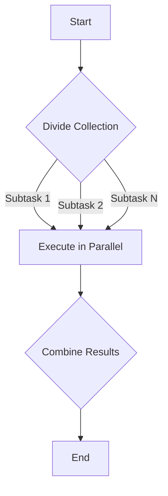

## 8.3 Parallel Collections

In the world of modern software development, performance and efficiency are paramount. As systems grow in complexity and data volumes increase, the ability to process data concurrently becomes a critical skill for software engineers. Scala, with its robust support for functional programming and concurrency, offers a powerful toolset for parallel processing. In this section, we will delve into the concept of parallel collections in Scala, explore how to use them effectively, and understand the underlying mechanisms that make them a valuable asset in your programming toolkit.

### Introduction to Parallel Collections

Parallel collections in Scala provide a straightforward way to leverage multi-core processors by distributing operations across multiple threads. This can lead to significant performance improvements, especially for CPU-bound tasks that involve large datasets. By simply converting a standard collection to a parallel collection, you can take advantage of parallel processing with minimal changes to your code.

#### Key Concepts

- **Concurrency vs. Parallelism**: Concurrency involves managing multiple tasks at the same time, while parallelism involves executing multiple tasks simultaneously. Parallel collections focus on parallelism, distributing tasks across multiple cores.
- **Immutable Collections**: Scala's immutable collections are inherently thread-safe, making them ideal for parallel processing.
- **Functional Programming**: The functional programming paradigm, with its emphasis on immutability and pure functions, aligns well with parallel processing, reducing the risk of race conditions and side effects.

### Why Use Parallel Collections?

Parallel collections are particularly useful when dealing with large datasets or computationally intensive tasks. They allow you to:

- **Improve Performance**: By distributing work across multiple cores, parallel collections can significantly reduce execution time.
- **Simplify Code**: With parallel collections, you can achieve parallelism without explicitly managing threads or synchronization.
- **Leverage Multi-Core Architectures**: Modern processors have multiple cores, and parallel collections enable you to utilize these resources effectively.

### Converting to Parallel Collections

Scala provides a simple way to convert a standard collection to a parallel collection using the `par` method. This method is available on all standard collections and returns a parallel version of the collection.

```scala
val numbers = (1 to 1000000).toList
val parallelNumbers = numbers.par
```

In this example, `numbers` is a standard list, and `parallelNumbers` is its parallel counterpart. Operations on `parallelNumbers` will be executed in parallel.

### Operations on Parallel Collections

Once you have a parallel collection, you can perform various operations such as `map`, `filter`, `reduce`, and `fold` in parallel. These operations are executed concurrently across multiple threads, potentially leading to performance gains.

#### Example: Parallel Map

```scala
val numbers = (1 to 1000000).toList.par
val squaredNumbers = numbers.map(n => n * n)
```

In this example, the `map` operation is applied in parallel, with each element being squared concurrently.

#### Example: Parallel Reduce

```scala
val numbers = (1 to 1000000).toList.par
val sum = numbers.reduce(_ + _)
```

The `reduce` operation sums the elements of the collection in parallel, distributing the work across multiple threads.

### Understanding the Execution Model

Parallel collections in Scala use a fork/join framework under the hood. This framework divides tasks into smaller subtasks, executes them concurrently, and then combines the results. The fork/join model is well-suited for divide-and-conquer algorithms, where a problem can be broken down into independent subproblems.

#### Fork/Join Framework

- **Fork**: A task is split into smaller subtasks, which are executed concurrently.
- **Join**: The results of the subtasks are combined to produce the final result.

### Performance Considerations

While parallel collections can offer performance improvements, they are not a silver bullet. It's important to consider the following factors:

- **Overhead**: Parallel processing introduces overhead due to task creation and synchronization. For small datasets, this overhead can outweigh the benefits.
- **Immutability**: Parallel collections work best with immutable data structures, as they eliminate the need for synchronization.
- **Task Granularity**: The size of the tasks should be balanced. Too small tasks can lead to excessive overhead, while too large tasks may not fully utilize available cores.

### Visualizing Parallel Collection Execution

To better understand how parallel collections work, let's visualize the execution model using a Mermaid.js diagram.



**Diagram Description**: This diagram illustrates the fork/join model used by parallel collections. The collection is divided into subtasks, each executed in parallel. The results are then combined to produce the final output.

### Code Example: Parallel Word Count

Let's explore a practical example of using parallel collections to perform a word count on a large text.

```scala
import scala.io.Source

val text = Source.fromFile("large_text_file.txt").getLines().mkString(" ")
val words = text.split("\\s+").par
val wordCount = words.map(word => (word, 1)).groupBy(_._1).mapValues(_.size)

wordCount.foreach { case (word, count) =>
  println(s"$word: $count")
}
```

In this example, we read a large text file, split it into words, and use parallel collections to count the occurrences of each word. The `map`, `groupBy`, and `mapValues` operations are executed in parallel, improving performance.

### Try It Yourself

To get hands-on experience with parallel collections, try modifying the code examples provided. Experiment with different operations and observe the performance impact. Consider using a larger dataset to see the benefits of parallel processing.

### Design Considerations

When using parallel collections, keep the following considerations in mind:

- **Data Size**: Parallel collections are most effective with large datasets.
- **Operation Complexity**: Ensure that the operations performed on the collection are computationally intensive enough to benefit from parallelism.
- **Immutability**: Use immutable data structures to avoid synchronization issues.

### Differences and Similarities with Other Patterns

Parallel collections share similarities with other concurrency patterns, such as futures and actors, but they are distinct in their focus on data parallelism. While futures and actors are more suitable for task parallelism and message-passing, parallel collections excel at processing large datasets in parallel.

### Conclusion

Parallel collections in Scala offer a powerful and easy-to-use mechanism for improving the performance of data-intensive applications. By leveraging the multi-core capabilities of modern processors, you can achieve significant speedups with minimal code changes. As you continue to explore Scala's concurrency features, remember to consider the trade-offs and choose the right tool for the job.

### Further Reading

For more information on parallel collections and concurrency in Scala, consider exploring the following resources:

- [Scala Documentation on Parallel Collections](https://docs.scala-lang.org/overviews/parallel-collections/overview.html)
- [Java Fork/Join Framework](https://docs.oracle.com/javase/tutorial/essential/concurrency/forkjoin.html)

## Quiz Time!



### What is the primary advantage of using parallel collections in Scala?

- [x] Improved performance through parallel execution
- [ ] Simplified code syntax
- [ ] Enhanced security features
- [ ] Increased memory usage

> **Explanation:** Parallel collections improve performance by distributing tasks across multiple cores, allowing for concurrent execution of operations.

### Which method is used to convert a standard collection to a parallel collection in Scala?

- [x] `par`
- [ ] `parallel`
- [ ] `concurrent`
- [ ] `async`

> **Explanation:** The `par` method is used to convert a standard collection to a parallel collection in Scala.

### What is the underlying framework used by Scala's parallel collections?

- [x] Fork/Join Framework
- [ ] Actor Model
- [ ] Reactive Streams
- [ ] Thread Pool

> **Explanation:** Scala's parallel collections use the Fork/Join Framework to divide tasks into smaller subtasks and execute them concurrently.

### What is a potential drawback of using parallel collections for small datasets?

- [x] Overhead may outweigh benefits
- [ ] Increased memory usage
- [ ] Reduced code readability
- [ ] Security vulnerabilities

> **Explanation:** For small datasets, the overhead of parallel processing can outweigh the performance benefits, making it less efficient.

### Which of the following operations can be performed in parallel using parallel collections?

- [x] `map`
- [x] `reduce`
- [ ] `println`
- [ ] `readLine`

> **Explanation:** Operations like `map` and `reduce` can be executed in parallel on parallel collections, while `println` and `readLine` are not suitable for parallel execution.

### What is the primary focus of parallel collections compared to futures and actors?

- [x] Data parallelism
- [ ] Task parallelism
- [ ] Message-passing
- [ ] Error handling

> **Explanation:** Parallel collections focus on data parallelism, distributing data processing tasks across multiple cores.

### Which of the following is a key consideration when using parallel collections?

- [x] Data size
- [x] Operation complexity
- [ ] Network latency
- [ ] User interface design

> **Explanation:** Data size and operation complexity are important considerations when using parallel collections to ensure performance benefits.

### In the fork/join model, what does the "fork" step involve?

- [x] Dividing tasks into smaller subtasks
- [ ] Combining results of subtasks
- [ ] Synchronizing threads
- [ ] Allocating memory

> **Explanation:** The "fork" step involves dividing tasks into smaller subtasks that can be executed concurrently.

### True or False: Parallel collections in Scala are inherently thread-safe due to their immutability.

- [x] True
- [ ] False

> **Explanation:** Parallel collections are thread-safe because they are based on immutable data structures, eliminating the need for synchronization.

### What is a common use case for parallel collections in Scala?

- [x] Processing large datasets
- [ ] Building user interfaces
- [ ] Managing network connections
- [ ] Handling file I/O

> **Explanation:** Parallel collections are commonly used for processing large datasets, where parallel execution can significantly improve performance.


