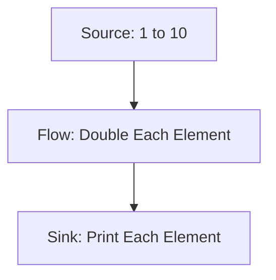

## 8.4 Reactive Streams and Akka Streams

In the realm of modern software development, handling asynchronous data streams efficiently is crucial for building responsive and scalable applications. Scala, with its robust ecosystem, provides powerful tools for managing such streams through Reactive Streams and Akka Streams. In this section, we will delve into these concepts, exploring their architecture, key components, and practical implementation techniques.

### Introduction to Reactive Streams

Reactive Streams is a specification aimed at providing a standard for asynchronous stream processing with non-blocking backpressure. This specification is crucial for building systems that can handle large volumes of data efficiently without overwhelming the system resources.

#### Key Concepts of Reactive Streams

- **Asynchronous Processing**: Reactive Streams enables the processing of data asynchronously, allowing systems to handle multiple tasks concurrently without blocking the main execution thread.
  
- **Backpressure**: This is a mechanism to ensure that a data producer does not overwhelm a consumer by sending data faster than it can be processed. Reactive Streams provides a way to manage backpressure effectively.

- **Publisher-Subscriber Model**: Reactive Streams follows a publisher-subscriber model where data is emitted by a publisher and consumed by a subscriber. This model decouples the production and consumption of data, providing flexibility and scalability.

- **Processor**: A processor is a component that acts as both a subscriber and a publisher. It can transform data as it passes through the stream.

#### Why Reactive Streams?

Reactive Streams is designed to handle asynchronous data streams in a way that is both efficient and scalable. By adhering to a standard specification, it ensures interoperability between different libraries and frameworks, making it a versatile choice for developers.

### Akka Streams: An Overview

Akka Streams is an implementation of the Reactive Streams specification, built on top of the Akka toolkit. It provides a powerful and flexible API for building streaming applications in Scala.

#### Architecture of Akka Streams

Akka Streams is built around a few core components:

- **Source**: Represents the starting point of a stream. It can emit data elements to the stream.

- **Sink**: Represents the endpoint of a stream where data is consumed.

- **Flow**: Represents a processing stage in a stream. It can transform data as it passes through.

- **Graph**: A more complex structure that allows for the composition of multiple sources, sinks, and flows.

#### Key Features of Akka Streams

- **Modularity**: Akka Streams allows for the composition of complex processing pipelines using simple building blocks.

- **Backpressure Handling**: By adhering to the Reactive Streams specification, Akka Streams provides robust backpressure handling out of the box.

- **Integration with Akka Actors**: Akka Streams integrates seamlessly with Akka Actors, allowing for the creation of highly concurrent and distributed systems.

- **Materialization**: Akka Streams provides a mechanism for materializing streams, allowing for the extraction of runtime information and metrics.

### Implementing Reactive Streams with Akka Streams

Let's explore how to implement a simple reactive stream using Akka Streams. We'll start by setting up a basic stream that processes a sequence of integers.

#### Setting Up Akka Streams

To use Akka Streams, you need to add the following dependencies to your `build.sbt` file:

```scala
libraryDependencies += "com.typesafe.akka" %% "akka-stream" % "2.6.19"
```

#### Creating a Simple Stream

We'll create a simple stream that processes a sequence of integers, doubling each value and printing the result.

```scala
import akka.actor.ActorSystem
import akka.stream.scaladsl.{Sink, Source}
import akka.stream.ActorMaterializer

object SimpleStreamApp extends App {
  implicit val system: ActorSystem = ActorSystem("SimpleStreamSystem")
  implicit val materializer: ActorMaterializer = ActorMaterializer()

  // Create a source that emits integers from 1 to 10
  val source = Source(1 to 10)

  // Create a flow that doubles each element
  val flow = source.map(_ * 2)

  // Create a sink that prints each element
  val sink = flow.to(Sink.foreach(println))

  // Run the stream
  sink.run()

  // Shut down the actor system
  system.terminate()
}
```

#### Explanation of the Code

- **Source**: We create a source that emits integers from 1 to 10.
- **Flow**: We define a flow that doubles each element in the stream.
- **Sink**: We create a sink that prints each element to the console.
- **Materialization**: The `run` method materializes the stream, starting the data flow from the source to the sink.

### Advanced Stream Processing with Akka Streams

Akka Streams provides a rich set of operators for building complex data processing pipelines. Let's explore some advanced concepts and operators.

#### Combining Streams

You can combine multiple streams using operators like `merge`, `concat`, and `zip`.

```scala
import akka.stream.scaladsl.{Merge, Sink, Source}

val source1 = Source(1 to 5)
val source2 = Source(6 to 10)

// Merge two sources into one
val mergedSource = Source.combine(source1, source2)(Merge(_))

// Print the merged stream
mergedSource.runWith(Sink.foreach(println))
```

#### Handling Errors

Akka Streams provides mechanisms for handling errors gracefully using the `recover` and `recoverWith` operators.

```scala
val faultySource = Source(1 to 5).map(n => if (n == 3) throw new RuntimeException("Error!") else n)

// Recover from errors
val recoveredSource = faultySource.recover {
  case _: RuntimeException => -1
}

// Print the recovered stream
recoveredSource.runWith(Sink.foreach(println))
```

#### Backpressure and Buffering

Akka Streams handles backpressure automatically, but you can also configure buffering strategies to optimize performance.

```scala
import akka.stream.OverflowStrategy

val bufferedSource = Source(1 to 100)
  .buffer(10, OverflowStrategy.dropHead)
  .map { n =>
    println(s"Processing $n")
    n
  }

bufferedSource.runWith(Sink.ignore)
```

### Visualizing Akka Streams

To better understand the flow of data in Akka Streams, let's visualize a simple stream using Mermaid.js.



This diagram represents a simple stream where data flows from a source, through a flow that doubles each element, and finally to a sink that prints each element.

### Practical Applications of Akka Streams

Akka Streams can be used in a variety of real-world applications, from data processing pipelines to real-time analytics systems. Let's explore some practical use cases.

#### Real-Time Data Processing

Akka Streams is well-suited for building real-time data processing systems. For example, you can use it to process log files, filter events, and aggregate metrics in real-time.

```scala
import akka.stream.scaladsl.{FileIO, Framing}
import akka.util.ByteString
import java.nio.file.Paths

val logFileSource = FileIO.fromPath(Paths.get("logs.txt"))
val frameDelimiter = Framing.delimiter(ByteString("\n"), 256, allowTruncation = true)

val logProcessor = logFileSource
  .via(frameDelimiter)
  .map(_.utf8String)
  .filter(_.contains("ERROR"))
  .to(Sink.foreach(println))

logProcessor.run()
```

#### Building ETL Pipelines

Akka Streams can be used to build ETL (Extract, Transform, Load) pipelines, allowing you to extract data from various sources, transform it, and load it into a database or data warehouse.

```scala
import akka.stream.scaladsl.{JdbcSink, Source}

val dataSource = Source(List("data1", "data2", "data3"))

val etlPipeline = dataSource
  .map(data => data.toUpperCase)
  .to(JdbcSink.sink("INSERT INTO table_name (column) VALUES (?)", connection))

etlPipeline.run()
```

### Try It Yourself

Experiment with the code examples provided in this section. Try modifying the streams to process different types of data, apply different transformations, or handle errors in various ways. This hands-on approach will deepen your understanding of Reactive Streams and Akka Streams.

### Knowledge Check

- Explain the key concepts of Reactive Streams.
- How does Akka Streams handle backpressure?
- What are some practical applications of Akka Streams?

### Conclusion

Reactive Streams and Akka Streams provide powerful tools for handling asynchronous data streams in Scala. By understanding their architecture and key components, you can build efficient and scalable streaming applications. Remember, this is just the beginning. As you progress, you'll discover more advanced techniques and patterns for stream processing. Keep experimenting, stay curious, and enjoy the journey!

## Quiz Time!



### What is the primary purpose of Reactive Streams?

- [x] To provide a standard for asynchronous stream processing with non-blocking backpressure.
- [ ] To handle synchronous data processing.
- [ ] To replace traditional database systems.
- [ ] To manage user authentication in web applications.

> **Explanation:** Reactive Streams is designed to handle asynchronous data streams efficiently, with a focus on non-blocking backpressure.

### Which component in Akka Streams represents the starting point of a stream?

- [x] Source
- [ ] Sink
- [ ] Flow
- [ ] Graph

> **Explanation:** In Akka Streams, a Source represents the starting point of a stream where data is emitted.

### How does Akka Streams handle backpressure?

- [x] Automatically, by managing the flow of data between producers and consumers.
- [ ] Manually, requiring developers to implement custom backpressure handling.
- [ ] By ignoring it, leading to potential data loss.
- [ ] By using external libraries for backpressure management.

> **Explanation:** Akka Streams handles backpressure automatically, ensuring that data flows smoothly between producers and consumers.

### What operator can be used to combine multiple streams in Akka Streams?

- [x] Merge
- [ ] Split
- [ ] Filter
- [ ] Map

> **Explanation:** The Merge operator in Akka Streams is used to combine multiple streams into one.

### Which of the following is a practical application of Akka Streams?

- [x] Real-time data processing
- [ ] Static web page rendering
- [ ] Image editing
- [ ] Text formatting

> **Explanation:** Akka Streams is well-suited for real-time data processing, allowing for efficient handling of continuous data flows.

### What is the role of a Processor in Reactive Streams?

- [x] It acts as both a subscriber and a publisher, transforming data as it passes through.
- [ ] It only emits data to the stream.
- [ ] It only consumes data from the stream.
- [ ] It manages user sessions in web applications.

> **Explanation:** A Processor in Reactive Streams acts as both a subscriber and a publisher, allowing for data transformation within the stream.

### What is the purpose of the `recover` operator in Akka Streams?

- [x] To handle errors gracefully by providing a fallback value.
- [ ] To split the stream into multiple branches.
- [ ] To merge multiple streams into one.
- [ ] To delay the processing of data elements.

> **Explanation:** The `recover` operator in Akka Streams is used to handle errors by providing a fallback value, ensuring that the stream can continue processing.

### How can you visualize the flow of data in Akka Streams?

- [x] Using Mermaid.js diagrams
- [ ] By printing debug statements
- [ ] By using a spreadsheet
- [ ] By writing custom visualization software

> **Explanation:** Mermaid.js diagrams can be used to visually represent the flow of data in Akka Streams, providing a clear understanding of the stream's architecture.

### What is the significance of materialization in Akka Streams?

- [x] It allows for the extraction of runtime information and metrics from the stream.
- [ ] It is used to merge multiple streams into one.
- [ ] It provides a way to handle errors in the stream.
- [ ] It is used to delay the processing of data elements.

> **Explanation:** Materialization in Akka Streams allows for the extraction of runtime information and metrics, providing insights into the stream's performance.

### True or False: Akka Streams can be used to build ETL pipelines.

- [x] True
- [ ] False

> **Explanation:** Akka Streams is well-suited for building ETL pipelines, allowing for the extraction, transformation, and loading of data efficiently.


