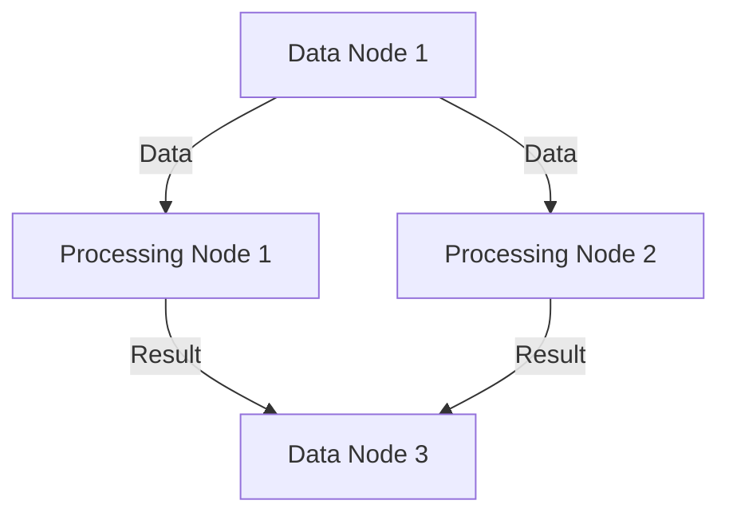
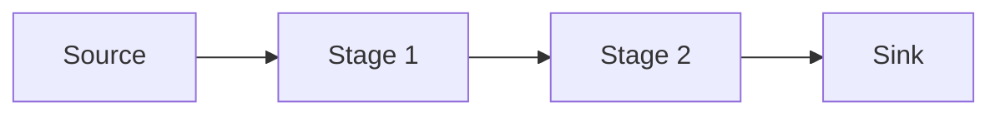

## 8.5 Advanced Concurrency Patterns

Concurrency is a cornerstone of modern software development, enabling applications to perform multiple operations simultaneously and efficiently. In Scala, advanced concurrency patterns such as dataflow and pipeline architectures play a crucial role in designing systems that can handle complex data processing tasks. This section delves into these patterns, providing expert software engineers and architects with the knowledge and tools to implement them effectively.

### Understanding Concurrency in Scala

Before diving into advanced patterns, let's briefly recap the concurrency model in Scala. Scala, being a JVM language, leverages Java's concurrency primitives but also introduces its own abstractions, such as Futures, Promises, and the Akka framework, to simplify concurrent programming.

#### Key Concurrency Concepts

- **Threading**: The basic unit of execution in concurrent programming. Scala provides high-level abstractions over threads to simplify their management.
- **Futures and Promises**: Asynchronous computations that will eventually yield a result. Futures are read-only, while Promises allow you to complete a future.
- **Actors**: A model for concurrent computation that encapsulates state and behavior, communicating through message passing.

### Dataflow Concurrency Pattern

The dataflow concurrency pattern is a paradigm where the execution of operations is driven by the availability of data rather than control flow. This pattern is particularly useful in scenarios where tasks can be decomposed into discrete steps that can run independently and concurrently.

#### Intent

The intent of the dataflow pattern is to enable parallel execution of tasks by defining dependencies between data and operations. This allows for efficient utilization of resources and improved performance in data-intensive applications.

#### Key Participants

- **Data Nodes**: Represent the data being processed. They can be inputs, intermediate results, or final outputs.
- **Processing Nodes**: Perform operations on data nodes. These nodes can execute concurrently if their input data is available.
- **Data Dependencies**: Define the relationships between data nodes and processing nodes, dictating the flow of data through the system.

#### Applicability

Use the dataflow pattern when:

- Tasks can be decomposed into independent units of work.
- There are clear data dependencies between tasks.
- You need to maximize parallelism and resource utilization.

#### Sample Code Snippet

Let's explore a simple dataflow example in Scala using Futures to represent asynchronous computations:

```scala
import scala.concurrent._
import scala.concurrent.ExecutionContext.Implicits.global
import scala.util._

object DataflowExample {
  def main(args: Array[String]): Unit = {
    // Define data nodes as Futures
    val dataNode1 = Future { 42 }
    val dataNode2 = Future { 58 }

    // Define a processing node that depends on dataNode1 and dataNode2
    val processingNode = for {
      value1 <- dataNode1
      value2 <- dataNode2
    } yield value1 + value2

    // Handle the result of the processing node
    processingNode.onComplete {
      case Success(result) => println(s"Result: $result")
      case Failure(e) => println(s"Error: ${e.getMessage}")
    }

    // Keep the JVM alive to see the result
    Thread.sleep(1000)
  }
}
```

In this example, `dataNode1` and `dataNode2` are independent computations that can run concurrently. The `processingNode` waits for both to complete before executing its logic.

#### Design Considerations

- **Data Dependencies**: Clearly define dependencies to prevent deadlocks and ensure correct execution order.
- **Error Handling**: Implement robust error handling to manage failures in asynchronous computations.
- **Scalability**: Ensure that the system can scale with the number of data nodes and processing nodes.

### Pipeline Concurrency Pattern

The pipeline concurrency pattern involves organizing tasks into a sequence of processing stages, where each stage performs a specific operation on the data and passes the result to the next stage. This pattern is ideal for scenarios where data needs to be processed in a series of transformations.

#### Intent

The intent of the pipeline pattern is to decompose complex processing tasks into simpler, sequential stages, allowing for concurrent execution of each stage and efficient data processing.

#### Key Participants

- **Stages**: Individual processing units that perform specific operations on data.
- **Data Stream**: The flow of data through the pipeline, moving from one stage to the next.
- **Buffers**: Temporary storage between stages to manage data flow and handle backpressure.

#### Applicability

Use the pipeline pattern when:

- Data processing can be broken down into a series of transformations.
- Each transformation is independent and can be executed concurrently.
- You need to manage data flow and backpressure effectively.

#### Sample Code Snippet

Let's implement a simple pipeline using Akka Streams, a powerful library for handling data streams in Scala:

```scala
import akka.actor.ActorSystem
import akka.stream._
import akka.stream.scaladsl._

object PipelineExample {
  implicit val system: ActorSystem = ActorSystem("PipelineSystem")
  implicit val materializer: Materializer = Materializer(system)

  def main(args: Array[String]): Unit = {
    // Define the stages of the pipeline
    val source = Source(1 to 10)
    val stage1 = Flow[Int].map(_ * 2)
    val stage2 = Flow[Int].map(_ + 1)
    val sink = Sink.foreach[Int](println)

    // Assemble the pipeline
    val pipeline = source.via(stage1).via(stage2).to(sink)

    // Run the pipeline
    pipeline.run()

    // Terminate the actor system
    system.terminate()
  }
}
```

In this example, the pipeline consists of a source generating numbers from 1 to 10, two stages (`stage1` and `stage2`) that transform the data, and a sink that prints the results.

#### Design Considerations

- **Backpressure**: Implement mechanisms to handle backpressure and prevent data loss or overflow.
- **Stage Isolation**: Ensure that each stage is independent and can be modified or replaced without affecting others.
- **Performance**: Optimize each stage for performance to maximize throughput.

### Visualizing Dataflow and Pipeline Patterns

To better understand these patterns, let's visualize their architectures using Mermaid.js diagrams.

#### Dataflow Pattern Diagram



*Diagram 1: Visualizing the dataflow pattern with data and processing nodes.*

#### Pipeline Pattern Diagram



*Diagram 2: Visualizing the pipeline pattern with sequential stages.*

### Parallel Processing of Data Streams

Parallel processing of data streams is a critical aspect of both dataflow and pipeline patterns. It involves distributing data processing tasks across multiple threads or cores to achieve higher throughput and lower latency.

#### Key Concepts

- **Parallelism**: Executing multiple tasks simultaneously to utilize available resources effectively.
- **Concurrency**: Managing multiple tasks that can be in progress at the same time.
- **Synchronization**: Coordinating access to shared resources to prevent data races and ensure consistency.

#### Implementing Parallel Processing

Scala provides several tools and libraries to implement parallel processing of data streams, including Futures, Akka Streams, and parallel collections.

##### Using Futures for Parallelism

Futures are a simple way to achieve parallelism in Scala. By creating multiple futures, you can execute tasks concurrently and combine their results.

```scala
import scala.concurrent._
import scala.concurrent.ExecutionContext.Implicits.global

object ParallelProcessingExample {
  def main(args: Array[String]): Unit = {
    // Define tasks as Futures
    val task1 = Future { computeTask1() }
    val task2 = Future { computeTask2() }

    // Combine results
    val combined = for {
      result1 <- task1
      result2 <- task2
    } yield result1 + result2

    // Handle the result
    combined.onComplete {
      case Success(result) => println(s"Combined Result: $result")
      case Failure(e) => println(s"Error: ${e.getMessage}")
    }

    // Keep the JVM alive to see the result
    Thread.sleep(1000)
  }

  def computeTask1(): Int = {
    // Simulate computation
    Thread.sleep(500)
    42
  }

  def computeTask2(): Int = {
    // Simulate computation
    Thread.sleep(500)
    58
  }
}
```

##### Using Akka Streams for Parallelism

Akka Streams provides a more robust solution for parallel processing of data streams, with built-in support for backpressure and stream composition.

```scala
import akka.actor.ActorSystem
import akka.stream._
import akka.stream.scaladsl._

object AkkaParallelProcessingExample {
  implicit val system: ActorSystem = ActorSystem("ParallelProcessingSystem")
  implicit val materializer: Materializer = Materializer(system)

  def main(args: Array[String]): Unit = {
    // Define a source of data
    val source = Source(1 to 100)

    // Define parallel processing stages
    val stage1 = Flow[Int].mapAsyncUnordered(4)(computeTask1)
    val stage2 = Flow[Int].mapAsyncUnordered(4)(computeTask2)

    // Define a sink to collect results
    val sink = Sink.foreach[Int](println)

    // Assemble the stream
    val stream = source.via(stage1).via(stage2).to(sink)

    // Run the stream
    stream.run()

    // Terminate the actor system
    system.terminate()
  }

  def computeTask1(n: Int): Future[Int] = Future {
    // Simulate computation
    Thread.sleep(100)
    n * 2
  }

  def computeTask2(n: Int): Future[Int] = Future {
    // Simulate computation
    Thread.sleep(100)
    n + 1
  }
}
```

### Design Considerations for Parallel Processing

- **Task Granularity**: Choose an appropriate level of granularity for tasks to balance overhead and parallelism.
- **Resource Management**: Monitor and manage resource usage to prevent contention and ensure optimal performance.
- **Error Handling**: Implement robust error handling to manage failures in parallel tasks.

### Differences and Similarities

Dataflow and pipeline patterns share similarities in their focus on data-driven execution and parallel processing. However, they differ in their structure and use cases:

- **Dataflow Pattern**: Emphasizes data dependencies and is suitable for tasks with complex interdependencies.
- **Pipeline Pattern**: Focuses on sequential transformations and is ideal for linear data processing tasks.

### Try It Yourself

Experiment with the provided code examples by modifying the tasks, data, or processing stages. Try implementing additional stages in the pipeline or introducing new data dependencies in the dataflow pattern. Observe how these changes affect the execution and performance of the system.

### Knowledge Check

- What are the key differences between dataflow and pipeline patterns?
- How can backpressure be managed in a pipeline architecture?
- What are the benefits of using Akka Streams for parallel processing?

### Embrace the Journey

Remember, mastering concurrency patterns is a journey. As you gain experience, you'll develop an intuition for choosing the right pattern for each scenario. Keep experimenting, stay curious, and enjoy the process of building efficient, concurrent systems.

---

## Quiz Time!



### What is the primary intent of the dataflow concurrency pattern?

- [x] To enable parallel execution of tasks by defining dependencies between data and operations.
- [ ] To sequentially process data through a series of transformations.
- [ ] To manage backpressure in data streams.
- [ ] To encapsulate state and behavior in actors.

> **Explanation:** The dataflow concurrency pattern focuses on parallel execution by defining data dependencies, allowing tasks to run concurrently when their input data is available.

### In the pipeline concurrency pattern, what is the role of buffers?

- [x] To manage data flow and handle backpressure between stages.
- [ ] To store final results of the pipeline.
- [ ] To execute tasks concurrently.
- [ ] To define data dependencies.

> **Explanation:** Buffers in a pipeline pattern manage data flow between stages and handle backpressure, ensuring smooth data processing.

### Which Scala library provides built-in support for backpressure in data streams?

- [x] Akka Streams
- [ ] Futures
- [ ] Promises
- [ ] Scala Collections

> **Explanation:** Akka Streams provides built-in support for backpressure, allowing for efficient management of data flow in streams.

### What is a key consideration when implementing parallel processing of data streams?

- [x] Task Granularity
- [ ] Sequential Execution
- [ ] Single-threaded Processing
- [ ] Ignoring Resource Management

> **Explanation:** Task granularity is crucial in parallel processing to balance overhead and parallelism, ensuring efficient execution.

### How can you achieve parallelism using Futures in Scala?

- [x] By creating multiple futures to execute tasks concurrently.
- [ ] By using a single future for all tasks.
- [ ] By executing tasks sequentially.
- [ ] By using only synchronous computations.

> **Explanation:** Creating multiple futures allows tasks to be executed concurrently, achieving parallelism in Scala.

### What is the primary focus of the pipeline concurrency pattern?

- [x] Sequential transformations of data.
- [ ] Data dependencies between tasks.
- [ ] Encapsulation of state and behavior.
- [ ] Managing actor communication.

> **Explanation:** The pipeline pattern focuses on sequential transformations, processing data through a series of stages.

### Which pattern is ideal for tasks with complex interdependencies?

- [x] Dataflow Pattern
- [ ] Pipeline Pattern
- [ ] Actor Model
- [ ] Singleton Pattern

> **Explanation:** The dataflow pattern is suitable for tasks with complex interdependencies due to its emphasis on data dependencies.

### What is a benefit of using Akka Streams for parallel processing?

- [x] Built-in support for backpressure and stream composition.
- [ ] Simplified single-threaded execution.
- [ ] Lack of error handling mechanisms.
- [ ] Limited scalability.

> **Explanation:** Akka Streams offers built-in support for backpressure and stream composition, making it ideal for parallel processing.

### Which pattern focuses on data-driven execution?

- [x] Dataflow Pattern
- [ ] Pipeline Pattern
- [ ] Observer Pattern
- [ ] Strategy Pattern

> **Explanation:** The dataflow pattern emphasizes data-driven execution, where operations are driven by data availability.

### True or False: The pipeline pattern is suitable for linear data processing tasks.

- [x] True
- [ ] False

> **Explanation:** The pipeline pattern is indeed suitable for linear data processing tasks, as it involves sequential transformations of data.


