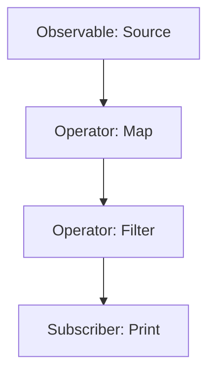

## 8.6 Reactive Programming with RxScala or Monix

Reactive programming is a paradigm that enables developers to build responsive, resilient, and scalable applications. In the Scala ecosystem, RxScala and Monix are two powerful libraries that facilitate reactive programming by providing tools to handle asynchronous data streams efficiently. This section will delve into the concepts, techniques, and best practices for leveraging these libraries in Scala applications.

### Introduction to Reactive Programming

Reactive programming is about building systems that react to changes, such as user inputs, network responses, or other events. It emphasizes the flow of data and the propagation of changes, allowing applications to respond to events as they occur. This paradigm is particularly useful in modern applications where responsiveness and scalability are critical.

#### Key Concepts

- **Asynchronous Data Streams**: Streams of data that are processed asynchronously, allowing for non-blocking operations.
- **Observables**: Core components in reactive programming that emit a sequence of items over time.
- **Subscribers**: Entities that listen to observables and react to the emitted items.
- **Operators**: Functions that allow transformation, filtering, and combination of data streams.

### RxScala: Reactive Extensions for Scala

RxScala is a Scala wrapper around the popular Reactive Extensions (Rx) library, which provides a powerful abstraction for asynchronous programming. It allows Scala developers to work with observables and provides a rich set of operators to manipulate data streams.

#### Getting Started with RxScala

To begin using RxScala, you need to add the library to your project dependencies. Here’s how you can do it with SBT:

```scala
libraryDependencies += "io.reactivex" %% "rxscala" % "0.27.0"
```

#### Creating Observables

Observables are the heart of RxScala. They represent a stream of data that can be observed over time. Here's a simple example of creating an observable that emits a sequence of integers:

```scala
import rx.lang.scala.Observable

val numbers = Observable.from(1 to 5)

numbers.subscribe(n => println(s"Received: $n"))
```

In this example, the observable `numbers` emits integers from 1 to 5, and the subscriber prints each received number.

#### Transforming Data with Operators

RxScala provides a wide range of operators to transform data streams. Some common operators include `map`, `filter`, and `flatMap`.

```scala
val evenNumbers = numbers.filter(_ % 2 == 0)

evenNumbers.subscribe(n => println(s"Even number: $n"))
```

This code filters the observable to only emit even numbers.

#### Handling Errors

Error handling is crucial in reactive programming. RxScala provides operators like `onErrorReturn` and `onErrorResumeNext` to handle errors gracefully.

```scala
val faultyObservable = Observable[Int](subscriber => {
  subscriber.onNext(1)
  subscriber.onError(new RuntimeException("An error occurred"))
})

faultyObservable.onErrorReturn(_ => -1).subscribe(
  n => println(s"Received: $n"),
  e => println(s"Error: ${e.getMessage}")
)
```

In this example, if an error occurs, the observable will emit `-1` instead.

### Monix: Advanced Asynchronous Programming

Monix is another powerful library for reactive programming in Scala. It offers a high-performance, type-safe API for handling asynchronous computations and data streams. Monix is built on top of the `cats-effect` library, providing a robust foundation for functional programming.

#### Setting Up Monix

To use Monix, add it to your project dependencies:

```scala
libraryDependencies += "io.monix" %% "monix" % "3.4.0"
```

#### Task: A Powerful Abstraction

Monix introduces the `Task` abstraction, which represents a computation that can be executed asynchronously. It is similar to `Future` but provides more control over execution.

```scala
import monix.eval.Task
import monix.execution.Scheduler.Implicits.global

val task = Task {
  println("Running task")
  42
}

task.runToFuture.foreach(result => println(s"Result: $result"))
```

In this example, the task prints a message and returns the number 42.

#### Observable in Monix

Monix also provides an `Observable` type, similar to RxScala, for working with data streams.

```scala
import monix.reactive.Observable

val observable = Observable.fromIterable(1 to 5)

observable.foreachL(n => println(s"Received: $n")).runToFuture
```

This code creates an observable that emits integers from 1 to 5.

#### Combining Observables

Monix allows you to combine multiple observables using operators like `merge` and `zip`.

```scala
val obs1 = Observable.fromIterable(1 to 3)
val obs2 = Observable.fromIterable(4 to 6)

val combined = obs1.merge(obs2)

combined.foreachL(n => println(s"Combined: $n")).runToFuture
```

Here, `obs1` and `obs2` are merged into a single observable.

### Visualizing Reactive Streams

To better understand the flow of data in reactive programming, let's visualize a simple stream processing pipeline.



This diagram represents a data stream that starts with an observable source, passes through a map operator, then a filter operator, and finally reaches a subscriber that prints the results.

### Advanced Concepts in Reactive Programming

#### Backpressure

Backpressure is a mechanism to handle situations where data is produced faster than it can be consumed. Both RxScala and Monix provide strategies for managing backpressure, such as buffering or dropping items.

#### Concurrency and Parallelism

Reactive programming naturally supports concurrency. Monix, in particular, offers advanced features for parallel processing, allowing you to distribute computations across multiple threads.

```scala
val parallelTask = Task.parMap2(Task(1), Task(2))(_ + _)

parallelTask.runToFuture.foreach(result => println(s"Parallel result: $result"))
```

This code executes two tasks in parallel and combines their results.

### Try It Yourself

Experiment with the following code examples to deepen your understanding of reactive programming in Scala. Try modifying the observables, operators, and error handling strategies to see how they affect the output.

### References and Further Reading

- [ReactiveX Documentation](http://reactivex.io/documentation/observable.html)
- [Monix Documentation](https://monix.io/docs/current/)
- [Scala Language](https://www.scala-lang.org/)

### Knowledge Check

- What is the primary purpose of reactive programming?
- How do observables differ from traditional collections?
- What are some common operators used in RxScala?
- How does Monix's `Task` differ from Scala's `Future`?

### Conclusion

Reactive programming with RxScala and Monix offers a powerful approach to handling asynchronous data streams in Scala. By understanding the core concepts and leveraging the capabilities of these libraries, you can build responsive and scalable applications. Remember, this is just the beginning. As you progress, you'll discover more advanced techniques and patterns. Keep experimenting, stay curious, and enjoy the journey!

## Quiz Time!



### What is the primary purpose of reactive programming?

- [x] To build systems that react to changes in data or events.
- [ ] To perform synchronous computations.
- [ ] To replace object-oriented programming.
- [ ] To simplify database interactions.

> **Explanation:** Reactive programming is about building systems that react to changes, such as user inputs or network responses, allowing applications to respond to events as they occur.

### How do observables differ from traditional collections?

- [x] Observables emit data over time, while collections hold data statically.
- [ ] Observables are always mutable, while collections are immutable.
- [ ] Observables are only used for error handling.
- [ ] Observables cannot be transformed or filtered.

> **Explanation:** Observables represent a stream of data that can be observed over time, unlike traditional collections that hold data in a static manner.

### Which of the following is a common operator used in RxScala?

- [x] map
- [ ] join
- [ ] execute
- [ ] transform

> **Explanation:** The `map` operator is commonly used in RxScala to transform data streams.

### How does Monix's `Task` differ from Scala's `Future`?

- [x] `Task` provides more control over execution and can be executed lazily.
- [ ] `Task` is always executed immediately.
- [ ] `Task` does not support error handling.
- [ ] `Task` is a blocking operation.

> **Explanation:** Monix's `Task` provides more control over execution, including lazy execution, unlike Scala's `Future`, which is eagerly executed.

### What is backpressure in reactive programming?

- [x] A mechanism to handle situations where data is produced faster than it can be consumed.
- [ ] A method for increasing data production speed.
- [ ] A technique for reducing memory usage.
- [ ] A way to prioritize certain data streams.

> **Explanation:** Backpressure is a mechanism to handle situations where data is produced faster than it can be consumed, ensuring system stability.

### Which library is built on top of `cats-effect`?

- [x] Monix
- [ ] RxScala
- [ ] Akka
- [ ] Play Framework

> **Explanation:** Monix is built on top of the `cats-effect` library, providing a robust foundation for functional programming.

### What is the role of a subscriber in reactive programming?

- [x] To listen to observables and react to emitted items.
- [ ] To produce data for observables.
- [ ] To transform data streams.
- [ ] To handle errors exclusively.

> **Explanation:** A subscriber listens to observables and reacts to the items they emit, processing the data as it arrives.

### Which operator is used to combine multiple observables in Monix?

- [x] merge
- [ ] split
- [ ] join
- [ ] reduce

> **Explanation:** The `merge` operator is used in Monix to combine multiple observables into a single observable.

### True or False: Reactive programming is only useful for handling user inputs.

- [ ] True
- [x] False

> **Explanation:** Reactive programming is useful for handling various types of events, including user inputs, network responses, and other asynchronous data streams.

### What is a key advantage of using reactive programming in modern applications?

- [x] It enhances responsiveness and scalability.
- [ ] It simplifies database schema design.
- [ ] It eliminates the need for testing.
- [ ] It reduces the need for documentation.

> **Explanation:** Reactive programming enhances the responsiveness and scalability of modern applications, making them more efficient in handling asynchronous events.


