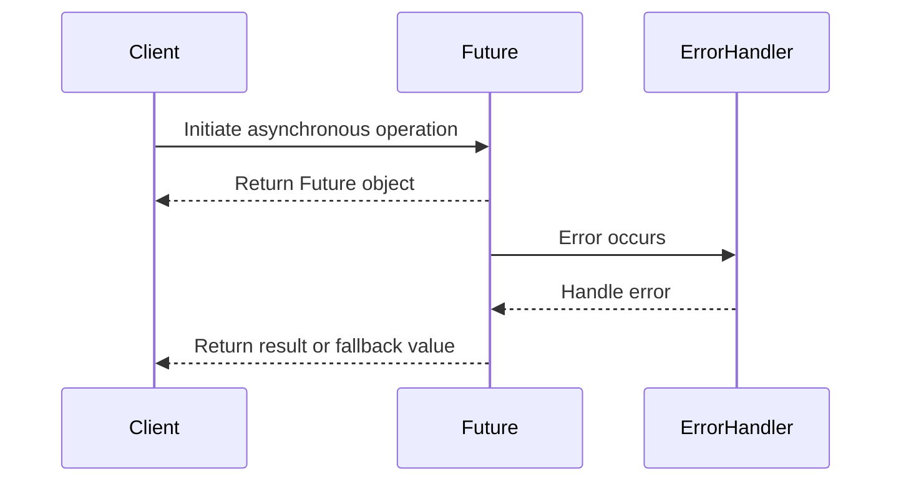

## 8.7 Asynchronous Error Handling

In the realm of modern software development, asynchronous programming has become a cornerstone for building responsive and scalable applications. Scala, with its powerful concurrency model, provides robust tools for handling asynchronous operations. However, managing exceptions and failures in asynchronous code presents unique challenges that require careful consideration and expertise. In this section, we will delve into the intricacies of asynchronous error handling in Scala, exploring various techniques, patterns, and best practices to equip you with the knowledge needed to master this critical aspect of software engineering.

### Understanding Asynchronous Programming in Scala

Before we dive into error handling, let's briefly revisit the concept of asynchronous programming. Asynchronous programming allows tasks to run concurrently without blocking the main execution thread. This is particularly useful in I/O-bound operations, such as network requests or file reading, where waiting for a response can significantly delay the program's execution.

Scala provides several constructs for asynchronous programming, with `Future` being one of the most commonly used. A `Future` represents a computation that may not have completed yet, allowing you to perform other tasks while waiting for the result.

```scala
import scala.concurrent.Future
import scala.concurrent.ExecutionContext.Implicits.global

val futureResult: Future[Int] = Future {
  // Simulate a long-running computation
  Thread.sleep(1000)
  42
}
```

In this example, the computation runs asynchronously, and the main thread is free to perform other tasks.

### The Challenge of Asynchronous Error Handling

Asynchronous programming introduces a new dimension to error handling. Unlike synchronous code, where exceptions can be caught and handled immediately, asynchronous operations require a different approach. Errors in asynchronous tasks can occur at any time, and handling them effectively is crucial to maintaining the stability and reliability of your application.

### Techniques for Asynchronous Error Handling

Scala provides several techniques for handling errors in asynchronous code. Let's explore some of the most effective methods:

#### 1. Handling Errors with `Future`

The `Future` class in Scala offers built-in mechanisms for error handling. You can use methods like `recover`, `recoverWith`, and `fallbackTo` to manage exceptions gracefully.

- **Recovering from Errors**

The `recover` method allows you to specify a partial function to handle specific exceptions and provide an alternative value.

```scala
val safeFuture: Future[Int] = futureResult.recover {
  case _: ArithmeticException => 0
}
```

In this example, if an `ArithmeticException` occurs, the future will return `0` instead.

- **Chaining with `recoverWith`**

The `recoverWith` method is similar to `recover`, but it allows you to return a new `Future`, enabling more complex recovery logic.

```scala
val alternativeFuture: Future[Int] = futureResult.recoverWith {
  case _: ArithmeticException => Future.successful(0)
}
```

- **Providing a Fallback with `fallbackTo`**

The `fallbackTo` method allows you to specify an alternative `Future` to use if the original one fails.

```scala
val fallbackFuture: Future[Int] = futureResult.fallbackTo(Future.successful(0))
```

#### 2. Transforming Errors with `map` and `flatMap`

You can use `map` and `flatMap` to transform the result of a `Future`, including handling errors. This approach is useful for chaining multiple asynchronous operations.

```scala
val transformedFuture: Future[String] = futureResult.map { result =>
  s"The result is $result"
}.recover {
  case _: ArithmeticException => "An error occurred"
}
```

#### 3. Using `Try`, `Option`, and `Either`

Scala's `Try`, `Option`, and `Either` types provide functional ways to handle errors. You can use these types in conjunction with `Future` to manage exceptions more effectively.

- **Using `Try`**

`Try` is a monadic container that represents a computation that may either result in a success or a failure.

```scala
import scala.util.{Try, Success, Failure}

val tryFuture: Future[Try[Int]] = futureResult.map(Success(_)).recover {
  case ex: Throwable => Failure(ex)
}
```

- **Using `Option`**

`Option` represents a value that may or may not be present. While not specifically designed for error handling, it can be useful in certain scenarios.

```scala
val optionFuture: Future[Option[Int]] = futureResult.map(Some(_)).recover {
  case _: Throwable => None
}
```

- **Using `Either`**

`Either` is a versatile type that can represent a value of two possible types, typically used for error handling.

```scala
val eitherFuture: Future[Either[String, Int]] = futureResult.map(Right(_)).recover {
  case ex: Throwable => Left(ex.getMessage)
}
```

### Best Practices for Asynchronous Error Handling

To effectively manage errors in asynchronous code, consider the following best practices:

#### 1. Use a Consistent Error Handling Strategy

Choose a consistent strategy for handling errors across your application. Whether you prefer using `recover`, `recoverWith`, or `fallbackTo`, ensure that your team follows the same approach to maintain code consistency.

#### 2. Log Errors for Debugging

Logging is an essential tool for debugging asynchronous errors. Ensure that all exceptions are logged with sufficient context to aid in troubleshooting.

```scala
import scala.util.{Failure, Success}

futureResult.onComplete {
  case Success(value) => println(s"Result: $value")
  case Failure(exception) => println(s"Error: ${exception.getMessage}")
}
```

#### 3. Avoid Blocking Operations

Blocking operations can negate the benefits of asynchronous programming. Avoid using blocking calls within `Future` transformations, as they can lead to performance bottlenecks.

#### 4. Test Asynchronous Code Thoroughly

Testing asynchronous code can be challenging, but it's crucial for ensuring reliability. Use testing frameworks that support asynchronous operations, such as ScalaTest or Specs2.

```scala
import org.scalatest.concurrent.ScalaFutures
import org.scalatest.flatspec.AnyFlatSpec
import org.scalatest.matchers.should.Matchers

class FutureSpec extends AnyFlatSpec with Matchers with ScalaFutures {
  "A Future" should "complete successfully" in {
    val future = Future.successful(42)
    whenReady(future) { result =>
      result shouldEqual 42
    }
  }
}
```

#### 5. Consider Using Libraries for Enhanced Error Handling

Several libraries, such as Cats Effect and ZIO, provide advanced error handling capabilities for asynchronous programming. These libraries offer powerful abstractions for managing side effects and errors in a functional way.

### Advanced Patterns for Asynchronous Error Handling

As you become more proficient in handling asynchronous errors, you may encounter scenarios that require more advanced patterns. Let's explore some of these patterns:

#### 1. Circuit Breaker Pattern

The Circuit Breaker pattern is a design pattern used to detect failures and encapsulate the logic of preventing a failure from constantly recurring during maintenance, temporary external system failure, or unexpected system difficulties.

```scala
import akka.pattern.CircuitBreaker
import scala.concurrent.duration._

val breaker = new CircuitBreaker(
  scheduler = system.scheduler,
  maxFailures = 5,
  callTimeout = 10.seconds,
  resetTimeout = 1.minute
)

val protectedFuture: Future[Int] = breaker.withCircuitBreaker(futureResult)
```

#### 2. Retry Pattern

The Retry pattern involves retrying a failed operation a certain number of times before giving up. This pattern is useful for handling transient errors.

```scala
import scala.concurrent.{Future, ExecutionContext}
import scala.util.{Failure, Success}

def retry[T](operation: => Future[T], retries: Int)(implicit ec: ExecutionContext): Future[T] = {
  operation.recoverWith {
    case _ if retries > 0 => retry(operation, retries - 1)
  }
}

val retriedFuture: Future[Int] = retry(futureResult, 3)
```

#### 3. Fallback Pattern

The Fallback pattern involves providing an alternative operation or value when the primary operation fails. This pattern is similar to `fallbackTo` but can be extended to more complex scenarios.

```scala
val fallbackFuture: Future[Int] = futureResult.recoverWith {
  case _: Throwable => Future.successful(0)
}
```

### Visualizing Asynchronous Error Handling

To better understand the flow of asynchronous error handling, let's visualize the process using a sequence diagram.



This diagram illustrates the interaction between the client, the `Future`, and the error handler. When an error occurs, the error handler processes it and returns a result or fallback value to the client.

### Try It Yourself

To solidify your understanding of asynchronous error handling, try modifying the code examples provided. Experiment with different error handling strategies, such as using `recover`, `recoverWith`, and `fallbackTo`. Observe how each approach affects the behavior of the program.

### Knowledge Check

Let's reinforce what we've learned with some questions and exercises:

1. What is the primary benefit of using `Future` for asynchronous programming in Scala?
2. How does the `recover` method differ from `recoverWith`?
3. Why is it important to avoid blocking operations in asynchronous code?
4. Implement a retry mechanism for a `Future` operation that fails intermittently.
5. How can libraries like Cats Effect and ZIO enhance error handling in Scala?

### Conclusion

Asynchronous error handling is a vital skill for any Scala developer working with concurrent systems. By mastering the techniques and patterns discussed in this section, you'll be well-equipped to build robust and resilient applications. Remember, this is just the beginning. As you progress, continue to explore advanced patterns and libraries that can further enhance your error handling capabilities. Keep experimenting, stay curious, and enjoy the journey!

## Quiz Time!



### What is the primary benefit of using `Future` for asynchronous programming in Scala?

- [x] It allows tasks to run concurrently without blocking the main execution thread.
- [ ] It simplifies error handling in synchronous code.
- [ ] It provides a way to handle exceptions immediately.
- [ ] It eliminates the need for logging errors.

> **Explanation:** `Future` allows tasks to run concurrently without blocking the main execution thread, making it ideal for I/O-bound operations.

### How does the `recover` method differ from `recoverWith`?

- [x] `recover` returns a value, while `recoverWith` returns a new `Future`.
- [ ] `recover` handles errors, while `recoverWith` logs them.
- [ ] `recover` is used for synchronous code, while `recoverWith` is for asynchronous code.
- [ ] `recover` requires a fallback value, while `recoverWith` does not.

> **Explanation:** `recover` returns a value to handle specific exceptions, whereas `recoverWith` allows returning a new `Future`, enabling more complex recovery logic.

### Why is it important to avoid blocking operations in asynchronous code?

- [x] Blocking operations can negate the benefits of asynchronous programming by causing performance bottlenecks.
- [ ] Blocking operations simplify error handling.
- [ ] Blocking operations improve code readability.
- [ ] Blocking operations are necessary for logging errors.

> **Explanation:** Blocking operations can negate the benefits of asynchronous programming by causing performance bottlenecks, as they prevent other tasks from executing concurrently.

### Implement a retry mechanism for a `Future` operation that fails intermittently.

- [x] Use a recursive function with `recoverWith` to retry the operation a specified number of times.
- [ ] Use a loop to repeatedly call the operation until it succeeds.
- [ ] Use `recover` to handle the error and retry the operation.
- [ ] Use `fallbackTo` to provide an alternative value.

> **Explanation:** A recursive function with `recoverWith` can be used to retry the operation a specified number of times, handling transient errors effectively.

### How can libraries like Cats Effect and ZIO enhance error handling in Scala?

- [x] They provide advanced abstractions for managing side effects and errors in a functional way.
- [ ] They simplify synchronous error handling.
- [ ] They eliminate the need for logging errors.
- [ ] They provide built-in retry mechanisms.

> **Explanation:** Libraries like Cats Effect and ZIO offer advanced abstractions for managing side effects and errors in a functional way, enhancing error handling capabilities.

### What is the Circuit Breaker pattern used for?

- [x] Detecting failures and preventing a failure from constantly recurring.
- [ ] Simplifying error handling in synchronous code.
- [ ] Logging errors in asynchronous operations.
- [ ] Providing alternative values for failed operations.

> **Explanation:** The Circuit Breaker pattern is used to detect failures and prevent a failure from constantly recurring during maintenance or unexpected system difficulties.

### What is the Retry pattern used for?

- [x] Retrying a failed operation a certain number of times before giving up.
- [ ] Simplifying error handling in synchronous code.
- [ ] Logging errors in asynchronous operations.
- [ ] Providing alternative values for failed operations.

> **Explanation:** The Retry pattern involves retrying a failed operation a certain number of times before giving up, handling transient errors effectively.

### What is the Fallback pattern used for?

- [x] Providing an alternative operation or value when the primary operation fails.
- [ ] Simplifying error handling in synchronous code.
- [ ] Logging errors in asynchronous operations.
- [ ] Detecting failures and preventing them from recurring.

> **Explanation:** The Fallback pattern involves providing an alternative operation or value when the primary operation fails, ensuring continued functionality.

### What is the purpose of logging errors in asynchronous code?

- [x] To aid in debugging by providing context for exceptions.
- [ ] To eliminate the need for error handling.
- [ ] To simplify synchronous error handling.
- [ ] To prevent errors from occurring.

> **Explanation:** Logging errors in asynchronous code aids in debugging by providing context for exceptions, making it easier to troubleshoot issues.

### True or False: Asynchronous error handling is only necessary for network-related operations.

- [ ] True
- [x] False

> **Explanation:** Asynchronous error handling is necessary for any operation that runs concurrently, not just network-related operations. It ensures that errors are managed effectively in all asynchronous tasks.


