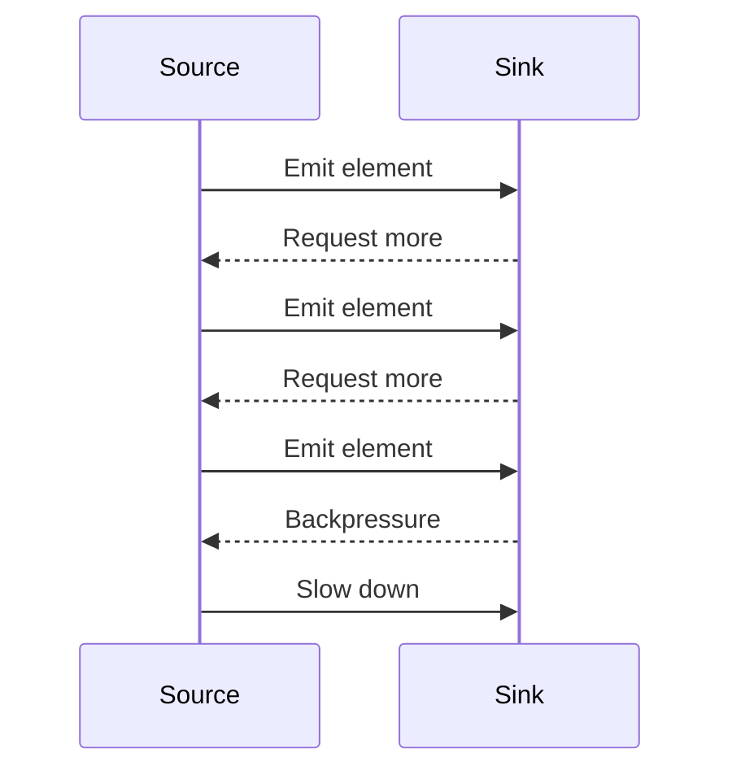

## 8.8 Cancellation and Backpressure Handling

As we delve deeper into the world of concurrency and asynchronous programming in Scala, two crucial concepts emerge: **cancellation** and **backpressure handling**. These concepts are vital for building robust, responsive, and efficient applications that can gracefully handle the complexities of modern software systems. In this section, we will explore these concepts in detail, providing insights, code examples, and best practices to help you master them.

### Introduction to Cancellation and Backpressure

Before we dive into the specifics, let's define what we mean by cancellation and backpressure:

- **Cancellation**: In the context of asynchronous programming, cancellation refers to the ability to stop an ongoing operation before it completes. This is particularly useful in scenarios where the result of an operation is no longer needed, or when the operation is taking too long and needs to be aborted.

- **Backpressure**: Backpressure is a mechanism for handling situations where the rate of data production exceeds the rate of data consumption. It ensures that systems remain stable and responsive by preventing overwhelming the consumer with too much data at once.

### Implementing Cancellation Tokens

Cancellation tokens are a common pattern used to implement cancellation in asynchronous operations. They provide a way to signal that an operation should be canceled, allowing the operation to terminate gracefully. Let's explore how to implement cancellation tokens in Scala.

#### Understanding Cancellation Tokens

A cancellation token is an object that can be passed to an asynchronous operation. It provides a mechanism to check whether the operation should be canceled and to respond accordingly. The token can be triggered by an external event, such as a user action or a timeout, indicating that the operation should stop.

#### Creating a Cancellation Token in Scala

To create a cancellation token in Scala, we can define a simple class that encapsulates the cancellation logic. Here's an example:

```scala
class CancellationToken {
  @volatile private var canceled = false

  def cancel(): Unit = {
    canceled = true
  }

  def isCanceled: Boolean = canceled
}
```

In this example, the `CancellationToken` class has a private `canceled` flag that indicates whether the operation should be canceled. The `cancel` method sets this flag to `true`, and the `isCanceled` method allows the operation to check the cancellation status.

#### Using Cancellation Tokens in Asynchronous Operations

To use a cancellation token in an asynchronous operation, we need to periodically check the token's status and terminate the operation if it has been canceled. Here's an example of how to use a cancellation token in a long-running computation:

```scala
def longRunningComputation(token: CancellationToken): Unit = {
  for (i <- 1 to 1000000) {
    if (token.isCanceled) {
      println("Operation canceled")
      return
    }
    // Simulate some work
    Thread.sleep(1)
  }
  println("Operation completed")
}

val token = new CancellationToken()
val thread = new Thread(() => longRunningComputation(token))
thread.start()

// Cancel the operation after 100 milliseconds
Thread.sleep(100)
token.cancel()
```

In this example, the `longRunningComputation` function performs a loop that simulates a long-running task. It periodically checks the `isCanceled` method of the `CancellationToken` to determine whether it should terminate early. The operation is canceled after 100 milliseconds by calling the `cancel` method on the token.

### Handling Backpressure in Reactive Streams

Backpressure is a critical concept in reactive programming, where data flows asynchronously between producers and consumers. In Scala, libraries like Akka Streams and Monix provide powerful tools for handling backpressure in reactive streams.

#### Understanding Backpressure

Backpressure is a flow control mechanism that ensures that a data producer does not overwhelm a consumer with more data than it can handle. It allows the consumer to signal to the producer to slow down or stop sending data until it is ready to process more.

#### Implementing Backpressure with Akka Streams

Akka Streams is a powerful library for building reactive streams in Scala. It provides built-in support for backpressure, allowing you to build systems that can handle varying rates of data production and consumption.

Here's an example of how to implement backpressure with Akka Streams:

```scala
import akka.actor.ActorSystem
import akka.stream._
import akka.stream.scaladsl._

import scala.concurrent.duration._

implicit val system: ActorSystem = ActorSystem("BackpressureExample")
implicit val materializer: Materializer = Materializer(system)

val source = Source(1 to 1000)
val slowSink = Sink.foreach[Int] { elem =>
  Thread.sleep(100) // Simulate slow processing
  println(s"Processed: $elem")
}

val runnableGraph = source.to(slowSink)
runnableGraph.run()
```

In this example, we create a source that emits integers from 1 to 1000 and a sink that processes each element with a delay to simulate slow processing. Akka Streams automatically handles backpressure by slowing down the source when the sink cannot keep up.

#### Visualizing Backpressure in Akka Streams

To better understand how backpressure works in Akka Streams, let's visualize the flow of data using a Mermaid.js sequence diagram:



In this diagram, the source emits elements to the sink, which processes them. When the sink cannot keep up, it signals backpressure to the source, causing the source to slow down.

#### Implementing Backpressure with Monix

Monix is another powerful library for reactive programming in Scala. It provides abstractions for handling asynchronous data streams and backpressure.

Here's an example of how to implement backpressure with Monix:

```scala
import monix.eval.Task
import monix.execution.Scheduler.Implicits.global
import monix.reactive._

val source = Observable.range(1, 1000)
val slowConsumer = source.mapEval { elem =>
  Task {
    Thread.sleep(100) // Simulate slow processing
    println(s"Processed: $elem")
  }
}

slowConsumer.subscribe()
```

In this example, we create an `Observable` that emits integers from 1 to 1000 and a consumer that processes each element with a delay. Monix handles backpressure by ensuring that the source does not emit more elements than the consumer can process.

### Design Considerations for Cancellation and Backpressure

When implementing cancellation and backpressure handling in Scala, there are several design considerations to keep in mind:

- **Granularity of Cancellation**: Determine the appropriate granularity for cancellation. Fine-grained cancellation allows for more responsive systems but may introduce complexity.

- **Resource Management**: Ensure that resources are properly released when an operation is canceled. This includes closing file handles, network connections, and other resources.

- **Error Handling**: Consider how cancellation and backpressure interact with error handling. Ensure that errors are propagated correctly and that the system remains stable.

- **Performance**: Be mindful of the performance implications of cancellation and backpressure. Ensure that the system can handle the expected load without excessive overhead.

### Differences and Similarities with Other Patterns

Cancellation and backpressure handling are often used in conjunction with other concurrency and asynchronous patterns. Here are some key differences and similarities:

- **Cancellation vs. Timeout**: Cancellation is an explicit action taken by the user or system, while a timeout is an automatic mechanism that triggers when an operation takes too long.

- **Backpressure vs. Buffering**: Backpressure is a flow control mechanism that prevents data overload, while buffering temporarily stores data to smooth out variations in data flow.

- **Integration with Reactive Patterns**: Both cancellation and backpressure are integral to reactive programming patterns, ensuring that systems remain responsive and scalable.

### Try It Yourself

Now that we've covered the concepts of cancellation and backpressure handling, it's time to experiment with the code examples provided. Try modifying the examples to see how different configurations affect the behavior of the system. Here are some suggestions:

- **Modify the Cancellation Example**: Change the delay in the `longRunningComputation` function to see how it affects the cancellation behavior. Try adding additional checks for cancellation at different points in the computation.

- **Experiment with Akka Streams**: Change the processing delay in the Akka Streams example and observe how it affects the flow of data. Try adding additional stages to the stream to see how they interact with backpressure.

- **Explore Monix Backpressure**: Modify the Monix example to use different types of consumers and observe how they handle backpressure. Try using different operators to transform the data stream and see how it affects performance.

### Conclusion

Cancellation and backpressure handling are essential concepts in building robust, responsive, and efficient applications in Scala. By understanding and implementing these patterns, you can create systems that gracefully handle the complexities of modern software environments. Remember, this is just the beginning. As you continue to explore Scala's concurrency and asynchronous patterns, you'll discover new ways to optimize and enhance your applications. Keep experimenting, stay curious, and enjoy the journey!

## Quiz Time!



### What is the primary purpose of a cancellation token in asynchronous operations?

- [x] To signal that an operation should be stopped
- [ ] To increase the speed of an operation
- [ ] To manage memory allocation
- [ ] To handle exceptions

> **Explanation:** A cancellation token is used to signal that an operation should be stopped, allowing it to terminate gracefully.

### How does backpressure help in reactive streams?

- [x] It prevents the consumer from being overwhelmed by too much data
- [ ] It speeds up data processing
- [ ] It increases memory usage
- [ ] It simplifies error handling

> **Explanation:** Backpressure is a flow control mechanism that prevents the consumer from being overwhelmed by too much data, ensuring stability and responsiveness.

### Which Scala library provides built-in support for backpressure in reactive streams?

- [x] Akka Streams
- [ ] Slick
- [ ] Play Framework
- [ ] Scalaz

> **Explanation:** Akka Streams provides built-in support for backpressure, allowing for efficient handling of reactive streams.

### What is the role of the `cancel` method in a `CancellationToken`?

- [x] To set the cancellation flag to true
- [ ] To start an asynchronous operation
- [ ] To allocate resources
- [ ] To handle exceptions

> **Explanation:** The `cancel` method sets the cancellation flag to true, indicating that the operation should be stopped.

### What is the difference between cancellation and timeout?

- [x] Cancellation is explicit, while timeout is automatic
- [ ] Cancellation is automatic, while timeout is explicit
- [ ] Both are automatic mechanisms
- [ ] Both are explicit actions

> **Explanation:** Cancellation is an explicit action taken by the user or system, while a timeout is an automatic mechanism that triggers when an operation takes too long.

### In the context of backpressure, what does buffering do?

- [x] Temporarily stores data to smooth out variations in data flow
- [ ] Increases the speed of data processing
- [ ] Reduces memory usage
- [ ] Simplifies error handling

> **Explanation:** Buffering temporarily stores data to smooth out variations in data flow, which is different from backpressure.

### Which method in Akka Streams can be used to slow down the source when the sink cannot keep up?

- [x] Backpressure
- [ ] Buffering
- [ ] Cancellation
- [ ] Timeout

> **Explanation:** Backpressure is the mechanism used in Akka Streams to slow down the source when the sink cannot keep up.

### What is a key design consideration when implementing cancellation?

- [x] Granularity of cancellation
- [ ] Increasing memory usage
- [ ] Simplifying error handling
- [ ] Reducing code complexity

> **Explanation:** Granularity of cancellation is a key design consideration, as it affects the responsiveness and complexity of the system.

### How does Monix handle backpressure in reactive streams?

- [x] By ensuring that the source does not emit more elements than the consumer can process
- [ ] By increasing the speed of data processing
- [ ] By reducing memory usage
- [ ] By simplifying error handling

> **Explanation:** Monix handles backpressure by ensuring that the source does not emit more elements than the consumer can process.

### True or False: Backpressure and buffering are the same thing.

- [ ] True
- [x] False

> **Explanation:** Backpressure and buffering are not the same thing. Backpressure is a flow control mechanism, while buffering temporarily stores data.


