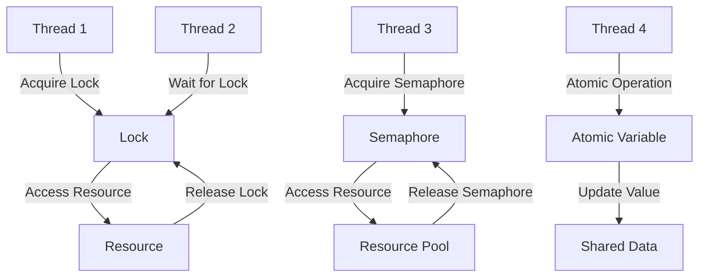

## 8.9 Synchronization Primitives

In the world of concurrent programming, synchronization primitives are essential tools that allow us to manage access to shared resources safely and efficiently. In Scala, as in many other languages, these primitives include locks, semaphores, and atomic variables. This section will delve into these concepts, providing expert software engineers and architects with the knowledge needed to implement robust and efficient concurrent systems in Scala.

### Introduction to Synchronization Primitives

Concurrency introduces complexity, especially when multiple threads or processes need to access shared resources. Without proper synchronization, race conditions, deadlocks, and inconsistent data states can occur. Synchronization primitives are mechanisms that help prevent these issues by controlling the execution order of threads and ensuring data consistency.

#### Key Concepts

- **Race Conditions**: Occur when the outcome of a program depends on the relative timing of events such as thread execution.
- **Deadlocks**: Arise when two or more threads are blocked forever, each waiting for the other to release resources.
- **Data Consistency**: Ensures that shared data remains in a valid state, even when accessed concurrently.

### Locks in Scala

Locks are one of the most fundamental synchronization primitives. They allow only one thread to access a resource at a time, ensuring mutual exclusion.

#### Types of Locks

1. **Reentrant Locks**: Allow the thread holding the lock to acquire it again without causing a deadlock.
2. **Read-Write Locks**: Separate locks for reading and writing, allowing multiple readers but only one writer at a time.

#### Implementing Locks in Scala

Scala provides several ways to implement locks, primarily through the Java `java.util.concurrent` package, which is fully interoperable with Scala.

```scala
import java.util.concurrent.locks.ReentrantLock

class Counter {
  private var count = 0
  private val lock = new ReentrantLock()

  def increment(): Unit = {
    lock.lock()
    try {
      count += 1
    } finally {
      lock.unlock()
    }
  }

  def getCount: Int = count
}
```

In this example, a `ReentrantLock` is used to ensure that only one thread can increment the counter at a time.

#### Considerations When Using Locks

- **Deadlock Avoidance**: Always acquire locks in a consistent order.
- **Performance**: Locks can introduce contention, slowing down the system.
- **Fairness**: Some locks can be configured to be fair, ensuring that threads acquire locks in the order they requested them.

### Semaphores in Scala

Semaphores are more generalized synchronization primitives that can control access to a resource pool with a fixed number of permits.

#### How Semaphores Work

A semaphore maintains a set of permits. A thread can acquire a permit if one is available, or it can wait until a permit is released by another thread.

#### Implementing Semaphores in Scala

Scala uses Java's `java.util.concurrent.Semaphore` to implement semaphores.

```scala
import java.util.concurrent.Semaphore

class ResourcePool(size: Int) {
  private val semaphore = new Semaphore(size)

  def acquireResource(): Unit = {
    semaphore.acquire()
    try {
      // Access the resource
    } finally {
      semaphore.release()
    }
  }
}
```

In this example, a semaphore is used to limit access to a resource pool, ensuring that only a specified number of threads can access the resource simultaneously.

#### Considerations When Using Semaphores

- **Starvation**: Ensure that threads are not indefinitely blocked.
- **Fairness**: Semaphores can also be configured to be fair.
- **Complexity**: Semaphores can introduce complexity in managing permits.

### Atomic Variables in Scala

Atomic variables provide a way to perform thread-safe operations on single variables without using locks.

#### How Atomic Variables Work

Atomic variables support atomic operations, such as compare-and-swap (CAS), which are performed without locking, making them very efficient.

#### Implementing Atomic Variables in Scala

Scala uses Java's `java.util.concurrent.atomic` package for atomic variables.

```scala
import java.util.concurrent.atomic.AtomicInteger

class AtomicCounter {
  private val count = new AtomicInteger(0)

  def increment(): Unit = {
    count.incrementAndGet()
  }

  def getCount: Int = count.get()
}
```

In this example, an `AtomicInteger` is used to increment a counter safely without locks.

#### Considerations When Using Atomic Variables

- **Limited Use**: Best for simple operations on single variables.
- **Performance**: Generally faster than locks for single-variable operations.
- **Complexity**: Can be difficult to use for more complex data structures.

### Visualizing Synchronization Primitives

Let's visualize how these synchronization primitives work together to manage concurrency.



**Diagram Description**: This flowchart illustrates how threads interact with locks, semaphores, and atomic variables to manage access to shared resources.

### Advanced Synchronization Techniques

Beyond basic locks, semaphores, and atomic variables, Scala developers can leverage more advanced synchronization techniques for complex scenarios.

#### Condition Variables

Condition variables allow threads to wait for certain conditions to be met before proceeding. They are often used in conjunction with locks.

```scala
import java.util.concurrent.locks.{Lock, ReentrantLock, Condition}

class BoundedBuffer[T](capacity: Int) {
  private val buffer = new Array[Any](capacity)
  private var count, putIndex, takeIndex = 0
  private val lock: Lock = new ReentrantLock()
  private val notFull: Condition = lock.newCondition()
  private val notEmpty: Condition = lock.newCondition()

  def put(item: T): Unit = {
    lock.lock()
    try {
      while (count == buffer.length) {
        notFull.await()
      }
      buffer(putIndex) = item
      putIndex = (putIndex + 1) % buffer.length
      count += 1
      notEmpty.signal()
    } finally {
      lock.unlock()
    }
  }

  def take(): T = {
    lock.lock()
    try {
      while (count == 0) {
        notEmpty.await()
      }
      val item = buffer(takeIndex).asInstanceOf[T]
      takeIndex = (takeIndex + 1) % buffer.length
      count -= 1
      notFull.signal()
      item
    } finally {
      lock.unlock()
    }
  }
}
```

In this example, a bounded buffer uses condition variables to manage producer-consumer synchronization.

#### Read-Write Locks

Read-write locks allow multiple threads to read a resource simultaneously while ensuring exclusive access for writing.

```scala
import java.util.concurrent.locks.ReentrantReadWriteLock

class ReadWriteCounter {
  private var count = 0
  private val lock = new ReentrantReadWriteLock()

  def increment(): Unit = {
    lock.writeLock().lock()
    try {
      count += 1
    } finally {
      lock.writeLock().unlock()
    }
  }

  def getCount: Int = {
    lock.readLock().lock()
    try {
      count
    } finally {
      lock.readLock().unlock()
    }
  }
}
```

This example demonstrates how to use a read-write lock to allow concurrent reads while ensuring exclusive writes.

### Try It Yourself

Experiment with the provided code examples by modifying them to suit different scenarios. For instance, try changing the number of permits in the semaphore example or adding more threads to the lock example to observe how the system behaves.

### References and Further Reading

- [Java Concurrency in Practice](https://jcip.net/)
- [Scala Documentation](https://docs.scala-lang.org/)
- [Java SE Documentation](https://docs.oracle.com/javase/8/docs/api/)

### Knowledge Check

- Explain the difference between locks and semaphores.
- Describe a scenario where atomic variables are more efficient than locks.
- What are the potential pitfalls of using condition variables?

### Conclusion

Synchronization primitives are crucial for building robust concurrent systems in Scala. By understanding and effectively utilizing locks, semaphores, and atomic variables, developers can ensure data consistency and prevent concurrency-related issues. Remember, this is just the beginning. As you progress, you'll build more complex and interactive systems. Keep experimenting, stay curious, and enjoy the journey!

## Quiz Time!



### What is a race condition?

- [x] A situation where the outcome depends on the timing of thread execution
- [ ] A type of deadlock
- [ ] A method of synchronization
- [ ] A way to improve performance

> **Explanation:** A race condition occurs when the outcome of a program depends on the relative timing of events such as thread execution.

### Which of the following is a characteristic of a semaphore?

- [x] Controls access to a resource pool with a fixed number of permits
- [ ] Ensures only one thread can access a resource at a time
- [ ] Provides atomic operations on single variables
- [ ] Prevents deadlocks

> **Explanation:** A semaphore controls access to a resource pool by maintaining a set of permits, allowing threads to acquire permits if available.

### What is the main advantage of using atomic variables?

- [x] They provide thread-safe operations without locks
- [ ] They are easier to implement than locks
- [ ] They can manage complex data structures
- [ ] They prevent deadlocks

> **Explanation:** Atomic variables allow for thread-safe operations on single variables without the need for locks, making them efficient.

### What is a deadlock?

- [x] A situation where two or more threads are blocked forever, each waiting for the other to release resources
- [ ] A method of synchronization
- [ ] A way to improve performance
- [ ] A type of race condition

> **Explanation:** A deadlock occurs when two or more threads are blocked forever, each waiting for the other to release resources.

### Which synchronization primitive is best for simple operations on single variables?

- [x] Atomic variables
- [ ] Locks
- [ ] Semaphores
- [ ] Condition variables

> **Explanation:** Atomic variables are best for simple operations on single variables due to their efficiency and simplicity.

### What is the purpose of a condition variable?

- [x] To allow threads to wait for certain conditions to be met before proceeding
- [ ] To provide atomic operations on single variables
- [ ] To control access to a resource pool
- [ ] To prevent deadlocks

> **Explanation:** Condition variables allow threads to wait for specific conditions to be met before proceeding, often used with locks.

### How does a read-write lock differ from a regular lock?

- [x] It allows multiple threads to read simultaneously but only one to write
- [ ] It prevents deadlocks
- [ ] It is easier to implement
- [ ] It provides atomic operations

> **Explanation:** A read-write lock allows multiple threads to read a resource simultaneously while ensuring exclusive access for writing.

### What is the main disadvantage of using locks?

- [x] They can introduce contention and slow down the system
- [ ] They are difficult to implement
- [ ] They cannot prevent deadlocks
- [ ] They are not thread-safe

> **Explanation:** Locks can introduce contention, slowing down the system as threads wait to acquire locks.

### What is the role of a semaphore in concurrency?

- [x] To control access to a resource pool with a fixed number of permits
- [ ] To ensure only one thread can access a resource at a time
- [ ] To provide atomic operations on single variables
- [ ] To prevent deadlocks

> **Explanation:** A semaphore controls access to a resource pool by maintaining a set of permits, allowing threads to acquire permits if available.

### True or False: Atomic variables can be used for complex data structures.

- [ ] True
- [x] False

> **Explanation:** Atomic variables are best suited for simple operations on single variables and are not typically used for complex data structures.


