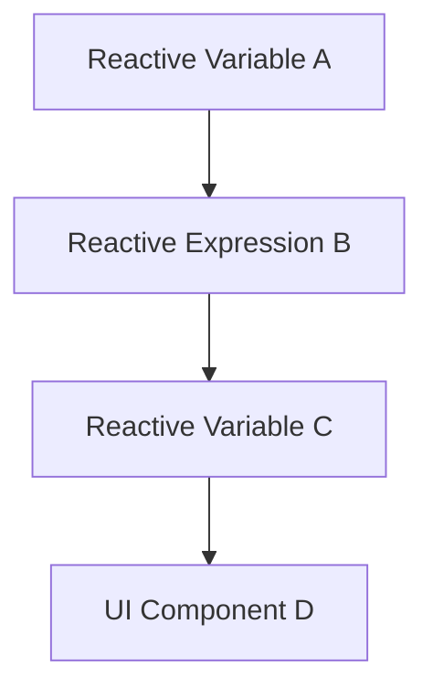

## 9.1 Functional Reactive Programming (FRP)

Functional Reactive Programming (FRP) is a powerful paradigm that combines the principles of functional programming with reactive programming to manage dynamic and asynchronous data flows. In this comprehensive guide, we will explore the concepts of FRP, its implementation in Scala using libraries like Scala.Rx and Laminar, and how it can be leveraged to build robust, responsive applications.

### Introduction to Functional Reactive Programming

FRP is a programming paradigm designed to work with time-varying values and event streams. It provides a declarative approach to building systems that react to changes over time. By integrating functional programming principles, FRP allows developers to write cleaner, more predictable code that is easier to reason about and maintain.

#### Key Concepts of FRP

- **Reactive Data Flows**: FRP models data as streams that can be transformed and combined. These streams represent values that change over time, allowing applications to react to changes dynamically.
- **Declarative Programming**: Instead of specifying how to perform a task, FRP allows developers to declare what the task is, abstracting away the underlying complexity.
- **Time-Varying Values**: FRP introduces the concept of behaviors, which are values that change over time, and events, which represent discrete occurrences.

### Implementing FRP in Scala

Scala, with its strong support for functional programming, is an ideal language for implementing FRP. Libraries like Scala.Rx and Laminar provide the necessary tools to work with reactive data flows in a functional context.

#### Scala.Rx

Scala.Rx is a library that brings FRP to Scala, allowing developers to create reactive data flows with ease. It provides a simple API for defining reactive variables, known as `Rx`, which automatically update when their dependencies change.

##### Basic Usage of Scala.Rx

Let's start with a simple example to demonstrate the basic usage of Scala.Rx:

```scala
import scala.rx._

object ScalaRxExample extends App {
  // Define a reactive variable
  val a = Var(10)
  val b = Var(20)

  // Define a reactive expression
  val sum = Rx { a() + b() }

  // Print the initial sum
  println(s"Initial sum: ${sum()}")

  // Update a reactive variable
  a() = 15

  // Print the updated sum
  println(s"Updated sum: ${sum()}")
}
```

In this example, `a` and `b` are reactive variables, and `sum` is a reactive expression that depends on them. When `a` is updated, `sum` automatically recalculates and reflects the new value.

##### Advanced Features of Scala.Rx

Scala.Rx also supports more advanced features such as:

- **Combinators**: Functions like `map`, `filter`, and `reduce` can be used to transform reactive variables.
- **Event Streams**: Scala.Rx can handle discrete events, allowing developers to react to specific occurrences.

Here's an example demonstrating event streams:

```scala
import scala.rx._

object EventStreamExample extends App {
  // Define an event stream
  val clicks = EventSource[Int]()

  // Define a reactive variable that counts clicks
  val clickCount = clicks.fold(0)((count, _) => count + 1)

  // Subscribe to the click count
  clickCount.foreach(count => println(s"Click count: $count"))

  // Emit some events
  clicks.emit(1)
  clicks.emit(1)
  clicks.emit(1)
}
```

In this example, `clicks` is an event stream, and `clickCount` is a reactive variable that counts the number of events emitted.

#### Laminar

Laminar is another powerful library for building reactive web applications in Scala. It provides a declarative way to construct user interfaces that react to changes in application state.

##### Building a Simple Reactive UI with Laminar

Laminar allows developers to build UIs that automatically update when the underlying data changes. Here's a simple example:

```scala
import com.raquo.laminar.api.L._

object LaminarExample extends App {
  // Create a reactive variable
  val counter = Var(0)

  // Define a UI component
  val app = div(
    button(
      "Increment",
      onClick --> { _ => counter.update(_ + 1) }
    ),
    div(
      "Counter value: ",
      child.text <-- counter.signal.map(_.toString)
    )
  )

  // Render the component
  render(dom.document.body, app)
}
```

In this example, the `counter` variable is reactive, and the UI automatically updates when the counter changes.

##### Advanced Laminar Features

Laminar offers several advanced features for building complex UIs:

- **Dynamic Lists**: Use `children <--` to render lists that update dynamically.
- **Event Handling**: Attach event listeners to elements using `onClick`, `onChange`, etc.
- **State Management**: Manage application state with reactive variables and signals.

Here's an example demonstrating dynamic lists:

```scala
import com.raquo.laminar.api.L._

object DynamicListExample extends App {
  // Create a reactive list
  val items = Var(List("Item 1", "Item 2", "Item 3"))

  // Define a UI component
  val app = div(
    button(
      "Add Item",
      onClick --> { _ => items.update(_ :+ s"Item ${items.now().size + 1}") }
    ),
    ul(
      children <-- items.signal.split(identity) { (item, _) =>
        li(item)
      }
    )
  )

  // Render the component
  render(dom.document.body, app)
}
```

In this example, the list of items is reactive, and the UI updates automatically when new items are added.

### Visualizing Reactive Data Flows

To better understand how reactive data flows work, let's visualize the flow of data in a simple reactive system using a Mermaid.js diagram.



In this diagram, changes to Reactive Variable A propagate through Reactive Expression B to Reactive Variable C, which in turn updates UI Component D.

### Design Considerations for FRP

When implementing FRP in Scala, there are several design considerations to keep in mind:

- **Performance**: Reactive systems can introduce overhead due to the continuous propagation of changes. It's important to optimize the performance of reactive expressions and minimize unnecessary updates.
- **Complexity**: While FRP simplifies the handling of dynamic data, it can also introduce complexity in understanding the flow of data. Proper documentation and visualization can help mitigate this complexity.
- **Debugging**: Debugging reactive systems can be challenging due to the asynchronous nature of data flows. Tools and techniques for tracing data propagation can be invaluable.

### Differences and Similarities with Other Patterns

FRP shares similarities with other reactive programming paradigms, such as the Observer pattern and Publish-Subscribe pattern. However, it differs in its focus on declarative data flows and the integration of functional programming principles.

- **Observer Pattern**: In the Observer pattern, observers are notified of changes to a subject. FRP generalizes this concept by modeling data as streams and allowing complex transformations.
- **Publish-Subscribe Pattern**: Both FRP and Publish-Subscribe involve broadcasting changes to multiple subscribers. FRP, however, emphasizes the composition and transformation of data streams.

### Try It Yourself

To deepen your understanding of FRP, try modifying the examples provided:

- **Experiment with Different Combinators**: Use `map`, `filter`, and `reduce` to transform reactive variables in Scala.Rx.
- **Create a More Complex UI**: Build a multi-component UI with Laminar that reacts to changes in multiple reactive variables.
- **Visualize Data Flows**: Draw your own diagrams to visualize how data flows through your reactive system.

### Knowledge Check

- **What is the primary advantage of using FRP in Scala?**
- **How does Scala.Rx differ from Laminar in terms of functionality?**
- **What are some common challenges when debugging reactive systems?**

### Conclusion

Functional Reactive Programming in Scala provides a powerful framework for building responsive, dynamic applications. By leveraging libraries like Scala.Rx and Laminar, developers can create systems that react to changes in real-time, leading to more engaging user experiences. As you continue to explore FRP, remember to experiment, visualize, and document your reactive systems to fully harness the potential of this paradigm.

## Quiz Time!



### What is the primary advantage of using FRP in Scala?

- [x] It allows for declarative data flows and simplifies handling dynamic data.
- [ ] It eliminates all performance overhead in applications.
- [ ] It makes debugging asynchronous systems trivial.
- [ ] It automatically optimizes code for parallel execution.

> **Explanation:** FRP allows developers to handle dynamic data flows declaratively, simplifying the complexity of managing changes over time.

### Which library is used for building reactive web applications in Scala?

- [ ] Scala.Rx
- [x] Laminar
- [ ] Akka
- [ ] Play Framework

> **Explanation:** Laminar is a library specifically designed for building reactive web applications in Scala.

### What is a key feature of Scala.Rx?

- [x] It provides reactive variables that automatically update when dependencies change.
- [ ] It is used for building RESTful APIs.
- [ ] It offers built-in support for database connections.
- [ ] It is a testing framework.

> **Explanation:** Scala.Rx provides reactive variables (`Rx`) that update automatically when their dependencies change, enabling reactive data flows.

### How does Laminar handle UI updates?

- [x] By using reactive variables and signals to automatically update the UI.
- [ ] By manually refreshing the UI components.
- [ ] By polling the server for changes.
- [ ] By using traditional callback functions.

> **Explanation:** Laminar uses reactive variables and signals to automatically update the UI when the underlying data changes.

### What is a common challenge when debugging reactive systems?

- [x] Tracing data propagation due to asynchronous data flows.
- [ ] Lack of available debugging tools.
- [ ] Inability to handle large data sets.
- [ ] Difficulty in writing unit tests.

> **Explanation:** Debugging reactive systems can be challenging due to the asynchronous nature of data flows, making it difficult to trace data propagation.

### Which of the following is a reactive programming paradigm similar to FRP?

- [x] Observer Pattern
- [ ] Singleton Pattern
- [ ] Factory Pattern
- [ ] Builder Pattern

> **Explanation:** The Observer pattern is similar to FRP as it involves notifying observers of changes, but FRP generalizes this concept with streams and transformations.

### What is the role of combinators in Scala.Rx?

- [x] To transform reactive variables using functions like `map`, `filter`, and `reduce`.
- [ ] To handle HTTP requests and responses.
- [ ] To manage database transactions.
- [ ] To define class hierarchies.

> **Explanation:** Combinators in Scala.Rx are used to transform reactive variables, allowing developers to apply functions like `map`, `filter`, and `reduce`.

### What is a behavior in FRP?

- [x] A time-varying value that changes over time.
- [ ] A static value that never changes.
- [ ] A function that handles user input.
- [ ] A design pattern for managing state.

> **Explanation:** In FRP, a behavior is a time-varying value that represents data that changes over time.

### Which of the following is NOT a feature of Laminar?

- [ ] Dynamic lists
- [ ] Event handling
- [ ] State management
- [x] Built-in database support

> **Explanation:** Laminar does not provide built-in database support; it focuses on building reactive UIs.

### True or False: FRP in Scala eliminates all performance overhead.

- [ ] True
- [x] False

> **Explanation:** While FRP simplifies handling dynamic data, it can introduce performance overhead due to continuous propagation of changes.


