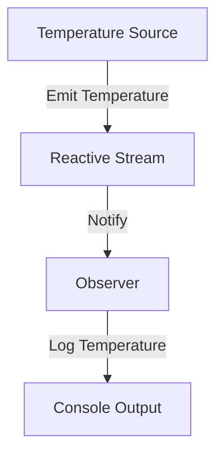

## 9.2 Observer Pattern with Reactive Streams

In the realm of software design patterns, the Observer Pattern stands out as a fundamental concept for managing event-driven systems. It allows objects, known as observers, to subscribe to and receive updates from another object, known as the subject, whenever a change occurs. In Scala, the Observer Pattern can be effectively implemented using Reactive Streams, a specification for asynchronous stream processing with non-blocking backpressure. This section delves into the intricacies of the Observer Pattern with Reactive Streams, focusing on implementations using Akka Streams and Monix.

### Understanding the Observer Pattern

**Intent:** The Observer Pattern defines a one-to-many dependency between objects so that when one object changes state, all its dependents are notified and updated automatically.

**Key Participants:**
- **Subject:** Maintains a list of observers and notifies them of state changes.
- **Observer:** Defines an updating interface for objects that should be notified of changes in a subject.
- **ConcreteSubject:** Stores state of interest to ConcreteObserver objects and sends a notification when its state changes.
- **ConcreteObserver:** Implements the Observer interface to keep its state consistent with the subject's.

**Applicability:** Use the Observer Pattern when:
- An abstraction has two aspects, one dependent on the other.
- A change to one object requires changing others, and you don't know how many objects need to be changed.
- An object should be able to notify other objects without making assumptions about who those objects are.

### Reactive Streams in Scala

Reactive Streams is a standard for asynchronous stream processing with non-blocking backpressure. It provides a robust framework for handling data streams, ensuring that producers do not overwhelm consumers. In Scala, libraries like Akka Streams and Monix offer powerful tools for implementing Reactive Streams.

#### Akka Streams

Akka Streams is a module of Akka, a toolkit for building highly concurrent, distributed, and resilient message-driven applications. It provides a high-level API for processing streams of data.

**Key Concepts in Akka Streams:**
- **Source:** A starting point of a stream, which can emit elements.
- **Sink:** An endpoint of a stream, which consumes elements.
- **Flow:** A processing stage that transforms elements.
- **Graph:** A blueprint of a stream processing pipeline.

#### Monix

Monix is a high-performance library for asynchronous programming in Scala. It provides abstractions for dealing with asynchronous computations and data streams.

**Key Concepts in Monix:**
- **Observable:** Represents a stream of data or events.
- **Observer:** Consumes the data or events emitted by an Observable.
- **Task:** Represents a computation that can be executed asynchronously.

### Implementing the Observer Pattern with Akka Streams

Let's explore how to implement the Observer Pattern using Akka Streams. We'll create a simple application that simulates a temperature sensor and notifies observers whenever the temperature changes.

```scala
import akka.actor.ActorSystem
import akka.stream.scaladsl.{Sink, Source}
import akka.stream.{ActorMaterializer, OverflowStrategy}

import scala.concurrent.duration._
import scala.concurrent.ExecutionContext.Implicits.global

object TemperatureSensorApp extends App {
  implicit val system: ActorSystem = ActorSystem("TemperatureSensorSystem")
  implicit val materializer: ActorMaterializer = ActorMaterializer()

  // Simulate temperature readings
  val temperatureSource = Source.tick(1.second, 1.second, () => scala.util.Random.nextInt(100))

  // Define an observer that prints the temperature
  val temperatureObserver = Sink.foreach[Int](temp => println(s"Current temperature: $temp°C"))

  // Connect the source to the observer
  temperatureSource.map(_.apply()).to(temperatureObserver).run()

  // Shutdown the system after 10 seconds
  system.scheduler.scheduleOnce(10.seconds) {
    system.terminate()
  }
}
```

**Explanation:**
- **Source.tick:** Generates a stream of random temperature readings every second.
- **Sink.foreach:** Acts as an observer, printing each temperature reading.
- **map and to:** Connect the source to the sink, forming a complete stream.

### Implementing the Observer Pattern with Monix

Now, let's implement the same Observer Pattern using Monix. We'll create an Observable that emits temperature readings and an Observer that logs these readings.

```scala
import monix.eval.Task
import monix.execution.Scheduler.Implicits.global
import monix.reactive.{Observable, Observer}

import scala.concurrent.duration._

object TemperatureSensorMonixApp extends App {
  // Create an observable that emits temperature readings
  val temperatureObservable: Observable[Int] = Observable.interval(1.second).map(_ => scala.util.Random.nextInt(100))

  // Define an observer that logs the temperature
  val temperatureObserver: Observer[Int] = new Observer[Int] {
    def onNext(temp: Int): Task[Unit] = Task(println(s"Current temperature: $temp°C"))
    def onError(ex: Throwable): Unit = println(s"Error occurred: ${ex.getMessage}")
    def onComplete(): Unit = println("Stream completed.")
  }

  // Subscribe the observer to the observable
  temperatureObservable.subscribe(temperatureObserver)

  // Keep the application running for 10 seconds
  Task.sleep(10.seconds).runSyncUnsafe()
}
```

**Explanation:**
- **Observable.interval:** Emits a sequence of integers at regular intervals.
- **Observer:** Logs each temperature reading to the console.
- **subscribe:** Connects the observer to the observable.

### Design Considerations

When implementing the Observer Pattern with Reactive Streams, consider the following:

- **Backpressure:** Ensure that your system can handle varying rates of data production and consumption. Akka Streams and Monix provide built-in mechanisms for managing backpressure.
- **Error Handling:** Implement robust error handling to manage exceptions and failures gracefully. Both Akka Streams and Monix offer tools for handling errors in streams.
- **Resource Management:** Properly manage resources such as threads and memory to prevent leaks and ensure efficient operation. Use Akka's ActorSystem and Monix's Scheduler to manage execution contexts.

### Differences and Similarities

While both Akka Streams and Monix provide powerful tools for implementing Reactive Streams, they have distinct features and use cases:

- **Akka Streams:** Ideal for building complex, distributed systems with a focus on resilience and scalability. It integrates seamlessly with the Akka ecosystem, including Akka Actors and Akka HTTP.
- **Monix:** Offers a more lightweight and flexible approach to asynchronous programming. It excels in scenarios requiring high-performance, low-latency data processing.

### Visualizing the Observer Pattern with Reactive Streams

To better understand how the Observer Pattern works with Reactive Streams, let's visualize the flow of data from a source to an observer.



**Diagram Explanation:** The diagram illustrates the flow of temperature data from the source through the reactive stream to the observer, which logs the temperature to the console.

### Try It Yourself

Experiment with the code examples provided by making the following modifications:

- **Change the Emission Interval:** Adjust the interval at which temperature readings are emitted to see how it affects the observer's output.
- **Add Multiple Observers:** Create additional observers that perform different actions, such as logging to a file or sending alerts.
- **Implement Error Handling:** Introduce errors into the stream and implement error handling logic to manage them gracefully.

### Knowledge Check

To reinforce your understanding of the Observer Pattern with Reactive Streams, consider the following questions:

1. What is the primary purpose of the Observer Pattern?
2. How do Akka Streams and Monix differ in their approach to Reactive Streams?
3. What mechanisms do Akka Streams and Monix provide for handling backpressure?
4. How can you manage resources effectively when implementing Reactive Streams?

### Conclusion

The Observer Pattern with Reactive Streams offers a powerful paradigm for managing event-based data streams in Scala. By leveraging libraries like Akka Streams and Monix, you can build robust, scalable systems that handle asynchronous data processing with ease. Remember, this is just the beginning. As you progress, you'll build more complex and interactive systems. Keep experimenting, stay curious, and enjoy the journey!

## Quiz Time!



### What is the primary purpose of the Observer Pattern?

- [x] To define a one-to-many dependency between objects so that when one object changes state, all its dependents are notified and updated automatically.
- [ ] To encapsulate a request as an object, thereby allowing for parameterization of clients with queues, requests, and operations.
- [ ] To provide a way to access the elements of an aggregate object sequentially without exposing its underlying representation.
- [ ] To define a family of algorithms, encapsulate each one, and make them interchangeable.

> **Explanation:** The Observer Pattern is used to define a one-to-many dependency between objects, ensuring that when one object changes state, all its dependents are notified and updated automatically.

### Which library is ideal for building complex, distributed systems with a focus on resilience and scalability?

- [x] Akka Streams
- [ ] Monix
- [ ] RxScala
- [ ] Play Framework

> **Explanation:** Akka Streams is part of the Akka toolkit, which is designed for building highly concurrent, distributed, and resilient message-driven applications.

### What does the `Source.tick` method in Akka Streams do?

- [x] Generates a stream of elements at regular intervals.
- [ ] Consumes elements from a stream at regular intervals.
- [ ] Transforms elements in a stream at regular intervals.
- [ ] Terminates a stream after a specified interval.

> **Explanation:** The `Source.tick` method in Akka Streams generates a stream of elements at regular intervals, which can be used to simulate periodic data emissions.

### How does Monix handle asynchronous computations?

- [ ] By using Akka Actors for message passing.
- [ ] By using the `Future` and `Promise` constructs.
- [x] By using `Observable` and `Task` abstractions.
- [ ] By using the `Stream` and `Sink` constructs.

> **Explanation:** Monix handles asynchronous computations using `Observable` for data streams and `Task` for asynchronous computations.

### What is a key feature of Reactive Streams?

- [x] Non-blocking backpressure
- [ ] Synchronous data processing
- [ ] Blocking I/O operations
- [ ] Single-threaded execution

> **Explanation:** Reactive Streams provide non-blocking backpressure, allowing systems to handle varying rates of data production and consumption efficiently.

### Which of the following is NOT a key participant in the Observer Pattern?

- [ ] Subject
- [ ] Observer
- [ ] ConcreteSubject
- [x] Mediator

> **Explanation:** The Mediator is not a participant in the Observer Pattern. The key participants are Subject, Observer, ConcreteSubject, and ConcreteObserver.

### What is the role of the `Observer` in Monix?

- [ ] To generate data for the stream.
- [x] To consume data or events emitted by an `Observable`.
- [ ] To transform data within the stream.
- [ ] To manage backpressure in the stream.

> **Explanation:** In Monix, the `Observer` consumes data or events emitted by an `Observable`.

### How can you introduce error handling in Akka Streams?

- [x] By using the `recover` or `recoverWith` methods.
- [ ] By using the `try-catch` block.
- [ ] By using the `onError` method.
- [ ] By using the `finally` block.

> **Explanation:** Akka Streams provides `recover` and `recoverWith` methods to handle errors gracefully within a stream.

### Which of the following is a benefit of using Reactive Streams?

- [x] Efficient handling of asynchronous data streams with backpressure.
- [ ] Simplified synchronous data processing.
- [ ] Guaranteed single-threaded execution.
- [ ] Reduced need for error handling.

> **Explanation:** Reactive Streams efficiently handle asynchronous data streams with backpressure, ensuring that producers do not overwhelm consumers.

### True or False: Monix is a part of the Akka toolkit.

- [ ] True
- [x] False

> **Explanation:** Monix is not a part of the Akka toolkit. It is a separate library designed for high-performance asynchronous programming in Scala.


