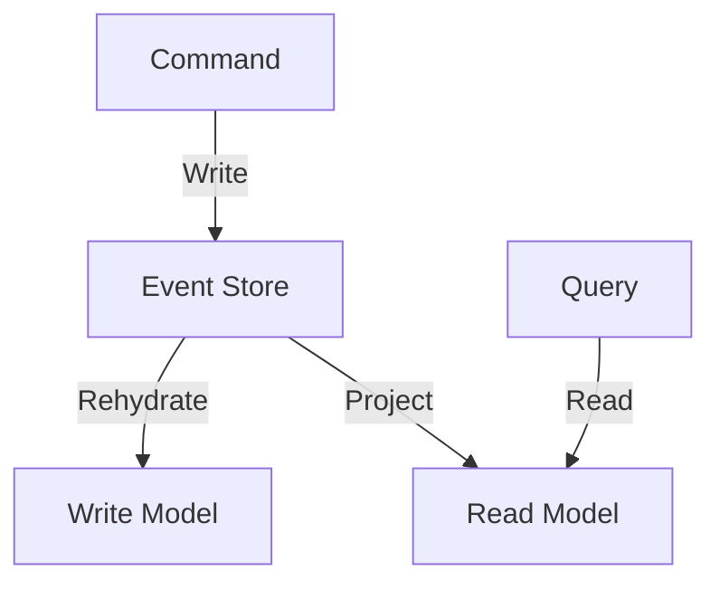

## 9.3 Event Sourcing and CQRS

In the realm of modern software architecture, Event Sourcing and Command Query Responsibility Segregation (CQRS) stand out as pivotal patterns for building scalable, resilient, and maintainable systems. These patterns are particularly well-suited for applications that require high throughput, complex business logic, or need to maintain a detailed audit trail of changes. In this section, we will delve into the concepts of Event Sourcing and CQRS, explore their integration, and demonstrate their implementation in Scala.

### Understanding Event Sourcing

**Event Sourcing** is a design pattern where state changes in a system are stored as a sequence of events. Instead of persisting the current state of an object, every change to the state is captured as an event, which is then stored in an event store. The current state of the system can be reconstructed by replaying these events.

#### Key Concepts of Event Sourcing

- **Event Store**: A specialized database that stores events. It acts as the source of truth for the system's state.
- **Event**: A record of a state change. Events are immutable and represent facts that have occurred.
- **Rehydration**: The process of reconstructing the current state of an object by replaying its events.
- **Snapshot**: A periodic capture of the current state to optimize rehydration by reducing the number of events that need to be replayed.

#### Advantages of Event Sourcing

- **Auditability**: Every change is recorded, providing a complete audit trail.
- **Scalability**: Event stores can be optimized for high write throughput.
- **Flexibility**: Ability to reconstruct past states and derive new projections.

#### Implementing Event Sourcing in Scala

To implement Event Sourcing in Scala, we need to define our events, an event store, and the logic to apply events to reconstruct the state.

```scala
// Define an event trait
sealed trait AccountEvent
case class AccountCreated(accountId: String, initialBalance: Double) extends AccountEvent
case class MoneyDeposited(accountId: String, amount: Double) extends AccountEvent
case class MoneyWithdrawn(accountId: String, amount: Double) extends AccountEvent

// Define an account state
case class AccountState(balance: Double = 0.0) {
  def apply(event: AccountEvent): AccountState = event match {
    case AccountCreated(_, initialBalance) => copy(balance = initialBalance)
    case MoneyDeposited(_, amount) => copy(balance = balance + amount)
    case MoneyWithdrawn(_, amount) => copy(balance = balance - amount)
  }
}

// Event store interface
trait EventStore {
  def save(event: AccountEvent): Unit
  def load(accountId: String): Seq[AccountEvent]
}

// Rehydrating the account state
def rehydrate(events: Seq[AccountEvent]): AccountState =
  events.foldLeft(AccountState())((state, event) => state.apply(event))
```

### Introducing CQRS

**Command Query Responsibility Segregation (CQRS)** is a pattern that separates the responsibility of handling commands (which change state) from queries (which read state). This separation allows for optimized read and write models, each tailored to its specific use case.

#### Key Concepts of CQRS

- **Command**: An action that changes the state of the system. Commands are typically handled asynchronously.
- **Query**: A request to read data from the system. Queries are often optimized for performance.
- **Read Model**: A representation of the data optimized for queries.
- **Write Model**: A representation of the data optimized for processing commands.

#### Advantages of CQRS

- **Scalability**: Separate read and write models can be scaled independently.
- **Performance**: Optimized data models for reading and writing improve performance.
- **Flexibility**: Different models can be used for different use cases.

#### Implementing CQRS in Scala

To implement CQRS in Scala, we define commands and queries, and separate the handling logic for each.

```scala
// Define commands
sealed trait AccountCommand
case class CreateAccount(accountId: String, initialBalance: Double) extends AccountCommand
case class DepositMoney(accountId: String, amount: Double) extends AccountCommand
case class WithdrawMoney(accountId: String, amount: Double) extends AccountCommand

// Define queries
sealed trait AccountQuery
case class GetAccountBalance(accountId: String) extends AccountQuery

// Command handler
class AccountCommandHandler(eventStore: EventStore) {
  def handle(command: AccountCommand): Unit = command match {
    case CreateAccount(accountId, initialBalance) =>
      eventStore.save(AccountCreated(accountId, initialBalance))
    case DepositMoney(accountId, amount) =>
      eventStore.save(MoneyDeposited(accountId, amount))
    case WithdrawMoney(accountId, amount) =>
      eventStore.save(MoneyWithdrawn(accountId, amount))
  }
}

// Query handler
class AccountQueryHandler(eventStore: EventStore) {
  def handle(query: AccountQuery): Double = query match {
    case GetAccountBalance(accountId) =>
      val events = eventStore.load(accountId)
      rehydrate(events).balance
  }
}
```

### Integrating Event Sourcing with CQRS

Event Sourcing and CQRS complement each other well. Event Sourcing provides a detailed history of changes, while CQRS allows for optimized read and write operations. Integrating these patterns involves using Event Sourcing for the write model and creating projections for the read model.

#### Creating Projections

Projections are views of the data that are derived from the event store. They are updated asynchronously as new events are processed.

```scala
// Projection for account balances
class AccountBalanceProjection(eventStore: EventStore) {
  private var balances: Map[String, Double] = Map.empty

  def update(event: AccountEvent): Unit = event match {
    case AccountCreated(accountId, initialBalance) =>
      balances += (accountId -> initialBalance)
    case MoneyDeposited(accountId, amount) =>
      balances = balances.updated(accountId, balances(accountId) + amount)
    case MoneyWithdrawn(accountId, amount) =>
      balances = balances.updated(accountId, balances(accountId) - amount)
  }

  def getBalance(accountId: String): Double = balances.getOrElse(accountId, 0.0)
}
```

### Design Considerations

When implementing Event Sourcing and CQRS, consider the following:

- **Consistency**: Eventual consistency is common, as projections may lag behind the event store.
- **Complexity**: These patterns introduce complexity and may not be suitable for simple applications.
- **Event Schema Evolution**: Plan for changes in event schemas over time.
- **Performance**: Optimize event storage and retrieval for high throughput.

### Differences and Similarities

Event Sourcing and CQRS are often used together but can be applied independently. Event Sourcing focuses on capturing changes as events, while CQRS emphasizes separating read and write responsibilities.

### Visualizing Event Sourcing and CQRS

To better understand the flow of data and operations in Event Sourcing and CQRS, let's visualize the architecture using Mermaid.js diagrams.



**Diagram Description**: This diagram illustrates the flow of commands and queries in an Event Sourcing and CQRS architecture. Commands are processed and stored in the event store. The write model is rehydrated from the event store, while the read model is updated through projections. Queries are executed against the read model.

### Try It Yourself

Experiment with the code examples provided by modifying the events, commands, and projections. Consider adding new event types or queries to explore the flexibility of Event Sourcing and CQRS.

### References and Links

- [Martin Fowler on Event Sourcing](https://martinfowler.com/eaaDev/EventSourcing.html)
- [CQRS Documentation](https://martinfowler.com/bliki/CQRS.html)
- [Akka Persistence for Event Sourcing](https://doc.akka.io/docs/akka/current/typed/persistence.html)

### Knowledge Check

- What are the main advantages of using Event Sourcing?
- How does CQRS improve scalability and performance?
- What is the role of projections in an Event Sourcing and CQRS architecture?

### Embrace the Journey

Remember, mastering Event Sourcing and CQRS is a journey. As you continue to explore these patterns, you'll discover new ways to build robust and scalable systems. Keep experimenting, stay curious, and enjoy the process!

## Quiz Time!



### What is the primary purpose of Event Sourcing?

- [x] To capture every change to the system state as an event
- [ ] To optimize read operations
- [ ] To separate read and write responsibilities
- [ ] To improve user interface performance

> **Explanation:** Event Sourcing captures every change to the system state as an event, providing a complete history of changes.

### In CQRS, what is a command responsible for?

- [x] Changing the state of the system
- [ ] Reading data from the system
- [ ] Optimizing query performance
- [ ] Generating reports

> **Explanation:** A command in CQRS is responsible for changing the state of the system.

### What is a projection in the context of Event Sourcing and CQRS?

- [x] A view of the data derived from the event store
- [ ] A type of command
- [ ] A method for optimizing writes
- [ ] A mechanism for handling queries

> **Explanation:** A projection is a view of the data derived from the event store, used to optimize read operations.

### How does CQRS improve scalability?

- [x] By allowing read and write models to be scaled independently
- [ ] By storing all data in a single model
- [ ] By reducing the number of queries
- [ ] By simplifying the data model

> **Explanation:** CQRS improves scalability by allowing read and write models to be scaled independently.

### What is the role of the event store in Event Sourcing?

- [x] To act as the source of truth for the system's state
- [ ] To optimize query performance
- [ ] To handle user authentication
- [ ] To generate reports

> **Explanation:** The event store acts as the source of truth for the system's state, storing all events.

### What is rehydration in Event Sourcing?

- [x] Reconstructing the current state by replaying events
- [ ] Optimizing query performance
- [ ] Handling user input
- [ ] Generating reports

> **Explanation:** Rehydration is the process of reconstructing the current state by replaying events.

### What is a key benefit of using Event Sourcing?

- [x] Auditability of all changes
- [ ] Simplified data model
- [ ] Improved user interface performance
- [ ] Reduced storage requirements

> **Explanation:** A key benefit of Event Sourcing is the auditability of all changes, as every event is recorded.

### How are commands typically handled in a CQRS architecture?

- [x] Asynchronously
- [ ] Synchronously
- [ ] In parallel with queries
- [ ] Directly in the user interface

> **Explanation:** Commands in a CQRS architecture are typically handled asynchronously to improve performance and scalability.

### What is a common challenge when implementing Event Sourcing and CQRS?

- [x] Managing eventual consistency
- [ ] Handling synchronous operations
- [ ] Reducing storage requirements
- [ ] Simplifying the user interface

> **Explanation:** A common challenge is managing eventual consistency, as projections may lag behind the event store.

### True or False: Event Sourcing and CQRS can be used independently.

- [x] True
- [ ] False

> **Explanation:** Event Sourcing and CQRS can be used independently, although they are often used together for complementary benefits.


