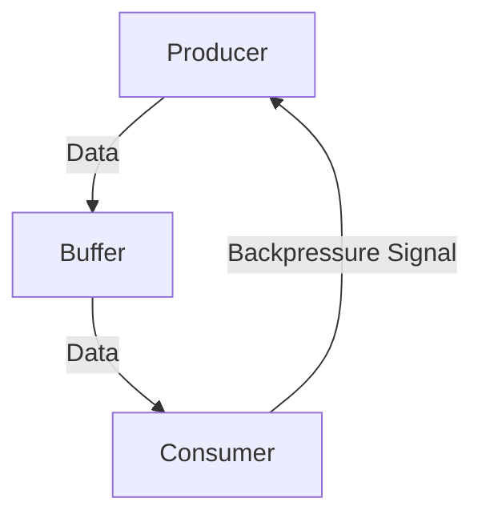

## 9.4 Backpressure Handling

In the realm of reactive programming, managing data flow between producers and consumers is crucial for maintaining system stability and performance. Backpressure is a key concept that ensures producers do not overwhelm consumers with data, allowing systems to handle varying loads gracefully. In this section, we will delve into backpressure handling in Scala, focusing on reactive streams and providing practical examples to illustrate the concepts.

### Understanding Backpressure

**Backpressure** is a mechanism that allows a consumer to signal to a producer to slow down or stop sending data until the consumer is ready to process more. This is particularly important in systems where data production rates can exceed consumption rates, leading to potential memory overflow or system crashes.

#### Why Backpressure Matters

- **System Stability**: Without backpressure, a fast producer can overwhelm a slow consumer, leading to buffer overflows or dropped messages.
- **Resource Management**: Efficient backpressure handling ensures optimal use of system resources, preventing unnecessary memory and CPU usage.
- **Scalability**: Systems that handle backpressure effectively can scale more easily, as they can adapt to varying loads and processing speeds.

### Key Concepts in Backpressure

To effectively implement backpressure, it's essential to understand the following concepts:

1. **Producer**: The entity that generates data.
2. **Consumer**: The entity that processes data.
3. **Buffer**: A temporary storage area where data is held before being processed by the consumer.
4. **Flow Control**: The process of managing the rate of data transmission between producer and consumer.

### Implementing Backpressure in Scala

Scala provides several libraries and frameworks that facilitate backpressure handling, with Akka Streams being one of the most popular choices. Akka Streams is built on top of the Reactive Streams API, which defines a standard for asynchronous stream processing with non-blocking backpressure.

#### Akka Streams and Reactive Streams

Akka Streams is a powerful library for building and composing asynchronous and event-driven applications. It provides a rich set of tools for handling streams of data, including built-in support for backpressure.

##### Basic Components of Akka Streams

- **Source**: Represents a source of data.
- **Sink**: Represents a destination for data.
- **Flow**: Represents a processing stage that transforms data.
- **Graph**: Represents a complex processing pipeline composed of sources, sinks, and flows.

##### Example: Simple Akka Stream with Backpressure

Let's start with a simple example of an Akka Stream that demonstrates backpressure handling:

```scala
import akka.actor.ActorSystem
import akka.stream.scaladsl.{Sink, Source}
import akka.stream.{ActorMaterializer, OverflowStrategy}

import scala.concurrent.duration._

object BackpressureExample extends App {
  implicit val system: ActorSystem = ActorSystem("BackpressureExample")
  implicit val materializer: ActorMaterializer = ActorMaterializer()

  // Create a source that emits numbers from 1 to 1000
  val source = Source(1 to 1000)

  // Create a slow sink that processes one element per second
  val slowSink = Sink.foreach[Int] { number =>
    println(s"Processing number: $number")
    Thread.sleep(1000) // Simulate slow processing
  }

  // Connect the source to the sink with a buffer and backpressure
  source
    .buffer(10, OverflowStrategy.backpressure)
    .to(slowSink)
    .run()
}
```

In this example, we create a source that emits numbers from 1 to 1000 and a slow sink that processes one number per second. The `buffer` method is used to introduce a buffer of size 10 with a backpressure strategy. This ensures that if the sink cannot keep up with the source, the source will slow down, preventing overflow.

### Advanced Backpressure Techniques

While the basic example demonstrates the concept of backpressure, real-world applications often require more sophisticated techniques to handle complex data flows.

#### Custom Backpressure Strategies

Akka Streams allows you to define custom backpressure strategies to suit your application's needs. Some common strategies include:

- **Drop Head**: Discards the oldest elements in the buffer when it's full.
- **Drop Tail**: Discards the newest elements in the buffer when it's full.
- **Drop New**: Discards incoming elements when the buffer is full.
- **Drop Buffer**: Discards all elements in the buffer when it's full.
- **Backpressure**: Slows down the producer until the buffer has space.

##### Example: Custom Backpressure Strategy

```scala
import akka.stream.OverflowStrategy

// Define a custom backpressure strategy
val customStrategy = OverflowStrategy.dropHead

// Use the custom strategy in a stream
source
  .buffer(10, customStrategy)
  .to(slowSink)
  .run()
```

In this example, we define a custom backpressure strategy using `OverflowStrategy.dropHead`, which discards the oldest elements in the buffer when it's full.

### Visualizing Backpressure Flow

To better understand how backpressure works in a stream, let's visualize the flow using a diagram.



In this diagram, the producer sends data to the buffer, which holds it temporarily before passing it to the consumer. If the consumer cannot process the data fast enough, it sends a backpressure signal to the producer to slow down.

### Handling Backpressure in Complex Systems

In complex systems, backpressure handling can become more challenging due to multiple producers and consumers, varying processing speeds, and network latency. Here are some strategies to handle backpressure in such scenarios:

#### Throttling

Throttling is a technique used to limit the rate of data production. This can be achieved by introducing delays or limiting the number of requests a producer can make in a given time period.

##### Example: Throttling in Akka Streams

```scala
import akka.stream.ThrottleMode

// Throttle the source to emit one element per second
source
  .throttle(1, 1.second, 1, ThrottleMode.shaping)
  .to(slowSink)
  .run()
```

In this example, we use the `throttle` method to limit the source to emit one element per second, ensuring that the sink is not overwhelmed.

#### Dynamic Buffering

Dynamic buffering involves adjusting the buffer size based on the current load and processing speed. This can help accommodate bursts of data while maintaining system stability.

##### Example: Dynamic Buffering

```scala
// Define a dynamic buffer size based on system load
val dynamicBufferSize = if (systemLoad < 0.5) 20 else 10

source
  .buffer(dynamicBufferSize, OverflowStrategy.backpressure)
  .to(slowSink)
  .run()
```

In this example, we adjust the buffer size based on the system load, allowing for more flexibility in handling varying data rates.

### Integrating Backpressure with Other Patterns

Backpressure handling can be integrated with other design patterns to create robust and scalable systems. Here are some examples:

#### Circuit Breaker Pattern

The Circuit Breaker pattern can be used in conjunction with backpressure to prevent system overload and ensure resilience. By monitoring the success and failure rates of operations, a circuit breaker can temporarily halt requests to a failing service, allowing it to recover.

##### Example: Circuit Breaker with Backpressure

```scala
import akka.pattern.CircuitBreaker

val breaker = new CircuitBreaker(
  system.scheduler,
  maxFailures = 5,
  callTimeout = 10.seconds,
  resetTimeout = 1.minute
)

source
  .via(breaker.flow)
  .buffer(10, OverflowStrategy.backpressure)
  .to(slowSink)
  .run()
```

In this example, we use a circuit breaker to monitor the flow of data and apply backpressure when necessary, ensuring that the system remains stable even under high load.

#### Load Balancing

Load balancing can be used to distribute data across multiple consumers, reducing the risk of any single consumer being overwhelmed. This can be achieved using techniques such as round-robin or least connections.

##### Example: Load Balancing with Akka Streams

```scala
import akka.stream.scaladsl.{Broadcast, Merge}

val consumer1 = Sink.foreach[Int](println)
val consumer2 = Sink.foreach[Int](println)

source
  .via(Broadcast(2))
  .to(consumer1)
  .run()

source
  .via(Broadcast(2))
  .to(consumer2)
  .run()
```

In this example, we use the `Broadcast` stage to distribute data across two consumers, ensuring that the load is balanced and backpressure is managed effectively.

### Best Practices for Backpressure Handling

To effectively implement backpressure in your Scala applications, consider the following best practices:

1. **Monitor System Metrics**: Regularly monitor system metrics such as CPU usage, memory usage, and network latency to identify potential bottlenecks and adjust backpressure strategies accordingly.

2. **Test Under Load**: Conduct load testing to simulate real-world scenarios and ensure that your backpressure handling mechanisms can cope with varying data rates and processing speeds.

3. **Use Appropriate Buffer Sizes**: Choose buffer sizes that balance performance and resource usage, considering the characteristics of your data and processing requirements.

4. **Implement Graceful Degradation**: Design your system to degrade gracefully under high load, ensuring that essential services remain available even when backpressure is applied.

5. **Leverage Built-in Tools**: Utilize the built-in tools and libraries provided by Scala and Akka Streams to simplify backpressure handling and reduce the risk of errors.

### Conclusion

Backpressure handling is a critical aspect of reactive programming, ensuring that systems can manage data flow effectively and maintain stability under varying loads. By leveraging Scala's powerful tools and libraries, such as Akka Streams, you can implement robust backpressure mechanisms that enhance the performance and scalability of your applications.

Remember, mastering backpressure handling is an ongoing journey. As you gain experience, you'll develop a deeper understanding of the nuances involved and be better equipped to tackle complex data flow challenges. Keep experimenting, stay curious, and enjoy the journey!

## Quiz Time!



### What is backpressure in the context of reactive programming?

- [x] A mechanism to manage data flow between producers and consumers
- [ ] A method to increase data production rates
- [ ] A strategy to eliminate data buffering
- [ ] A technique to prioritize data processing

> **Explanation:** Backpressure is a mechanism that allows consumers to signal producers to slow down or stop sending data until they are ready to process more, ensuring system stability.

### Which Scala library is commonly used for implementing backpressure?

- [x] Akka Streams
- [ ] Play Framework
- [ ] Slick
- [ ] Monix

> **Explanation:** Akka Streams is a popular library in Scala for building asynchronous and event-driven applications with built-in support for backpressure.

### What does the `buffer` method in Akka Streams do?

- [x] Introduces a buffer with a specified size and backpressure strategy
- [ ] Increases the speed of data processing
- [ ] Removes elements from the stream
- [ ] Converts a stream to a list

> **Explanation:** The `buffer` method in Akka Streams introduces a buffer with a specified size and backpressure strategy to manage data flow between producers and consumers.

### Which backpressure strategy discards the oldest elements in the buffer when it's full?

- [x] Drop Head
- [ ] Drop Tail
- [ ] Drop New
- [ ] Backpressure

> **Explanation:** The Drop Head strategy discards the oldest elements in the buffer when it's full, allowing new elements to be added.

### How can you limit the rate of data production in Akka Streams?

- [x] Using the `throttle` method
- [ ] Increasing the buffer size
- [ ] Reducing the number of consumers
- [ ] Applying a filter

> **Explanation:** The `throttle` method in Akka Streams is used to limit the rate of data production, ensuring that consumers are not overwhelmed.

### What is the purpose of a circuit breaker in conjunction with backpressure?

- [x] To prevent system overload and ensure resilience
- [ ] To increase data production rates
- [ ] To eliminate data buffering
- [ ] To prioritize data processing

> **Explanation:** A circuit breaker is used to prevent system overload and ensure resilience by temporarily halting requests to a failing service, allowing it to recover.

### Which technique involves adjusting the buffer size based on the current load and processing speed?

- [x] Dynamic Buffering
- [ ] Throttling
- [ ] Load Balancing
- [ ] Circuit Breaking

> **Explanation:** Dynamic Buffering involves adjusting the buffer size based on the current load and processing speed to accommodate bursts of data while maintaining system stability.

### What is the role of the `Broadcast` stage in Akka Streams?

- [x] To distribute data across multiple consumers
- [ ] To increase the speed of data processing
- [ ] To remove elements from the stream
- [ ] To convert a stream to a list

> **Explanation:** The `Broadcast` stage in Akka Streams is used to distribute data across multiple consumers, ensuring that the load is balanced and backpressure is managed effectively.

### Why is it important to monitor system metrics in backpressure handling?

- [x] To identify potential bottlenecks and adjust strategies accordingly
- [ ] To increase data production rates
- [ ] To eliminate data buffering
- [ ] To prioritize data processing

> **Explanation:** Monitoring system metrics is important to identify potential bottlenecks and adjust backpressure strategies accordingly, ensuring optimal performance and resource usage.

### True or False: Backpressure handling is only necessary in systems with high data production rates.

- [ ] True
- [x] False

> **Explanation:** Backpressure handling is necessary in any system where data production rates can exceed consumption rates, regardless of the overall production rate, to ensure stability and prevent resource overload.


