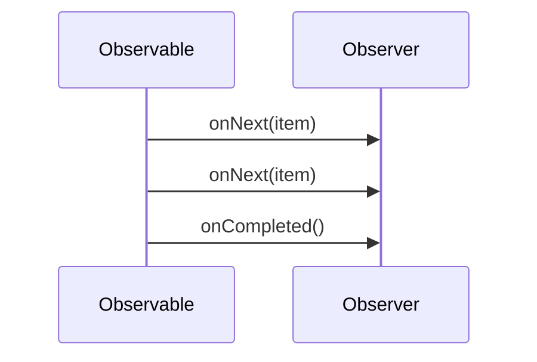

## 9.5 Reactive Extensions in Scala

Reactive Extensions (Rx) provide a powerful model for handling asynchronous and event-based programming by using observable sequences. In Scala, RxScala is the library that brings the power of Reactive Extensions to the Scala ecosystem. This section will guide you through the core concepts, practical applications, and advanced techniques of using RxScala to build responsive, resilient, and scalable applications.

### Introduction to Reactive Extensions

Reactive Extensions (Rx) is a library for composing asynchronous and event-based programs using observable sequences and LINQ-style query operators. RxScala is the Scala adaptation of Rx, allowing developers to leverage the expressive power of Scala's functional programming features alongside Rx's robust asynchronous capabilities.

#### Key Concepts

- **Observable Sequences**: The core abstraction in Rx, representing a stream of data or events that can be observed.
- **Observers**: Consumers of the data or events emitted by an observable sequence.
- **Operators**: Functions that enable complex event processing, such as filtering, transforming, and combining observable sequences.

### Why Use RxScala?

RxScala offers several advantages for building modern applications:

- **Asynchronous Programming**: Simplifies the handling of asynchronous operations, reducing the complexity of callback hell.
- **Event-Driven Architecture**: Facilitates the design of systems that react to events in real-time.
- **Functional Composition**: Leverages Scala's functional programming features to create concise and expressive code.
- **Scalability**: Supports the development of scalable applications that can handle high volumes of data and events.

### Setting Up RxScala

To start using RxScala, add the following dependency to your `build.sbt` file:

```scala
libraryDependencies += "io.reactivex" %% "rxscala" % "0.27.0"
```

Ensure you have the latest version of RxScala to take advantage of the latest features and improvements.

### Core Components of RxScala

#### Observables

An `Observable` is a data source that emits items over time. Observables can emit zero or more items and then either complete or fail with an error.

```scala
import rx.lang.scala.Observable

val observable = Observable.just("Hello", "World")
observable.subscribe(println)
```

In this example, the `Observable.just` method creates an observable that emits the strings "Hello" and "World".

#### Observers

An `Observer` subscribes to an observable to receive data items and notifications about the observable's lifecycle events.

```scala
val observer = new rx.lang.scala.Observer[String] {
  def onNext(value: String): Unit = println(s"Received: $value")
  def onError(error: Throwable): Unit = println(s"Error: $error")
  def onCompleted(): Unit = println("Completed")
}

observable.subscribe(observer)
```

Here, the observer prints each item it receives, handles errors, and prints a message when the observable completes.

#### Operators

Operators allow you to transform, filter, and combine observables. RxScala provides a rich set of operators for various operations.

```scala
val numbers = Observable.from(1 to 10)
val evenNumbers = numbers.filter(_ % 2 == 0)
evenNumbers.subscribe(println)
```

This example demonstrates the use of the `filter` operator to create a new observable that emits only even numbers.

### Advanced RxScala Patterns

#### Combining Observables

You can combine multiple observables to create more complex data flows. The `zip` operator combines two observables into a single observable.

```scala
val observable1 = Observable.just(1, 2, 3)
val observable2 = Observable.just("A", "B", "C")

val zipped = observable1.zip(observable2)
zipped.subscribe { case (num, char) => println(s"$num -> $char") }
```

This code combines two observables into pairs of numbers and characters.

#### Error Handling

RxScala provides operators for handling errors gracefully. The `onErrorResumeNext` operator allows you to continue emitting items from another observable if an error occurs.

```scala
val faultyObservable = Observable.just(1, 2, 0).map(10 / _)
val fallback = Observable.just(10, 20, 30)

val safeObservable = faultyObservable.onErrorResumeNext(fallback)
safeObservable.subscribe(println)
```

In this example, if an error occurs in `faultyObservable`, the `fallback` observable will be used instead.

#### Backpressure Handling

Backpressure is a common challenge in reactive systems, where producers emit data faster than consumers can process it. RxScala provides strategies to handle backpressure effectively.

```scala
val fastProducer = Observable.interval(100.millis)
val slowConsumer = fastProducer.sample(1.second)

slowConsumer.subscribe(println)
```

The `sample` operator reduces the frequency of emissions to match the consumer's processing speed.

### Visualizing Reactive Extensions

To better understand the flow of data and events in a reactive system, let's visualize the interaction between observables and observers.



This sequence diagram illustrates how an observable emits items to an observer and notifies it upon completion.

### Practical Applications of RxScala

#### Building Real-Time Applications

RxScala is ideal for building real-time applications that require immediate responses to user actions or external events. For example, you can use RxScala to implement a chat application that updates messages in real-time.

```scala
val messageStream = Observable.interval(1.second).map(_ => "New message")
messageStream.subscribe(println)
```

This simple example simulates a stream of new messages arriving every second.

#### Integrating with Existing Systems

RxScala can be integrated with existing systems to enhance their responsiveness and scalability. For instance, you can use RxScala to process data from a database or an external API.

```scala
def fetchData(): Observable[String] = {
  // Simulate fetching data from an external source
  Observable.just("Data1", "Data2", "Data3")
}

fetchData().subscribe(println)
```

This example demonstrates how to create an observable that emits data fetched from an external source.

### Try It Yourself

To deepen your understanding of RxScala, try modifying the examples provided:

1. **Modify the Observable**: Change the data emitted by the observable and observe the effects on the observer.
2. **Add Error Handling**: Introduce an error in the observable and use error handling operators to manage it.
3. **Experiment with Operators**: Use different operators to transform and combine observables in new ways.

### Best Practices for Using RxScala

- **Keep Observables Simple**: Break down complex data flows into smaller, manageable observables.
- **Use Backpressure Strategies**: Implement backpressure handling to prevent overwhelming consumers.
- **Leverage Functional Composition**: Use Scala's functional programming features to create concise and expressive reactive code.
- **Test Reactive Code**: Write tests to ensure the correctness and reliability of your reactive code.

### Design Considerations

When using RxScala, consider the following design considerations:

- **Concurrency**: Ensure that your reactive code handles concurrency appropriately, especially when dealing with shared resources.
- **Error Propagation**: Design your observables to propagate errors in a way that allows for graceful recovery.
- **Resource Management**: Manage resources carefully to avoid memory leaks and ensure efficient use of system resources.

### Differences and Similarities with Other Patterns

Reactive Extensions share similarities with other asynchronous programming models, such as Futures and Promises. However, RxScala provides a more comprehensive model for handling streams of data and events, making it suitable for complex event-driven systems.

### Conclusion

Reactive Extensions in Scala, through RxScala, offer a powerful and flexible model for building asynchronous and event-driven applications. By leveraging observables, observers, and operators, you can create responsive, resilient, and scalable systems. As you continue to explore RxScala, remember to experiment with different patterns and techniques to find the best solutions for your specific use cases.

## Quiz Time!



### What is the core abstraction in Reactive Extensions?

- [x] Observable Sequences
- [ ] Promises
- [ ] Futures
- [ ] Callbacks

> **Explanation:** Observable sequences are the core abstraction in Reactive Extensions, representing streams of data or events.

### Which operator is used to combine two observables into a single observable?

- [ ] filter
- [ ] map
- [x] zip
- [ ] flatMap

> **Explanation:** The `zip` operator combines two observables into a single observable by pairing their emitted items.

### What is the purpose of the `onErrorResumeNext` operator?

- [ ] To transform data
- [ ] To filter data
- [x] To handle errors gracefully
- [ ] To combine observables

> **Explanation:** The `onErrorResumeNext` operator allows you to continue emitting items from another observable if an error occurs.

### How can backpressure be handled in RxScala?

- [ ] By using the `map` operator
- [ ] By using the `filter` operator
- [x] By using the `sample` operator
- [ ] By using the `flatMap` operator

> **Explanation:** The `sample` operator can be used to reduce the frequency of emissions, helping to handle backpressure.

### Which of the following is a benefit of using RxScala?

- [x] Simplifies asynchronous programming
- [ ] Increases code complexity
- [ ] Reduces code readability
- [ ] Limits scalability

> **Explanation:** RxScala simplifies asynchronous programming by providing a powerful model for handling streams of data and events.

### What is a key advantage of using functional composition in RxScala?

- [x] Creates concise and expressive code
- [ ] Increases the need for callbacks
- [ ] Reduces the use of operators
- [ ] Limits the use of observables

> **Explanation:** Functional composition allows for concise and expressive code by leveraging Scala's functional programming features.

### What should you consider when designing reactive systems with RxScala?

- [x] Concurrency and error propagation
- [ ] Only the number of observables
- [ ] The use of callbacks
- [ ] The size of the data

> **Explanation:** When designing reactive systems, it's important to consider concurrency and error propagation to ensure system reliability.

### Which of the following is NOT a core component of RxScala?

- [ ] Observables
- [ ] Observers
- [ ] Operators
- [x] Callbacks

> **Explanation:** Callbacks are not a core component of RxScala; instead, RxScala uses observables, observers, and operators.

### How can you test reactive code in RxScala?

- [x] By writing tests to ensure correctness and reliability
- [ ] By avoiding the use of operators
- [ ] By using only synchronous code
- [ ] By not handling errors

> **Explanation:** Testing reactive code is essential to ensure its correctness and reliability, especially in complex systems.

### True or False: RxScala is suitable for building real-time applications.

- [x] True
- [ ] False

> **Explanation:** RxScala is well-suited for building real-time applications due to its ability to handle asynchronous and event-driven programming efficiently.


