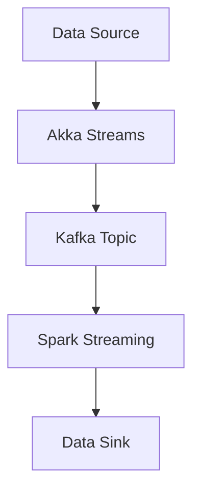

## 9.6 Stream Processing

Stream processing is a powerful paradigm for handling continuous data flows, enabling real-time data processing and analysis. In Scala, this is achieved using tools like Akka Streams, Apache Kafka, and Apache Spark Streaming. In this section, we will explore these technologies, their integration, and how they can be used to build scalable and efficient stream processing applications.

### Introduction to Stream Processing

Stream processing involves the continuous ingestion, processing, and analysis of data streams. Unlike batch processing, which handles data in large chunks, stream processing deals with data in real-time, allowing for immediate insights and actions. This is particularly useful in scenarios where timely data processing is critical, such as fraud detection, real-time analytics, and IoT applications.

#### Key Concepts

- **Data Streams**: Continuous flows of data generated by various sources, such as sensors, logs, or user interactions.
- **Real-Time Processing**: The ability to process data as it arrives, minimizing latency and enabling immediate responses.
- **Scalability**: The capacity to handle increasing data volumes by distributing processing across multiple nodes or clusters.

### Akka Streams

Akka Streams is a library built on top of Akka, a toolkit for building concurrent, distributed, and resilient message-driven applications. It provides a powerful API for stream processing, leveraging Akka's actor model to achieve high throughput and low latency.

#### Key Features

- **Backpressure**: Akka Streams supports backpressure, a mechanism to control the flow of data and prevent overwhelming downstream components.
- **Modularity**: Streams are composed of reusable building blocks, such as sources, sinks, and flows, which can be easily combined and configured.
- **Fault Tolerance**: Built-in support for error handling and recovery ensures robustness in production environments.

#### Basic Components

- **Source**: Represents the starting point of a stream, producing data elements.
- **Sink**: Represents the endpoint of a stream, consuming data elements.
- **Flow**: Represents a processing stage that transforms data elements as they pass through.

#### Sample Code Snippet

```scala
import akka.actor.ActorSystem
import akka.stream.scaladsl.{Flow, Sink, Source}
import akka.stream.ActorMaterializer

object AkkaStreamsExample extends App {
  implicit val system = ActorSystem("AkkaStreamsExample")
  implicit val materializer = ActorMaterializer()

  // Define a source that emits numbers from 1 to 10
  val source = Source(1 to 10)

  // Define a flow that doubles each number
  val flow = Flow[Int].map(_ * 2)

  // Define a sink that prints each number
  val sink = Sink.foreach[Int](println)

  // Connect the source, flow, and sink to form a runnable graph
  val runnableGraph = source.via(flow).to(sink)

  // Run the graph
  runnableGraph.run()
}
```

In this example, we create a simple stream that doubles numbers from 1 to 10 and prints them to the console. The `Source`, `Flow`, and `Sink` components are connected using the `via` and `to` methods, forming a runnable graph.

#### Design Considerations

- **Backpressure Management**: Ensure that your stream processing pipeline can handle varying data rates by implementing backpressure.
- **Error Handling**: Use supervision strategies to manage errors and maintain system stability.
- **Resource Management**: Optimize resource usage by tuning parallelism and buffer sizes.

### Apache Kafka

Apache Kafka is a distributed streaming platform that provides high-throughput, fault-tolerant, and scalable messaging capabilities. It is widely used for building real-time data pipelines and streaming applications.

#### Key Features

- **Scalability**: Kafka can handle large volumes of data by distributing partitions across multiple brokers.
- **Durability**: Data is persisted to disk, ensuring reliability and fault tolerance.
- **Decoupling**: Producers and consumers are decoupled, allowing for flexible and independent scaling.

#### Basic Components

- **Producer**: Publishes messages to a Kafka topic.
- **Consumer**: Subscribes to a Kafka topic and processes messages.
- **Broker**: Manages the storage and retrieval of messages.

#### Sample Code Snippet

```scala
import org.apache.kafka.clients.producer.{KafkaProducer, ProducerRecord}

import java.util.Properties

object KafkaProducerExample extends App {
  val props = new Properties()
  props.put("bootstrap.servers", "localhost:9092")
  props.put("key.serializer", "org.apache.kafka.common.serialization.StringSerializer")
  props.put("value.serializer", "org.apache.kafka.common.serialization.StringSerializer")

  val producer = new KafkaProducer[String, String](props)

  for (i <- 1 to 10) {
    val record = new ProducerRecord[String, String]("test-topic", s"key-$i", s"value-$i")
    producer.send(record)
  }

  producer.close()
}
```

In this example, we create a Kafka producer that sends ten messages to a topic named "test-topic". Each message consists of a key-value pair, serialized as strings.

#### Design Considerations

- **Partitioning Strategy**: Choose an appropriate partitioning strategy to balance load and optimize performance.
- **Message Retention**: Configure retention policies to manage storage and data availability.
- **Security**: Implement authentication and authorization to secure your Kafka cluster.

### Apache Spark Streaming

Apache Spark Streaming is an extension of Apache Spark that enables scalable and fault-tolerant stream processing. It processes data in micro-batches, providing a balance between real-time processing and batch processing.

#### Key Features

- **Scalability**: Spark Streaming can process large volumes of data by distributing computation across a cluster.
- **Fault Tolerance**: Built-in support for checkpointing and recovery ensures reliability.
- **Integration**: Seamlessly integrates with other components of the Spark ecosystem, such as Spark SQL and MLlib.

#### Basic Components

- **DStream**: Represents a continuous stream of data, divided into micro-batches.
- **Transformation**: Operations applied to DStreams to process data.
- **Output Operation**: Actions that write data to external systems.

#### Sample Code Snippet

```scala
import org.apache.spark.SparkConf
import org.apache.spark.streaming.{Seconds, StreamingContext}

object SparkStreamingExample extends App {
  val conf = new SparkConf().setMaster("local[*]").setAppName("SparkStreamingExample")
  val ssc = new StreamingContext(conf, Seconds(1))

  // Create a DStream that reads data from a socket
  val lines = ssc.socketTextStream("localhost", 9999)

  // Split each line into words
  val words = lines.flatMap(_.split(" "))

  // Count each word in each batch
  val wordCounts = words.map(word => (word, 1)).reduceByKey(_ + _)

  // Print the first ten elements of each RDD generated in this DStream
  wordCounts.print()

  // Start the computation
  ssc.start()
  ssc.awaitTermination()
}
```

In this example, we create a simple Spark Streaming application that reads text data from a socket, splits it into words, and counts the occurrences of each word. The results are printed to the console.

#### Design Considerations

- **Batch Interval**: Choose an appropriate batch interval to balance latency and throughput.
- **Checkpointing**: Enable checkpointing to recover from failures and maintain state.
- **Resource Allocation**: Optimize resource allocation by tuning executor and memory settings.

### Integrating Akka Streams, Apache Kafka, and Apache Spark Streaming

Integrating these technologies allows you to build robust and scalable stream processing applications. Akka Streams can be used to process data in real-time, Kafka can serve as a durable message broker, and Spark Streaming can handle complex analytics and transformations.

#### Integration Patterns

- **Akka Streams to Kafka**: Use Akka Streams to produce data to Kafka topics, leveraging its backpressure and modularity.
- **Kafka to Spark Streaming**: Consume data from Kafka topics using Spark Streaming, enabling scalable and fault-tolerant processing.
- **End-to-End Pipeline**: Combine Akka Streams, Kafka, and Spark Streaming to create an end-to-end stream processing pipeline.

#### Sample Code Snippet

```scala
import akka.actor.ActorSystem
import akka.kafka.scaladsl.Producer
import akka.kafka.{ProducerSettings, Subscriptions}
import akka.stream.scaladsl.{Flow, Sink, Source}
import akka.stream.ActorMaterializer
import org.apache.kafka.clients.producer.ProducerRecord
import org.apache.kafka.common.serialization.StringSerializer

object AkkaKafkaIntegrationExample extends App {
  implicit val system = ActorSystem("AkkaKafkaIntegrationExample")
  implicit val materializer = ActorMaterializer()

  val producerSettings = ProducerSettings(system, new StringSerializer, new StringSerializer)
    .withBootstrapServers("localhost:9092")

  val source = Source(1 to 10).map(_.toString)

  val kafkaSink = Producer.plainSink(producerSettings)

  val runnableGraph = source
    .map(value => new ProducerRecord[String, String]("test-topic", value))
    .to(kafkaSink)

  runnableGraph.run()
}
```

In this example, we use Akka Streams to produce data to a Kafka topic. The `ProducerSettings` configure the Kafka producer, and the `plainSink` method creates a sink that writes to Kafka.

### Visualizing Stream Processing Pipelines

To better understand the flow of data through a stream processing pipeline, let's visualize a typical architecture using Mermaid.js.



This diagram illustrates a stream processing pipeline where data flows from a source through Akka Streams, is published to a Kafka topic, processed by Spark Streaming, and finally written to a data sink.

### Try It Yourself

Experiment with the provided code examples by modifying the data sources, transformations, and sinks. For instance, try changing the Kafka topic name, adjusting the batch interval in Spark Streaming, or adding additional processing stages in Akka Streams. This hands-on approach will deepen your understanding of stream processing in Scala.

### Knowledge Check

- Explain the differences between Akka Streams, Apache Kafka, and Apache Spark Streaming.
- Describe how backpressure is implemented in Akka Streams.
- Discuss the role of Kafka in a stream processing pipeline.
- Identify the key components of a Spark Streaming application.

### Conclusion

Stream processing is a vital component of modern data architectures, enabling real-time data processing and analysis. By leveraging Akka Streams, Apache Kafka, and Apache Spark Streaming, you can build scalable and efficient stream processing applications in Scala. Remember, this is just the beginning. As you progress, you'll discover more advanced techniques and optimizations. Keep experimenting, stay curious, and enjoy the journey!

## Quiz Time!



### What is the primary advantage of stream processing over batch processing?

- [x] Real-time data processing
- [ ] Lower resource consumption
- [ ] Simpler implementation
- [ ] Better data accuracy

> **Explanation:** Stream processing allows for real-time data processing, enabling immediate insights and actions.

### Which component in Akka Streams is responsible for consuming data elements?

- [ ] Source
- [ ] Flow
- [x] Sink
- [ ] Actor

> **Explanation:** In Akka Streams, a Sink is responsible for consuming data elements.

### What mechanism does Akka Streams use to control data flow and prevent overwhelming downstream components?

- [ ] Fault tolerance
- [ ] Modularity
- [x] Backpressure
- [ ] Scalability

> **Explanation:** Akka Streams uses backpressure to control data flow and prevent overwhelming downstream components.

### In Apache Kafka, what is the role of a broker?

- [ ] Publishing messages to a topic
- [ ] Subscribing to a topic
- [x] Managing the storage and retrieval of messages
- [ ] Transforming data

> **Explanation:** A broker in Apache Kafka manages the storage and retrieval of messages.

### What is a DStream in Apache Spark Streaming?

- [x] A continuous stream of data divided into micro-batches
- [ ] A single data element
- [ ] A transformation operation
- [ ] A storage component

> **Explanation:** A DStream in Apache Spark Streaming represents a continuous stream of data, divided into micro-batches.

### Which of the following is NOT a key feature of Apache Kafka?

- [ ] Scalability
- [ ] Durability
- [ ] Decoupling
- [x] Real-time analytics

> **Explanation:** Apache Kafka is a messaging platform and does not provide real-time analytics capabilities.

### What is the purpose of checkpointing in Spark Streaming?

- [ ] To increase processing speed
- [x] To recover from failures and maintain state
- [ ] To optimize resource allocation
- [ ] To enhance security

> **Explanation:** Checkpointing in Spark Streaming is used to recover from failures and maintain state.

### How can Akka Streams be integrated with Apache Kafka?

- [x] By using Akka Streams to produce data to Kafka topics
- [ ] By using Kafka to transform data in Akka Streams
- [ ] By using Kafka to consume data from Akka Streams
- [ ] By using Akka Streams to store data in Kafka

> **Explanation:** Akka Streams can be integrated with Apache Kafka by using them to produce data to Kafka topics.

### Which tool is used for distributed tracing and telemetry in stream processing applications?

- [ ] Akka Streams
- [ ] Apache Kafka
- [ ] Apache Spark Streaming
- [x] OpenTelemetry

> **Explanation:** OpenTelemetry is used for distributed tracing and telemetry in stream processing applications.

### True or False: Stream processing is only suitable for small-scale applications.

- [ ] True
- [x] False

> **Explanation:** Stream processing is suitable for both small-scale and large-scale applications, providing real-time data processing capabilities.


